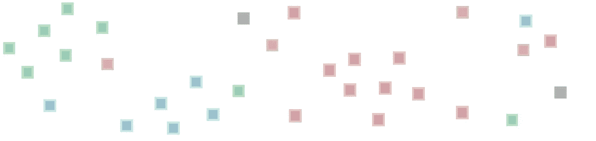
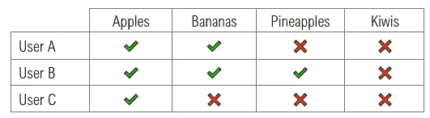
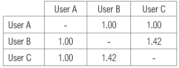
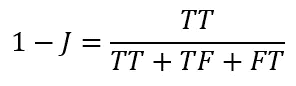
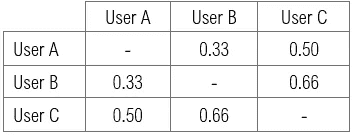

# Python 中二进制数据的用户相似性

> 原文：<https://towardsdatascience.com/user-similarity-with-binary-data-in-python-d15940a702fc?source=collection_archive---------21----------------------->

## 为二进制数据选择相似性度量时需要考虑什么



*作者图片。*

用户聚类和相似性计算在当今的行业中越来越重要。顾客被要求对特定的 f. e .产品进行评分，然后与其他顾客的评分进行比较，以找出它们之间的相似之处。

大多数用户聚类应用程序使用分级评级，例如 0-5 颗星，或者像 [IMDB](http://www.imdb.com) 上的评级等级 1-10。在这些情况下，我们可以很容易地应用像[欧几里德距离](https://en.wikipedia.org/wiki/Euclidean_distance)或[余弦相似度](https://en.wikipedia.org/wiki/Cosine_similarity)这样的度量来发现用户的选择有多相似/不同。如果我们没有这样的收视率，我们在**处理** **二进制数据**怎么办？

在本文中，我将向您展示在二进制数据上使用欧几里德距离度量时为什么要小心，使用什么度量来计算用户相似性，以及如何创建这些用户的排名。我将使用 Python 3 和 Scipy 和熊猫 T21。

```
import scipy.spatial
import pandas as pd
```

# 1 |计算适当的相似性度量

假设我们有三个用户:A、B 和 c。这些用户都填写了关于他们最喜欢的水果的多项选择调查。



表 1:用户对喜爱水果的选择。*图片作者。*

用户的选择可以被解释为独热编码向量，而✔️被替换为 1，❌被替换为 0。

```
user_choices = [[1, 1, 0, 0], 
                [1, 1, 1, 0], 
                [1, 0, 0, 0]]df_choices = pd.DataFrame(user_choices, columns=['Apples', 
                          'Bananas', 'Pineapples', 'Kiwis'], 
                          index=(["User A", "User B", "User C"]))
```

为什么欧氏距离或余弦相似性等度量不适用于此数据集？

首先看一下表 1，我们会建议用户 A 和用户 B 有更相似的口味，因为他们都选择了“苹果”和“香蕉”作为他们最喜欢的水果。

但是，计算用户之间的欧几里德距离会得到如下结果，如表 2 所示:

```
euclidean = scipy.spatial.distance.cdist(df_choices, df_choices, 
                                         metric='euclidean')user_distance = pd.DataFrame(euclidean,    
                             columns=df_choices.index.values,
                             index=df_choices.index.values)
```



表 2:用户之间的欧几里德距离。*图片作者。*

尽管我们看到用户 A 和用户 B 都选择了更多相同的水果，但欧几里德距离为用户 B 和用户 c 返回了相同的距离值 1.00。**为什么会这样呢**？

欧几里德距离考虑了联合缺席(即两个用户在相同的位置上具有 0)。因此，它也认为用户 A 和用户 C 是相似的，因为他们都**没有**选择“菠萝”。同样的原理也适用于余弦相似性。对于某些用例，欧几里德距离可能仍然是二进制数据的合适度量，但是对于我们的用例，它给出了错误的结果。

> 我们不希望根据用户没有做出的选择来假设用户是相似的。

为了我们的目的，我们应该转向一种叫做**雅克卡距离**的度量。



图 1: Jaccard 距离方程。*作者图片。*

TT (True True)是两个用户选择相同水果的次数(即两个用户在相同的位置都有 1)。TF (True False)和 FT (False True)是只有一个用户选择水果的次数(即一个用户选择 1，另一个用户在相同位置选择 0)。我们不考虑两个用户都不选择水果的情况。

现在让我们看看 Jaccard 距离如何对我们用户的相似性进行评级:

```
jaccard = scipy.spatial.distance.cdist(df_choices, df_choices,  
                                       metric='jaccard')user_distance = pd.DataFrame(jaccard, columns=data.index.values,  
                             index=data.index.values)
```



表 3:用户之间的 Jaccard 距离。*图片作者。*

从上表中我们可以看到，实际上，与用户 C 到用户 A 的距离值相比，Jaccard 距离值**认为用户 B 与用户 A** 更相似，因为它的距离值更低。这是我们希望我们的用例达到的结果。

# 2 |根据用户选择的相似性对用户进行排名

为了完成我们的任务，让我们根据用户的相似性对他们进行排序，并将他们导出为 Python 字典。

```
# prepare a dictionary
user_rankings = {}# iterate over the columns in the dataframe
for user in user_distance.columns: # extract the distances of the column ranked by smallest
    distance = user_distance[user].nsmallest(len(user_distance))

    # for each user, create a key in the dictionary and assign a  
    # list that contains a ranking of its most similar users
    data = {user : [i for i in distance.index if i!=user]}
    user_rankings.update(data)
```

输出字典将如下所示:

```
{'User A': ['User B', 'User C'],
 'User B': ['User A', 'User C'],
 'User C': ['User A', 'User B']}
```

用户 A 对喜爱的水果的选择更类似于用户 B，而不是用户 C。
用户 B 对喜爱的水果的选择更类似于用户 A，而不是用户 C。

本文演示了 Jaccard 距离如何成为计算二进制向量之间相似性的合适度量。

尽管如此，始终确保根据数据集类型和您试图实现的目标明智地选择相似性/距离度量**。**

## 参考资料:

[1] A. S. Shirkhorshidi，S. Aghabozorgi S，T. Y. Wah，[连续数据聚类中相似度和相异度的比较研究](https://doi.org/10.1371/journal.pone.0144059) (2015)，PLoS ONE 10(12): e0144059。

[[](https://www.ibm.com/support/knowledgecenter/SSLVMB_sub/statistics_mainhelp_ddita/spss/base/cmd_proximities_sim_measure_binary.html) 2] IBM，[二进制数据的距离相似性度量](https://www.ibm.com/support/knowledgecenter/SSLVMB_sub/statistics_mainhelp_ddita/spss/base/cmd_proximities_sim_measure_binary.html) (2021)