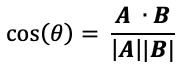
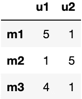

# 通过简单的例子解释用户对用户和项目对项目的协同过滤(第 1 部分)

> 原文：<https://towardsdatascience.com/user-to-user-vs-item-to-item-collaborative-filtering-explained-through-simple-examples-part-1-f133bec23a58?source=collection_archive---------21----------------------->

## 简单解释了协同过滤背后的魔力。


Samuel Regan-Asante 在 [Unsplash](https://unsplash.com?utm_source=medium&utm_medium=referral) 上拍摄的照片

如果你是一名数据科学家，想要建立一个项目组合来推荐书籍/电影/产品，或者你只是想了解协同过滤是如何工作的，这篇文章将会帮助你。

概括地说，有两种主要类型的推荐系统。基于内容的协同过滤。顾名思义，第一种基于内容的类型通过推荐与你喜欢的内容相似的产品来工作。一种常见的方法是推荐具有相似描述的产品(即内容)作为您最喜欢的产品。在这篇文章中，我们将关注第二种类型，即**协同过滤**方法，这种方法根据用户评级推荐产品，在行业中被广泛采用。

让我们用电影推荐来说明这个概念。如果我们使用用户对用户的方法，我们会发现用户之间的相似性，而推荐给用户的电影将基于与他们最相似的另一个用户喜欢的电影。

另一方面，如果我们使用项目到项目的方法，我们会发现电影之间的相似性。然后如果一个用户喜欢一部电影，我们会推荐和那部最相似的电影。

用户到用户和项目到项目之间的区别可能会令人困惑，帮助我区分它们的概念是我们是否使用用户或项目作为绘制的轴。如果我们使用用户作为轴，那么这意味着我们在使用项目到项目的方法。反之亦然，如果我们用电影作为轴心，这意味着我们在做用户对用户的方法。我们来举例说明。

**用户对用户的方法**

这里有一个例子，其中 3 个用户(u1、u2、u3)对 2 部电影(m1、m2)进行了评级。


**3 电影用户评分 1 & 2**

然后，我们可以通过将电影 1 的收视率作为 x 轴，将电影 2 的收视率作为 y 轴来绘制这些用户。


用户对用户的方法

如你所见，用户 1 和用户 3 非常相似。如果我们有一些电影 X，用户 1 确实喜欢，而用户 3 没有看过，我们将只把电影 X 推荐给用户 3。

**逐项方法**

现在让我们假设只有 2 个用户(u1，u2)对 3 部电影(m1，m2，m3)进行了评级。


**用户 1 & 2** 评价的 3 部电影

我们不会试图寻找用户之间的相似性，而是将重点放在以每个用户评级为轴绘制电影上。


逐项方法

通过查看图表，我们可以看到电影 1 和 3 更接近，因此更相似。起初，这可能看起来有点像魔术，但肯定是有效的，因为喜欢动作片的用户可能会对其他类型的评分很低，从而导致这些相似性聚类的出现。但是我们如何量化这种相似性呢？

确定相似性的两种流行方法是**余弦距离**和**皮尔逊相关性**，余弦距离本质上是两个向量之间的角度投影，皮尔逊相关性计算向量之间的成对相关性。

**余弦相似度**



确定两个向量 A 和 b 之间余弦相似性的公式。分子表示两个向量的点积，分母表示它们的大小相乘。

让我们用 python 计算余弦距离。



```
from sklearn.metrics.pairwise import cosine_similaritycosine_similarity(df)
```


或将余弦相似性数组放入数据帧中


余弦相似矩阵

我们做了什么，这意味着什么？

通过做余弦相似度(df)，我们已经计算了每部电影之间的 cos(Theta)。因此，第一行向我们展示了电影 1 与其自身完全相关/相似，与电影 2 相关性差，与电影 3 相关性非常强。相关性越强，电影越相似；这使得我们能够向一个用户推荐他过去可能喜欢的类似电影。

**标准化评级**

将用户相对于其他用户的“审阅者难度”标准化的常用方法是通过减去平均值并将评级除以范围来标准化他们的评级。

如果我们将评级标准化，然后取余弦相似度，我们会得到


归一化余弦相似矩阵

现在你可以看到相关性更容易解释，但得出的结论与我们之前的分析相同。

**皮尔森相关性**

就拿电影之间的皮尔逊相关性来说吧。提醒一下，这是我们的逐项评级数据框架(df)


我们仍然在做项目到项目的方法，但是为了计算电影之间的相似性，我们必须对这个矩阵进行转置，使每部电影成为一列。原因是 Pearson correlation 将每一列视为一个向量，并将计算它们之间的成对相关性。


项目间的皮尔逊相关矩阵

正如你所看到的，对角线上的词都是 1，因为每部电影都有完美的相关性/完美的相似性。但是为了解释其含义，从第一行我们可以看到，电影 1 与电影 2 的相关性非常差，而与电影 3 的相关性非常强，这也与我们使用归一化余弦相似性方法得到的结果一致。

**最后的话**

如果用户告诉我们他们最喜欢的电影，我们如何扩展这种方法并创建一个函数或后端 API 来向用户推荐电影？

例如，一个简单的策略是，如果他们告诉我们他们喜欢电影 1；我们将获得 m1 的相似性行，按照降序排列相似性值，并选取与电影 1 最相似的前 10 或 50 个项目，并将它们推荐给用户。

我将在下一篇文章“**如何使用开源 MovieLens 数据集构建电影推荐引擎后端 Flask API(第 2 部分)**中进一步探讨这个问题。

**参考文献**

*   [https://medium . com/code-heroku/how-to-turn-your-machine-learning-scripts-into-projects-you-can-demo-CBC 5611 ca 442](https://medium.com/code-heroku/how-to-turn-your-machine-learning-scripts-into-projects-you-can-demo-cbc5611ca442)
*   [https://real python . com/build-re commendation-engine-collaborative-filtering/](https://realpython.com/build-recommendation-engine-collaborative-filtering/)