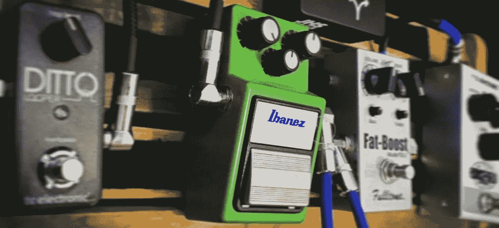
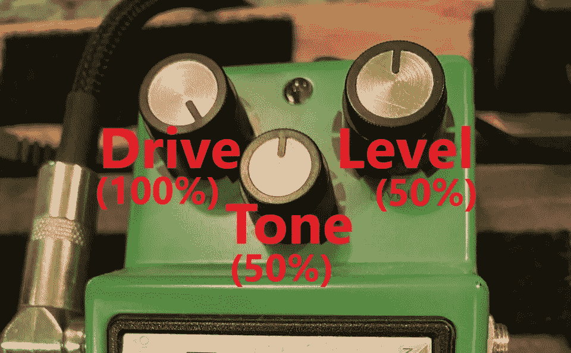
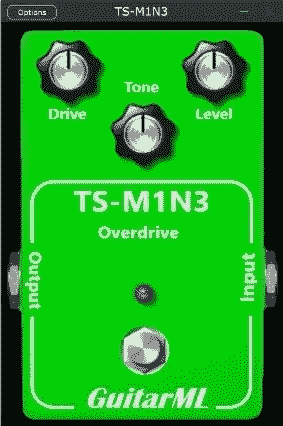

# 使用人工智能模拟 TS-9 吉他踏板

> 原文：<https://towardsdatascience.com/using-a-i-to-model-the-ts-9-guitar-pedal-f7c7c8205edd?source=collection_archive---------25----------------------->

装有 TS-9 的踏板(图片由作者提供)

## *开源，使用机器学习实时数字克隆 TS-9 吉他踏板(带视频演示)*

A nalog 是吉他效果领域的王者，但数字建模已经走过了漫长的道路来复制它。详细的电路分析和数学方程可以重现许多这类设备的声音，从电子管放大器到过驱电路再到弹簧混响。通常需要电子和物理建模领域的专业知识。

但是，如果我们能跳过所有的数学和物理，直接去做我们真正想要的东西，*美妙的声音*，会怎么样呢？如果你可以说，我不在乎那些金属盒子里发生了什么，我只想要声音！这种方法被称为*黑盒* *建模*，公开可用的人工智能框架使任何人都有可能做到。

## 作为一名工程师，我的一部分想大喊，“*嘿，那是作弊！”*你真的能跳过分析电路、建立元件模型和令人头疼的数学运算，直接把数据扔给计算机替你解决吗？答案是既肯定又否定。

人工智能采用传统的问题解决方式，并彻底改变了它。你仍然需要了解如何设置你的问题，但它的解决方式不同。找出最佳的模型架构和训练参数本身就是一门科学(或艺术),这一切都取决于良好的数据。在 TS-9 吉他踏板的情况下，数据以音频记录的形式出现。

通过记录踏板的输入和踏板的输出，你把它当作一个黑匣子。输入和输出是已知的，但我们不需要了解它是如何工作的。根据音频数据训练神经网络，使其表现与真实踏板相同。你甚至可以在你的吉他上实时运行这个模型，方法是围绕它构建一个高性能的音频应用程序，本质上是制作一个数字克隆。

*注:你可以在这里* *阅读更多关于我的数据收集方法* [*。*](https://medium.com/nerd-for-tech/neural-networks-for-real-time-audio-introduction-ed5d575dc341)

这对于在特定设置下采集踏板声音非常有用。在 TS-9 踏板的情况下，这可能看起来像 100%的驱动，50%的音调和 50%的水平。但是我们如何在一个模型中复制所有可能的旋钮位置呢？更多数据！

TS-9 踏板上的控件(图片由作者提供)

参数调节允许我们创建一个模型，它可以像真正的踏板一样*调整*。通过在每个旋钮的离散步骤中记录踏板的音频，您可以训练一个条件模型，该模型对旋钮或旋钮组的整个范围进行插值。

对于 TS-9，驱动和音调控制被选为条件参数。水平旋钮可以被包括在内，但它可以近似为实时音频插件中的一个简单的音量旋钮。这也会给培训增加更多的数据和复杂性。

对于训练数据，在 0%、25%、50%、75%和 100%旋钮位置进行 2 分钟采样。对于两个旋钮，这产生 5 * 5 = 25 种不同的组合，用于 25 个单独的 2 分钟录音加上基线输入音频文件。一旦录制了音频，每个音轨都被导出为 32 位浮点单声道 WAV 文件。音频数据的总大小约为 520MB。

[自动化吉他弹模](https://github.com/Alec-Wright/Automated-GuitarAmpModelling)项目的[吉他弹模叉](https://github.com/GuitarML/Automated-GuitarAmpModelling)用于训练。此分叉包含用于条件模型音频处理的额外代码。该项目用 python 编写，使用 [Pytorch](https://pytorch.org/) ，包含几个机器学习模型，用于模拟效果建模。LSTM(长短期记忆)模型用于 TS-9 踏板。

*注意:处理后的输入 WAV 文件包含三个通道，一个用于音频，一个用于驱动旋钮参数(范围 0.0 到 1.0)，一个用于色调旋钮参数(范围 0.0 到 1.0)，作为 LSTM 模型的输入。输出 WAV 文件包含一个通道，即输出音频。*

实时插件(作者图片)

JUCE 框架用于构建实时应用程序，命名为“TS-M1N3”(这是一个不好的双关语)。Windows/Mac 安装程序可以从 [Github](https://github.com/GuitarML/TS-M1N3/releases) 和[源代码](https://github.com/GuitarML/TS-M1N3)下载，有 VST3 / AU / Standalone 格式。 [RTNeural](https://github.com/jatinchowdhury18/RTNeural) 用于 LSTM 模型的神经网络推理，并显著提高了速度。

*注:关于使用 LSTM 神经网络创建实时音频应用程序的更多细节，请查看这些* [*文章*](/neural-networks-for-real-time-audio-raspberry-pi-guitar-pedal-bded4b6b7f31) *。*

下面是一个视频演示，比较了不同设置下原始 TS-9 踏板和插件克隆:

(作者视频)

*特别感谢 UAH(位于亨茨维尔的阿拉巴马大学)MLAMSK 高级设计团队，他们的研究和辛勤工作直接影响了本文呈现的结果。*

*我希望你喜欢这篇文章，感谢阅读！*