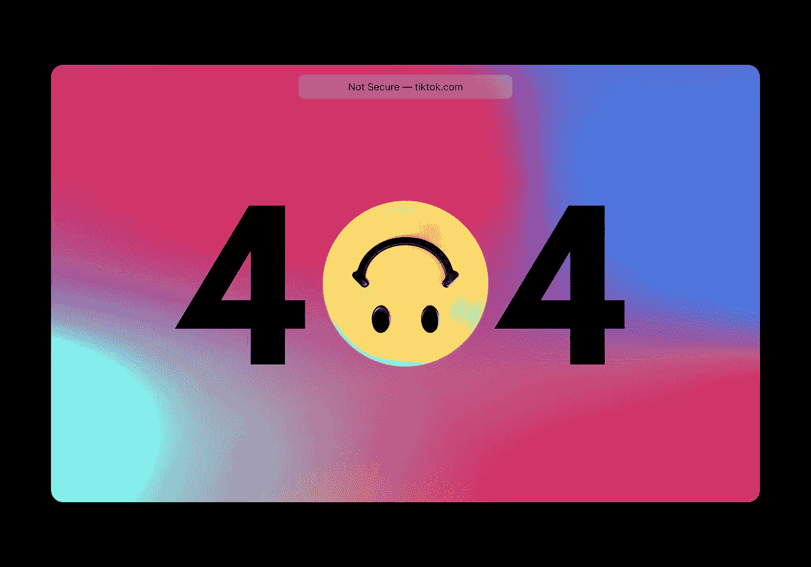

# 使用 Python 后端

> 原文：<https://towardsdatascience.com/using-a-python-back-end-b9e4f9ac5d?source=collection_archive---------4----------------------->

## [从零开始逐个任务地进行数据科学](https://towardsdatascience.com/tagged/dofromscratch)

## 用于 NLP 的 Python Flask 和 Vue.js

在 [Unsplash](https://unsplash.com?utm_source=medium&utm_medium=referral) 上[科学高清](https://unsplash.com/@scienceinhd?utm_source=medium&utm_medium=referral)摄影

我正在写一个关于创建 NLP 应用程序来帮助人们改进简历的迷你系列文章。我在[的第一篇文章](/ai-is-working-against-your-job-application-bec65d496d22)中介绍了核心思想，在[的最后一篇文章](/semantic-highlighting-d2fba3da2822)中，我展示了如何将标记应用于特定的关键词。在这篇文章中，我将向您展示如何连接 Python 后端，并为我在上一篇文章中使用的用户界面提供服务。我希望如果我能把这些任务分解成简短的帖子，我就能成功地解释我的过程。截至撰写本文时，我已经做了许多这样的应用，如 ***概念证明*** 。你准备好进入后端世界了吗？我们开始吧！

# Python 后端

虽然有时我可能看起来是一个死忠的 Python 爱好者，但事实是 Python 只是我工具箱中的一个工具。我经常使用 Express with Node，这实际上涉及到安全性和各种外部服务的可用 SDK，如 [Okta](https://www.okta.com/) 。因为我只对 ***概念证明*** 感兴趣，所以我的生活没有那些不得不 ***保证数据隐私、安全、性能和弹性*的人复杂。**为什么[我们选择 Python 作为后端](https://www.asapdevelopers.com/python-backend-language/)语言归结起来，对于我来说，到 ***机器学习生态系统*** 。我从来不喜欢姜戈，但我知道它非常受欢迎。Flask 一直是我的首选，我从未遇到过性能问题。自然，你需要用 ***Nginx 和 Gunicorn 之类的用 Supervisor*** 来部署。

照片由 [Hitesh Choudhary](https://unsplash.com/@hiteshchoudhary?utm_source=medium&utm_medium=referral) 在 [Unsplash](https://unsplash.com?utm_source=medium&utm_medium=referral) 上拍摄

用 Python 挂接一个单页面前端 UI 有几个步骤。首先，我们需要 Python 后端作业，然后我们需要对 Vue.js 应用程序进行一些更改。好了，我们编码吧！我现在用的是视觉代码！

## 瓶

让我们讨论一下 Flask 服务器端的工作

我的开发方法一直是极度敏捷的过程。我的重点是在每次迭代中运行软件。一次迭代可以是几分钟，也可以是几小时，但一般来说，有一个大约 3 小时的 ***时间框。*** 虽然可能不明显，我的 ***专业更侧重于****的产品管理，而我更喜欢把专业人员留给真正的产品开发。*

*web.py 文件中的第 1 行到第 3 行处理库的导入。请注意，我们已经将 Gensim 纳入范围。第 5 行是这个脚本中最重要的一行。 ***Flask 期望一个静态文件夹*** ，但是 Vue 和 ***NPM 构建时设置了一个 Dist 文件夹。*** 我们需要把这两个人撮合起来。*

*第 13 行为主页创建了一个路由，在这个早期阶段，它只为 index.HTML 服务，是从 NPM 的 build 命令生成的。第 19 行运行应用程序， ***但是请不要在面向 web 的上下文中这样做！*** 留意图 1 所示的警示井。*

**

*图 1:带有警告可视代码中的终端视图。从未在生产中使用过*

*既然开发 web 服务器已经启动并运行，让我们把注意力转向调整 Vue 前端接口。*

## *某视频剪辑软件*

*如果你只是在中场休息时才收看比赛，你可以通过阅读[前一篇文章](/semantic-highlighting-d2fba3da2822)来赶上比赛，那会告诉你我们是如何来到这里的！如果你允许类比团队 ***数据科学原型*** 在这个区间都涨了 2！*

**

*康斯坦丁·希莫年科在 [Unsplash](https://unsplash.com?utm_source=medium&utm_medium=referral) 上拍摄的照片*

*回顾是敏捷的一个重要组成部分，它是一个很有意义的仪式！一般我们都是坐着而不是站着！你记得吗？我告诉过你 Flask 需要一个静态文件夹，但是 NPM build 设置了一个 Dist 文件夹。我们需要将这两者结合起来，我们通过为 Vue 引入一个配置文件来做到这一点。*

*第 2 行 vue.config.js 定义了构建输出文件夹。第 5 行创建了 Flask 需要的静态文件夹。这是一个关键的步骤，如果忽略，我们将给出 404 错误。*

**

*[Unsplash](https://unsplash.com?utm_source=medium&utm_medium=referral) 上[视觉](https://unsplash.com/@visuals?utm_source=medium&utm_medium=referral)的照片*

*现在你需要记住，我们正在处理两种不同的技术。*

*   *Python 是运行时解释的。*
*   *NPM 需要使用 ***transpilers、webpack 和 voodoo*** 来构建，这很无聊，但很有必要。网络浏览器的兼容性比[永恒恶臭的沼泽](https://muppet.fandom.com/wiki/Bog_of_Eternal_Stench)还要糟糕。*

*所以底线是*

*   *Git 添加。(展示变化)*
*   *Git commit -m(在变更对象中包装变更)*
*   *Git push(更新对 repo 的更改)*
*   *NPM 跑搭( ***跑巫毒和闻泥塘*** )*
*   *Python backend.py ( ***执行服务端*** )*

*必须是你的过程，当然也是我的过程。所以现在我们准备好执行连接的流程。*

## *运行它*

*对于这一部分，剩下的工作就是运行 Python 脚本。我已经完成了构建并检查了输出。图 2 显示了结果。*

**

*图 2:导航到端口 5006，我们得到显示的应用程序。图片作者。*

*除了我们在端口 **5006** 而不是图 3 所示的 Vue 开发服务器的 **8080** 端口之外，真的没有什么新的东西可看。*

**

*图 3: npm run serve 在端口 8080 上创建一个服务。图片由作者提供。*

*但是，我现在已经向您展示了如何创建前端应用程序和后端服务器端作业。Gensim 已经包括在内，我有自己的 NLP 代码从最初的职位。在下一篇文章中，我们将继续这一旅程。*

*   *给前端添加一个更好的用户界面。*
*   *添加一些前端 API 调用来处理简历和职位描述。*
*   *添加一些服务器端 API 端点。*

*现在我们开始有趣的事情。如果你在问自己这与数据科学有什么关系，你应该接受用 Python 构建 NLP 模型是不够的。你需要一个**用户界面**，你需要**资金**，你需要**说服其他人投资**他们的现金和他们的**家庭时间在你的项目上**。最后，如果您是项目经理、产品经理或产品所有者，您需要构建 backlog 并交付项目。您需要了解将 NLP 解决方案带给消费者的所有步骤。与其说这是科学，不如说这是编码、营销、设计、隐私、安全和大量艰苦工作的现实生活。*

*回来获取下一期，我会添加那些新特性！同时，如果你对开发过程感兴趣，想看我演示如何从零开始制作*产品的视频，你可能会喜欢我的 YouTube 系列。构建 web 服务、API 调用、用户界面都有详细的讨论。**