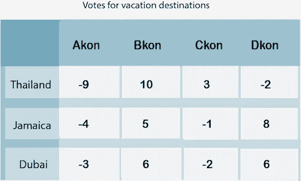
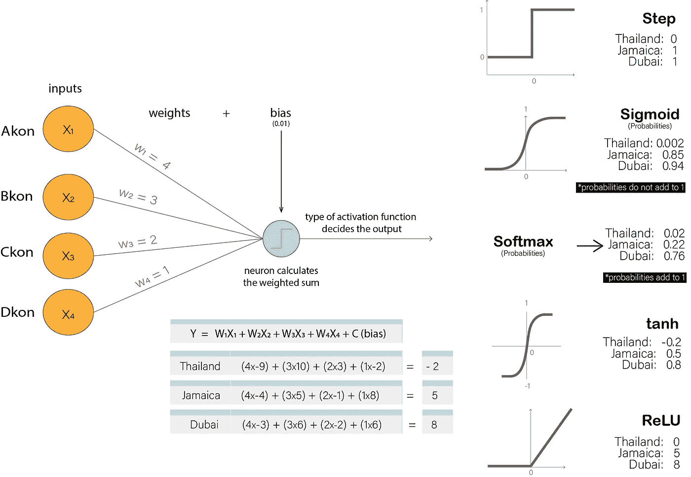

# 在神经网络中使用激活函数

> 原文：<https://towardsdatascience.com/using-activation-functions-in-neural-nets-c119ad80826?source=collection_archive---------31----------------------->

## 机器学习|神经网络|激活函数|

## 常见的激活函数及其使用

激活函数是将输入信号转换成输出信号的神经元的内部状态。

基本上，神经元计算其输入的加权和，加上偏差，然后将值输入到激活函数，该函数决定它是否应该吐出输出。激活函数为神经网络提供非线性属性。如果没有激活函数，神经元的输出值可以在(-无穷大)到(+无穷大)之间变化。

我们都知道特性缩放以及为什么要这样做。特征缩放是在数据预处理期间执行的，并且是为了归一化/标准化独立特征。在标准化过程中，我们在 0 到 1 的范围内重新调整特征值。激活函数也在做类似的事情。它将输出值带到特定的范围。

在这里阅读更多关于特征缩放的内容:[https://becoming human . ai/feature-scaling-in-machine-learning-20 DD 93 bb 1 BCB](https://becominghuman.ai/feature-scaling-in-machine-learning-20dd93bb1bcb)

让我们用一个小例子来理解激活函数。

一群 4 个朋友决定去度假。他们已将选择范围缩小到三个国家。泰国、牙买加和迪拜。为了选择最终的目的地，他们每个人都决定在-10 到 10 的范围内为这些国家投票。-10 表示最不感兴趣，10 表示最感兴趣。0 可以认为是中性的。

从下表中，你可以注意到，例如，Bkon 对泰国最感兴趣，对访问牙买加最不感兴趣。

作者创建的虚构数据

让我们给每个变量分配初始随机权重。为了简化计算，我们将保持偏差值= 0.01 或简单地为 0。

观察下图:神经元计算其输入的加权和，并提供输出值。这里的神经元在没有激活功能的情况下将为泰国、牙买加和迪拜各提供 1 个值。即泰国= -2，牙买加= 5，迪拜= 8。由于这不是一个回归问题，这些值将很难解释。

作者创建的图像

不同的激活功能及其输出:

**阶跃函数** —该激活函数可用于二元分类。它产生二进制输出 0 或 1。任何低于 0 的值都自动被赋予值 0，任何高于 0 的值都被赋予值 1。

**Sigmoid/逻辑函数** —该激活函数可用于二元和多标签分类，我们将输出预测为概率。这个团队去迪拜的可能性有多大？该函数将任何实数值作为输入，并输出 0 到 1 范围内的值。输入越正，输出值就越接近 1，反之，如果输入越负，输出就越接近 0。

**Softmax 函数** —当我们将输出预测为概率并希望得到明确答案时，该激活函数可用于多类分类。在 softmax 中，所有概率相加为 1，选择概率最高的类。在我们的例子中，迪拜将是明显的赢家。

在 Sigmoid 函数中，输出的概率值加起来不是 1，而在 Softmax 函数中，概率加起来是 1，因此给出了最终的赢家。

**双曲正切函数** —该激活函数类似于 sigmoid 函数。然而，如果两个事件略有不同，它们都将被赋予高概率。该函数将任何实数值作为输入，并输出-1 到 1 范围内的值。输入越正，输出值就越接近 1，反之，如果输入越负，输出就越接近-1。这主要用于递归神经网络(RNNs)。

**ReLU 函数** —该激活函数主要用于多层感知器(MLPs)和卷积神经网络(CNN)。任何低于 0 的输入值都被赋予 0 值，任何高于 0 的值都是值本身。因此，它的范围可以从 0 到无穷大。

当不确定为你的神经网络使用哪种激活函数时，最好尝试几种并比较结果。

感谢您的阅读。如果您有更多问题，请通过链接联系我们

 [## Swapnil Kangralkar

### Swapnil Kangralkar。我是一名驻加拿大渥太华的中级数据科学家。

swapnilin.github.io](https://swapnilin.github.io/)