# 使用人工智能生成复杂的和声

> 原文：<https://towardsdatascience.com/using-ai-to-generate-complex-harmonies-afd6893719ee?source=collection_archive---------39----------------------->

## 在巴赫合唱数据集上训练

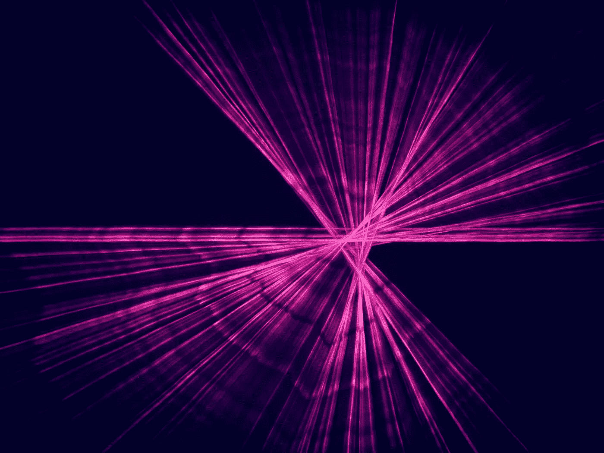

范二·阿夫沙里在 [Unsplash](https://unsplash.com/backgrounds/colors/light?utm_source=unsplash&utm_medium=referral&utm_content=creditCopyText) 上的照片

照片由 [Lorenzo Spoleti](https://unsplash.com/@lorenzospoleti?utm_source=unsplash&utm_medium=referral&utm_content=creditCopyText) 在 [Unsplash](https://unsplash.com/s/photos/music?utm_source=unsplash&utm_medium=referral&utm_content=creditCopyText) 上拍摄

创造性内容是计算机复制的最复杂的东西:非常低的损失将意味着网络的输出不是原创的，而非常高的损失将意味着网络的输出与源材料没有任何相似之处。因此，需要大量的超参数调整来获得有效的结果。

# 概念:

巴赫合唱数据集是一个广泛的数据集，包含了巴赫合唱的 381 个音符值。每首赞美诗都被分解成一个 CSV 文件，有 4 列。每列包含合唱中 4 种声部(女高音、女低音、男高音和男低音)的音符值。

你可以在这里找到数据集[。](https://github.com/ageron/handson-ml2/blob/master/datasets/jsb_chorales/README.md)

我的目标是将这些数据转换成空间数据，使网络能够链接过去的笔记，为下一个笔记做出决定。我最初的印象是将文件转换成图像，因为图像适用于许多不同类型的网络。

网络将得到损坏的数据(具有丢失信息的数据),并试图填补空白。

# 数据收集:

该脚本导入运行程序所需的所有库。Numpy 用于矩阵操作，PIL 用于图像，pickle 用于在本地文件中存储列表值，以便将来节省时间。Array2img 是一个特殊的函数，用于将巴赫合唱团数组转换为图像。它采用空白图像(全黑),如果有注释，则添加白色像素。

这个脚本查看一个目录中的所有文件。使用 os.chdir()移动到存储所有数据的目录。这些值被拆分成 106 乘 106 的数组。这是因为 midi 文件中的音符范围是 106，正方形图像比矩形图像更容易处理。这是因为在卷积网络中更容易根据内核大小来处理。这些数据将被保存起来以备将来使用。

这个脚本将 csv 文件转换成一个数组，然后该数组可以转换成一个图像。再加上另一个将图像文件转换成 midi 文件的脚本，这应该可以完美地工作了，对吗？

## 问题 1:转型

我对将创建的图像转换为 img2midi 函数的输入感到非常困惑。

最终，经过几个小时的测试，我发现将图像逆时针旋转 90 度可以得到最好的结果。

这是一个巴赫合唱曲的形象例子:

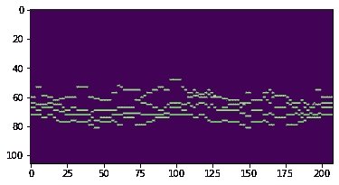

由作者创建

## 问题 2:音高

即使在完成项目后，我也不确定是什么导致了这个问题。函数输出的音符都是错的。当打印计算机使用的值时，它与 csv 文件中的值不匹配。

我不得不重新编写 img2midi 脚本，以便可以将 csv 中的值直接输入到函数中。

这个脚本的原始代码不是我的。这里可以找到[。](https://github.com/mathigatti/midi2img)

我将 csv 中的注释直接输入到图像中。笔记是一个名为“notesy”的列表。

通过直接输入值而不是使用图像，它防止了错误音高的发生。

使用另一个 midi2img，我将 midi 转换回图像，然后比较这两个图像。

我观察到了不同之处，并对 array2img 代码做了一些调整。

在经历了许多图像和 midi 文件的困难之后，我决定只使用 midi 音符本身作为网络的输入和输出。从长远来看，这是可行的，因为图像包含大量冗余值。4 声道输入也将导致网络输出一个 4 部分的和声，这正是我在寻找的。

# 数据综合:

## 随机损坏:

想到的第一个想法是随机移除某些音符。这个 scr

损坏系数用于计算将从合唱中随机移除的值的数量。这是用合唱中的音符数乘以系数计算出来的。

经过一点点测试后，这种方法的效果并不太好，因为数据集中定义的时间步长非常短，所以脚本只是将笔记分成更多的片段。这对于模型来说太容易外推，因此是无用的数据。

以下是该算法生成的数据示例:

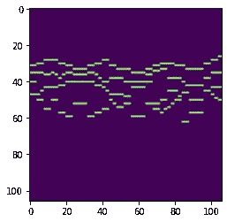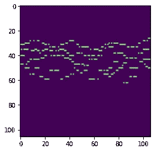

作者创建的两个图像(左:原始，右:损坏)

## 逐块:

这个脚本使用不同的策略来实现这一点。它创建定义大小的块，并垂直清除合唱。这意味着合唱团的所有 4 个声部的音符在合唱团的一小段中被移除。

不是知道损坏纸币的确切数量，而是使用概率来确定图像损坏的程度。

左边的要点还提供了一个脚本来生成一个具有定义数量的数据点的数据集。

以下是该算法造成的损坏:

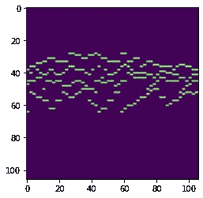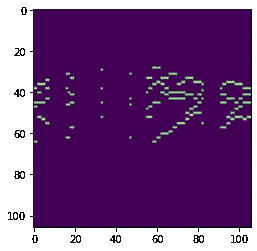

作者创建的两个图像(左:原始，右:损坏)

## 逐行:

此脚本删除了合唱中除低音线以外的所有声部。要保留的这条线可以用 line_n 变量来确定。因为 python 使用基于 0 的索引，所以 0 表示高音，3 表示低音。

以下是使用该算法生成的图像示例:

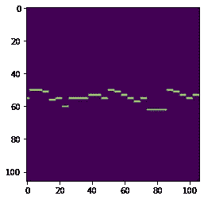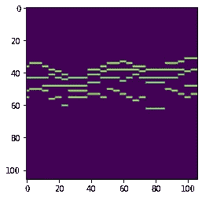

作者创建的两个图像(左:原始，右:损坏)

经过一些测试后，我认为定义数据的最佳方式是将其表示为大小为(106，4)的数组。每个声部将有 4 个通道，合唱部分将被分割成 106 个时间步长的片段。

# 模型

假设您已经在当前工作目录中保存了所有的 pickled 文件，左边的代码将准备所有基于块的数据。

它还有另外两个有趣的功能:

## 填写区块:

填充块接收网络的输出，并移除模型输出的所有重叠，以创建完整的模型输出。这可以通过原始输出获得更多信息。

## 数组 2 图像分析:

Array2img 分析允许将 array2img 与像素颜色一起转换。这样就很容易分辨出哪些笔记是电脑生成的。

这个基线模型只使用密集模型和 relu 激活函数。它只使用密集层的事实使得它很难学习更多的空间模式。虽然这通常会导致收敛速度变慢，但在这种情况下，几乎没有学习。

以下是结果示例:

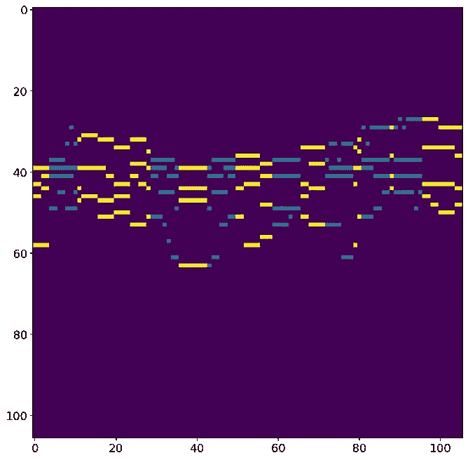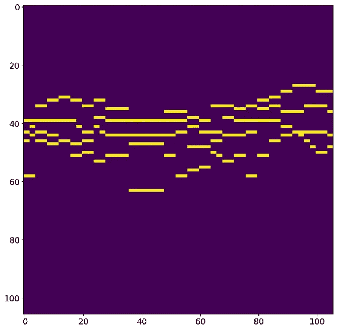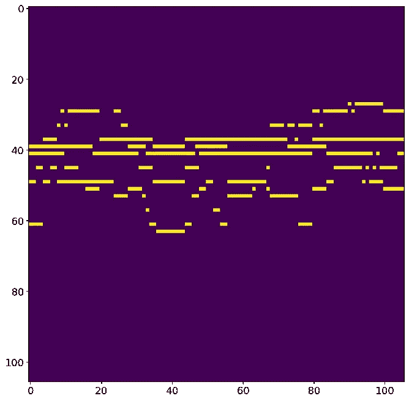

作者的所有图片(左:已填充，中:真实，右:未过滤)

该模型类似于基线模型，但增加了漏失层。我认为基线模型产生的大多数平线是由于最佳预测是相同的 4 个音符。因此，这意味着漏失层将导致更大数量的变化，从而获得更好的结果。

辍学可以得到更多的控制，但这仅仅是一个概念的证明。

这是我最初打算使用的第一个包含一维卷积层的模型。

这是一个基本的卷积网络，有一些基本的超参数调整。kernel_size 经过了很好的优化:4 非常适合通道数，并且比其他值收敛得更快。

在研究最佳模型架构时，我发现 GANs 的想法是另一种有效的模型架构。

这个项目最理想的 GAN 是 Pix2Pix GAN。问题是这将需要很长时间来编码，我决定我不想在这个项目上花太多时间，并决定放弃这个想法。

然而，我设法创建了一个类似于 Pix2Pix GAN 中发生器的编码器-解码器设置。

编码器减小输入的维度，直到它具有相同图像的较小表示。然后，解码器将图像放大，填补这个过程中的漏洞。

此外，编码器-解码器模块之间存在跳跃连接，允许信息从不同的处理级别传递。

以下是结果示例:

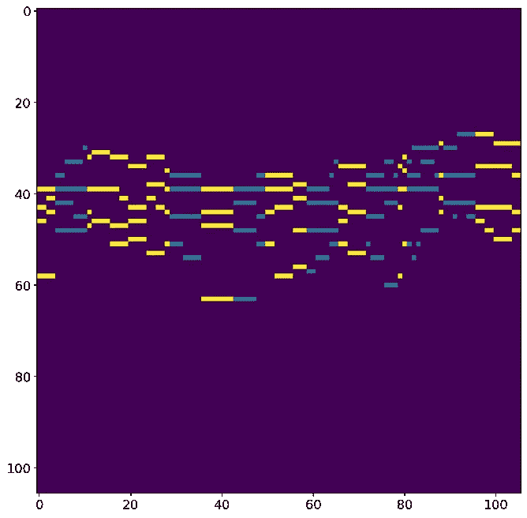

作者的所有图片(左:已填充，中:真实，右:未过滤)

# 结论:

我认为这个项目基本上是成功的。然而，在这个项目中使用 Pix2Pix GAN 会非常有趣:

Pix2Pix GAN 将能够产生更多原创和有趣的结果，因为发电机损耗不仅仅是地面真实值和发电机输出之间的 MSE。从理论上讲，这将产生真正原创的结果。

我希望在不久的将来为这个项目使用 Pix2Pix GAN。

# 我的链接:

如果你想看更多我的内容，点击这个 [**链接**](https://linktr.ee/victorsi) 。