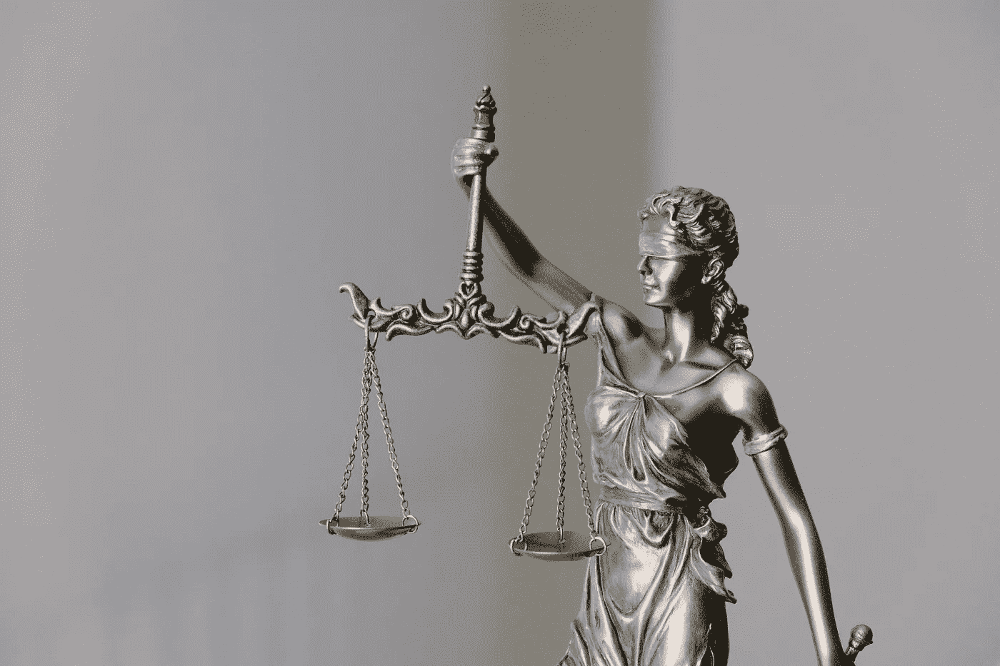

# 用 AI？你可能希望开始进行人权影响评估(HRIA)

> 原文：<https://towardsdatascience.com/using-ai-you-may-want-to-start-conducting-human-rights-impact-assessments-hria-89ec0fdbce52?source=collection_archive---------34----------------------->

## [公平和偏见](https://towardsdatascience.com/tagged/fairness-and-bias)

## 欧洲人工智能监管目标之争的教训

图片:照片由[托卢·奥卢博德](https://unsplash.com/@toluobde?utm_source=unsplash&utm_medium=referral&utm_content=creditCopyText)在 [Unsplash](https://unsplash.com/s/photos/supports?utm_source=unsplash&utm_medium=referral&utm_content=creditCopyText) 上拍摄

在最近的一篇文章中，我提供了一些关于拜登政府将如何改变人工智能领域的预测。主要的收获是，人工智能监管的到来比你想象的要快，你最好从实施内部人工智能治理开始准备。如果你在北美开展业务，这将有助于你超越监管机构和竞争对手。如果你在欧洲做生意，你需要遵守欧洲法律。

[算法影响评估](https://ainowinstitute.org/aiareport2018.pdf) (AIAs)和像[人工智能注册](/ai-registers-finally-a-tool-to-increase-transparency-in-ai-ml-f5694b1e317d)这样的工具是开始记录你的人工智能的简单方法。然而，鉴于最近的发展，你可能需要在你的人工智能治理工具箱中添加另一个工具:人权影响评估(HRIA)。为什么？让我们看看欧洲围绕人工智能监管的激烈辩论，看看我们可以从中吸取什么教训。其中一些可能很快就会适用于我们，因为美国的方法与欧洲正在采取的方法有相似之处。

这两种方法都倾向于有选择的、有针对性的监管，关注特定的行业，而不是“一刀切”。两人都认为技术应用的目的、背景和范围很重要。例如，NIST 信息技术实验室主任 Elham Tabassi 说，高度争议的面部识别如果用于解锁汽车，可能不会有高风险。这真的取决于用例。

**AI 监管:基于风险还是基于价值观？**

欧洲委员会关于人工智能的白皮书引发了欧洲的辩论。该文件于 2020 年 2 月进入公众咨询，通常被理解为即将到来的欧洲人工智能立法提案的基础。(该提案有望在 Q1 2021 年提出)。这份文件得到了很多回应，包括来自 60 多个民间社会组织的一封高度批评[的公开信](https://edri.org/wp-content/uploads/2021/01/EDRi-open-letter-AI-red-lines.pdf) [。](https://edri.org/our-work/civil-society-call-for-ai-red-lines-in-the-european-unions-artificial-intelligence-proposal/)

争论的核心是人工智能监管应该基于风险还是基于权利的问题，以及鉴于迄今为止记录的许多侵权行为，基于风险的方法是否足以保护人权。

委员会认为，基于风险的方法将确保监管干预是相称的、平衡的和有重点的。这种方法将保护公民和消费者，而不会给部署人工智能/人工智能的组织带来不必要的负担，也不会扼杀这一领域的创新。这种方法也将有助于立法者和监督机构关注最有可能发生危害的领域。(这可能会帮助他们更好地管理资源。)

上周，该委员会人工智能和数字产业主管 Lucilla Sioli 重申了该委员会的意图。她指出，委员会希望建立一个“繁荣的人工智能市场”。她在活动上发言[“公正的人工智能转变:机会和威胁在哪里？”](https://www.euractiv.com/section/digital/video/the-just-ai-transition-where-are-the-opportunities-and-threats/)，由专门研究欧盟政策的独立泛欧媒体网络 EURACTIV 举办。

委员会的白皮书提出了两个标准来确定人工智能系统是否是高风险的:

1)如果它“被用于预计会发生[…]重大风险的部门[…]，例如保健部门；运输；能源和部分公共部门。”

2)“此外，有关部门人工智能应用的使用方式可能会产生重大风险。”

委员会还指出，一些应用程序可能被认为是高风险的，即使它们不符合上述标准。例如，在招聘中使用人工智能是合格的，还有“远程生物识别和其他侵入性监控技术”。你可能会问，这种方法有什么问题？

图片:[廷杰律师事务所](https://unsplash.com/@tingeyinjurylawfirm?utm_source=unsplash&utm_medium=referral&utm_content=creditCopyText)在 [Unsplash](https://unsplash.com/s/photos/law-order?utm_source=unsplash&utm_medium=referral&utm_content=creditCopyText) 上的照片

(人工智能)法则的目的是什么？

第一个争论点是围绕人工智能/人工智能的法律的目的:它是[建立标准，维持秩序，解决争端，保护自由和权利](https://courses.lumenlearning.com/wmopen-introbusiness/chapter/meaning-and-purposes-of-the-law/)，还是[促进人工智能的吸收“同时解决与这种新技术的某些使用相关的风险](https://ec.europa.eu/info/sites/info/files/commission-white-paper-artificial-intelligence-feb2020_en.pdf)”？委员会的白皮书指出，它有两个目标——委员会“致力于实现科学突破，保持欧盟的技术领先地位，并确保新技术为所有欧洲人服务——改善他们的生活，同时尊重他们的权利。”

作为回应，Access Now [写道](https://www.accessnow.org/trust-and-excellence-the-eu-is-missing-the-mark-again-on-ai-and-human-rights/)“任何技术的采用，尤其是在公共部门，都不应该是一个独立的目标，它本身没有价值”。 [Access Now](https://www.accessnow.org/) 是一家专注于捍卫数字权利的非营利组织，也是上述公开信的签名者之一。在接下来的文章中，Access Now 写道，“人工智能并不是所有情况下的正确解决方案，也不应被视为灵丹妙药”。

这也是我向 InfoTech 的许多客户提供的建议:并非所有的商业挑战都可以或应该用人工智能来解决。人工智能只是你商业工具包中的一个工具，它不应该取代其他方法(包括一些低技术含量的方法)。

Access Now 表示，欧洲监管机构和立法者不应该强调人工智能的采用，而是应该“通过降低风险来确保技术值得信赖”。[……]欧盟应该通过将保护基本权利置于对人工智能全球竞争力的担忧之前，赢得人们对其人工智能举措的信任。首要目标应该是避免对个人和社会的伤害，而不是减轻伤害。”(同上)

这就引出了下一个争论点。

**人工智能监管应该是被动的还是主动的？**

除了现有的立法，该委员会还概述了几项要求，希望为高风险的人工智能应用开发这些要求。(这些要求可以作为标准进一步充实。)它们的范围包括确保 AI/ML 系统中使用的训练数据符合欧盟安全规则，披露系统的能力和限制，以及通过人类监督保护人类自主权。

该提案的批评者说，所有这些都是好的，非常需要，但还不够。基于风险的方法会给解释和公司法律操作留下太多空间。与此同时，自动化决策系统已经在伤害人民、社区和环境，而且它们也在侵犯基本人权。然而，这些权利是不可谈判的，无论与外部因素相关的风险水平如何，它们都必须得到尊重。 (原强调)

上面的[公开信](https://edri.org/wp-content/uploads/2021/01/EDRi-open-letter-AI-red-lines.pdf)敦促委员会建立“明确的监管红线，以防止侵犯基本权利的人工智能的使用”。信中指出“**即将出台的监管提案在法律中明确限制人工智能**的合法使用，这一点至关重要”(原文强调)。换句话说，某些人工智能用例应该被[完全禁止，或者因为与民主社会不相容而受到法律限制](https://edri.org/wp-content/uploads/2021/01/EDRi-open-letter-AI-red-lines.pdf)。具体来说:

生物特征监控

预测性警务

刑事司法中的人工智能，例如风险评估工具

移民和边境管制

人工智能用于社会评分和决定获得社会权利和福利(如福利、教育和就业)的系统。

公开信还呼吁委员会“明确处理”人工智能的使用:

加剧现有的结构性歧视；

限制获得医疗保健、社会保障和其他基本服务；

允许监视工人并侵犯他们的权利；

促进对公众舆论和人类行为的大规模操纵(例如，“轻推”、深度造假)以及“对人类尊严、机构和集体民主的相关威胁。”

图片:[联合国大会，维基百科](https://commons.wikimedia.org/wiki/File:Unpicture.jpg)

**人权快速复习**

[根据联合国人权事务高级专员办公室的说法](https://www.ohchr.org/en/issues/pages/whatarehumanrights.aspx#:~:text=Universal%2520and%2520inalienable&text=Human%2520rights%2520are%2520inalienable.,by%2520a%2520court%2520of%2520law.)，“人权是我们作为人类而拥有的权利——它们不是任何国家赋予的。这些普世权利是我们所有人固有的权利，不分国籍、性别、民族或种族、肤色、宗教、语言或任何其他身份。这些权利从最基本的权利——生命权——到使生命值得活下去的权利，如食物权、教育权、工作权、健康权和自由权。”换言之，人权是普遍的、不可剥夺的、不可分割的和相互依存的:

普遍性:它们适用于每一个人；我们都平等地享有我们的所有人权。

不可剥夺的:任何人都不能剥夺个人的人权，“除非在特定情况下并根据正当程序”——例如，“如果一个人被法院判定有罪”。

不可分割和相互依存:所有人权地位平等；“一套权利离开另一套就无法充分享受”；侵犯一项权利可能会对其他权利产生负面影响。

人权被编入 1948 年联合国大会一致通过的《世界人权宣言》( UDHR ),以及随后的文件中，这些文件共同构成了《国际人权法案》。

**人权和 AI 有什么关系？**

如果你没有关注关于人工智能和自动决策系统造成的许多滥用和伤害的新闻，这封公开信和 Access Now 的两篇文章(上文引用)是一个很好的起点。

或者你可以看看大赦国际[2019 年的报告《监控巨头:谷歌和脸书的商业模式如何威胁人权》](https://www.amnesty.org/en/documents/pol30/1404/2019/en/)。这份报告简明扼要地解释了谷歌和脸书无孔不入的监控机器是如何侵犯核心人权的，比如尊严权、自主权和隐私权；控制自己信息的权利；以及拥有自由表达自我的空间的权利。

如果你想长时间阅读，我推荐以下几本书:

凯茜·奥尼尔的《摧毁数学的武器》

弗吉尼亚·尤班克斯的《自动化不平等》

卡罗琳·克里亚多·佩雷斯的《隐形女人》

詹妮弗·埃伯哈特的《偏见》

弗兰克·帕斯奎尔的《黑箱社会》

[《监视资本主义的时代》](https://shoshanazuboff.com/book/about/)作者肖莎娜·祖博夫

还有很多视频。一个是凯特·克劳福德的 NIPS 2017 主题演讲[“偏见的麻烦”](https://www.youtube.com/watch?v=fMym_BKWQzk)。另一个是 YouTube [上这个搞笑的 3 分钟喜剧小品“苏格兰语音识别电梯——11 点！”](https://www.youtube.com/watch?v=MNuFcIRlwdc)，这说明了有偏见的语音识别系统是如何惩罚甚至是母语人士的。

图片:Getty

**人工智能技术并不是第一个引发伦理担忧的技术**

我想重温一下 Access 的断言“我们的权利是不可谈判的，无论风险有多大，都必须得到尊重”。除了人工智能的军事应用(这是一个值得拥有自己空间的话题)，我们需要确保我们正在建设造福全人类的系统。这个目标需要小心地处理一些技术和用例，甚至可能禁止它们。例如，克隆人类在 70 个国家被禁止，理由很充分。尽管如此，克隆其他物种是允许的——包括宠物和家畜的商业克隆。克隆濒危物种实际上可能会确保它们的生存。

我们可能还需要为人工智能时代增加新的人权，例如:

知情权:了解个人数据的使用方式、技术的发展方式及其对个人、社区、社会和环境的影响；

选择退出的权利:可以选择使用低技术途径(在可能的情况下)或与人类互动，但仍然能够有意义地参与经济和社会；

与自动决策系统打交道时的补救权；

数据代理权；

· …

**这些问题对您的组织意味着什么？**

立即获取组织[认为](https://www.accessnow.org/eu-regulation-ai-risk-based-approach/)“希望开发或部署人工智能系统的实体[应该]承担举证责任，通过强制性人权影响评估证明其没有侵犯人权(HRIA)。这一要求将适用于所有领域的所有应用，作为更广泛的尽职调查框架的一部分，它应适用于公共和私营部门。”

监管机构是否同意这一提议仍有待观察。无论如何，我支持 Access Now 和签署公开信的 60 个组织——人权影响评估是构建道德、安全和负责任的人工智能的基础。此外，根据您业务的性质和您经营的地区，您可能已经在进行这样的评估。将它们扩展到你的 AI/ML 项目应该是很自然的下一步。

不知道如何开始使用人权影响评估？—参考丹麦人权研究所的这份优秀指南。这里是[雀巢公司评估其商业活动中人权影响的经验。](https://www.nestle.com/sites/default/files/asset-library/documents/library/documents/corporate_social_responsibility/nestle-hria-white-paper.pdf)

人权影响评估将帮助你让你的人工智能和你的组织免受牢狱之灾(转述[詹姆斯·泰勒在预测分析世界 2020 大会](http://www.predictiveanalyticsworld.com/business/2020/agenda/)上的专家小组)。所以你晚上可能会睡得更好。他们还将帮助您的组织建立竞争优势，促进信任，这是企业和社会的基础。