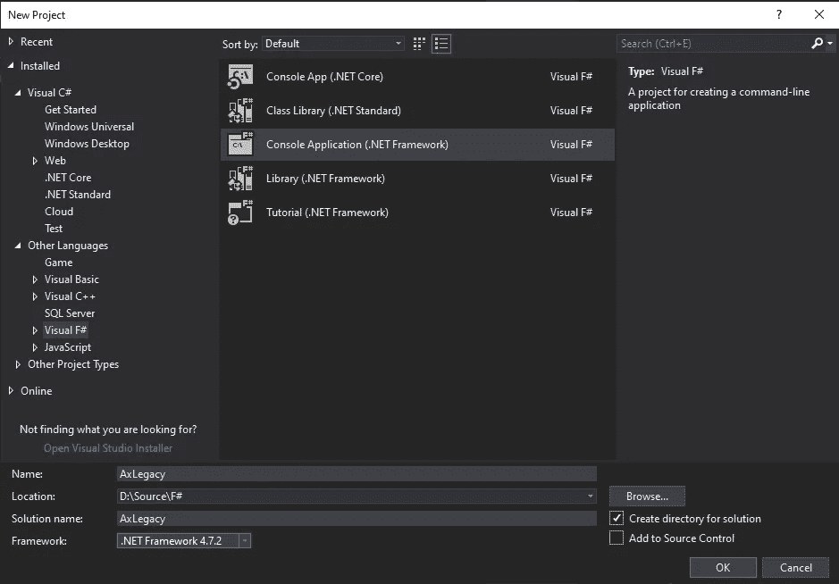
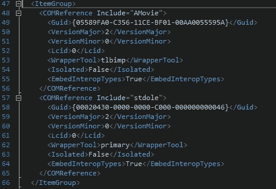

# 在 F#中使用 ActiveX 控件

> 原文：<https://towardsdatascience.com/using-an-activex-control-in-f-722e4d6614a1?source=collection_archive---------25----------------------->

## F#和 COM

我想在我的 F#中添加一个对遗留 ActiveX 控件的引用。NET Framework)项目。问题是，当它添加引用时，它是以一种非常基本且无益的方式添加的。我在 StackOverflow 上发帖，看看是否有人有解决方案，但建议的东西都不起作用:

<https://stackoverflow.com/questions/67933379/how-to-access-com-variant-properties-with-f>  

最后，我自己解决了这个问题，这篇文章是关于我是如何解决的。花了不少功夫，但是键用的是 Visual Studio 2017(完全支持 F#。NET Framework)并利用 C#作为临时过渡。我写这篇文章是为了防止其他人发现自己处于同样的情况，并想知道如何解决它。对我来说也是个参考:)

## F#控制台应用程序

创建一个 F#控制台应用程序。NET Framework)在 Visual Studio 2017:



F#控制台应用程序(。NET 框架)

添加一个 C#类库(。NET Framework)添加到解决方案中，并将其命名为 **DummyLib** :


C#类库(。NET 框架)

右键单击 **DummyLib** 的引用，并选择添加一个引用。然后选择一个 COM 引用。您应该会看到一个包含 ActiveX 控件的 COM 对象列表。为了演示起见，请选择**微软的 ActiveMovie 控件**(在现实世界中，您可以添加您想要的 ActiveX 控件):


添加对 Microsoft ActiveMovie 控件的引用

一旦你点击“确定”按钮，它将添加 COM 引用，并且它将被列在“引用”树下。如果您现在双击引用中的一个视图，这将打开对象浏览器窗口。展开互操作。AMovie 对象，您将看到 AMovie 名称空间。展开它，您会看到 ActiveMovieClass。如果选择，您将看到所有方法、属性和事件:


对象浏览器中的 ActiveMovieClass

如果您现在右键单击 DummyLib 项目并选择卸载该项目，那么您可以再次右键单击它并编辑它:


编辑 DummLib.csproj 文件

向下滚动到定义 COMReference 的 ItemGroup 元素，并将其复制到安全的地方:



COMReference 部分

现在需要卸载 AxLegacy 控制台应用程序，然后以同样的方式编辑 FSPROJ 文件。向下滚动到文件底部，将复制的部分插入到最后一条注释的正上方:


AxLegacy.fsproj 中插入的部分

右键单击两个项目文件并重新加载它们。我们快到了！

## 构建解决方案

如果你现在查看 AxLegacy 项目的 Obj 输出文件夹，你会看到 **tlbimp** 工具已经创建了引用 COM 库的**Interop.AMovie.dll**文件。我们需要确保将它复制到我们的输出文件夹中，我们确保这一点的方法是将其添加为后期构建步骤:


构建后副本

那一行写着:

```
xcopy /Y /F $(ProjectDir)obj\*.dll $(TargetDir)
```

这应该适用于以这种方式包含的任何 COM 对象。

现在可以安全地从解决方案中移除 **DummyLib** 了，请继续操作。

## 测试

为了查看我们是否可以正确地访问我们的 COM 对象，我们将在控制台应用程序中执行如下操作:

## 结论

在 Visual Studio 2019 中，做一些本应开箱即用的事情需要做很多工作！我希望当我们得到 Visual Studio 2022 时，它也能支持 F#。NET 框架应用程序。

## 资源

您可以从我的 GitHub 下载我在这里创建的示例应用程序:

<https://github.com/ianormy/AXLegacy> 