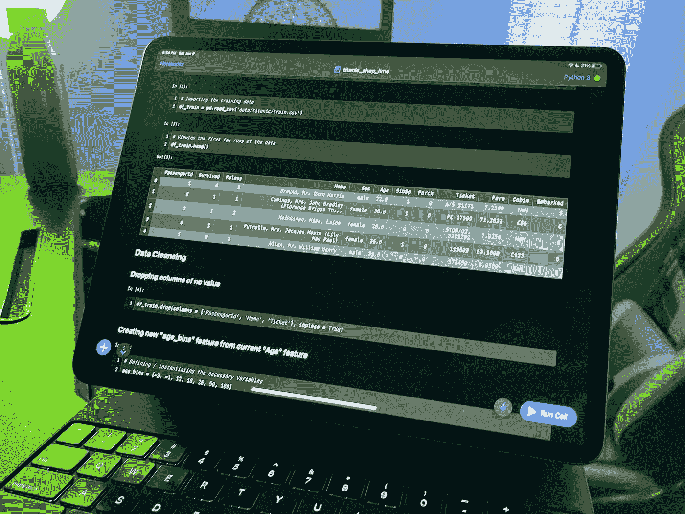
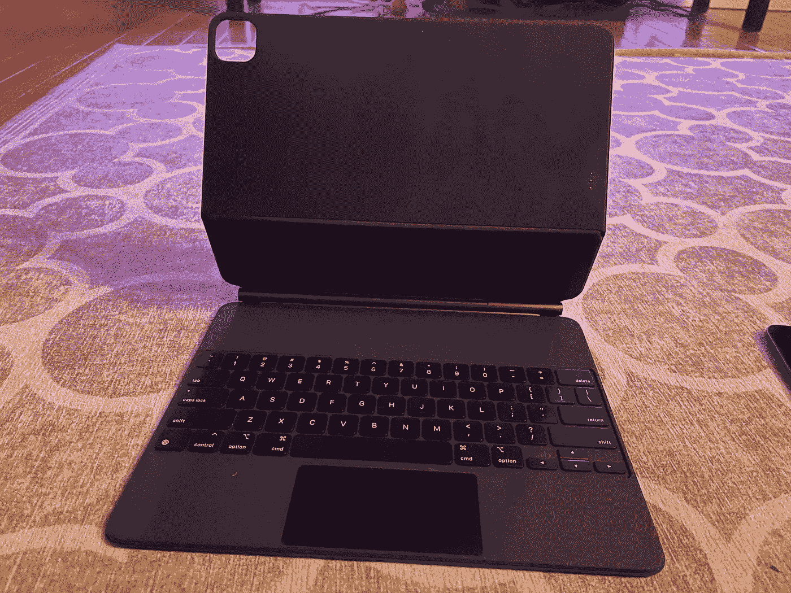
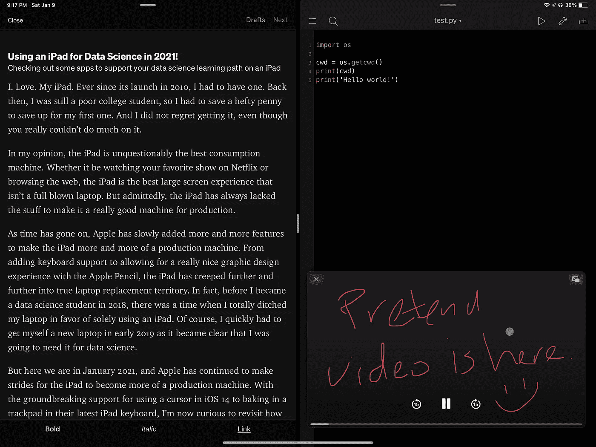
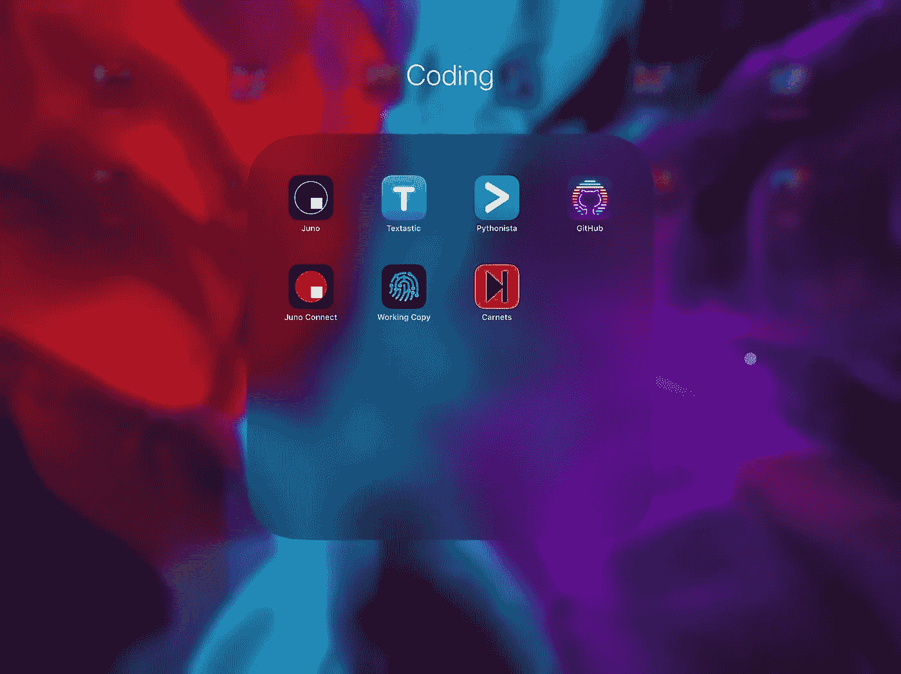
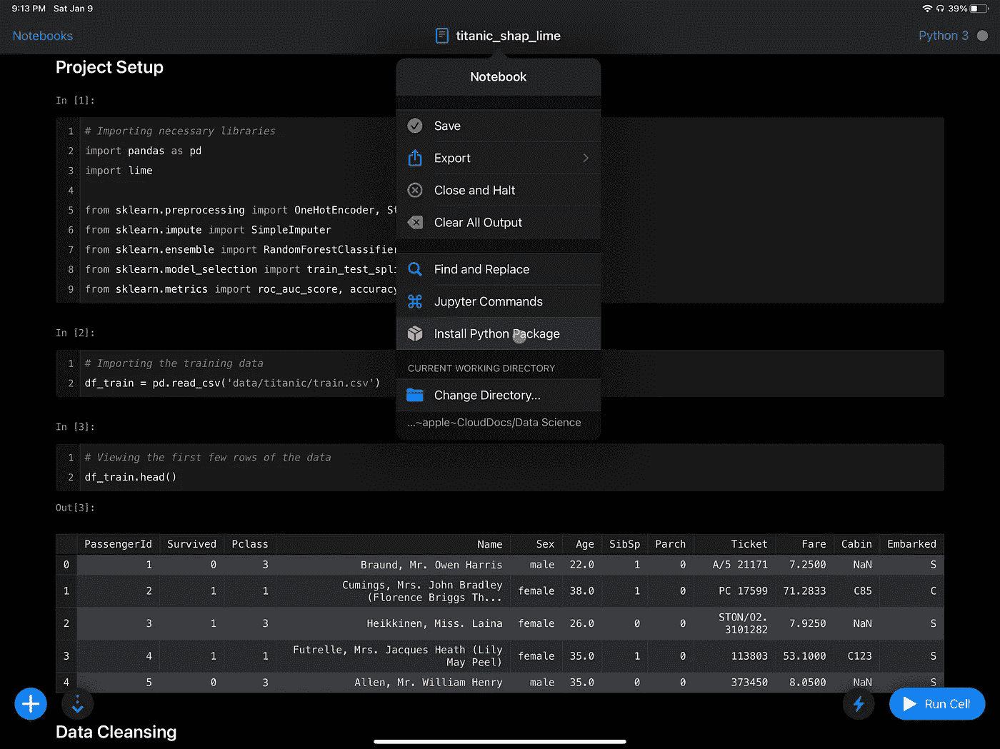
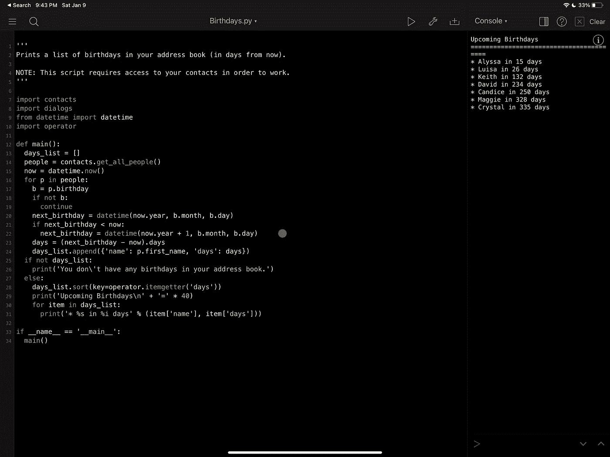

# 2021 年用 iPad 做数据科学！

> 原文：<https://towardsdatascience.com/using-an-ipad-for-data-science-in-2021-d6a973dd27ab?source=collection_archive---------3----------------------->

图片由装有 Juno 应用程序的 iPad 的作者拍摄

## 查看一些应用程序，以支持您在 iPad 上学习数据科学

一、爱情。我的 iPad。自从它在 2010 年推出以来，我不得不有一个。那时，我还是一个贫穷的大学生，所以我不得不省下一大笔钱来买我的第一个。我不后悔得到它，即使你真的不能做太多。

在我看来，iPad 无疑是最好的消费机器。无论是在网飞看你最喜欢的节目还是浏览网页，iPad 都是最好的个人大屏幕体验，而不是一台成熟的笔记本电脑。但不可否认的是，iPad 一直缺乏让它成为真正好的生产机器的东西。

随着时间的推移，苹果慢慢增加了越来越多的功能，使 iPad 越来越像一台生产机器。从增加键盘支持到允许用 Apple Pencil 进行非常好的图形设计体验，iPad 已经越来越接近真正的笔记本电脑替代品。事实上，在我 2018 年成为数据科学学生之前，有一段时间我完全抛弃了我的笔记本电脑，只使用 iPad。当然，我很快不得不在 2019 年初给自己买了一台新的笔记本电脑，因为很明显，我将需要它来进行数据科学。

但现在是 2021 年 1 月，苹果公司继续大步前进，让 iPad 更像一台生产机器。随着 iOS 14 突破性地支持在最新的 iPad 键盘上使用光标在触控板上烘焙，我现在很好奇 iPad 作为数据科学机器的可行性如何。在这篇文章的剩余部分，我们将看到我们如何在数据科学领域利用 iPad，并对这种体验的有用性做出最终判断。

事不宜迟，我们开始吧！

(哦，还有一件事……我 100%知道，如果你使用 AWS 或 GCP 这样的云服务，你肯定可以把 iPad 当作生产机器来使用，但这感觉像是作弊。这篇文章将涵盖 iPad 的硬件、软件和应用程序，以获得不依赖云计算的体验。)

# 硬件

作者拍摄的图像

我认为可以有把握地说，过去两年发布的任何 iPad 都有足够强的性能，可以与大多数普通笔记本电脑相媲美。我们将在我们的应用程序中进一步探讨这一点，但使用应用程序从 CSV 加载数据集并使用 Pandas 探索它们是一种非常爽快的体验。我个人是一名 16 英寸的 MacBook Pro，用于我作为机器学习工程师的日常工作，对于用 Python 工作，我要说我的 iPad Pro 和全 MacBook Pro 一样快。

但是我们不能忽视巨大的缺点:iPad 本身就是一个大触摸屏。使用虚拟键盘和使用手指作为光标是一种非常笨拙的体验。(更不用说虚拟键盘占用了一吨宝贵的屏幕空间。)iPad 增加对物理键盘的支持已经有一段时间了，这非常有帮助。2020 年夏天，苹果在 iOS 14 中正式添加了光标支持，以使用支持蓝牙的鼠标等。同样，这是将 iPad 用作生产机器的又一次巨大飞跃，但是这些额外的东西并不便宜。

如果你有一个普通的 iPad，并且没有兴趣购买这些额外的配件，那么你将很难在你的 iPad 上进行数据科学活动。可能吗？从技术上来说，是的，但是这种体验太糟糕了，我宁愿用低端笔记本电脑来工作。

# 软件

由 Medium、Pythonista 和 PIP 视频的作者拍摄的截图

尽管苹果在让 iOS 对生产客户更具吸引力方面取得了长足进步(甚至最近将 iPad 上的 iOS 重新命名为 iPadOS)，但它仍然是 iOS 的核心。它最终限制了我在普通笔记本电脑上做的一些事情，不幸的是，我永远无法真正用 iPad 取代我的工作笔记本电脑。也就是说，我不能使用命令行和命令行工具、构建 Docker 映像等等。

但这并不意味着我们完全不知所措。我们仍然可以做很多很酷的事情，我们将在应用程序部分介绍，但停留在 iOS 的基础水平，有一些事情值得注意。首先是 iOS 文件系统。这与我们对传统笔记本电脑的预期完全不同，但至少苹果在短短几年前就加入了他们自己的变体。这很棒，因为许多应用程序现在可以在所有应用程序中使用相同的文件，就像你在传统计算机上使用任何文件一样。此外，苹果的 iCloud Drive 使您在所有苹果设备之间同步文件变得轻而易举。(当然，如果您处理的是非常大的文件，那么最后一个会有所增加。)而且我也有责任提一下并行应用的非常好的用户界面！

苹果做出的这些重大改进值得称赞，但归根结底，如果没有好的应用，这些改进没有多大意义。让我们探索一下截至 2021 年初，这些应用包括哪些内容。

# 应用程序

作者捕获的屏幕截图

整个 iOS 生态系统的面包和黄油在于它的应用程序商店，幸运的是，一些伟大的人已经推出了一些伟大的应用程序，以帮助整个代码开发和数据科学过程。我们甚至会谈到这些应用程序是如何协同工作的，甚至会谈到你在 GitHub 上的工作，但我必须做到 100%透明:这不是一个简单的过程。你最终会像我一样习惯它，但它肯定不会像使用传统电脑那样无缝。

让我们进入我发现对数据科学有很大价值的应用程序。

## iOS 版 Juno

《iOS 版朱诺》作者截图

*(价格:$14.99，*[*App Store 链接*](https://apps.apple.com/us/app/juno/id1462586500) *)*

不用说，使用 Jupyter 进行探索性数据分析和数据可视化是一项巨大的资产，而 Juno 带来的正是这一点。Juno 是一个允许你运行 Jupyter 笔记本界面的应用程序，它可以与 Python 内核甚至一些包如 Pandas 和 Scikit-Learn 一起工作。如前所述，Juno 等应用程序现在可以直接与 iOS 文件系统交互，因此您可以轻松地从 Kaggle 等网站下载数据集，并直接在 Juno 中使用它。不错！

不幸的是，Juno 并非没有缺点。它建立在 iOS 之上，不能运行传统的 shell 命令。此外，虽然您可以从 PyPi 安装一些额外的包，但它们必须完全用 Python 编写。如果它们不是纯用 Python 编写的，那么它们就不能下载到 Juno。(例如，对于模型透明度，我可以下载石灰，但不能下载 SHAP。去想想。)Juno 在导航文件系统时也可能有点笨拙，但最终，我认为 Juno 是一个令人惊叹的应用程序，并期待着看到它如何随着时间的推移继续发展。

## 腐霉 3 号

Pythonista 3 作者截图

*(价格:$9.99，*[*App Store*](https://apps.apple.com/us/app/pythonista-3/id1085978097)*)链接*

在 Jupyter 中工作是很棒的，但是当涉及到形式化你的训练和推理代码时，我们真的需要走出 Jupyter 的世界。幸运的是，Pythonista 是一个优秀的基于 Python 的 iPad IDE，它正好满足了我们的要求。像 Juno 一样，它也可以与 iOS 文件系统无缝同步，这样您就可以在同一个地方使用 Juno 的 Jupyter 笔记本和 Python 的 Python 脚本。Pythonista 还提供了一些非常酷的例子，展示了您可以在应用程序中实际完成的事情，因此，请查看这些例子，了解一些您可以在下一次数据科学工作中考虑的巧妙想法。

## 工作副本

工作副本的作者捕获的屏幕截图

*(价格:基本功能免费，高级功能 19.99 美元，App Store* *中的* [*链接)*](https://apps.apple.com/us/app/working-copy-git-client/id896694807)

还记得我说过你可以把你的作品存回 GitHub 吗？这就是这个应用程序的全部内容。就像 Juno 和 Pythonista 一样，工作副本可以直接进入 iOS 文件系统，以创建可以同步回 GitHub 的 Git repo。(或者 Filelocker 或者 GitLab 或者更多！)这是一个简单的应用程序，但对于在 iPad 上工作来说，它是一个超级好的补充。在这三个应用程序和 iOS 文件系统之间，你现在可以在 iPad 上的一个地方共同工作，这个地方可以很容易地同步到源代码库中。不错！！

当然，我不得不提到一个小缺点:用户界面。你可以说我疯了，但实际上我喜欢使用命令行，由于 iPad 对 iOS 的依赖，这显然是不存在的。工作副本确实有一个 UI 来执行这些传统的 Git 命令，但是…它可能需要一些工作。好消息是，核心功能已经存在，所以如果这款应用的开发者能够真正优化他们的用户界面，我认为这款应用可能会比现在更加出色。但不管 UI 如何，它仍然足够好，我仍然在自己的工作中使用它。

## 荣誉奖

上面提到的三个应用程序是在 iPad 上执行数据科学的“必备”，但我认为还有其他应用程序可能值得一试。我确信我可能遗漏了一些你想添加到这个列表中的内容，所以请在评论中说出你想在这里看到的内容。

[**【text astic(价格:9.99 美元)**](https://apps.apple.com/us/app/textastic-code-editor-9/id1049254261) : Textastic 是 App Store 上最受欢迎的编码应用，因为它在语法高亮显示方面做得非常好，并且适用于许多不同的语言。但是因为我大部分时间都在使用 Python，所以我不太需要在 Juno 或 Pythonista 上使用这个应用程序。不过，把它放在诸如 markdown 文件编辑之类的地方还是不错的。

[**【GitHub(价格:免费)**](https://apps.apple.com/us/app/github/id1477376905) :这款应用最近才问世，支持流行的源代码库。我喜欢用 GitHub 展示我所有的个人作品，但 iPad 应用程序在我的书中并不是“必须的”。我个人不在 GitHub 上进行任何多人协作，但它在这些场景中确实显得更有用。因为它是免费的，为什么不下载呢？

[**【Carnets Jupyter(价格:免费)**](https://apps.apple.com/us/app/carnets-jupyter/id1450994949) :这是我在 Jupyter 笔记本中用于交互的应用程序，但后来我换成了 Juno，老实说我不记得为什么了。它一点也不差，当然，它是免费的，没人能否认。

# 你能抛弃你的传统笔记本电脑吗？

因此，我们终于来到了我们一直在等待的问题，那就是，我们最终可以单独使用 iPad 进行数据科学工作吗？不幸的是，答案最终是否定的。因为 iOS 不是传统的操作系统，由于我依赖命令行工具、Docker 映像等等，所以有很多事情我做不了。我很有兴趣看看苹果是否能够克服这些障碍，但不幸的是，它们在 2021 年 1 月仍然存在。

但这并不意味着数据科学在 iPad 上完全死亡。我发现，如果有合适的硬件(例如，物理键盘和鼠标/触控板)，iPad 是一个令人惊叹的学习和概念验证工具。如果你正在编写一些基本的代码，想要做一些简单的探索性数据分析，或者测试你刚刚学到的一些新技能，iPad 最终能够胜任所有这些事情。在一天结束的时候，我肯定不会扔掉我的笔记本电脑，但很高兴知道如果我真的想的话，我可以用我的 iPad 度过难关。