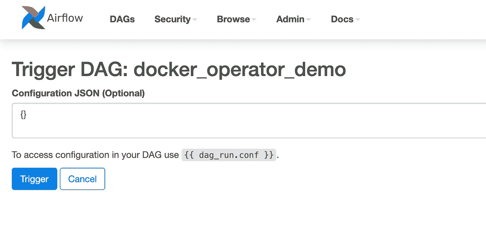

# 使用 Apache Airflow DockerOperator 和 Docker Compose

> 原文：<https://towardsdatascience.com/using-apache-airflow-dockeroperator-with-docker-compose-57d0217c8219?source=collection_archive---------8----------------------->

围绕`[DockerOperator](https://airflow.apache.org/docs/apache-airflow-providers-docker/stable/_api/airflow/providers/docker/operators/docker/index.html)`的互联网上的大多数教程都很棒，但是它们有一个缺失的环节，我今天想在这里介绍一下，它们都没有假设你正在用 Docker Compose 运行 [Apache Airflow。](https://airflow.apache.org/docs/apache-airflow/stable/start/docker.html)

这里的所有代码和进一步的说明都在 repo[fclesio/air flow-docker-operator-with-compose](https://github.com/fclesio/airflow-docker-operator-with-compose)中。

## 游戏攻略

a)首先，使用 webservice 创建一个容器，并创建`airflow`用户[，如官方文档](https://airflow.apache.org/docs/apache-airflow/stable/start/docker.html)中所述:

结果应该大致类似于下图:

b)完成初始设置后，通过`docker-compose`启动网络服务和其他组件:

当您运行下面的语句时，您可以使用`docker container ps`来检查 docker 容器。结果应该大致如下所示:

c)所有容器都已启动并运行，让我们使用`airflow`作为登录和密码进入气流 UI:

d)在 Airflow UI 中，您会发现一个与 Docker 操作符相关的 DAG:

e)取消暂停 DAG:

f)单击 DAG 并进入图形模式:

您将看到正在执行的两个任务。这是下面的 DAG 代码:

如我们所见，我们正在执行一条`sleep`语句和另一条带有`echo`语句的语句。[N1]

在执行过程中，这将是`docker container ps`语句的结果:

在这幅图中，我们可以看到每个任务都有自己的容器。我使用任务中的`container_name`属性来命名这些任务。我强烈建议你**总是**在每个任务的容器中输入名字，因为如果你有一些容器在做一些意想不到的事情(*例如*无限循环，花费很长时间等等)，调试一些未命名的容器将会非常困难。

g)我在 DAG 中做了一个小的改动，我加入了两个`echo`语句来显示这些信息将如何返回到气流日志中。只需将以下代码复制并粘贴到您的 DAG 中:

我们将向负责该任务的每个容器发送两条`echo`语句。一个带有`hello`，另一个带有`world`:

h)刷新并触发 DAG:

I)使用图形视图检查 DAG 中的执行情况:

在我的机器上执行相当快，但是我们可以通过查看日志来检查每个任务的结果。

如果我们点击`docker_command_hello`任务并选择`logs`选项，我们将看到`command`的输出

我们在`docker_command_world`任务中也会得到相同的结果:

j)在实验结束时，运行`docker-compose down`并停止所有容器。

# 一些实际的用法

*   独立于语言的任务编排(例如，我目前正在一个完全用 Ruby 编写的数据管道中工作)；
*   提交第三方平台的作业(*例如* AWS Sage Maker、Spark jobs、Databricks、Azure 等)；
*   [在隔离环境中运行 dbt 模型](https://docs.getdbt.com/reference/node-selection/syntax)；
*   ETL/ELT 任务的容器化；
*   [用 soda.sql 进行一些 ETL/ELT 测试](https://github.com/sodadata/soda-sql)；
*   包括一个额外的步骤[数据剖析、验证和测试，并对其寄予厚望](https://greatexpectations.io/)，没有环境问题。

# 使用的小技巧

*   [正如 Marc Lamberti 所描述的](https://marclamberti.com/blog/how-to-use-dockeroperator-apache-airflow/)如果您的 docker 映像不是在相同的本地环境中构建的(例如在 worker 中)，这意味着它需要被下载，这将增加 SLA
*   docker 容器用户([在这个例子中是用户](https://github.com/fclesio/airflow-docker-operator-with-compose/blob/main/dags/docker_job/Dockerfile) `[airflow](https://github.com/fclesio/airflow-docker-operator-with-compose/blob/main/dags/docker_job/Dockerfile)` ) **需要在 docker 守护进程**中有权限(一个简单的`chmod`给气流用户权限就可以解决[N2】)；
*   [一个单独的](https://github.com/fclesio/airflow-docker-operator-with-compose/blob/main/dags/docker_job/Dockerfile) `[dockerfile](https://github.com/fclesio/airflow-docker-operator-with-compose/blob/main/dags/docker_job/Dockerfile)` [可以被转换成一个图像](https://github.com/fclesio/airflow-docker-operator-with-compose/blob/main/dags/docker_job/Dockerfile)，供每个 DAG 使用。有一个" *god docker image* "包含所有的依赖项和包，可以运行 ELT 管道中的所有任务，这很有吸引力。请不要这样做。图像会变得不必要的臃肿，构建会花费很长时间(这将反映在 SLA 中)；
*   [由于 DockerOperator 实现中的一个问题](https://github.com/apache/airflow/issues/13487)，选项`[AIRFLOW__CORE__ENABLE__XCOM_PICKLING](https://github.com/fclesio/airflow-docker-operator-with-compose/blob/11e67d9248d0639c9786313643190028b27659f0/docker-compose.yaml#L54)` [应该设置为](https://github.com/fclesio/airflow-docker-operator-with-compose/blob/11e67d9248d0639c9786313643190028b27659f0/docker-compose.yaml#L54)`[true](https://github.com/fclesio/airflow-docker-operator-with-compose/blob/11e67d9248d0639c9786313643190028b27659f0/docker-compose.yaml#L54)`；
*   [我们需要将运行 docker 守护进程](https://github.com/fclesio/airflow-docker-operator-with-compose/blob/11e67d9248d0639c9786313643190028b27659f0/docker-compose.yaml#L59)的主机的 URL 链接作为一个卷传递给[以允许 web 服务器容器启动 Docker 映像](https://stackoverflow.com/q/51342810/7024760)；
*   [不要忘记在](https://github.com/fclesio/airflow-docker-operator-with-compose/blob/11e67d9248d0639c9786313643190028b27659f0/dags/docker_job/docker-job.py#L36) `[DockerOperator](https://github.com/fclesio/airflow-docker-operator-with-compose/blob/11e67d9248d0639c9786313643190028b27659f0/dags/docker_job/docker-job.py#L36)` [中建立](https://github.com/fclesio/airflow-docker-operator-with-compose/blob/11e67d9248d0639c9786313643190028b27659f0/dags/docker_job/docker-job.py#L36) `[container_name](https://github.com/fclesio/airflow-docker-operator-with-compose/blob/11e67d9248d0639c9786313643190028b27659f0/dags/docker_job/docker-job.py#L36)` [属性。](https://github.com/fclesio/airflow-docker-operator-with-compose/blob/11e67d9248d0639c9786313643190028b27659f0/dags/docker_job/docker-job.py#L36)这一点非常重要，因为如果您忘记建立不同的名称，您可能会遇到容器名称冲突，DAG 将会失败(长话短说:出于某种原因，我发现 Airflow 正在尝试重新连接一些上游启动的容器；而这引起了一些冲突)；
*   [默认情况下，](https://github.com/fclesio/airflow-docker-operator-with-compose/blob/11e67d9248d0639c9786313643190028b27659f0/dags/docker_job/docker-job.py#L35) `[image](https://github.com/fclesio/airflow-docker-operator-with-compose/blob/11e67d9248d0639c9786313643190028b27659f0/dags/docker_job/docker-job.py#L35)` [属性](https://github.com/fclesio/airflow-docker-operator-with-compose/blob/11e67d9248d0639c9786313643190028b27659f0/dags/docker_job/docker-job.py#L35)将总是拍摄最新的图像。根据经验，我**强烈**建议使用最近的`Dockerfile`构建所有图像。如果您希望 100%确保作业将始终使用(事实)最新的映像，请考虑为您的映像包含一个以前的构建任务。类似`docker build -f path/to/Dockerfile -t yourname/image_name .`的东西。
*   据我查看 Docker 实现的[源代码，Airflow 在 Docker 套接字中使用了一种绑定安装来启动容器。我不是 100%确定，但这意味着气流没有做*对接*可能会导致其他一些过多的问题](https://github.com/apache/airflow/blob/b66b54c83cb2efa274ba8040ce22ae719defbe75/airflow/providers/docker/operators/docker.py#L329)。

# 结束语

我个人认为 Airflow + Docker 是一个很好的组合，可以为 ELT/ETL 任务提供灵活、可扩展和无麻烦的环境。不幸的是，在互联网上，大多数使用 Docker Compose 的 Airflow 实现都没有考虑到使用 DockerOperator 作为灵活的任务编排环境的可行替代方案。

就 ELT/ETL 架构而言，这种使用 Docker Compose + DockerOperator 的气流组合认为是一个很好的替代方案，与以下相比:(I)由于我们不需要处理工作人员供应，(ii)由于其固有的复杂性，(iii)使用 [Docker Swarm](https://docs.docker.com/engine/swarm/) 管理这些任务，但其在供应和故障恢复能力方面存在局限性。

# 参考

有用的链接，我在这个过程中使用的重要性排序。

*   [对接器中的运行气流](https://airflow.apache.org/docs/apache-airflow/stable/start/docker.html)
*   [我已经在 Docker 中运行 Airflow，如何在 Airflow 中使用 DockerOperator？](https://www.reddit.com/r/dataengineering/comments/kmojyc/how_can_i_used_the_dockeroperator_in_airflow_of_i/)
*   [在您的 CI 或测试环境中使用 Docker-in-Docker？三思而后行。](https://jpetazzo.github.io/2015/09/03/do-not-use-docker-in-docker-for-ci/)
*   [如何在 Apache Airflow 中使用 docker operator](https://marclamberti.com/blog/how-to-use-dockeroperator-apache-airflow/)
*   [如何使用气流而不头疼](/how-to-use-airflow-without-headaches-4e6e37e6c2bc)
*   [码头工人灭霸(小心使用)](https://gist.github.com/fclesio/436aedee06b91aa8ac863b671919372e)
*   [DockerOperator 无法将 XCom 值序列化到 JSON 中](https://github.com/apache/airflow/issues/13487)
*   从 docker 内部运行 docker 可以吗？
*   [停靠栏中的 chmod 无法正常工作](https://serverfault.com/questions/772227/chmod-not-working-correctly-in-docker)
*   [air flow docker operator:connect sock . connect(self . UNIX _ socket)file not found error:[Errno 2]没有这样的文件或目录](https://stackoverflow.com/questions/61186983/airflow-dockeroperator-connect-sock-connectself-unix-socket-filenotfounderror)
*   [如何使用正确的组将 docker 插座作为卷安装到 docker 容器中](https://stackoverflow.com/questions/36185035/how-to-mount-docker-socket-as-volume-in-docker-container-with-correct-group)
*   [关于通过 Apache Airflow 在 Python 子进程中运行 docker 命令的权限问题](https://stackoverflow.com/questions/56782039/permission-issue-on-running-docker-command-in-python-subprocess-through-apache-a/60092639#60092639)
*   [如何在 Docker 容器中运行 Docker](https://devopscube.com/run-docker-in-docker/)

## 笔记

[N1] —我在任务名称和命令语句中犯了一点小错误。

【N2】—[在 Reddit](https://www.reddit.com/r/dataengineering/comments/kmojyc/how_can_i_used_the_dockeroperator_in_airflow_of_i/go44nip/) 的这个帖子中，一个用户通过`chmod 777 /var/run/docker.sock`为主机 Docker 守护进程中的权限做了一个激进的解决方案。我个人不推荐。