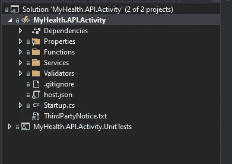
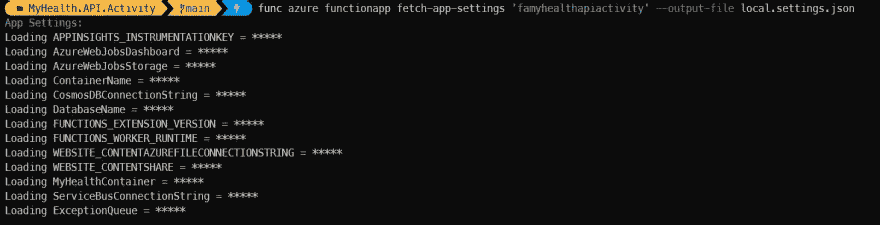
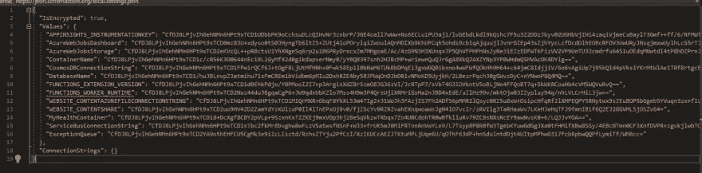

# 使用 Azure Functions 核心工具获取本地开发的应用程序设置

> 原文：<https://towardsdatascience.com/using-azure-functions-core-tools-to-fetch-app-settings-for-local-development-c657866fb783?source=collection_archive---------11----------------------->

## 使用 Azure Function Core 工具，我们可以从函数中检索设置，以简化我们的本地开发和调试工作！

在部署我们的 Azure 功能之前，最好在本地调试我们的功能，以确保它按预期工作。本地运行我们的函数需要一个 *local.settings.json* 文件来存储我们的应用程序设置。

当我们第一次在 Visual Studio 中创建函数时，会为我们生成一个 local.settings.json 文件。但是，如果我们从一个库克隆一个功能 app，这个文件就不会被克隆了！(*希望*它不会被克隆。最好不要把这个文件提交给你的回购，因为它有应用程序的秘密！).

幸运的是，我们可以使用 Azure Function Core Tools 创建一个 local.settings.json 文件，并将我们的函数设置导入到该文件中，这样我们就可以在本地运行我们的函数，就像我们在那个环境中运行它一样！

# 我们为什么要这么做？

比方说，如果我们有多个环境(开发、测试、UAT 等),我们希望使用这些环境设置在本地调试一个功能，我们可以使用 Azure Function Core 工具来简化这些设置的检索。尤其是对于有很多设置的函数。我们不想浪费时间复制和粘贴所有这些设置！

# 开始之前

你需要确保你的机器上已经安装了 [Azure 功能核心工具](https://docs.microsoft.com/en-us/azure/azure-functions/functions-run-local?tabs=windows%2Ccsharp%2Cportal%2Cbash%2Ckeda)。Azure Functions 核心工具包括一个支持 Azure Functions 运行时的相同运行时版本，我们可以在我们的机器上运行它。

虽然我们将只关注获取我们的应用程序设置，但函数核心工具附带了允许我们创建函数、部署函数等命令！

如果您还没有安装这些工具，请查看本文档开始安装。

# 我们开始吧

对于本教程，我从 GitHub 克隆了一个现有项目。我已经把这个功能部署到 Azure 和我的。gitignore 文件排除了我创建项目时生成的 local.settings.json 文件。

为了帮助我进行本地调试，我将使用 Function Core 工具来帮助从 Azure 获取我的应用程序设置。为了验证本地设置文件不在我的项目目录中，这里有一个屏幕截图:



图片作者:Will Velida

我们需要创建一个 JSON 文件来写入我们的应用程序设置。为此，右键单击 Functions 项目并创建一个新文件。创建一个 *JavaScript JSON 配置文件*，命名为 *local.settings.json*

# 步骤 1:设置我们的 Azure 订阅

如果你使用多个 Azure 订阅，我们需要使用 AZ CLI 来设置它，以确保当我们运行我们的功能核心工具时，它在正确的位置。

在您的计算机上打开命令行或 PowerShell，并通过运行以下命令登录到您的 Azure 帐户:

```
az login
```

登录后，您应该会看到您有权访问的订阅列表。要设置托管您的函数的订阅，请运行以下命令:

```
az account set -s "<subscription-name-or-id>"
```

-s 是订阅的简写参数。

# 步骤 2:获取我们的应用程序设置

现在，我们可以从 Azure 的功能应用程序中获取应用程序设置。确保您位于项目的目录中，并在终端中运行以下命令:

```
func azure functionapp fetch-app-settings '<function-name>' --output-file local.settings.json
```

您应该会在终端中看到类似如下的输出:



图片作者:Will Velida

回到 Visual Studio 中的项目，并签出您的 *local.settings.json* 文件。我们可以看到，我们的函数设置已经被检索并写入我们的本地设置文件！

然而，只有一个问题…



图片作者:Will Velida

我们的设置被加密了！当在本地运行我们的函数时，这对我们没有帮助！函数应用程序设置在存储时是加密的，只有在启动时被注入函数的进程内存之前才会被解密。

要了解 Azure Functions 中应用程序设置的更多信息，请查看这篇[文章](https://docs.microsoft.com/en-us/azure/azure-functions/security-concepts#application-settings)。

# 第三步:解密我们的设置。

谢天谢地，我们可以使用 Azure Function Core 工具解密我们的设置！在您的终端中，运行以下命令:

```
func settings decrypt
```

回到 Visual Studio，您将看到您的设置已经被解密，并准备好用于您的本地调试需要！

(*当然我不会给你那个的截图！这是秘密！*😂😉).

我们现在可以在本地启动我们的功能，就像我们在 Azure 环境中运行它一样！

这里要注意一点！如果您在 Key Vault 中存储了一些应用程序设置(您应该这样做！)，则当您检索该设置时，您可能只能获得存储该机密的密钥库 URL。要使用实际值，您需要从密钥库中检索它。

# 包扎

正如你所看到的，使用 Azure Function Core 工具可以帮助我们快速检索功能应用设置，从而加快我们的开发过程。

如果您想了解更多信息，请查看以下资源:

*   [使用 Azure 功能核心工具](https://docs.microsoft.com/en-us/azure/azure-functions/functions-run-local?tabs=windows%2Ccsharp%2Cportal%2Cbash%2Ckeda)
*   [Azure 功能核心工具 GitHub](https://github.com/Azure/azure-functions-core-tools)

如果您有任何问题，请随时在 [Twitter](https://twitter.com/willvelida) 上联系我或在评论中提问！

编码快乐！👨‍💻👩‍💻💻