# 使用 Azure 日志分析工作区从虚拟机收集自定义日志

> 原文：<https://towardsdatascience.com/using-azure-log-analytics-workspaces-to-collect-custom-logs-from-your-vm-99ef7816a0fe?source=collection_archive---------3----------------------->

## 不，我们不是在谈论带有预定义指标的 Azure Monitor。


马丁·范·登·霍维尔在 [Unsplash](https://unsplash.com/s/photos/files?utm_source=unsplash&utm_medium=referral&utm_content=creditCopyText) 上的照片

# 动机:

我们都已经在虚拟机页面上看到了“Monitoring”选项卡的关键指标。是的，通过 **CPU** 指标来查看 CPU 是否一直在运行，以指标来检查虚拟机何时通过**网络从外部世界获取数据，以及虚拟机是否正在使用**磁盘操作/秒**指标进行任何类型的写操作，这都很有用，但对于我们在虚拟机上构建的定制服务来说，这并不有效。因此，在这篇博客中，我将向您展示如何基于客户服务创建您自己的日志，使用其默认代理将它带到**Azure Log Analytics Workspace**，并根据我们的需要查询它，甚至更好地在其上创建警报。**

# 先决条件:

1.  蓝色账户
2.  Azure 虚拟机服务
3.  Azure 日志分析工作区服务
4.  Azure 警报服务

# Azure 虚拟机:

让我们从虚拟机本身开始。您已经在虚拟机上运行了服务，但是不知道如何将这些日志放入门户，甚至不知道如何为您的服务创建日志。因此，让我们假设您还没有为您的服务创建日志。因此，在这篇博客中，我将以一个简单的 flask 应用程序作为我的服务示例。要启动并运行它，我们必须从 pip 下载 flask 库，然后创建一个 flask 应用程序，如下所示:

苏拉布什雷斯塔。使用 Azure 日志分析工作区从 VM 1 收集自定义日志。2021.JPEG 文件。

没什么，只是一个运行在默认端口 5000 上的简单的 flask 应用程序。让我们通过下面的命令来运行它:

```
python app.py
```

该服务必须正在运行。现在完成了，让我们移动到日志部分。我们将要使用的技巧都取决于 grep。由于 grep 命令将帮助我们找到正在运行的服务，我们将利用它来了解 app 服务是否正在工作。因此，我创建了这个 bash 脚本来了解应用服务是否正在运行。如果它正在运行，我会给它一个 **200** 成功代码，如果它没有运行，那么它会得到 **500** 错误代码。

苏拉布什雷斯塔。使用 Azure 日志分析工作区从您的虚拟机 2 收集自定义日志。2021.JPEG 文件。

一直到现在都很简单。现在尝试运行脚本，它会根据您的服务状态显示 200 或 500。但是我们不能永远手动操作。所以为了自动化，我使用 **crontab** 每分钟为我运行一次脚本。通过“crontab -e”打开 crontab，然后输入以下命令

苏拉布什雷斯塔。使用 Azure 日志分析工作区从您的虚拟机 3 收集自定义日志。2021.JPEG 文件。

为了解释它，第一部分处理 bash 脚本所在的位置，第二部分处理您希望将生成的日志文件放在哪里。我建议你创建这个文件和文件夹，并在把它放到 crontab 之前给它适当的权限' **chmod** '。现在，让我们等待 5 分钟，检查日志是否已写入。

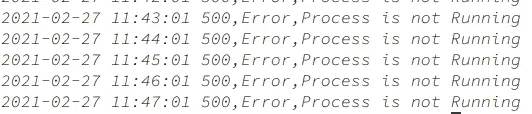

苏拉布什雷斯塔。使用 Azure 日志分析工作区从您的虚拟机 4 收集自定义日志。2021.JPEG 文件。

看起来它像预期的那样工作，因为我在 crontab 上运行它之前已经关闭了我的服务。复制其中 5 条消息，并将其保存在一个新文件中，我们需要向日志分析工作区提交一个样本。现在，让我们转到 Azure 门户。

# Azure 日志分析工作区:

转到您的虚拟机，然后选择“日志”并单击“启用”按钮。系统将提示您创建新的工作空间。

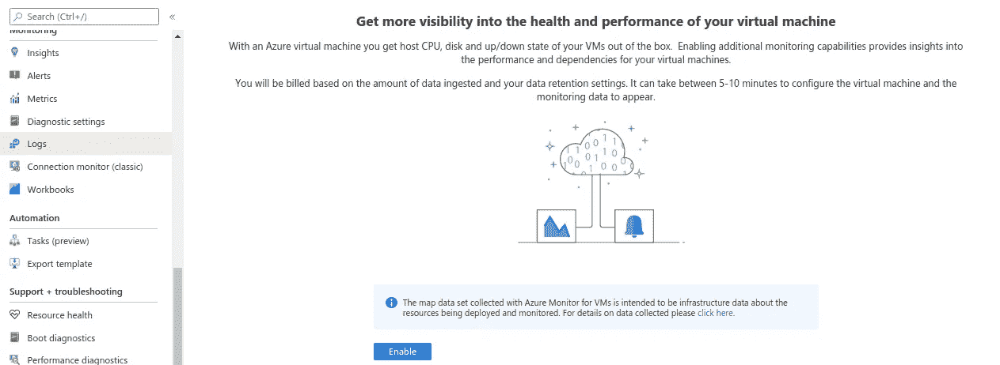

苏拉布什雷斯塔。使用 Azure 日志分析工作区从您的虚拟机 5 收集自定义日志。2021.JPEG 文件。

工作区需要 5-10 分钟，请耐心等待。创建工作空间后，转到 Insights 选项卡

我们现在正在做的是通过点击我们的按钮来安装 Azure Log Analytics 工作空间。我们也可以使用 CLI 创建，但我更喜欢门户方式。当且仅当门户不起作用时，我才会选择 CLI 方式。现在让我们配置我们的机器来获取定制日志。转到您创建的日志分析工作区，单击“高级设置”,这将提示您进入新页面。

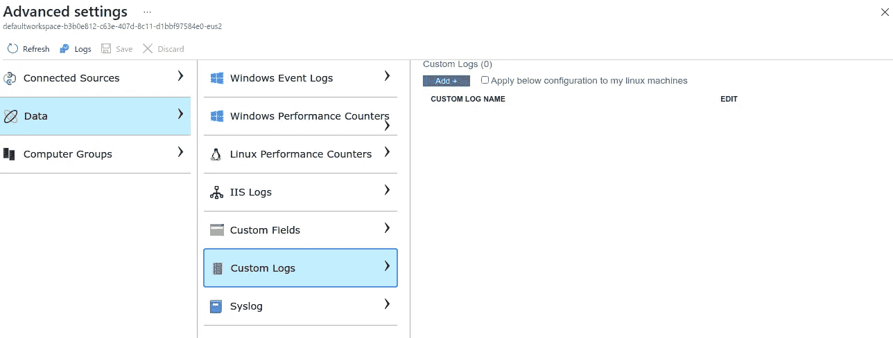

苏拉布什雷斯塔。使用 Azure 日志分析工作区从 VM 6 收集自定义日志。2021.JPEG 文件。

点击“数据”和“自定义日志”。你会看到一个“添加+”按钮。点击它，你会得到一个新标签的提示。

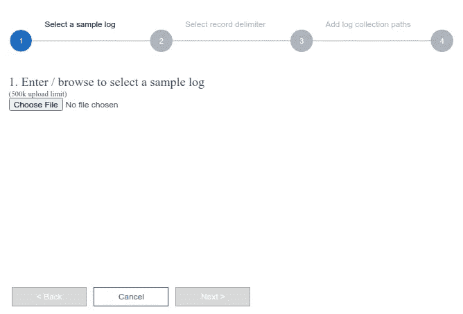

苏拉布什雷斯塔。使用 Azure 日志分析工作区从您的 VM 7 收集自定义日志。2021.JPEG 文件。

上传您在上面保存示例日志，然后单击“下一步”。您将看到“新行”和“时间戳”选项。选择“新行”并点击“下一步”

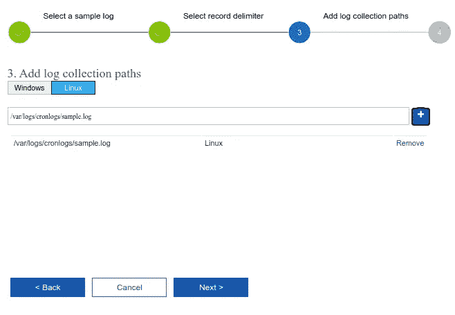

苏拉布什雷斯塔。使用 Azure 日志分析工作区从您的 VM 8 收集自定义日志。2021.JPEG 文件。

给出 crontab 上的路径，然后点击“下一步”

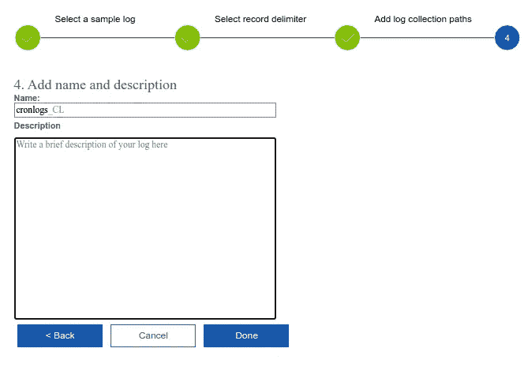

苏拉布什雷斯塔。使用 Azure 日志分析工作区从您的 VM 9 收集自定义日志。2021.JPEG 文件。

给出适当的名称，因为如果需要，我们将在查询中使用该名称。

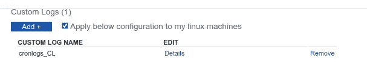

苏拉布什雷斯塔。使用 Azure 日志分析工作区从您的 VM 10 收集自定义日志。2021.JPEG 文件。

不要忘记选择“将以下配置应用于我的 Linux 机器”。现在让我们看看日志是否到达。Azure 文档说日志可能需要 1 小时到达，但是在我的例子中，它在 20 分钟内到达。所以请按照步骤做好，等待日志到达。现在，点击“日志”,会出现一个窗口提示您输入一些类似 SQL 的命令。它实际上是 Kusto 查询语言，类似于 SQL，所以我们可以使用 Azure 提供的引用来使用它。我还将在下面的参考资料部分链接该指南。

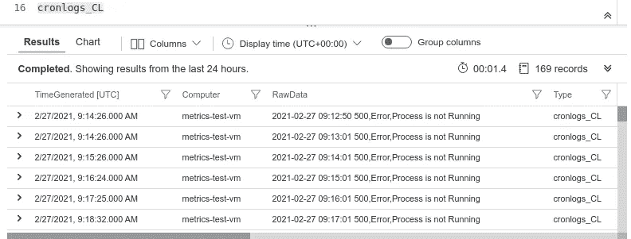

苏拉布什雷斯塔。使用 Azure 日志分析工作区从您的 VM 11 收集自定义日志。2021.JPEG 文件。

如你所见，它成功了。如果你已经做到了这一步，那么恭喜你，因为你已经很好地将你的自定义日志引入了 Azure 门户。现在您可以使用它，查询它，分析它，等等。在下一部分中，我将基于自定义日志创建一个警报。

# Azure 提醒:

到目前为止，我们将自定义日志引入 Azure 门户，这已经是一项相当大的工作，但我们还想做得更多。因此，让我们基于自定义日志创建一个警报。正如你已经意识到的，自定义日志是混乱的，所以我们要做的是首先使用 Kusto 查询语言(KQL)清理它。

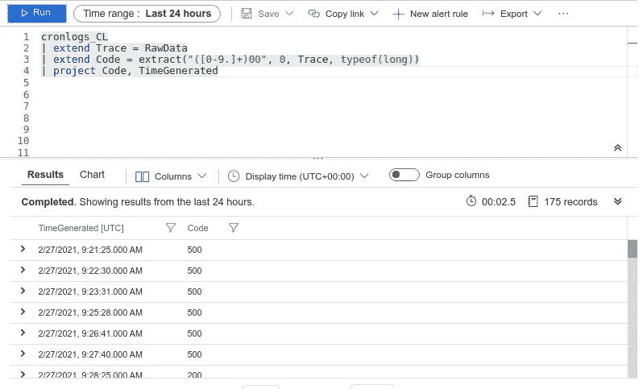

苏拉布什雷斯塔。使用 Azure 日志分析工作区从您的 VM 12 收集自定义日志。2021.JPEG 文件。

我们在这里所做的只是从我们的自定义日志中提取状态代码。我应该说非常整洁。现在，我们要做的是根据状态代码创建一个警报。如果服务不运行，我们将得到一个 500 错误代码，因此，如果服务不工作，我们将使用 500 错误代码创建一个警报。单击“新建警报规则”,这将提示您进入新页面。

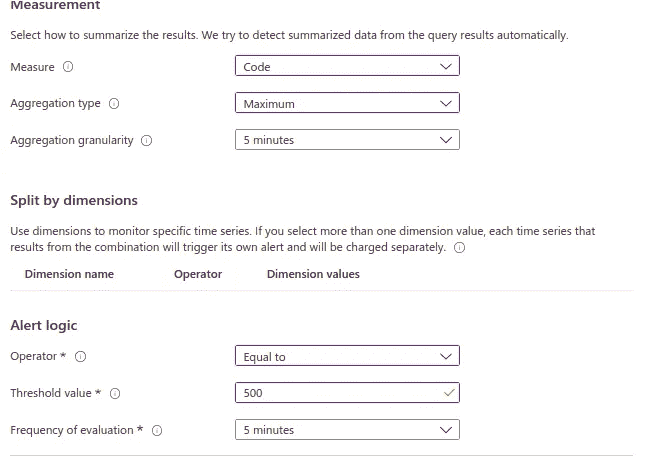

苏拉布什雷斯塔。使用 Azure 日志分析工作区从您的 VM 13 收集自定义日志。2021.JPEG 文件。

输入我所做的选择。我们使用聚合类型作为最大值，因为我们只有两个状态代码，并且警报逻辑本身是描述性的。点击“下一步”和“创建行动组”,输入您的电话号码或电子邮件。

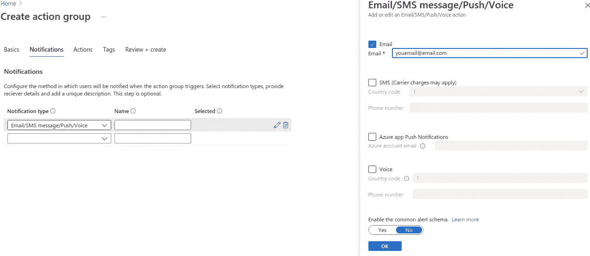

苏拉布什雷斯塔。使用 Azure 日志分析工作区从您的 VM 14 收集自定义日志。2021.JPEG 文件。

创建行动组后，返回，您将看到您新创建的行动组。给出您的提醒名称和“查看+创建”。现在让我们等待 5 分钟，看看是否会弹出一封电子邮件。

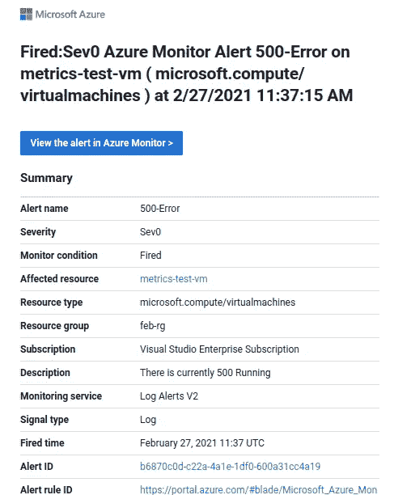

苏拉布什雷斯塔。使用 Azure 日志分析工作区从您的 VM 15 收集自定义日志。2021.JPEG 文件。

耶，警报被触发了，我们收到了一封邮件。祝贺你，如果你已经做到了这一步，因为这不是一个简单的任务。

# **结论:**

我们创建了一个服务，每分钟生成一个日志，将它带到 Azure 门户，并基于它创建一个警报。如果您想要在为机器学习任务训练模型时创建 GPU 的日志以了解其状态，则可以将相同的逻辑应用于 GPU 指标。它还可以应用于不同的 web 服务，以了解它们的状态等等。可能性是无限的，选择是无限的，你想做什么取决于你自己。如果你遇到任何问题或难以遵循这些步骤，请在下面评论这篇文章或在 tsulabh4@gmail.com 给我发消息。你也可以在 [Linkedin](https://www.linkedin.com/in/sulabhshrestha/) 和 [GitHub](https://github.com/codexponent) 上和我联系。

资源:

[1]:KQL-1:[https://docs . Microsoft . com/en-us/azure/data-explorer/kusto/query/extract function](https://docs.microsoft.com/en-us/azure/data-explorer/kusto/query/extractfunction)

[2]KQL-2:[https://docs . Microsoft . com/en-us/azure/data-explorer/kusto/query/re2](https://docs.microsoft.com/en-us/azure/data-explorer/kusto/query/re2)

[3]KQL-3:[https://docs . Microsoft . com/en-us/azure/data-explorer/kusto/query/samples？pivots=azuredataexplorer](https://docs.microsoft.com/en-us/azure/data-explorer/kusto/query/samples?pivots=azuredataexplorer)

[4]KQL-4:[https://docs . Microsoft . com/en-us/azure/data-explorer/kusto/query/SQL cheat sheet](https://docs.microsoft.com/en-us/azure/data-explorer/kusto/query/sqlcheatsheet)

[5] Azure 日志分析工作区:[https://docs . Microsoft . com/en-us/Azure/Azure-monitor/agents/data-sources-custom-logs](https://docs.microsoft.com/en-us/azure/azure-monitor/agents/data-sources-custom-logs)