# 利用 PyMC3 中的贝叶斯分层模型推断新冠肺炎的疾病参数

> 原文：<https://towardsdatascience.com/using-bayesian-hierarchical-models-in-pymc3-to-infer-the-disease-parameters-of-covid-19-b396c8b9845?source=collection_archive---------22----------------------->

在本帖中，我们来看看如何使用 PyMC3 来推断新冠肺炎的疾病参数。PyMC3 是一个流行的概率编程框架，用于贝叶斯建模。实现这一点的两种流行方法是马尔可夫链蒙特卡罗( [MCMC](https://reference.wolfram.com/language/howto/PerformAMonteCarloSimulation.html) )和[变分推断](https://reference.wolfram.com/language/VariationalMethods/tutorial/VariationalMethods.html)方法。这里的工作着眼于使用美国感染病例的当前可用数据作为时间序列，并试图使用分室概率模型对此建模。我们想尝试推断疾病参数，并最终使用 MCMC 采样估计 *R0* 。然后，我们将探索如何使用贝叶斯分层模型来做同样的事情，以及与池化或非池化模型相比的好处。我们总结了这个模型的局限性，并概述了改进推理过程的步骤。

这里介绍的工作仅用于说明目的，现实生活中的贝叶斯建模需要比这里显示的复杂得多的工具。这里作出了关于种群动态的各种假设，这些假设可能不适用于大型非同质种群。此外，这里不考虑社会距离和疫苗接种等干预措施。

本帖将涵盖以下内容:

1.  流行病的分室模型
2.  数据从何而来，如何获取
3.  疾病动力学 SIR/SIRS 模型
4.  PyMC3 常微分方程的贝叶斯推理
5.  使用层次模型扩展工作
6.  概率编程的指南和调试技巧

我还在 Coursera 上推出了一系列课程，涵盖贝叶斯建模和推理的主题，课程 2 和 3 与本文特别相关。请到[https://www.coursera.org/specializations/compstats](https://www.coursera.org/specializations/compstats)查看。

# 流行病的分室模型

关于房室模型及其行为的概述，请参考朱莉亚[—https://github.com/sjster/Epidemic.](https://github.com/sjster/Epidemic.)的笔记

房室模型是封闭种群的一组常微分方程(ODEs ),这意味着种群没有进出该房室的运动。这些旨在模拟同质人群中的疾病传播。可以想象，这些假设在大人群中可能不成立。这里还必须指出的是，人口出生和死亡人数等生命统计数据可能不包括在这个模型中。下面的列表提到了一些分室模型以及疾病传播的各个分室，然而，这决不是一个详尽的列表。

*   易感感染(SI)
*   易感感染者康复(SIR)
*   易受感染的
*   易感感染恢复易感(SIRS)
*   易感感染者康复死亡(SIRD)
*   易感暴露感染康复(SEIR)
*   易感暴露感染恢复易感(SEIRS)
*   易感暴露感染康复死亡
*   母源性免疫易感传染病痊愈(MSIR)
*   西达尔特([https://www.nature.com/articles/s41591-020-0883-7](https://www.nature.com/articles/s41591-020-0883-7))

上面列出的最后一个是最近的，专门针对新冠肺炎的，可能值得感兴趣的人读一读。现实世界的疾病建模通常不仅仅涉及疾病阶段的时间演变，因为许多与分室相关的假设都被违反了。为了了解疾病是如何传播的，我们需要观察疾病在人群中的空间离散化和演变。GLEAM 是模拟这种时空演变的框架的一个例子(图 1)。

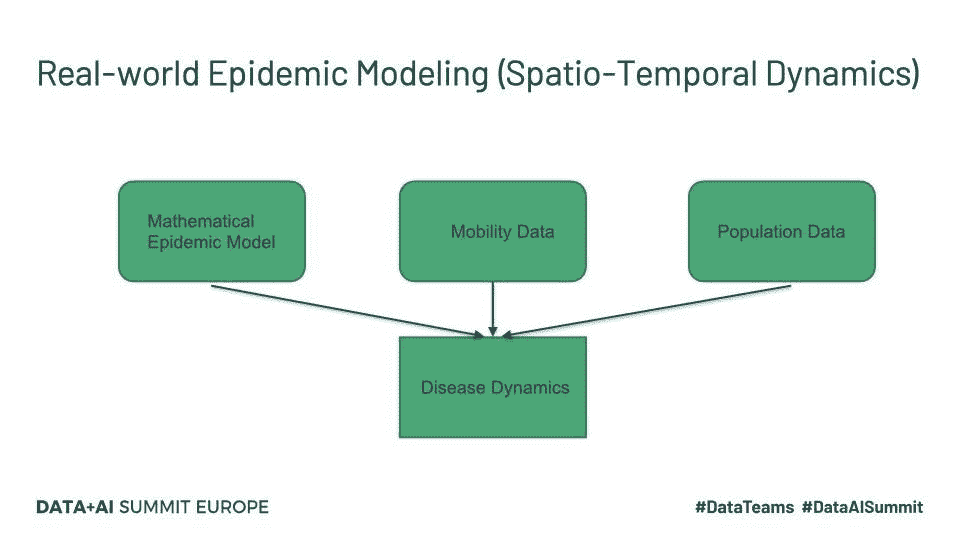

图 1-真实世界流行病建模(时空动态)。

GLEAM 等工具使用人口普查数据和流动模式来了解人们如何在地理上流动。GLEAM 将地球划分为大约 25 公里 x25 公里的空间网格。大致有两种类型的移动:全球或远程移动和本地或短程移动。长期流动性主要涉及航空旅行，因此机场被认为是疾病传播的中心。海上旅行也是另一个重要因素，因此军港是另一种进入点。与上面列出的数学模型一起，这提供了一个随机框架，可用于进行数百万次模拟，以推断参数并进行预测。

# 新冠肺炎数据

此处使用的数据来自约翰·霍普金斯 CSSE Github 页面，该页面中的病例数会定期更新:

[CSSE GitHub](https://github.com/CSSEGISandData/COVID-19/tree/master/csse_covid_19_data/csse_covid_19_time_series)

[确诊病例](https://raw.githubusercontent.com/CSSEGISandData/COVID-19/master/csse_covid_19_data/csse_covid_19_time_series/time_series_covid19_confirmed_global.csv)

[死亡人数](https://raw.githubusercontent.com/CSSEGISandData/COVID-19/master/csse_covid_19_data/csse_covid_19_time_series/time_series_covid19_deaths_global.csv)

这些数据以 CSV 文件的形式提供，可以通过 Python pandas 读取。

# SIR 和 SIRS 模型

## SIR 模型

SIR 模型由下面所示的三个常微分方程组(ODEs)给出。这个模型有三个部分。

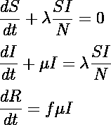

这里的‘S’、‘I’和‘R’指大小为‘N’的人群中的易感、感染和康复部分，因此

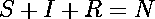

这里的假设是，一旦你从疾病中康复，个人将获得终身免疫。许多疾病的情况并非如此，因此可能不是一个有效的模型。

λ是感染率，μ是从疾病中康复的速度。从感染中康复的人的比例由“f”给出，但是为了这项工作的目的，“f”在这里被设置为 1。我们以我们的常微分方程组的初值问题(IVP)结束，其中 I(0)被假设为从疫情开始的情况计数中已知，并且 S(0)可以被估计为 N-I(0)。这里我们假设整个人口都是易感的。我们的目标是实现以下目标:

*   使用贝叶斯推理对λ和μ进行估计
*   使用上述参数估算任何时间“t”的 I(t)
*   计算 *R0*

正如已经指出的，λ是疾病传播系数。这取决于在单位时间内与有传染性的人互动的次数。这又取决于人群中的感染人数。

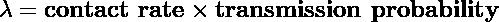

在任何时间‘t’的感染力或风险被定义为:

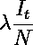

另外，μ是单位时间内发生的恢复的分数。因此，μ的倒数就是平均恢复时间。“基本再生数” *R0* 是由单个主要案例产生的次要案例的平均数(例如[https://www.ncbi.nlm.nih.gov/pmc/articles/PMC6002118/](https://www.ncbi.nlm.nih.gov/pmc/articles/PMC6002118/))。 *R0* 也被定义为λ和μ的比值，由下式给出

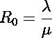

以上假设 *S0* 接近 1。当 *R0 > 1* 时，我们有了疾病的扩散，我们有了疫情。随着最近对脆弱人群进行疫苗接种的努力，这一点变得更加需要理解。如果我们给人口中的一小部分“p”接种疫苗以获得*(1p)R0<1*，我们就能阻止疾病的传播。

## SIRS 模型

如下图所示，SIRS 模型并没有假设感染者一旦康复后会终身免疫。因此，从恢复区室到易感区室。因此，对于新冠肺炎来说，这可能是一个更好的低保真度基线模型，因为它表明获得性免疫是短期的。这里唯一的附加参数是γ，它指的是免疫力丧失和受感染个体从恢复池移动到易感池的速率。

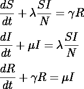

对于这项工作，只实现了 SIR 模型，SIRS 模型及其变体留待将来的工作。

# 使用 PyMC3 推断疾病参数

我们可以使用一阶或二阶时间差分方案对 SIR 模型进行离散化，然后将其传递给 PyMC3，pymc 3 将使用这些离散化方程及时推进求解。然后可以使用蒙特卡罗采样程序拟合参数λ和μ。

## 一阶方案

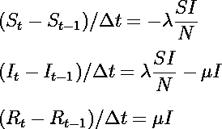

## 二阶方案

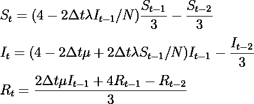

## PyMC3 中的微分方程方法

虽然我们可以选择高阶离散化方案来手动提供离散化，但这很快就会变得繁琐且容易出错，更不用说在 Python 这样的语言中计算效率低下了。幸运的是，PyMC3 有一个 ODE 模块来完成这个任务。我们可以使用 ODE 模块中的微分方程方法，该方法将一个函数作为输入，该函数以向量的形式返回一组 ODE 的值、需要求解的时间步长、对应于方程数量的状态数量以及我们想要求解的变量数量。尽管这仍然比手工离散化要快，但是这种方法对于问题的规模来说扩展性很差。推荐的最佳实践是使用 PyMC3 中的“sunode”模块(见下文)。例如，对于 100 个样本、100 个调整样本和 20 个时间点，相同的问题使用微分方程需要 5.4 分钟，而使用 sunode 需要 16 秒。

```
self.sir_model_non_normalized = DifferentialEquation(
   func = self.SIR_non_normalized,
   times = self.time_range1:],
   n_states = 2,
   n_theta = 2,
   t0 = 0)def SIR_non_normalized(self, y, t, p):
   ds = -p[0] * y[0] * y[1] / self.covid_data.N,
   di = p[0] * y[0] * y[1] / self.covid_data.N — p[1] * y[1]
   return[ds, di]
```

使用 sunode 模块的语法如下所示。虽然有一些句法上的差异，但总体结构与微分方程是相同的。

```
import sunode
import sunode.wrappers.as_theanodef SIR_sunode(t, y, p):
  return { ‘S’: -p.lam * y.S * y.I,
  ‘I’: p.lam * y.S * y.I — p.mu * y.I}……sir_curves, _, problem, solver, _, _ =       
   sunode.wrappers.as_theano.solve_ivp(
   y0={ # Initial conditions of the ODE
   ‘S’: (S_init, ()),
   ‘I’: (I_init, ()),},
   params={
      # Parameters of the ODE, specify shape
     ‘lam’: (lam, ()),
     ‘mu’: (mu, ()),
     ‘_dummy’: (np.array(1.), ())} # currently, sunode throws an error, without this # RHS of the ODE
   rhs=SIR_sunode,
   # Time points of th solution
   tvals=times,
   t0=times[0],)
```

## SIR 模型的推理过程

为了对我们寻求的参数进行推断，我们首先为疾病参数选择合理的先验。基于我们对疾病现象行为的理解，对数正态分布是疾病参数的合理先验。理想情况下，我们希望这个对数正态分布的平均参数在我们期望的参数附近。对于良好的融合和解决方案，数据似然性是适当的(领域专业知识！).通常选择以下之一作为可能性。

*   正态分布
*   对数正态分布
*   学生的 t 分布

我们从 ODE 求解器获得易感(S(t))和传染(I(t))数，然后对λ和μ的值进行采样，如下所示。

```
with pm.Model() as model4: sigma = pm.HalfCauchy(‘sigma’, self.likelihood[‘sigma’], shape=1) lam = pm.Lognormal(‘lambda’, self.prior[‘lam’], self.prior[‘lambda_std’]) # 1.5, 1.5 mu = pm.Lognormal(‘mu’, self.prior[‘mu’], self.prior[‘mu_std’]) res, _, problem, solver, _, _ = sunode.wrappers.as_theano.solve_ivp(
   y0={‘S’: (self.S_init, ()), ‘I’: (self.I_init, ()),},
   params={‘lam’: (lam, ()), ‘mu’: (mu, ()), ‘_dummy’: (np.array(1.), ())},
   rhs=self.SIR_sunode,
   tvals=self.time_range,
   t0=self.time_range[0]) # likelihood distribution mean, these are the predictions from the SIR model ODE solver if(likelihood[‘distribution’] == ‘lognormal’): I = pm.Lognormal(‘I’, mu=res[‘I’], sigma=sigma, observed=self.cases_obs_scaled) elif(likelihood[‘distribution’] == ‘normal’): I = pm.Normal(‘I’, mu=res[‘I’], sigma=sigma, observed=self.cases_obs_scaled) elif(likelihood[‘distribution’] == ‘students-t’): I = pm.StudentT( “I”, nu=likelihood[‘nu’], \
       mu=res[‘I’], 
       sigma=sigma,
       observed=self.cases_obs_scaled) R0 = pm.Deterministic(‘R0’,lam/mu) trace = pm.sample(self.n_samples, tune=self.n_tune, chains=4, cores=4) data = az.from_pymc3(trace=trace)
```

# PyMC3 的推理流程

因为开发这样一个模型，使用贝叶斯推理来估计疾病参数，是一个迭代过程，我们希望尽可能自动化。用各种参数实例化一类模型对象并自动运行可能是个好主意。为每次运行保存跟踪信息、推理度量(如 R̂ (R-hat ))以及其他元数据信息也是一个好主意。诸如 NetCDF 之类的文件格式可以用于此，尽管它可以像使用 Python 内置数据库模块“shelve”一样简单。这里没有显示用于数据提取的类，但是显示了它们的调用，以便您对这里使用的数据和模型参数有所了解。

```
covid_obj = COVID_data(‘US’, Population=328.2e6)covid_obj.get_dates(data_begin=’10/1/20', data_end=’10/28/20')sir_model = SIR_model_sunode(covid_obj)likelihood = {‘distribution’: ‘normal’, ‘sigma’: 2}prior = {‘lam’: 1.5,‘mu’: 1.5, ‘lambda_std’: 1.5, ‘mu_std’: 1.5 }sir_model.run_SIR_model(n_samples=500, n_tune=500, likelihood=likelihood, prior=prior)
```

这些结果纯粹是为了说明的目的，需要进行大量的实验才能从模拟中得到有意义的结果。美国 1 月至 10 月的病例数如下所示(图 2)。

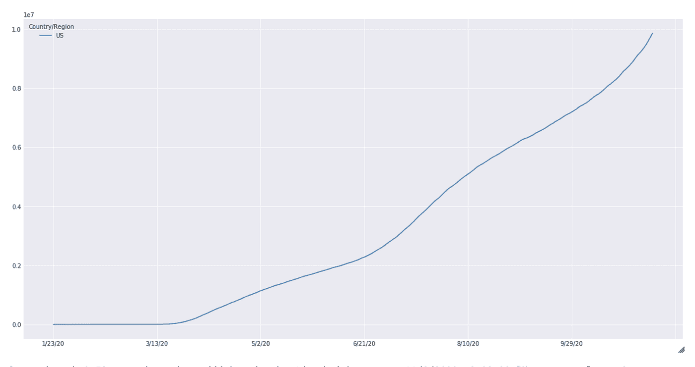

图 2 -美国新冠肺炎病例数可视化示例

图 3 示出了推理运行的结果，其中显示了λ、μ和 *R0* 的后验分布。执行贝叶斯推断的一个优点是，分布显示了平均值估计以及用于量化不确定性的最高密度区间(HDI)。检查跟踪是一个好主意(至少！)以确保正确采样。

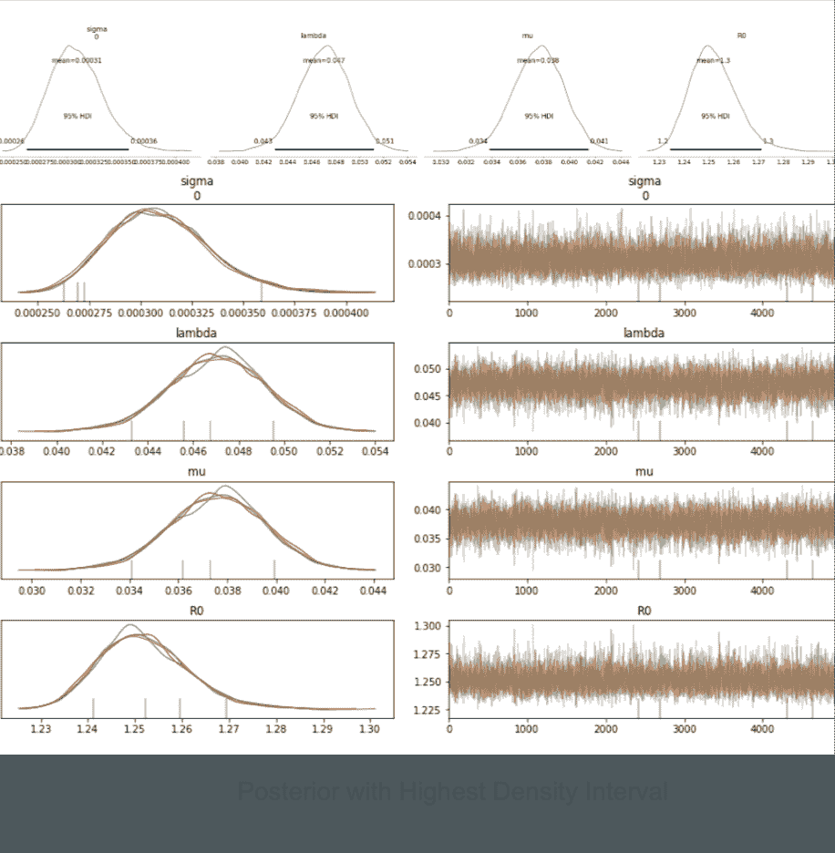

图 3 -使用 PyMC3 显示最高密度区间(HDI)的推理运行结果示例。

# 池化、非池化和分层模型

假设您有关于美国各州感染人数的信息。使用该数据来推断新冠肺炎的疾病参数(例如 *R0)* 的一种方式是将其全部相加以估计单个参数。这被称为*集合模型*。然而，这种方法的问题是可能包含在这些单独的状态或组中的细粒度信息丢失了。另一个极端是估计每个状态的单个参数 *R0* 。这种方法产生了一个*非池模型*。然而，考虑到我们正在尝试估计对应于同一病毒的参数，必须有一种方法来集体执行此操作，这将我们带到了*层次模型*。当在某些州没有足够的信息来创建准确的估计时，这特别有用。分层模型允许我们使用共享的“超优先级”来共享来自其他状态的信息。让我们以下面的例子来更详细地看看这个公式:

对于混合模型，我们可以从具有固定参数λ_μ，λ_σ的单个分布中提取

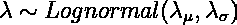

对于未规划的模型，我们可以从具有固定参数λ_μᵢ、λ_σᵢ

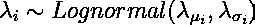

对于分层模型，我们有一个先验，它由来自其他分布的非常数参数来参数化。这里，我们为每个状态画一个λ值，但是它们通过共享的超优分布(具有常数参数)连接，如下所示。

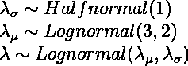

查看课程 3 *贝叶斯建模和推理的 PyMC3 介绍*(【https://www.coursera.org/learn/introduction-to-pymc3?】T2)specialization=compstats )来了解更多关于层次模型的细节。

# 分层模型的新冠肺炎数据

这里我们绘制并使用了美国和巴西这两个国家每天的感染病例数。然而，在层级模型中可以使用的国家的选择或数量没有限制。以下案例发生于 2020 年 3 月 1 日至 2021 年 1 月 1 日。这些图表似乎遵循相似的轨迹，尽管这些国家在 *y 轴*上的比例不同。考虑到这些病例来自同一个新冠肺炎病毒，这是合理的。然而，在现实场景中，需要考虑差异，例如不同的变量、不同的地理结构和社会距离规则、医疗保健基础设施等等。

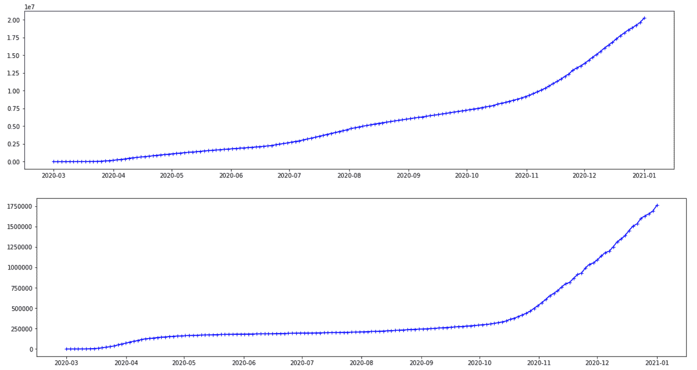

图 4 -两个国家的新冠肺炎病例数量图

# 参数推断

对于分层模型，下面给出了执行疾病参数推断的代码片段。

```
with pm.Model() as model4: # narrow std is roughly equivalent to a constant prior parameter,  if there are issues with sampling from the prior distribution
   # make the variance of the mean smaller. Variance of the distribution of the variance parameter seems less relevant in this regard. nsamples = 8000   ntune = 4000 Hyperprior = {“Lambda mean”: 0.75, “Lambda std”: 2, “Mu mean”: 0.75, “Mu std”: 2} Prior = {“Lambda std”: 1.0, “Mu std”: 1.0} Likelihood = {“Name”: “Normal”, “Parameters”: {“std”: 0.01}} prior_lam = pm.Lognormal(‘prior_lam’, Hyperprior[‘Lambda mean’], Hyperprior[‘Lambda std’]) prior_mu = pm.Lognormal(‘prior_mu’, Hyperprior[‘Mu mean’], Hyperprior[‘Mu std’]) prior_lam_std = pm.HalfNormal(‘prior_lam_std’, Prior[‘Lambda std’]) prior_mu_std = pm.HalfNormal(‘prior_mu_std’, Prior[‘Mu std’]) lam = pm.Lognormal(‘lambda’, prior_lam , prior_lam_std, shape=2) mu = pm.Lognormal(‘mu’, prior_mu , prior_mu_std, shape=2) # — — — — — — — — — — ODE model — — — — — — — — # res, _, problem, solver, _, _ = sunode.wrappers.as_theano.solve_ivp(
   y0={ ‘S’: (S_init, (2,)), ‘I’: (I_init, (2,)),},
   params={‘lam’: (lam, (2,)), ‘mu’: (mu, (2,)), ‘_dummy’: (np.array(1.), ())},
   rhs=SIR_sunode,
   tvals=time_range[1:],
   t0=time_range[0]) I = pm.Normal(‘I’, mu=res[‘I’], sigma=Likelihood[‘Parameters’][‘std’], observed=cases_obs_scaled[1:]) R0 = pm.Deterministic(‘R0’,lam/mu) # if you increase the variance and the distributions looks choppy, increase the tuning sample size to sample the space more effectively
   # also, increase the total number of samples trace = pm.sample(nsamples, tune=ntune, chains=8, cores=8) data = az.from_pymc3(trace=trace)
```

样本后验分布及其 94%的最高密度区间(HDI)如下所示。

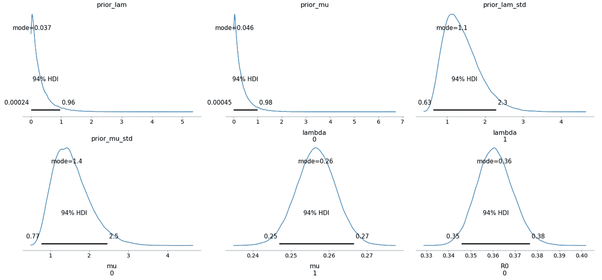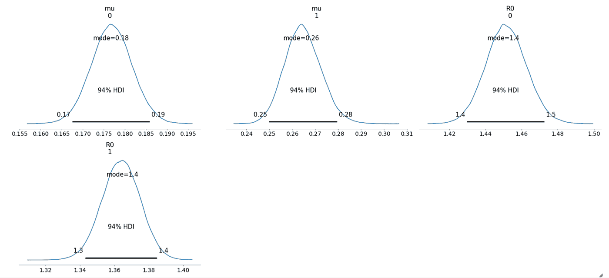

图 5 -采样后验分布及其 94%的最高密度区间(HDI)。

我们还可以检查轨迹图的收敛性，它显示了所有变量的良好混合——这是采样器很好地探索了空间的好迹象。所有的痕迹之间有很好的一致性。这种现象可以从上图中相当窄的 HDI 区间得到证实。

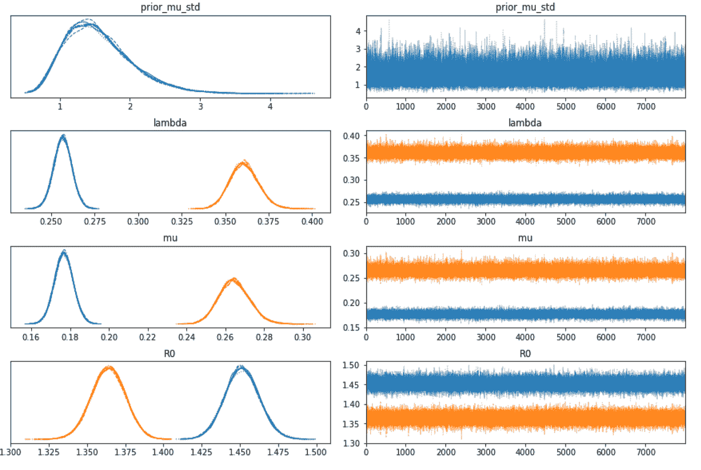

图 6-R0 和其他变量的轨迹图和密度图

下表总结了各种推断变量和参数的分布，以及抽样统计。虽然对变量的估计是必不可少的，但此表对于告知我们采样器的质量和效率特别有用。例如，R-hat 都接近或等于 1.0，表明所有链之间的一致性良好。有效样本量是另一个关键指标。如果这与样本总数相比很小，这肯定是取样器有问题的迹象。即使 R-hat 值看起来不错，也一定要检查有效样本量！

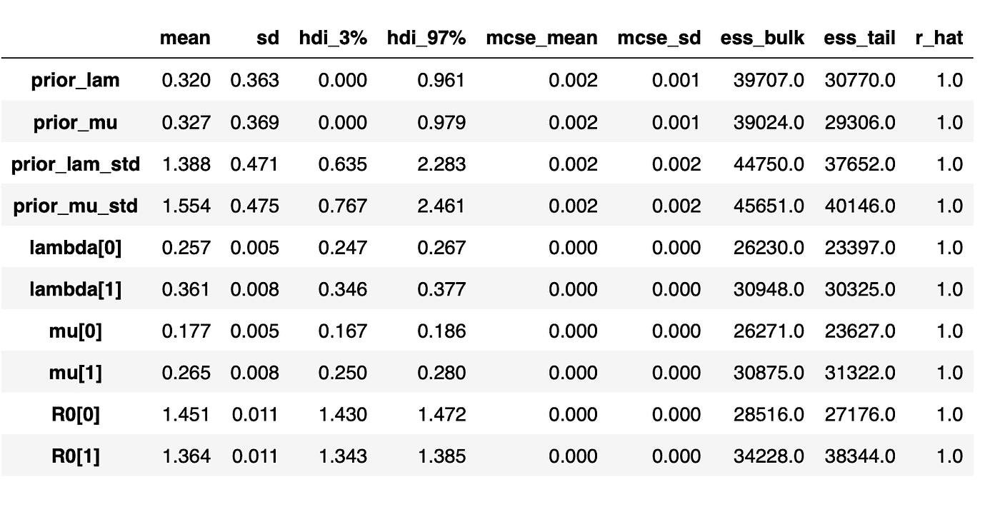

图 7 -推断变量分布表以及抽样统计

# 注意事项和指南

建模和推理的一些一般准则:

*   使用至少 5000 个样本和 1000 个样本进行调整。
*   对于上面显示的结果，我使用了:均值:λ= 1.5，= 1.5，两个参数的标准差:2.0。领域专家和他的知识在设置这些参数时是非常宝贵的。
*   至少从 3 条链上取样。
*   将 **target_accept** 设置为> 0.85(取决于采样算法)。
*   如果可能，用**核心=n** 并行采样，其中‘n’是可用核心的数量。
*   检查轨迹是否收敛。
*   有限的时间样本会影响推断的准确性，拥有更多高质量的数据总是更好的。
*   规范化您的数据，大值通常不利于收敛

## 调试您的模型

*   因为 PyMC3 的后端是 theano，所以 Python print 语句不能用于检查变量值。使用**the no . printing . print(DESCRIPTIVE _ STRING)(VAR)**来完成这个。
*   通过传递“testval”来初始化随机变量。这非常有助于检查那些讨厌的“坏能量”错误，这些错误通常是由于对可能性或先验的错误选择。使用 **Model.check_test_point()** 来验证这一点。
*   使用**步骤= pm。Metropolis()** 对于快速调试来说，这运行得更快，但结果却更粗糙。
*   如果采样很慢，检查你的先验分布和似然分布。
*   先验分布的窄西格玛值可用于模拟常数先验，并有助于调试从先验分布采样的问题。
*   如果增加方差导致不连续的后验分布，则增加调整样本大小和样本数量，以便更有效地对空间进行采样。

# 未来的工作

虽然这为我们的参数产生了令人满意的估计，但我们经常遇到采样器不能有效地执行的问题。对于未来的工作，有几种方法可以诊断和改进建模过程。下面按难度递增的顺序列出了这些问题:

1.  增加调整大小和抽取的样本数。
2.  减小采样器的 target_accept 参数，以减少样本间的自相关。使用自相关图来证实这一点。
3.  向观测数据中添加更多样本，即增加采样频率。
4.  为参数使用更好的先验和超先验。
5.  使用模型的替代参数化。
6.  将社交距离测量等变化纳入模型。

## 了解更多信息

你可以在我的 Coursera specialization([https://www.coursera.org/specializations/compstats](https://www.coursera.org/specializations/compstats))了解更多关于这些主题的信息，该课程包括以下课程:

1.  贝叶斯统计导论([https://www.coursera.org/learn/compstatsintro?专门化=compstats](https://www.coursera.org/learn/compstatsintro?specialization=compstats)
2.  贝叶斯推理与 MCMC(【https://www.coursera.org/learn/mcmc? 专门化=compstats
3.  用于贝叶斯建模和推理的 PyMC3 简介(【https://www.coursera.org/learn/introduction-to-pymc3?】T4)专业化=compstats

# 参考

1.  Priesemann 小组的工作

<https://github.com/Priesemann-Group/covid_bayesian_mcmc>  

2.Demetri Pananos 在 PyMC3 网站上的工作

  

3.太阳之歌

<https://github.com/aseyboldt/sunode>  

4.闪光

[http://www.gleamviz.org](http://www.gleamviz.org)