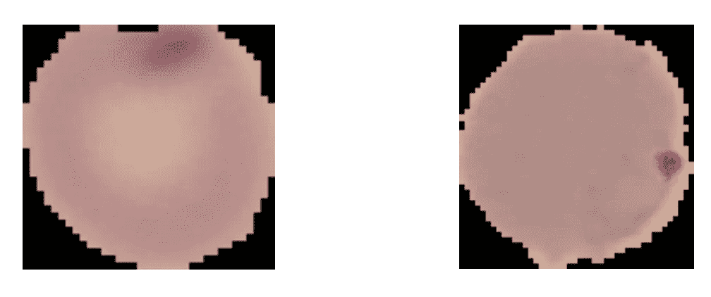
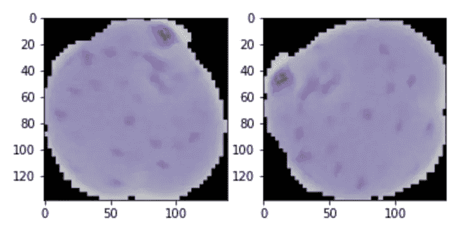
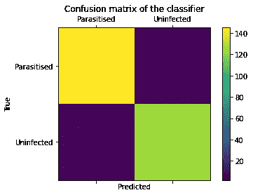
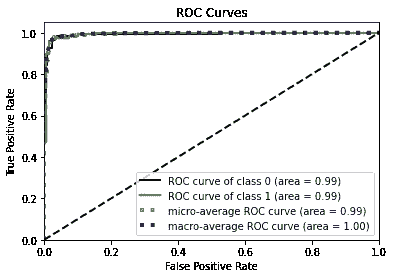
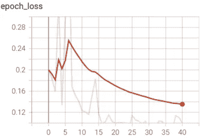

# 利用大转移预测疟疾

> 原文：<https://towardsdatascience.com/using-big-transfer-to-predict-malaria-9e4d1b1e6f02?source=collection_archive---------26----------------------->

## 使用迁移学习将血液涂片分类为未感染或感染了引起疟疾的寄生虫


Pixabay 在[像素上拍摄的照片](https://www.pexels.com/photo/black-white-mosquito-86722/)

迁移学习是利用在一项任务中获得的知识来解决另一项任务的过程。先前训练的模型被用作基础，在其上添加一个层来微调模型以解决新的任务。

本博客的主要目的是让读者了解什么是大转移，以及如何以最小的努力将它微调并应用于与预训练模型完全不同的领域中的问题。

在[的论文](https://arxiv.org/pdf/2101.05913v3.pdf)“医学成像规模的监督转移学习”中，来自谷歌的研究人员证明，使用大转移( [BiT](https://arxiv.org/pdf/1912.11370.pdf) )，可以提高各种医疗任务的准确性，如乳房 x 线摄影癌症识别、胸部 x 射线解释和皮肤状况分类。该论文还发现，使用 BiT 模型，他们仅使用 30%-60%的训练数据就能够实现基线性能。

在此之前，研究人员不清楚对一组自然图像的迁移学习如何适用于医学图像，因为图像大小的差异、域的差异以及使用医学图像中纹理的局部变化来检测感兴趣的病理。

我看到了 Mark Rober 的视频，讲述了斯坦福大学的一个团队如何开发了一台显微镜( [Foldscope](https://www.foldscope.com/) )和一台纸离心机( [Paperfuge](https://news.stanford.edu/2017/01/10/whirligig-toy-bioengineers-develop-20-cent-hand-powered-blood-centrifuge/) )，总共花费 68 美分，可以由一名训练有素的专业人员用来查看幻灯片和检测疟疾等疾病。虽然我没有设法得到从 Foldscope 收集的幻灯片图像数据集，但我发现了另一个[数据集](https://lhncbc.nlm.nih.gov/LHC-publications/pubs/MalariaDatasets.html)，其中幻灯片图像是由连接到传统光学显微镜的智能手机收集的。这一点很重要，因为在最需要这些检测的贫困社区，缺乏设备和资源是这些检测不容易获得的主要原因。



数据集的未感染(左)和寄生(右)载玻片示例

将所有这些放在一起，以及我对测试在医学图像数据集上微调 BiT 有多容易的兴趣，我决定在这个疟疾数据集上尝试大转移。

本博客将让您了解使用位超规则(BiT-HyperRule)对特定任务的位模型进行微调是多么容易，位超规则是一种启发式方法，用于确定所有用于微调的超参数，并获得很好的结果。比特超规则是一个很好的起点，这也是我将在本教程中经历的。我假设读者具备深度学习的基础知识。你可以在这里查看这个教程的 Jupyter 笔记本。

## 大传输(位)

BiT 的主要特点是使用 ImageNet-21k 和 JFT-300M 等大型数据集进行预训练。本教程中使用的模型是 BiT-M，它已经在 ImageNet 21k 上进行了预训练，ImageNet 21k 是一个数据集，包含 21，843 个不同类别的 1，400 万张图像，并基于 ResNet-50x1 架构。还有其他变化的钻头可用，这里列出了。

BiT 的优点是:

1.  适用于各种各样的任务，甚至是那些领域不匹配的任务，如医学成像
2.  使用位超规则，可以获得很好的结果，并且可以通过进一步调整超参数来改善这一点(下面将详细介绍)
3.  模型的快速收敛。

记住这一点，让我们开始吧。

我建议在阅读本教程之前，先浏览一下在这里找到的[的比特文件。](https://arxiv.org/pdf/1912.11370.pdf)

## 数据预处理:

该数据集包含 27558 个图像，未感染和寄生的载玻片图像之间平分。然后，我们将数据集分成 3 个不同的子集:训练集、验证集和测试集。训练集用于训练模型，然后基于验证集的结果，选择最佳模型。通常，模型的超参数将使用验证集进行调整，但是因为我们使用位超规则，所以我们将只使用验证集来选择最佳模型。最后，测试集用于评估模型的最终性能。请注意，测试集应该是独立的，永远不要用于调整模型。

在这种情况下，训练集包含 90%的图像，验证集包含 9%的图像，最后测试集包含 1%的图像。

```
train_size = int(0.90 * num_examples)
val_size = int(0.09* num_examples)
test_size = int(0.01 * num_examples)full_dataset = ds.shuffle(reshuffle_each_iteration=False, buffer_size=len(ds))
train_dataset = full_dataset.take(train_size)
test_val_dataset = full_dataset.skip(train_size)
val_dataset = test_val_dataset.take(val_size)
test_dataset = test_val_dataset.skip(val_size)
```

## 数据扩充和标准化；

收集和标记数据是一个昂贵的过程。数据扩充是用现有数据毫不费力地创建更多数据的方法。通过修改现有图像，如旋转、翻转，可以从现有图像生成新图像。其他数据扩充方法包括裁剪等技术，但在这种情况下不使用，因为它可能会导致图像的主要特征被删除。

```
features['image'] = tf.image.random_flip_left_right(features['image'])
features['image'] = tf.image.random_flip_up_down(features['image'])
```

我们还对图像数据进行了归一化处理，使该值介于 0-1 之间。这有助于确保数据具有相似的分布，从而有助于模型更快地收敛。这也有助于提高模型的稳定性。

```
features['image'] = tf.cast(features['image'], tf.float32) / 255.0
```

## 添加输出图层:

因为我们将使用的位模型是一个特征提取器，所以我们需要添加一个输出层，神经元的数量等于类的数量(本例中为 2)。然后，我们将该层的权重初始化为 0。

```
class MyBiTModel(tf.keras.Model):
  """BiT with a new head."""def __init__(self, num_classes, module):
    super().__init__() self.num_classes = num_classes
    **self.head = tf.keras.layers.Dense(num_classes, kernel_initializer='zeros')** 
    self.bit_model = module
```

## 使用位超规则设置超参数:

1.  批量:512 个
2.  学习率:0.003
3.  计划长度:500
4.  计划界限= 720，1440，2160

比特超规则规定，对于具有小于 20 k 的标记示例的数据集，调度长度应该是 500 步，而那些具有小于 500 k 的标记示例的数据集应该是 10 k 步。因为这个问题中的标记示例数是 27558，刚好超过 20 k 标记示例边界，所以我决定坚持 500 步。

初始学习率是 0.003，并且在步骤 720、1440、2160 中衰减 10 倍。这些步骤分别占整个训练步骤的 30%、60%和 90%

**提前停止回调以防止过拟合:**

为了防止过度拟合，使用了早期停止，这是一种在被监视的度量没有按预期表现时停止训练的方法。在这种情况下，如果验证损失连续 10 个时期没有减少，则停止训练，并且恢复来自具有最小验证损失的时期的模型权重。

```
es = EarlyStopping(monitor='val_loss', mode='min', verbose=1, patience=10,restore_best_weights=True)
```

## 优化器和损失函数:

使用带动量的随机梯度下降优化器。选择的损失函数是稀疏分类损失函数。当标签的数量为 2 或更多时，使用该损失函数，并且它期望类别标签是整数。

```
optimizer = tf.keras.optimizers.SGD(learning_rate=lr_schedule, momentum=0.9)
loss_fn = tf.keras.losses.SparseCategoricalCrossentropy(from_logits=True)
```

## 训练模型:

现在是激动人心的部分，按回车键+回车，让模型训练！完成这一步后，去给自己做一杯热饮吧，这是你应得的！

```
model.compile(optimizer=optimizer,loss=loss_fn,metrics=['accuracy'])
```

在这种情况下，验证损失在时段 31 之后没有减少，因此从时段 31 开始恢复并使用。

**列车运行前检查:**

在花费时间和资源在 *x* 时代上训练模型之前，重要的是执行某些健全性检查以确保模型按预期执行。

最重要的是检查输出值是否有意义。在分类模型的情况下，概率的总和值应该是 1。

```
test_logits = model(test_image) #running the model on a test image
**sum_proba = (np.sum(tf.nn.softmax(test_logits).numpy()[0]))** #summimg the probabilities 
#sum_proba should be 1\. 
```

**列车运行后检查:**

重要的是，对于特定的图像，当图像稍微改变时，例如旋转或翻转，模型输出不会改变。这被称为不变性检查。为了测试这一点，我们增加了测试集中的图像，并检查模型的预测在单个图像的所有不同变化中是否一致。

```
Pseudocode for post-train check: 
1\. Classify image with the trained model 
2\. Augment the image (rotate/ flip) and then classify it again 
if result from 1 == result from 2:
   Model passes post-train check
else:
   Retrain model such that it is invariant to augmentations which does not change the main features of the image.
```



用于不变性检查的旋转图像

## 评估模型:

一旦训练完成，我们确保用来自最佳时期的权重来拟合模型。在这种情况下，这是验证损失最小的模型。

```
model.load_weights('best_model')
```

然后，我们可以通过查看以下指标来继续分析该模型:

1.  **测试集上的准确性**:使用 274 幅图像的整个测试集，我们测试它的准确性。我们发现准确率高达 97.46%

2.**混乱矩阵:**



混淆矩阵允许我们以 NxN 矩阵的形式评估模型，其中 N 是类的数量。它让我们很好地了解模型的性能以及真阳性、真阴性、假阳性和假阴性的数量。该数据还可以用于重新训练模型，以改进特定类别的结果。例如，在医疗保健环境中，假阴性(当患者实际上患有疾病时，他/她被确定为健康)比假阳性(当他/她实际上没有疾病时，患者被检测为患有疾病)成本更高。

这里，错误分类的例子的数量是 7，其中 5 个被错误地预测为寄生。其他两个图像被预测为未感染，而它们实际上是寄生图像。

**3。ROC-AUC:**



受试者工作特征(ROC)曲线下的面积是衡量模型性能的一个非常重要的指标。以下摘录来自对 ROC-AUC 曲线的简单解释[此处](/understanding-auc-roc-curve-68b2303cc9c5):
“AUC-ROC 曲线是在各种阈值设置下对分类问题的性能测量。ROC 是概率曲线，AUC 代表可分性的程度或度量。它告诉我们这个模型在多大程度上能够区分不同的类。AUC 越高，模型预测 0 为 0 和 1 为 1 的能力越强。以此类推，AUC 越高，模型在区分患病和未患病患者方面就越好”

## 结论:

使用 BiT-HyperRule 得到的模型在验证集上的准确率为 96.81%，在测试集上的准确率为 97.46%，ROC-AUC 为 0.99。这表明 BiT 在对医疗数据集进行分类时表现出色，即使它所训练的图像在性质上非常不同。

一个有趣的观察是，在开始稳定之前，验证损失和准确性在最初的几个时期急剧下降。



验证损失与纪元图

这可能是由于学习率和批量大小。当用不同的超参数进行试验时，即通过将批量减少到 64(而不是 512)并将学习率从 0.003 降低到 0.0001，发现验证损失遵循递减趋势，并且不像上图那样波动。但是，在得出任何结论之前，还需要进行进一步的实验。

人工智能有助于让这些疾病的诊断变得更便宜、更容易，当大规模应用时，这将产生巨大的影响。我很乐观，并且真的相信人工智能可以真正彻底改变医疗保健的状况，特别是在发展中国家和不发达国家，那里最需要廉价和容易获得的医疗保健，而且疟疾等致命疾病仍然存在。

感谢谷歌的研究人员，他们研究了比特技术，也感谢谷歌实验室[笔记本](https://colab.research.google.com/github/google-research/big_transfer/blob/master/colabs/big_transfer_tf2.ipynb)的作者展示了如何使用比特技术。

“医学成像规模的监督迁移学习”的作者指出，模型可以通过超参数优化进一步改进。在下一篇博客中，我将尝试通过使用定制的超参数来提高模型的性能。所以请继续关注第 2 部分！

*感谢阅读。如果你有任何问题，请在下面评论。当这个博客的第二部分出来的时候，请跟随我在 Medium 上阅读它。我在*[*LinkedIn*](https://www.linkedin.com/in/bikramb/)*和*[*Twitter*](https://twitter.com/baruahbikram05)*上也有空。希望你有美好的一天*🙂