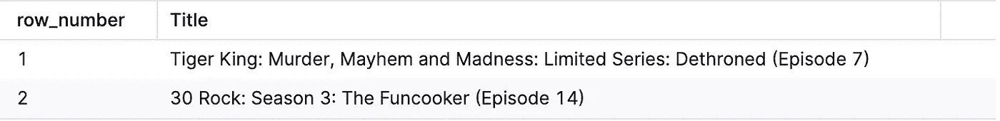
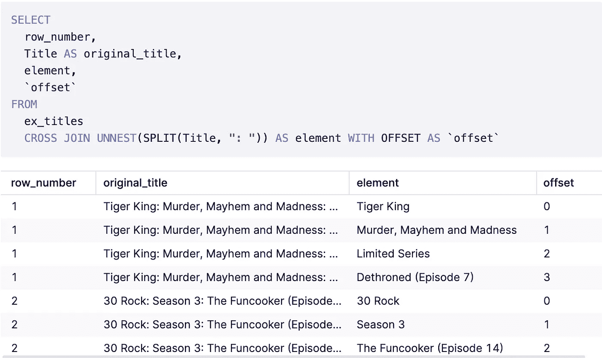
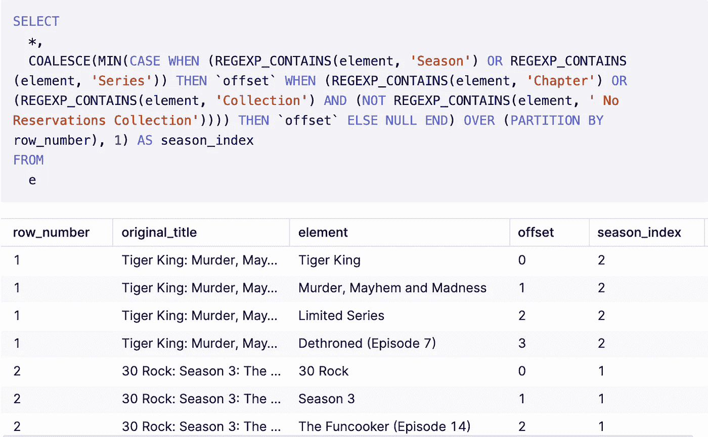
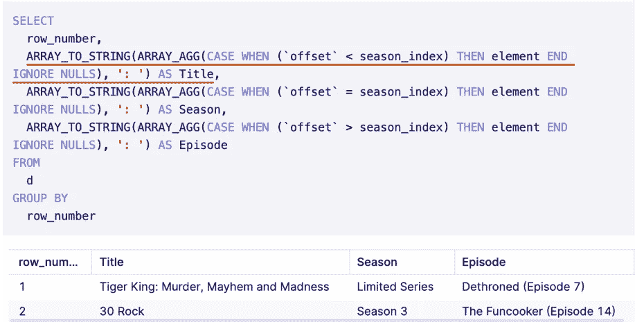
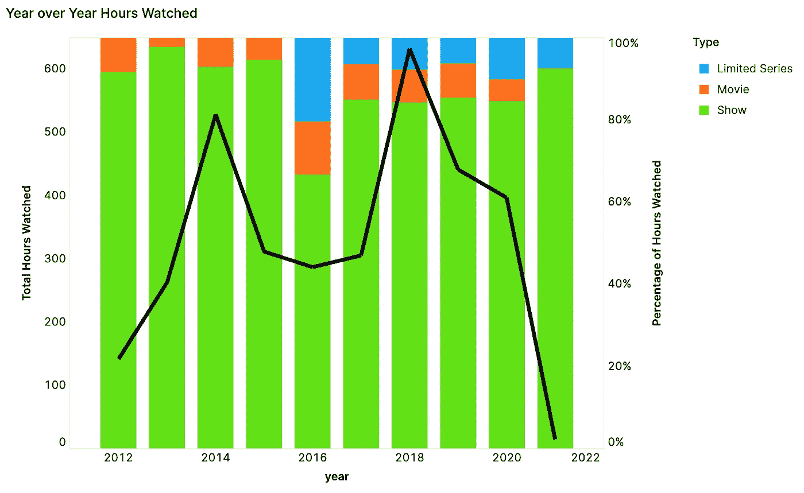
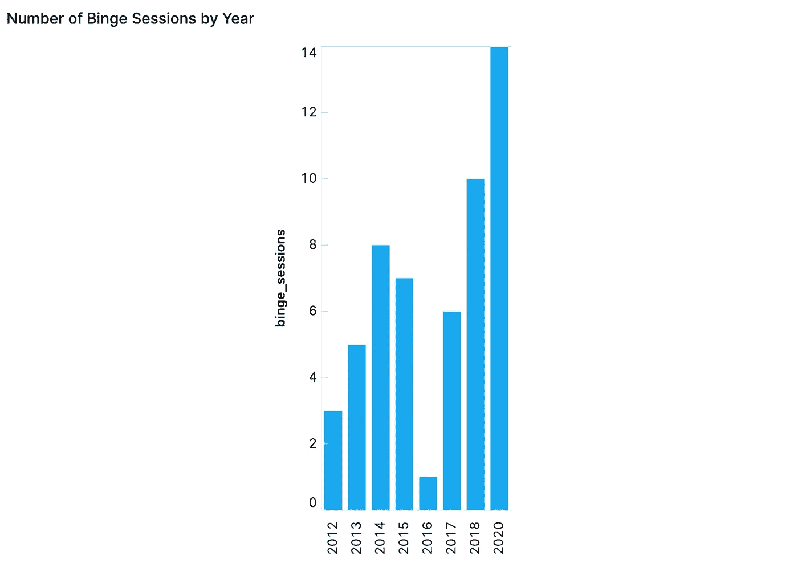
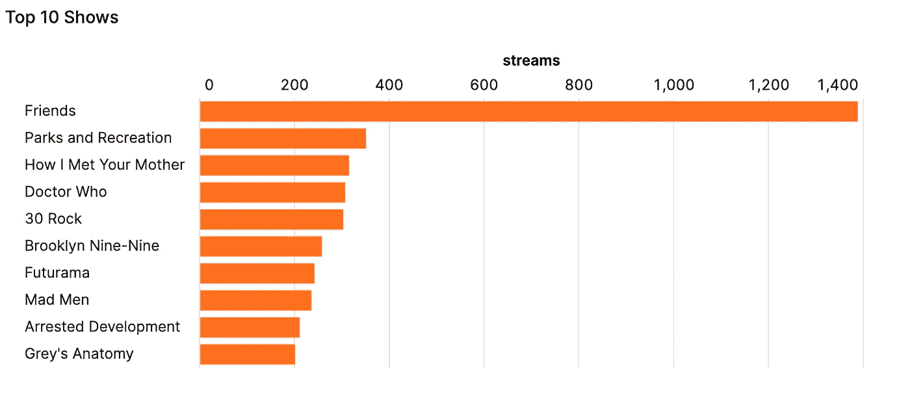
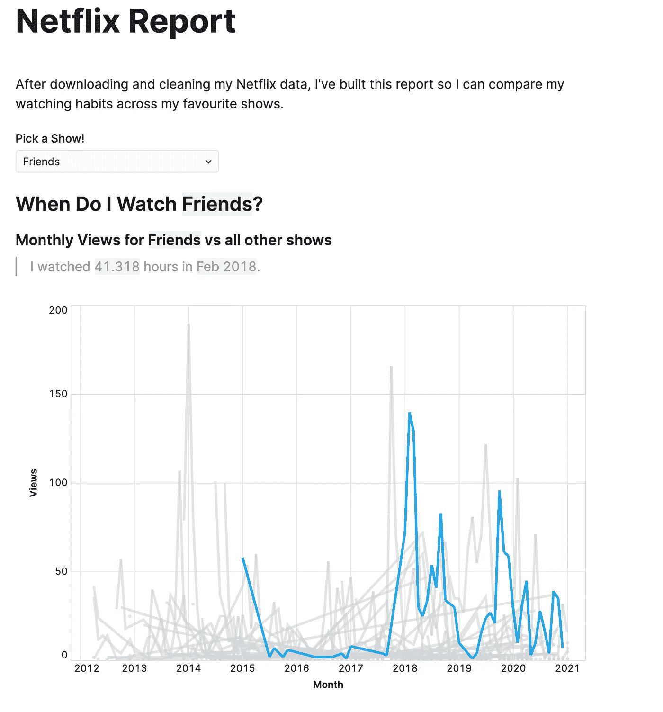

# 使用 BigQuery 数组分析我的网飞观看历史

> 原文：<https://towardsdatascience.com/using-bigquery-arrays-to-analyze-my-netflix-viewing-history-c93935185ac?source=collection_archive---------25----------------------->

## 如何在 SQL 中进行高级数据清理

# 介绍

当我听说你可以从网飞那里获得你所有的个人资料时，我很兴奋地想看看我能找到什么。最后，我不仅对自己有了更多的了解——比如我最常看《老友记》的哪一季(第六季)——而且这也是一个检验 BigQuery 分析能力的绝佳机会。本文介绍了我如何在 BigQuery 中完成最复杂的转换，但是您可以在这里找到完整的项目:

 [## 我的网飞项目

### 最近我得知网飞将向你提供他们掌握的所有关于你的信息。好奇心得到了最好的…

count.co](https://count.co/n/0erWed0YsMF) 

# 为什么是 BigQuery？

也许显而易见的问题是，为什么我选择在 BigQuery 中进行这种分析，而在 Python 中却可以轻松完成。嗯，我有几个原因:

## BigQuery 很快

尤其是大数据。现在，这些数据并不大，但是如果大的话，用 Python 进行这种类型的转换将需要很长时间。因此，为了迎接不可避免地需要对大数据进行大量字符串和数组操作的那一天，我想我应该准备好我的 BigQuery 技能。

## 并且缺乏实际例子

在做这个分析时，我意识到在 BigQuery 中进行复杂转换和分析的实际例子远没有 Python 中的多。然而，我和许多仍然依赖并喜欢使用 SQL 进行数据分析的人交谈过。我认为分享我的经验是值得的，这样下一个人就不必像我过去几天那样盯着 [BigQuery 的数组文档](https://cloud.google.com/bigquery/docs/reference/standard-sql/arrays)看很久了。

## 使用笔记本使 BigQuery 成为这项任务的理想选择

使用 SQL IDE 进行这种类型的分析将是一场噩梦——疯狂的嵌套查询，几十个临时表会让我在不到一天的时间里回到 Jupyter 的怀抱。但是为了这个分析，我使用了一个 [SQL 笔记本](https://count.co)，这样我就可以一个单元一个单元地分解每个步骤。一切都变了。

> 声明:我为 [Count](https://count.co) 工作，所以我是一个粉丝，但也有其他笔记本替代品！

# 第一部分:准备

当我下载并把数据加载到我的笔记本上时，我注意到网飞并没有帮我把这些数据变得易于分析。

查看历史预览

特别是，他们将所有有趣的信息都放在一个字段中: **Title** 。

乍一看，我们似乎可以通过“:”来拆分标题，以获得**标题** : **第四季**(如果可用):**第五集**(如果可用)。

唉，这并不适用于以下情况:

*   片名中带有“:”的电影如 ***《星球大战:第七集:原力觉醒》***
*   标题中带有“:”的显示:如 ***《虎王:谋杀、伤害与疯狂:限量系列:废黜(第七集)》***
*   多集如 ***【办公室(美国)】:第六季:尼亚加拉:第一集(第四集)***

只要稍微复杂一点，我们就能大幅提高精确度。具体来说，我们可以做到以下几点:

1.  将每个标题归类到节目的**类型**:电视节目、限量系列或电影和特别节目
2.  对于电影，我们将保持标题不变——不拆分。
3.  对于电视节目和限量系列，我们将按“:”进行分割，
4.  找到标题与季节相关的地方(即系列、系列等。)并称之为**季**，
5.  将赛季前的*串联成**标题**，*
6.  并把第季之后的一切*串联成**集。***

当然还有其他方法，但这是对我来说最有意义的方法。该方法需要对 BigQuery 中的[字符串](https://count.co/sql-resources/bigquery-standard-sql/string-functions-explained)和[数组](https://count.co/sql-resources/bigquery-standard-sql/arrays-explained)函数有很好的了解。

让我们用几个例子来看看它的实际应用:

例子

## 1.将我们的标题拆分成多个元素

> 使用[分离](https://count.co/sql-resources/bigquery-standard-sql/string-functions-explained#extracting-substrings)和[松开](https://count.co/sql-resources/bigquery-standard-sql/unnest)

## 2.查找包含季节信息的元素:

> 使用 [REGEXP_CONTAINS](https://count.co/sql-resources/bigquery-standard-sql/string-functions-explained#comparing-strings) 和[合并](https://count.co/sql-resources/bigquery-standard-sql/coalesce)

## 3.提取我们的标题，季节，和插曲

> 使用[数组 _ 聚集](https://count.co/sql-resources/bigquery-standard-sql/array_agg)和[数组 _ 字符串](https://cloud.google.com/bigquery/docs/reference/standard-sql/array_functions#array_to_string)

# 第二部分:分析

清理完数据后，我就可以开始探索了！事实上，去年我看《T4》和《网飞》的时间比前几年要少，但我的口味并没有太大变化——我仍然主要看电视节目。

[小时观看了](https://count.co/n/r8jQNna2nOF#zAqQPMZqnTK)

然而，我在 2020 年暴饮暴食的次数(在 7 天或更少的时间里观看一季 7 集以上)比以往任何时候都多。

[按年份划分的 bing Sessions](https://count.co/n/r8jQNna2nOF#tGn2kHLi4es)

最后，我不得不看看我到底看了多少朋友。答案是:很多，尤其是和我其他的顶级电视剧相比。

[前 10 名显示](https://count.co/n/r8jQNna2nOF#lQOlYdUOmjv)

我们都知道会这样。

由于我在网飞看的电视节目比其他任何东西都多，我决定建立一个互动报告来比较我在不同时间观看不同节目的习惯。这里有一个预览:

[互动电视节目报道](https://count.co/n/wgTgjkXGhAK)

您可以在此查看整个项目，从清洁、探索到互动报告:

 [## 我的网飞项目

### 最近我得知网飞将向你提供他们掌握的所有关于你的信息。好奇心得到了最好的…

count.co](https://count.co/n/0erWed0YsMF) 

# 结论

除了了解我个人的查看习惯和偏好之外，这次练习也是我了解 BigQuery 强大功能的一个很好的方式。我真的对自己能够如此轻松地复制我在 Python 中应用的相同类型的逻辑印象深刻。

## 有用的资源:

*   [BigQuery 数组指南](https://count.co/sql-resources/bigquery-standard-sql/arrays-explained)
*   [大查询字符串指南](https://count.co/sql-resources/bigquery-standard-sql/string-functions-explained)

*如果您想进一步了解笔记本电脑如何改变您和您的团队处理数据的方式？伸出手去* [*我*](mailto: taylor@count.co) *还有剩下的* [*算一算*](https://count.co) *团队了解更多！*