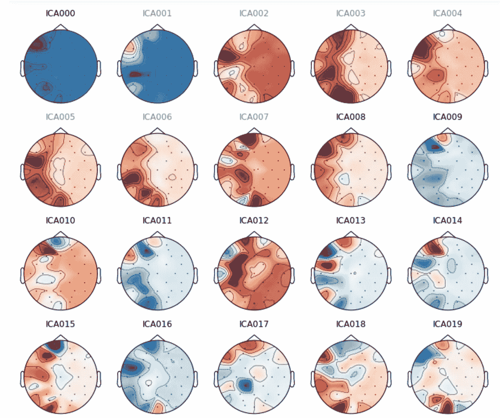

# 利用脑-机接口和脑电信号对情绪进行分类

> 原文：<https://towardsdatascience.com/using-brain-computer-interfaces-eeg-signals-to-classify-emotions-ca3e81096a5b?source=collection_archive---------28----------------------->

## 我们能从脑电波中学到什么？

Unsplash.com 的乔希·里默尔图片

# **神经科学和脑电信号**

脑电图是由电极测量的大脑活动的记录。汉斯·伯杰在 1924 年首次记录了脑电图信号，这是一个令人难以置信的发现，它导致了一个至今仍在进行大量研究的研究领域，其中有许多未知因素。脑电信号的采集是非侵入性的，电极用凝胶或浆糊放在头皮上。出于医学原因，EEG 信号最常见的用途包括癫痫研究和睡眠研究。它们也被用于发现脑损伤、脑部炎症和中风。

# **DEAP 数据集**

该数据集由伦敦玛丽女王大学创建，可在 https://www.eecs.qmul.ac.uk/mmv/datasets/deap/index.html[访问。数据集对公众开放使用，并要求签署发布表格。](https://www.eecs.qmul.ac.uk/mmv/datasets/deap/index.html)

数据集包括:

32 名参与者
40 个通道(前 32 个通道为脑电)
40 个一分钟视频
标签:效价、唤醒、支配、喜欢、熟悉、顺序
脑电通道名称- 'Fp1 '、' AF3 '、' F3 '、' F7 '、' FC5 '、' FC1 '、' C3 '、' T7 '、' CP5 '、' CP1 '、' P3 '、' P7 '、' PO3 '、' O1 '、' Oz '、' Pz '、' Fp2 '、' AF4 '、' F4 '、' F8 '、' FC6 '、' FC2 '、' Cz '、' C4 '、' T8 '、' CP6 '、'

# **项目动机**

虽然 EEG 信号通常用于医疗实践，但这项研究的重点是 EEG 信号是否以及如何用于更主观的方法，如人类的情感和情绪。通过整理参与者关于音乐视频(主观)和脑电图数据(客观)的调查，我们可以开始了解是否有可能从脑电图信号中预测情绪。

# 可视化和信号处理 Python 库

这项研究中主要使用的 python 库是 MNE-Python，这是一个开源的 Python 包，用于分析人类神经生理数据，包括脑磁图、脑电图和其他信号。

# 传感器位置

电极是小金属盘，根据 10/20 放置规则有策略地放置在头皮上。根据受试者头部的固定位置测量这些电极的位置。下面，我们可以看到该数据集实验中使用的 Biosemi 系统的传感器位置。

Biosemi32 系统头部的传感器位置(图片由作者提供)

本实验中的 Biosemi 系统是一个 32 通道系统，用于研究环境，不用于医疗用途。
偶数指头部右侧，奇数指左侧。传感器的命名惯例取决于传感器的位置:

原始的、未经处理的脑电图信号(图片由作者提供)

F —额叶
T —颞叶
C —中央叶
P —顶叶
O —枕叶

# **处理脑电信号**

信号预处理的目的是提高信噪比和检测实验效果。这是通过带通滤波来实现的(它通过一定范围内的频率，而拒绝该范围之外的频率)。此外，在预处理期间，死通道被丢弃，伪像被去除。

**标记不良频道**

重要的是标记坏的信道，即故障的、未使用的或不显示任何信号的信道，以便将它们从信号分析中排除。我们可以在下面的第一个图中看到，至少有一个坏通道。错误消息告诉我们通道是 GSR2。我们会将此标记为坏通道，并重新绘制图形，看看是否可以更好地看到其他通道。我们还从原始数据集描述中了解到，通道“Erg1”和“Erg2”也不是使用过的通道，因此我们也将它们标记为坏通道。我们可以在下面的第三个图中看到，未使用的通道不再包括在内。

(图片由作者提供)

我们还知道数据集中还有其他非 EEG 通道(例如皮肤电反应),因此我们也将这些通道排除在外，因为我们不会在模型中使用它们。现在，我们已经确定了所有未使用的和非脑电图通道，我们可以设置蒙太奇。这将给出传感器的位置，并将它们转到收集数据的系统(Biosemi32)。在上面的最后一张图中，我们只能看到 EEG 通道，这些通道用颜色将信号与其传感器位置关联起来。

功率谱密度图(图片由作者提供)

**通过期望的通带过滤数据**

脑电波中最有用的信息存在于 30hz 以下。我们可以在这张功率谱密度图中看到，频率在 30-40hz 之间下降，因此出于研究目的，我们将截止 30hz。

**检测伪影并用 ICA 消除**

在决定选择哪种方法来修复工件之前，可视化并观察数据中的工件是很重要的。有三种类型的伪像会干扰 EEG 数据。其中包括*环境*(电线、摔门、电梯噪音、手机、空调等)*仪器仪表*(头皮连接不良、电磁干扰)*生物假象*(心跳、眨眼、吞咽)。

(图片由作者提供)

首先，我们将从数据中移除 SSP(信号空间投影)投影仪。这是一个矩阵乘法，通过将数据投影到一个更低维度的子空间来降低数据的秩。

重要的是检测伪影(视觉和心跳),以便确定它们是否足够重要而需要修复，并且还确定使用哪个工具来修复它们。我们将使用独立分量分析(ICA ),它试图将多元信号分解成独立的非高斯信号。

眨眼伪影出现在不同的通道上(图片由作者提供)

# **寻找事件和时期**

一旦信号被处理，我们就能够识别信号中的事件。事件由刺激通道标记。对于这个数据集，刺激通道被称为“状态”。状态通道有 7 个事件标记。这些标记事件如实验开始、音乐开始、出现注视屏幕、实验结束等。这些事件标记可以对 EEG 信号进行切片以创建历元，这些历元是从连续 EEG 信号中提取的特定时间窗口。下面的第一个图像显示了这个数据样本中的所有事件标记。第二个图像是一个小的时间窗口，事件标记覆盖在信号的顶部。

一个数据样本中的标绘事件(图片由作者提供)

脑电图数据覆盖的标绘事件(图片由作者提供)

**被拒绝的纪元**

当我们搜索事件时，我们能够执行另一种拒绝数据的方式，这意味着眨眼(我们记得这是一种假象)。下图非常有趣，因为我们可以看到额叶中的传感器拒绝的数据比例最大。这符合常识，即额叶最靠近眨眼发生的眼睛，因此产生最强的伪像。

被拒绝的纪元的百分比(按作者分类的图像)

# 机器学习——监督

在数据集上测试了几种分类模型，包括 KNN、决策树分类器、随机森林分类器和袋装树。还执行了 GridsearchCV 来超调参数。

目标标签:参与者对视频的熟悉程度(图片由作者提供)

# **结论和前进**

不幸的是，EEG 信号有一些缺点。EEG 信号具有较差的空间分辨率(距离头皮约 10cm2 ),导致需要进行密集的解释，以了解特定响应激活了大脑的哪些区域。从这项研究中我们也可以看出，脑电信号也很难处理。因此，向前推进，改进该研究结果的一种方法是进一步处理和测试信号。此外，我们可以在我们的机器学习模型中看到，我们只对“熟悉度”进行了实验，但可以做一个回归问题来解决效价、唤醒和支配。

此外，KNN 模型最初在所有模型中表现最好，但由于数据集(1 个参与者样本)较小，没有一个模型表现得令人难以置信地好。因为这项研究有 32 名参与者，所以将所有的 EEG 信号解释到一个更大的机器学习模型中会很有趣。

## **参考文献**

1.  A.Gramfort，M. Luessi，E. Larson，D. Engemann，D. Strohmeier，C. Brodbeck，R. Goj，M. Jas，T. Brooks，L. Parkkonen，m . hml inen，[使用 MNE-Python 进行脑磁图和脑电图数据分析](https://www.frontiersin.org/articles/10.3389/fnins.2013.00267/abstract)，*神经科学前沿*，第 7 卷，2013 年，ISSN 1662–453 x，[【DOI】](https://doi.org/10.3389/fnins.2013.00267)
2.  哈斯，L . F .(2003 年)。[“汉斯·伯杰(1873–1941)，理查德·卡顿(1842–1926)，以及脑电图”](https://www.ncbi.nlm.nih.gov/pmc/articles/PMC1738204)。*神经病学杂志&神经外科杂志*。 **74** (1): 9。[doi](https://en.wikipedia.org/wiki/Doi_(identifier)):[10.1136/jnnp . 74 . 1 . 9](https://doi.org/10.1136%2Fjnnp.74.1.9)。[PMC](https://en.wikipedia.org/wiki/PMC_(identifier))1738204。PMID [12486257](https://pubmed.ncbi.nlm.nih.gov/12486257) 。
3.  舍雷尔，“什么是情绪？以及如何衡量它们”，*社会科学信息*，第 44 卷，第 4 期，第 695-729 页，2005 年。
4.  南 Koelstra，C. Muehl，M. Soleymani，J.-S. Lee，A. Yazdani，t .易卜拉希米，T. Pun，A. Nijholt，I .帕特雷，“DEAP:使用生理信号进行情感分析的数据库”， *IEEE 情感计算汇刊，系统构建和评估的自然情感资源特刊，正在出版*