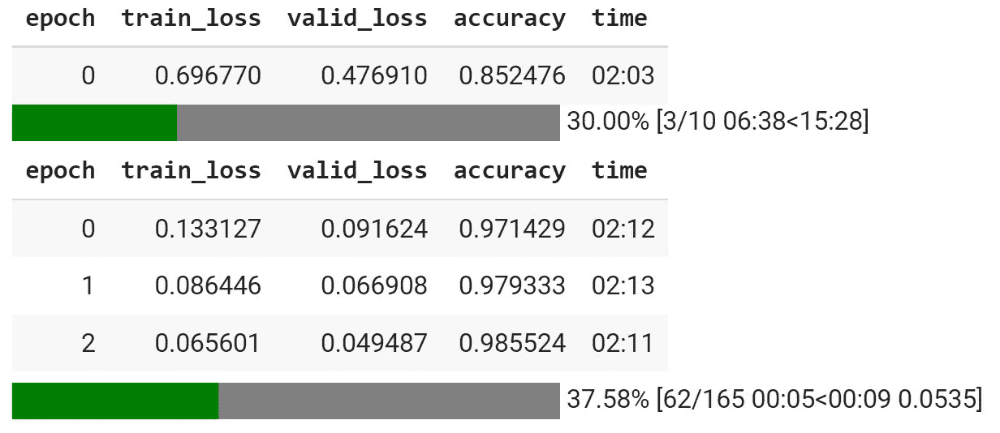

# 使用 Codex 将 Keras 翻译成 fastai

> 原文：<https://towardsdatascience.com/using-codex-to-translate-keras-to-fastai-8471a4596755?source=collection_archive---------25----------------------->


作者图片

## Codex 能成为深度学习框架的中间人吗？

OpenAI 的 [Codex](https://openai.com/blog/openai-codex/) 提供了一组特定于计算机语言的操作，可以用来从英语语言描述中生成代码，自动记录代码，并在编码语言之间进行翻译。在过去的几个月里，我一直在探索 Codex 的能力，包括它从英语提示中[生成 web 应用程序的能力](/back-to-the-future-with-codex-and-cobol-766782f5ae8f)和从 COBOL 中生成[现代代码的能力。我很好奇 Codex 将如何处理两个不同深度学习框架之间的翻译。](/codex-translates-cobol-into-javascript-266205d606c0)

## 挑战

我有幸写了两本书，一本是关于使用结构化数据的[深度学习的](https://www.amazon.com/Deep-Learning-Structured-Data-Mark/dp/1617296724/ref=sr_1_1?crid=PJ88C9FDGR0R&dchild=1&keywords=%22deep+learning+with+structured+data%22&qid=1635993870&qsid=130-4637480-5001025&sprefix=deep+learning+with+structured+data+%2Caps%2C100&sr=8-1&sres=1617296724%2C149203486X%2C0439438306%2C1412996481%2CB084TQ5RGK%2C054532114X%2C0545103339%2C3319659626&srpt=ABIS_BOOK)，其中展示了用 Keras(tensor flow 的高级深度学习框架)编写的深度学习示例，另一本是关于使用 fastai 的[深度学习的，fastai 是基于 PyTorch 构建的高级框架。在写第二本书的过程中，我需要创建一个现有 Keras 应用程序的 fastai 实现。当我写这本书的时候，我通过反复试验“手工”创建了 fastai 应用程序，直到我得到大致相当于 Keras 代码的工作代码。如果我在写书的时候能够接触到 Codex，我会利用它从 Keras 自动生成 fastai 吗？在这篇文章中，我将描述一个实验来回答这个问题。](https://www.amazon.com/Deep-Learning-fastai-Cookbook-easy/dp/1800208103/ref=sr_1_1?crid=3SYARIO8M3ZU3&dchild=1&keywords=%22deep+learning+with+fastai+cookbook%22&qid=1635994009&qsid=130-4637480-5001025&s=books&sprefix=deep+learning+with+fastai+cookbook+%2Cstripbooks-intl-ship%2C90&sr=1-1&sres=B0971LB85Z&srpt=ABIS_BOOK\)

## MNIST——深度学习的“你好世界”

你可以解决的最简单的深度学习问题是使用手写数字的 MNIST 数据集来训练一个模型，该模型可以预测手写数字图像中描绘的数字。


来自 MNIST 的示例图像

你可以说，为 MNIST 创建一个模型是深度学习的“你好世界”。

我关于 fastai 的书包含了 MNIST 模型的 Keras 和 fastai 实现的并排比较。这个比较说明了这两个框架之间的差异，并为熟悉 Keras 的开发人员探索 fastai 奠定了基础。

## 实验

为了锻炼 Codex 从 Keras 翻译到 fastai 的能力，我决定采用我为我的书手工转换成 fastai 的相同的 Keras MNIST 实现，看看 Codex 是否可以正确地完成翻译。

以下是 Keras MNIST 实现的起点，改编自[https://github . com/tensor flow/docs/blob/master/site/en/tutorials/quick start/beginner . ipynb](https://github.com/tensorflow/docs/blob/master/site/en/tutorials/quickstart/beginner.ipynb):

克拉斯 MNIST 模型

为了让 Codex 将它翻译成 fastai，我使用了以下提示模式:

```
// Rewrite this as a fastai model[ Keras code goes here ]// fastai version:
```

食品法典委员会得出的结果看起来像 fastai 一样合理:

fastai 输出从 Keras 输入产生 Codex

我把这段代码复制到了 Colab 笔记本上，但是它不能正常工作。为了让它在 Colab 中正确运行，我需要做两处修改:

*   用笔记本的 include 语句替换 include 语句:

```
#import fastai
#from fastai.vision.all import * 
!pip install -Uqq fastbook
from fastbook import *
from fastai.vision.all import *
```

*   注释掉编译语句:

```
#hello_world_model.compile(optimizer=optim.Adam,
#              loss_func=nn.CrossEntropyLoss(),
#              metrics=[accuracy])
```

通过这些改变，我能够在 Colab 中成功运行 fastai 代码，并获得一个有效的 MNIST 深度学习模型:



由 Codex 训练 MNIST 模型生成的 fastai 代码

虽然 Codex 生成的 fastai 代码进行了一些小的修改，但它并不完全等同于 Keras 输入代码。特别是，输入的 Keras 代码包括显示测试数据集的模型损失和准确性的语句:

```
test_scores = hello_world_model.evaluate(x_test,  y_test, verbose=2) 
print('Loss for test dataset:', test_scores[0])
print('Accuracy for test dataset:', test_scores[1])
```

Codex 生成的 fastai 代码包括以下语句，用于在测试集上训练模型，但它并不像原始 Keras 代码那样显示聚合结果:

```
test_dl = dls.test_dl(get_image_files(path/'testing'))preds,_ = learn.get_preds(dl=test_dl)
```

## 结论

给定 MNIST 深度学习模型的 Keras 代码作为输入，Codex 能够产生 fastai 代码作为输出(经过几次小的修改)，成功训练了 MNIST 深度学习模型。以下是我的主要观察结果:

*   一方面，这令人印象深刻。使用 Keras 框架的代码与使用 fastai 的代码有很大不同，作为一个人，我花了几次尝试，以 Keras 代码为起点，为 MNIST 开发 fastai 代码。Codex 第一次尝试就产生了(几乎)正常工作的 fastai 代码。我不必摆弄提示或对输入的 Keras 代码做任何更改。
*   另一方面，我不得不怀疑 Codex 是否简单地“记住”了作为 github 语料库一部分的 Keras 和 fastai MNIST 实现。例如，我用 fastai 书编写的[深度学习的代码(包括](https://www.amazon.com/Deep-Learning-fastai-Cookbook-easy/dp/1800208103/ref=sr_1_1?crid=3SYARIO8M3ZU3&dchild=1&keywords=%22deep+learning+with+fastai+cookbook%22&qid=1635994009&qsid=130-4637480-5001025&s=books&sprefix=deep+learning+with+fastai+cookbook+%2Cstripbooks-intl-ship%2C90&sr=1-1&sres=B0971LB85Z&srpt=ABIS_BOOK\)[这个手写的 fastai MNIST 应用](https://github.com/PacktPublishing/Deep-Learning-with-fastai-Cookbook/blob/main/ch1/mnist_hello_world.ipynb)和它的同伴 [Keras MNIST 应用](https://github.com/PacktPublishing/Deep-Learning-with-fastai-Cookbook/blob/main/ch1/keras_sequential_api_hello_world.py))自 2021 年年中以来一直在 github 中，所以 Codex 的训练集可能包括了我书中的例子，而 Codex 所做的只是从它在训练集中看到的手写的 MNIST 应用中“查找”fastai 语句。

总的来说，我不得不说，我对 Codex 能够从 Keras 代码中生成(几乎)有效的 fastai 代码印象深刻。甚至将“hello world”从一个框架自动翻译到另一个框架也是一种成就。我期待着用更具挑战性的 Keras 到 fastai 翻译来测试 Codex。

与本文主题相同的视频:[https://youtu.be/xUMBiMP4xNw](https://youtu.be/xUMBiMP4xNw)