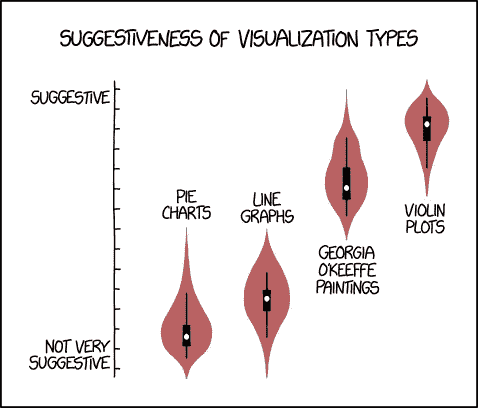

# 利用认知科学和教育科学来改善你交流结果的方式

> 原文：<https://towardsdatascience.com/using-cognitive-and-education-science-to-improve-the-way-you-communicate-results-de31c08c16f2?source=collection_archive---------26----------------------->

## [办公时间](https://towardsdatascience.com/tagged/office-hours)

## 提高演讲技巧的八个技巧

由 [Austin Distel](https://unsplash.com/@austindistel?utm_source=unsplash&utm_medium=referral&utm_content=creditCopyText) 在 [Unsplash](https://unsplash.com/s/photos/presentations?utm_source=unsplash&utm_medium=referral&utm_content=creditCopyText) 上拍摄

你们中有多少人在找工作时，在“必备技能”部分看到了“强大的沟通技能”？如果不是特别明确，肯定会有“人际交往技能”或“表达技能”之类的东西。这些在每个行业都很常见，所以最好问一句，你见过不具备上述条件的招聘信息*吗？*

好消息是，就像其他技能一样，我们可以通过练习和对要点的理解变得更好。在本文中，我们将重点应用认知科学和教育科学中的一些基于证据的结论，以改善我们作为数据科学家和分析师交流结果的方式，尽管这些观点可以推广到任何你发现自己在公开演讲的应用中。如果你想查看原始资料，你可以通读[这些](https://journals.sagepub.com/doi/citedby/10.1177/1529100612453266#top-content-scroll) [学术](https://journals.sagepub.com/doi/10.1177/1529100614525555?icid=int.sj-related-articles.similar-articles.37) [论文](https://journals.sagepub.com/doi/10.1177/1529100620973974?icid=int.sj-related-articles.similar-articles.13)。

回到数据科学家；让我们面对现实吧，我们这些花时间埋头于数字的人并不总是最擅长用一种令人信服和易于理解的方式来解释它们。但这有点傻，对吧？无论我们发现模式和做出推论的能力有多好，如果我们不能让团队成员相信这些模式，我们的结果将没有任何影响。作为一个能够应对交流结果这一挑战的人，一个需要对好的演示中隐含的技巧进行一些阐述的人，我发现以下技巧很有帮助。当你浏览这个列表时，我鼓励你思考一下最近的演示如何通过应用来改进。所以，事不宜迟:

# 1.细致的调查

精心调查“……促使学习者对明确陈述的事实做出解释。”通过提问，我们在社交上吸引了我们的听众(稍后会有更多介绍)，并鼓励听众处理正在呈现的信息，增加注意力。作为数据科学家，我们可以通过要求团队成员回忆以前幻灯片或会议的相关结论，或者利用每个人都可能拥有的一些领域知识，来进行精心的调查。精心调查和其他通过提问参与的方法之间的一个重要区别是听者能够回答问题；通过这种技巧，我们有意让听众将相关信息带入他们的头脑中。

# 2.实践测试

本节的标题不完全具有代表性；我们可能更喜欢在头脑中使用的术语可能是*修辞*或*引导提问*。我们不想测试我们听众的知识，因为这会让他们感觉如何，尤其是在一个问题的情况下，我们，演示者，将是唯一知道答案的人，这通常是在演示结果时的情况。然而，标题可能对读者有类似的影响，这导致了这种技术是有益的:

图片来自 knowyourmeme.com

回想一下学校里的考试公告，或者更糟的，可怕的突击测验。它们可能会让你觉得自己很像皮卡丘，感到惊讶并希望你知道更多。学习时的压力显著地促进了记忆的形成，然而，对于记忆回忆来说，情况正好相反。因此，我们对测试同事不感兴趣；事实上，当在演示过程中提问时，我们通常根本不期望他们回答。作为数据科学家，我们将利用这种压力反应以及由此带来的记忆回忆和大脑参与的改善，通过问一些修辞性或引导性的问题。一个有效的实现可以是展示初步数据，并简单地问一些类似这样的问题，“现在，从我们目前所看到的，我们可以推断出什么？”重要的是，在你的问题之后要有一个短暂的停顿，但要足够长，让听众考虑自己的解释和趋势，或者至少足够长，让他们思考，“嗯，我不确定。”然后，转到下一张幻灯片，用你来之不易的洞察力打击他们，在他们的大脑已经准备好接受它之后，他们更有可能记住和理解。

# 3.心理意象

继续我们的心理参与方法，我们可以使用意象来提高听众处理新信息的能力。毕竟，我们的眼睛是我们感官信息的主要来源。除了你为阐明而创造的美丽的形象化之外，有许多好的资源可以用来制作，要求听众在转述结论时富有想象力也是有帮助的。人类处理图像的速度比文本快 6 万倍，我们的大脑天生就能处理视觉数据。例如，假设你和一群房地产经纪人坐在一个房间里，并解释说，在房子的其他一切保持不变的情况下，我们的模型表明额外的卧室会使房子的售价下降。这可能感觉违反直觉(房地产经纪人也可能像皮卡丘一样看着你)，但如果我们让我们的房地产经纪人朋友想象自己站在他们最近出售的房子里，那么建议他们进一步想象，在总面积、浴室数量等没有增加的情况下。，再加一间卧室……嗯，放在哪里合适？为了打造另一个适合居住的卧室，我们必须重新利用现有房间的空间，让它们变得更加拥挤，更多的人最终会共用相同数量的浴室，等等。通过创造心理图像，我们可以用一种相关的、容易理解的方式传达结果，甚至那些一开始可能没有意义的结果。

XKCD 漫画

# 4.重复和突出显示

虽然教育研究表明这两种方法实际上都不是很好的学习技巧，不管它们有多受欢迎，但我们可以从它们糟糕的原因中获得价值。研究人员认为，突出显示尤其无效，因为你必须已经知道哪些信息是有价值的，才能突出显示正确的信息。幸运的是，我们*确实*知道什么信息是重要的，可以为我们的观众做重点介绍。这可以通过突出可视化的重要特征来实现，也可以通过将我们的幻灯片文本限制为简洁地捕捉主要思想的几个要点来实现，不过，如果你像我一样，实际的讨论将会冗长得多。最后，虽然我们将在下面进行有效的总结，但我们可以通过在每张幻灯片的结尾收集我们的想法，并通过陈述“继续，但这张幻灯片的主要内容是 _____，稍后您会看到为什么这很重要”来进行简短的总结，从而将重复作为一种突出的类比

# 5.社会和代理包容

离开时对团队环境感觉积极的听众更有可能关注我们的结果，因为他们更有可能将注意力放在我们身上，并对我们作为同事充满信心。社会包容可以包括指名道姓地提及个人或团队，并在演讲前后到场进行交谈或回答问题(我们都知道我们需要提前到场，以确保我们的演示文稿和演示准备就绪并正常工作！).如果我们碰巧在一天的早些时候看到同事的评论，我们也可以给他们留言，比如，“你会很兴奋地看到我今天下午演示的一些结果！”代理包容,“代理”指的是一个人对其环境施加影响的能力，激励听众在结果中感受到自己的存在，或感受到自己是引导演示流程的一部分。一定要承认其他团队和个人的努力，因为嘿，我们都在一起；创造数据洞察力是我们应该做的。允许观众提问，同时注意尊重时间限制，不要轻视或允许偏离我们精心制作的故事。建议稍后进行进一步的对话，以确保团队不偏离正轨，这是完全可以接受的。提出一个答案是“谢谢你，丽莎，很高兴你问了”的问题，这种感觉总是很棒。看到这种模式，我也想知道……”然后点击下一张幻灯片，上面有漂亮的可视化效果和谈话要点，正是为了满足这种好奇心而准备的。即使他们没有问这个问题，这也是我们真正追求的数据驱动的逻辑流程。

# 6.为不同的认知风格做好准备

我们需要了解我们的观众。我们是否在与数据团队的其他成员交流？软件部门的朋友，编码背景好但不一定懂数据？或者是销售部门的人，我们依赖他们面对客户的专业知识，或者是你向其解释项目的面试官，他们可能根本没有技术背景？是混合团吗？确保准备演示时考虑到目标受众。此外，在每个小组中，认识到存在不同的认知风格；有些人视觉学得更好，而有些人听觉学得更好。有许多原因，甚至在相似的个体中，为什么一个人的理解力会受到挑战。让我们尽最大努力为回答问题做好准备，记录下我们一路上遇到的困难，同时也考虑到由于我们独特的背景和经历，我们认为理所当然的信息可能会让其他人感到困惑。最后，如果经常向同一群人演示，注意他们问的问题类型和证明有用的可视化。我们可以做很多事情来改善我们的结果沟通，认识到重复的问题或同一类型的多个问题通常意味着我们未能以某种方式在我们的报告中包含必要的信息。

# 7.让您的结果令人难忘

为了让演示产生持久的影响，帮助提高我们的知名度，并让同事们期待我们未来的成果，我们应该在我们系统的工作环境中设定结果。我们刚刚花时间详细介绍了一个具体的结果；让我们不要忘记提醒每个人为什么我们首先对这个结果感兴趣。如果结果产生进一步的问题，解释未来的探索路径，并在必要时请求其他个人和团队的支持。如果提出问题的解决方案，说明对日常操作程序的影响。然而，作为数据科学家，我们可能不负责有关方向的决策，但我们可以利用这一点来增加我们的演示的普遍性。我们可以问一些问题，比如调查结果会如何影响我们的团队和邻近的团队，或者引发一场关于下一次调查应该关注什么的讨论，此外，我们还可以问一些其他问题，这些问题会让听众离开，通过我们的结论对下一步产生广泛的疑问。以“好吧，让我们在接下来的几天里都考虑一下，然后在我们的下一次会议上再回来”来结束一次会议可能会很好。吸引演示空间之外的同事的注意力，阐明结果的影响，通过增加其他人对其价值的感知，并给他们一个对下一部分好奇的理由，增加他们关注的欲望，使我们的演示更好。

# 8.摘要

在一次彻底的演讲后，听众会得到很多新的信息。对于回忆和持久的理解来说，重要的是确定想法之间的联系，以及哪些想法和结果是最重要的。花时间做总结，不要从最后一张幻灯片上读出一系列要点。虽然视觉上表现这些点是好的，但我们的口头表达应该以连贯的方式连接这些点，从头到尾总结这个故事。

图片来自 memegenerator.net

在这里，我将尽我所能写一份有效的总结。虽然我们已经介绍了很多技巧，但是所有的技巧都是通过引起听众的注意和让听众参与到信息处理中来实现的。我们通过提问、鼓励对旧问题的反思以及引导他们接受新问题来吸引他们。我们通过包容让他们参与进来；在社交方面，通过创造积极的工作环境；在代理方面，通过形象地回答问题，以个人为基础，并认可他人的贡献。最后，我们让他们参与进来，确保通过有效使用可视化和以重复信息的形式创建“点”作为小摘要来突出重要信息，然后在最终的连贯图片中“连接这些点”。通过这种方式，我们的观众会在离开时感受到我们的结果的价值，以及它在我们整个工作环境中的位置。

如果你已经走了这么远，谢谢你！现在你已经读了这篇文章并且理解了这些技巧…我在写作中使用了它们中的哪一个？我是否遗漏了什么，我的陈述如何才能更好？有没有我做过的有效但没有列在清单上的事情？你有没有最喜欢的老师和演讲者，他们有没有使用这里没有提到的技巧？请在评论中告诉我你的想法！