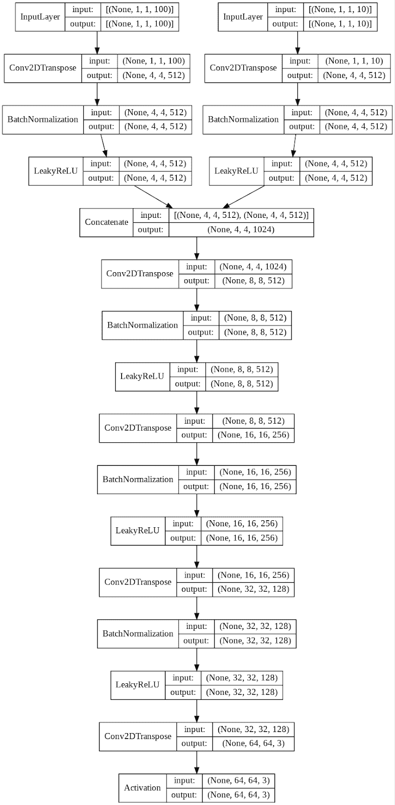
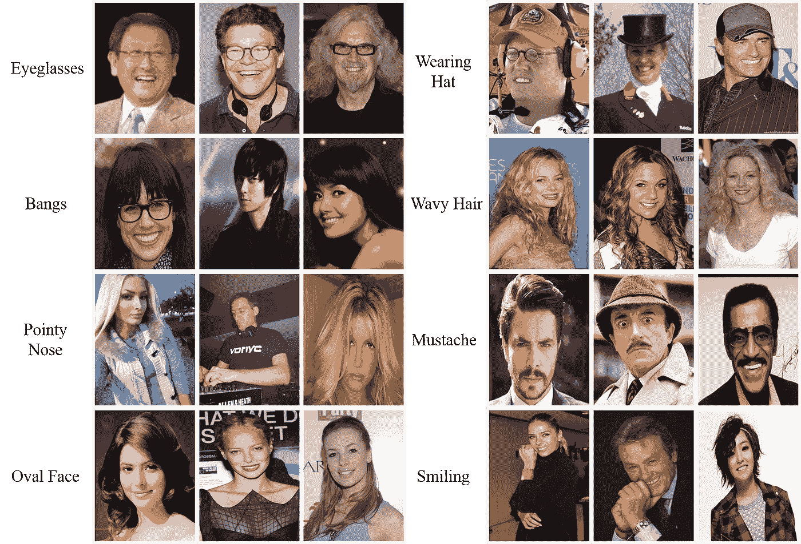
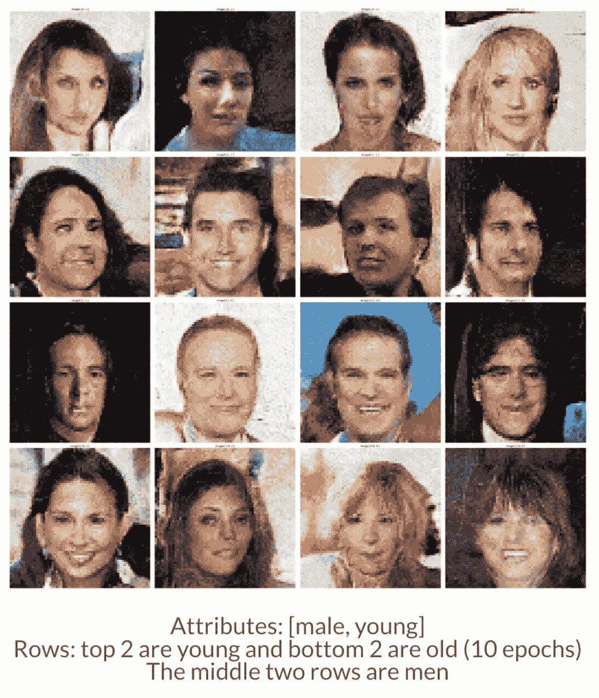
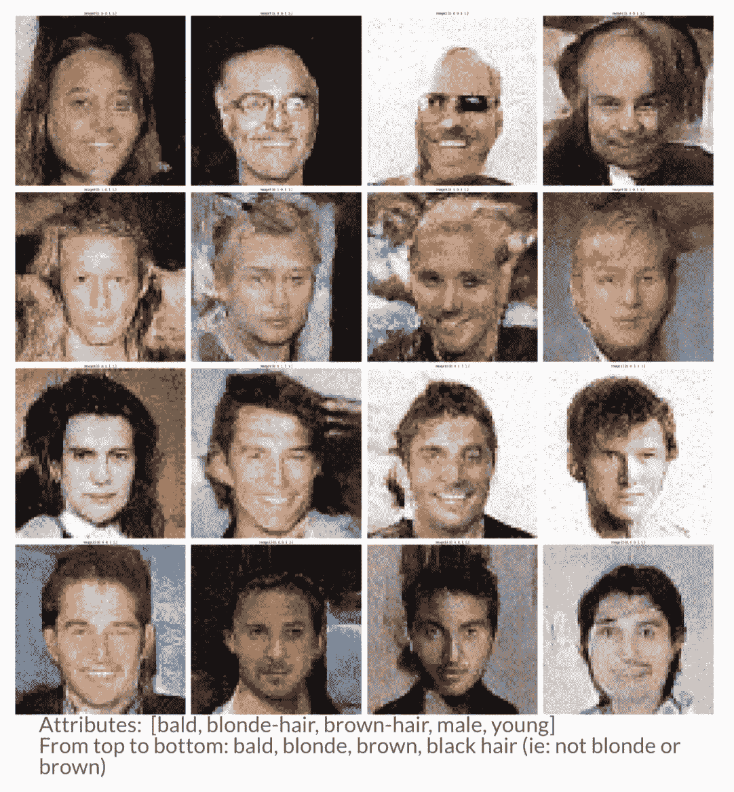
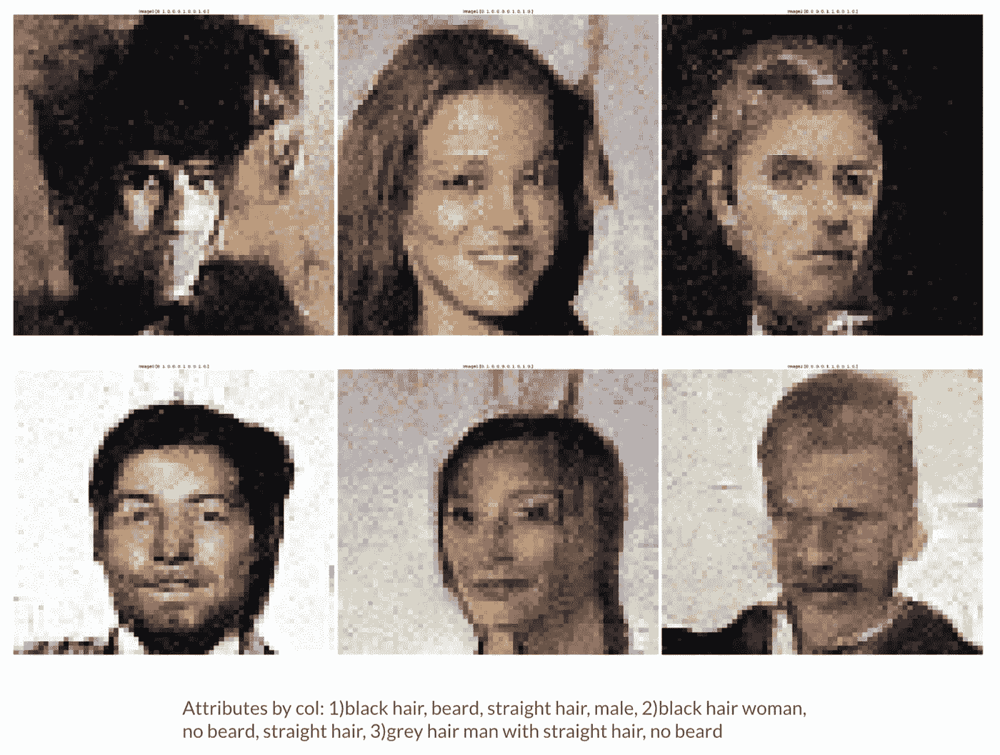
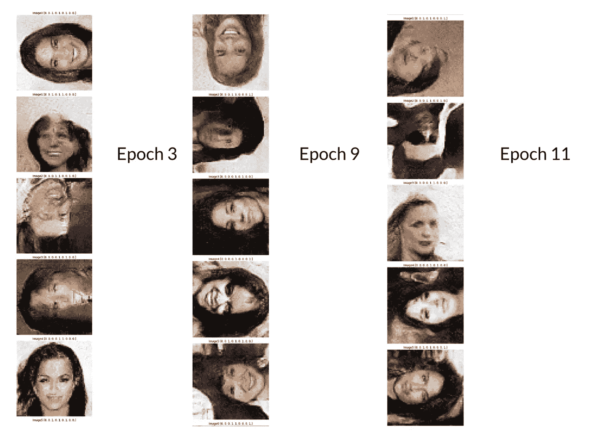

# 使用条件深度卷积 GANs 从文本描述生成自定义人脸

> 原文：<https://towardsdatascience.com/using-conditional-deep-convolutional-gans-to-generate-custom-faces-from-text-descriptions-e18cc7b8821?source=collection_archive---------23----------------------->

本项目代码见:[*【https://github.com/evanhu1/pytorch-CelebA-faCeGAN】*](https://github.com/evanhu1/pytorch-CelebA-faCeGAN)

GANs(生成对抗网络)是无监督学习模型的一个子集，它利用两个网络以及对抗训练来输出与输入数据相似的“新”数据。更具体地说，GANs 通常涉及“捕获数据分布的生成模型 G，以及估计样本来自训练数据而不是 G [1]的概率的判别模型 D。”

生成性对抗网络。[来源](https://developers.google.com/machine-learning/gan/gan_structure)

条件甘是原始甘模型的修改，后来由 Mehdi Mirza 和 Simon Osindero 在论文“[条件生成对抗网络](https://arxiv.org/abs/1411.1784)”(2014)中提出。在 cGAN(条件 GAN)中，鉴别器被给予数据/标签对，而不仅仅是数据，并且除了噪声向量之外，生成器还被给予标签，指示图像应该属于哪个类。标签的添加迫使生成器学习不同训练数据类的多种表示，允许显式控制生成器的输出的能力。在训练模型时，标签通常与生成器和鉴别器的数据样本相结合。实现这一点的代码将在下面给出。

在本文中，我将描述 PyTorch 中条件深度卷积 GAN 的实现，它使用英文文本而不是单个数字作为标签。我们的模型是深度卷积 GAN (DCGAN)，也就是说，它在其架构中使用深度卷积层，而不是原始论文中的全连接层。我们将在名人面孔的数据集上进行训练，图像被裁剪为 64x64。我们的模型架构包含五个卷积/转置卷积层，具有批量归一化和泄漏 ReLU 激活，以及用于鉴别器输出层的 sigmoid 激活和用于发生器输出层的 tanh 激活。使用 Adam 优化器和二元交叉熵损失。

参数和数据清理步骤由关于 GAN 训练的“传统智慧”指导，从诸如 [GANHacks](https://github.com/soumith/ganhacks) 和原始论文等来源收集。这些包括 Adam 优化器的学习率为 0.0002 (beta 0.5)，步进卷积而不是向下/向上采样，使用高斯分布的自定义权重初始化(平均值为 0.0，标准差为 0.02)，以及将真实图像从[0，1]缩放到[-1，1]以匹配伪图像中的 tanh 输出。

发生器模型的架构——鉴别器模型几乎完全相同，只是输入/输出维度和简单卷积层有所不同，而不是转置层。作者图片

在确定了设计之后，我们用 PyTorch 编写了我们的模型。

至于数据集，CelebA 为每张图像提供了 40 个二进制属性注释，如下例所示。

[来源](http://mmlab.ie.cuhk.edu.hk/projects/CelebA.html)

使用这些二元属性作为我们的标签或条件，我们可以训练我们的 cGAN 生成具有我们控制的特定特征的人脸。此外，我们可以选择多个属性进行训练和学习，只需将它们连接起来形成多维标签。给定足够的属性，我们可以生成具有不同人类特征的各种各样的人脸。例如，我们的初步训练结果显示，该模型可以学习二元属性，[男性，年轻]，允许我们生成 4 种不同的面部类型组合(年轻男性，“不年轻”男性，年轻女性，“不年轻”女性)

作者图片

在我们的代码中，我们构建了一个定制的 PyTorch 数据集，它带有一个参数来指定在总共 40 个二进制属性中包含哪些属性，因为对所有 40 个属性进行训练太困难了。

对于我们模型的实际输入，我们创建了沿标签轴具有二维的多热点编码张量。具体来说，假设我们在训练中仅使用 64x64 图像的两个二进制属性，则生成器将接收 32x2x1x1(批量大小、标签数量和反卷积层要作用的 2 个“伪”图像尺寸)的 multi-hot 编码张量作为每个训练样本的标签。相反，鉴别器将接收 32×2×64×64 的多热编码张量，根据训练样本的二进制属性填充 0 和 1。

在训练期间，在每个标签通过卷积/去卷积层之后，使用 torch.cat()层将这些标签与数据样本连接在一起。创建标签并将其处理成正确尺寸的代码在训练循环中，该循环基本上与普通的 GAN 训练循环相同，只是增加了将标签与数据样本一起输入的步骤。

鉴别器模型的训练代码

在 Google Collaboratory GPUs 上，每个时期的训练时间约为 30 分钟，平均到第 5 个时期时产生了有趣的结果。我们尝试稳步增加训练数据中用于描述面部的属性数量，希望了解 cGAN 能够学习多少。

每个图像有 5 个二进制属性:

作者图片

10 个属性:

['秃头'，'黑发'，'金发'，'棕发'，'灰发'，'男性'，'无胡须'，'后退 _ 发际线'，'直发'，'波浪发']。作者图片

正如您可能看到的，随着属性数量的增加，结果会受到影响。考虑到我们有限的计算资源和时间，我们没有超过 10 个属性，但看看它能走多远，以及一个足够大的模型是否能学习 celebA 的所有 40 个二进制属性将会很有趣。

作为额外的工作，我们还在 celebA 数据样本上使用旋转变换进行实验，看看 cGAN 是否不仅可以学习二进制属性，还可以学习旋转等增强。从论文[通过预测图像旋转的无监督表示学习](https://arxiv.org/abs/1803.07728)中获得灵感，我们生成了旋转 90、180 和 270 度的样本用于训练。

作者图片

结果表明，令人惊讶的是，cGAN 模型确实能够学习面部属性以及图像增强。

总之，这是对 GANs 从数据中学习的明确能力以及 cGANs 令人印象深刻的灵活性的引人入胜的观察。我们希望你会觉得有趣，就像我们一样。

承认

这个项目是与来自伯克利[机器学习](https://ml.berkeley.edu/)的[杰克·奥斯丁](https://www.linkedin.com/in/jake-austin-371770199/)、[雅利安·贾恩](https://www.linkedin.com/in/aryan-jain-9101/)和[布莱恩·刘](https://www.linkedin.com/in/brian-liu-9b302816b/)共同合作的成果。

参考

[1]生成性对抗网络:[https://arxiv.org/abs/1406.2661](https://arxiv.org/abs/1406.2661)