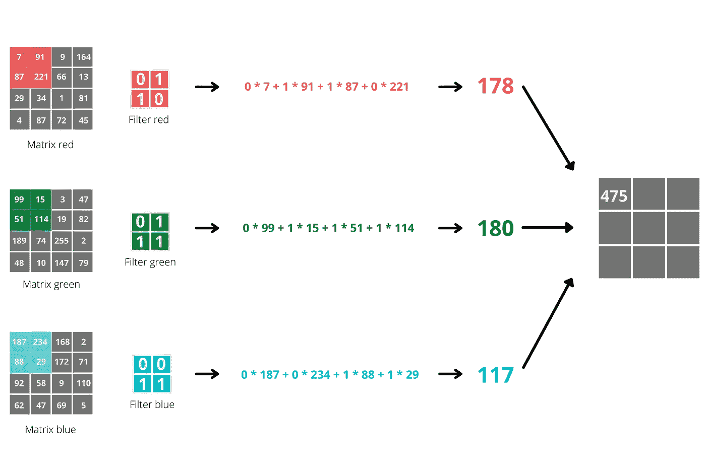
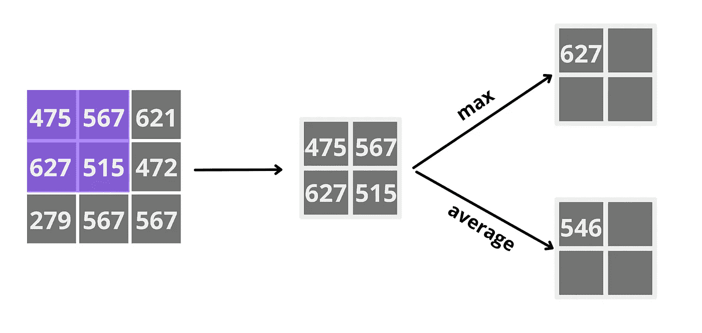

# 利用卷积神经网络进行图像分类

> 原文：<https://towardsdatascience.com/using-convolutional-neural-network-for-image-classification-5997bfd0ede4?source=collection_archive---------1----------------------->

纳斯蒂亚·杜尔希尔在 [Unsplash](https://unsplash.com/s/photos/convolutional-neural-network?utm_source=unsplash&utm_medium=referral&utm_content=creditCopyText) 上的照片

卷积神经网络(CNN 或 ConvNet)是神经网络的一个子类型，主要用于图像和语音识别。其内置的卷积层在不丢失信息的情况下降低了图像的高维度。这就是 CNN 特别适合这个用例的原因。

# 图像处理问题

如果我们想使用一个全连接的神经网络进行图像处理，我们很快就会发现它不能很好地扩展。

 [## 人工神经网络直观指南

### 人工神经网络(ANN)是人工智能和人工智能领域最常用的术语

medium.com](https://medium.com/illumination/intuitive-guide-to-artificial-neural-networks-5a2925ea3fa2) 

对于计算机来说，RGB 符号的图像是三个不同矩阵的总和。对于图像的每个像素，它描述了该像素显示的颜色。为此，我们在第一个矩阵中定义红色分量，在第二个矩阵中定义绿色分量，然后在最后一个矩阵中定义蓝色分量。因此，对于 3 个像素大小为 3 的图像，我们得到三个不同的 3x3 矩阵。

3x3x3 RGB 图片|图片:作者

为了处理图像，我们将每个像素作为输入输入到网络中。因此，对于大小为 200x200x3 的图像(即 200 个像素对 200 个像素，具有 3 个颜色通道，例如红色、绿色和蓝色)，我们必须提供 200 * 200 * 3= 120，000 个输入神经元。那么每个矩阵的大小为 200×200 像素，因此总共有 200 * 200 个条目。这个矩阵最终存在三次，分别代表红色、蓝色和绿色。问题出现在第一个隐藏层，因为那里的每个神经元都有来自输入层的 120，000 个权重。这意味着当我们增加隐藏层中神经元的数量时，参数的数量会迅速增加。

当我们想要处理具有更多像素和更多颜色通道的更大图像时，这一挑战变得更加严峻。这种具有大量参数的网络很可能会过拟合。这意味着该模型将为训练集提供良好的预测，但不会很好地推广到它尚不知道的新情况。此外，由于大量的参数，网络将很可能停止关注单个图像细节，因为它们将在纯粹的质量中丢失。然而，如果我们想要对图像进行分类，例如，图像中是否有狗，这些细节，例如鼻子或耳朵，可能是正确结果的决定性因素。

# 卷积神经网络

出于这些原因，卷积神经网络采取了一种不同的方法，模拟我们用眼睛感知环境的方式。当我们看到一幅图像时，我们会自动把它分成许多小的子图像，并逐个进行分析。通过组合这些子图像，我们处理和解释图像。如何在卷积神经网络中实现这一原理？

工作发生在所谓的**卷积层**。为了做到这一点，我们定义了一个过滤器，它决定了我们正在查看的部分图像应该有多大，以及一个步长，它决定了我们在计算之间继续多少像素，即部分图像彼此有多接近。通过采取这一步骤，我们大大降低了图像的维数。

下一步是**池层**。从纯计算的角度来看，这里发生的事情与卷积层相同，不同之处在于，根据应用，我们只从结果中取平均值或最大值。这保留了对任务解决方案至关重要的几个像素中的小特征。

最后，还有一个**全连接层**，正如我们从常规神经网络中已经知道的那样。现在，我们已经大大降低了图像的维度，我们可以使用紧密网格层。这里，各个子图像被再次链接，以便识别连接并执行分类。

现在，我们已经对各个图层的大致功能有了基本的了解，我们可以详细了解图像是如何成为一个类别的。为此，我们尝试从 4x4x3 图像中识别其中是否有狗。

# 细节:卷积层

在第一步中，我们想要减少 4x4x3 图像的尺寸。为此，我们为每种颜色定义一个尺寸为 2x2 的过滤器。此外，我们希望步长为 1，即在每个计算步骤之后，滤波器应该向前移动一个像素。这不会减少太多的维度，但图像的细节将被保留。如果我们用一个 2x2 迁移一个 4x4 矩阵，并在每一步中前进一列或一行，我们的卷积层将有一个 3x3 矩阵作为输出。矩阵的单个值通过取 2x2 矩阵的标量积来计算，如图所示。

卷积层|图片:作者

# 详细信息:池层

(最大)池层将卷积层的 3×3 矩阵作为输入，并尝试进一步降低维度，另外获取图像中的重要特征。我们希望生成一个 2x2 矩阵作为这一层的输出，因此我们将输入划分为所有可能的 2x2 部分矩阵，并在这些字段中搜索最高值。这将是输出矩阵字段中的值。如果我们使用平均池层而不是最大池层，我们将计算四个字段的平均值。

池层|照片:作者

汇集层还从图像中滤除噪声，即图像中对分类没有贡献的元素。例如，狗是站在房子前面还是森林前面，这一开始并不重要。

# 细节:完全连接的层

完全连接的层现在做的正是我们在开始时打算对整个图像做的。我们为较小的 2x2 矩阵中的每个条目创建一个神经元，并将它们连接到下一层中的所有神经元。这大大减少了我们的维度，也减少了培训所需的资源。

然后，这一层最终知道需要图像的哪些部分来进行狗或非狗的分类。如果我们的图像比我们的 5x5x3 示例大得多，当然也可以在进入全连接层之前连续几次设置卷积层和池层。通过这种方式，您可以将维数降低到足以减少训练工作量的程度。

# 数据集

Tensorflow 有各种各样的数据集，我们只需几行代码就可以下载和使用。当您想要测试新模型及其实现，并且因此不想长时间搜索适当的数据时，这尤其有用。此外，谷歌还提供了一个[数据集搜索](https://datasetsearch.research.google.com/)，人们可以通过点击几下找到合适的数据集。

 [## 张量流简介

### 了解机器学习框架、其架构以及与 PyTorch 的比较

towardsdatascience.com](/an-introduction-to-tensorflow-fa5b17051f6b) 

对于我们的示例卷积神经网络，我们使用通过 Tensorflow 获得的 [CIFAR10](https://www.cs.toronto.edu/~kriz/cifar.html) 数据集。该数据集包含总共 60，000 幅彩色图像，分为十个不同的图像类别，例如马、鸭或卡车。我们注意到，这是一个完美的训练数据集，因为每个类正好包含 6，000 幅图像。在分类模型中，如果可能的话，我们必须始终确保每个类在数据集中出现的次数相同。对于测试数据集，我们总共获取 10，000 张图像，因此训练数据集获取 50，000 张图像。

这些图像的尺寸都是 32×32 像素。像素依次具有 0 到 255 之间的值，其中每个数字代表一个颜色代码。因此，我们将每个像素值除以 255，以便将像素值归一化到 0 和 1 之间的范围。

为了检查所有图像是否正确显示，我们打印前十个图像，包括它们所属的类。由于这些只是 32×32 的图像，它们相对模糊，但你仍然可以分辨出它们属于哪一类。

# 建立一个卷积神经网络

在 Tensorflow 中，我们现在可以通过定义每层的序列来构建卷积神经网络。因为我们正在处理相对较小的图像，我们将使用卷积层和最大池层的堆栈两次。正如我们已经知道的，这些图像有 32 个高度维度、32 个宽度维度和 3 个颜色通道(红、绿、蓝)。

卷积层首先使用 32 个滤波器，然后使用 64 个具有 3×3 内核的滤波器，最大池层搜索 2×2 矩阵内的最大值。

经过这两次叠加后，我们已经将图像的尺寸显著减少到 6 个高度像素，6 个宽度像素，总共 64 个滤镜。利用第三个也是最后一个卷积层，我们将这些维度进一步降低到 4x4x64。在我们现在由此构建全网状网络之前，我们用 1024 个元素(4*4*64)的向量替换每个图像的 3×3 矩阵，而不会丢失任何信息。

现在，我们已经充分降低了图像的维度，并且可以在模型结束于具有十个不同类别的十个神经元的输出层之前，再添加一个总共具有 64 个神经元的隐藏层。

该模型总共有 122，570 个参数，现在可以开始构建和训练了。

# 编译和训练模型

在我们开始训练卷积神经网络之前，我们必须编译模型。在其中，我们定义了应该根据哪个损失函数、优化器(即，根据哪个算法来改变参数)来训练模型，以及为了能够监控训练过程，我们希望显示哪个度量。

# 评估模型

在对卷积神经网络进行总共 10 个时期的训练之后，我们可以查看模型精度的进展，以确定我们是否对训练满意。

我们对图像类别的预测在大约 80%的情况下是正确的。这不是一个不好的值，但也不是一个特别好的值。如果我们想进一步增加这一点，我们可以让卷积神经网络训练更多的时期，或者可能以甚至不同的方式配置密集层。

# 这是你应该带走的东西

*   卷积神经网络用于图像和语音处理，并且基于人类视觉皮层的结构。
*   它们由卷积层、汇集层和完全连接层组成。
*   卷积神经网络将图像分成更小的区域，以便第一次单独查看它们。
*   使用 Tensorflow，卷积神经网络只需几步即可编程。
*   根据不同的使用情况调整卷积层和最大池层的安排非常重要。

*如果你喜欢我的作品，请在这里订阅***或者查看我的网站* [*数据大本营*](http://www.databasecamp.de/en/homepage) *！还有，medium 允许你每月免费阅读* ***3 篇*** *。如果你希望有****无限制的*** *访问我的文章和数以千计的精彩文章，不要犹豫，点击我的推荐链接:*[【https://medium.com/@niklas_lang/membership】](https://medium.com/@niklas_lang/membership)每月花$***5****获得会员资格**

* [## 为什么您应该了解大数据

### 定义大数据及其潜在威胁

medium.com](https://medium.com/codex/why-you-should-know-big-data-3c0c161b9e14)  [## 借助《哈利·波特》理解 MapReduce

### MapReduce 是一种允许并行处理大型数据集的算法，例如，在多台计算机上…

medium.com](https://medium.com/@niklas_lang/understanding-mapreduce-with-the-help-of-harry-potter-5b0ae89cc88)  [## 学习编码:13 个免费网站帮助你开始

### 一旦你决定要学习编码，你会被众多的在线工具宠坏，这些工具可以帮助你…

towardsdatascience.com](/learn-coding-13-free-sites-to-help-you-do-it-9b2c1b92e573) 

# 参考

1.  [https://www.tensorflow.org/tutorials/images/cnn](https://www.tensorflow.org/tutorials/images/cnn)*