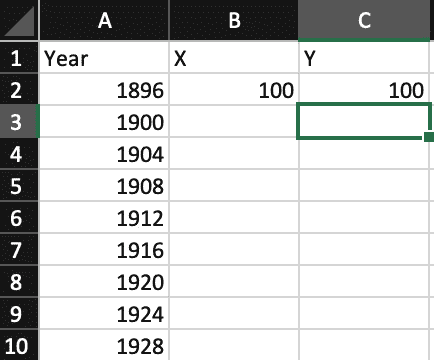
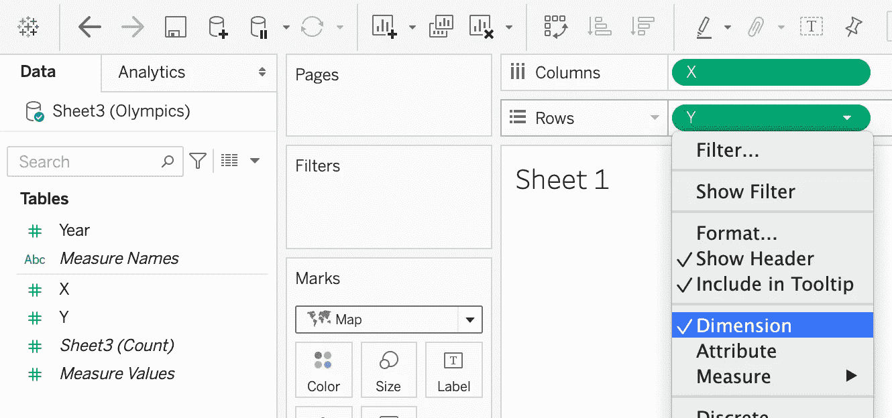
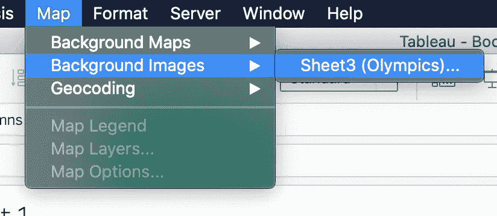
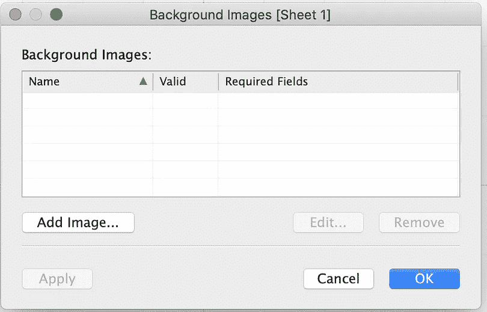
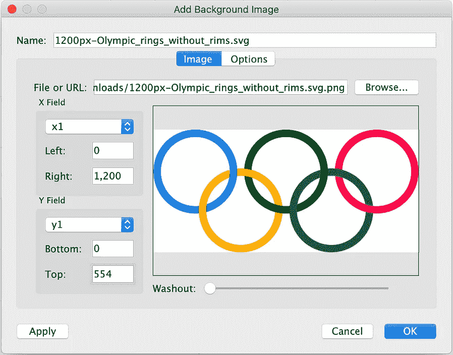
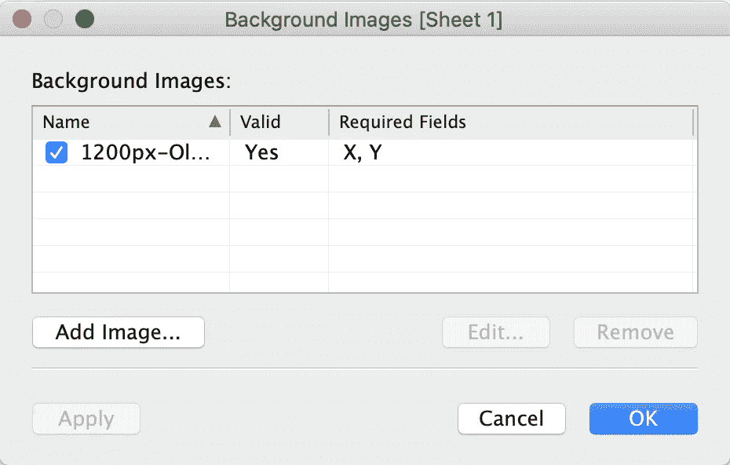
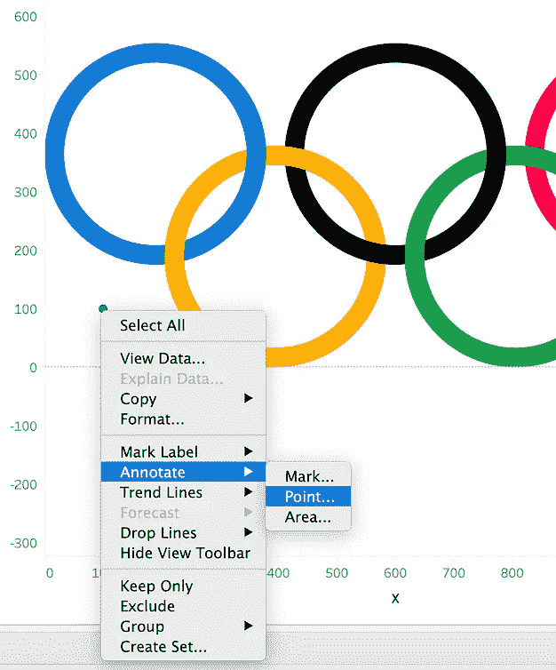
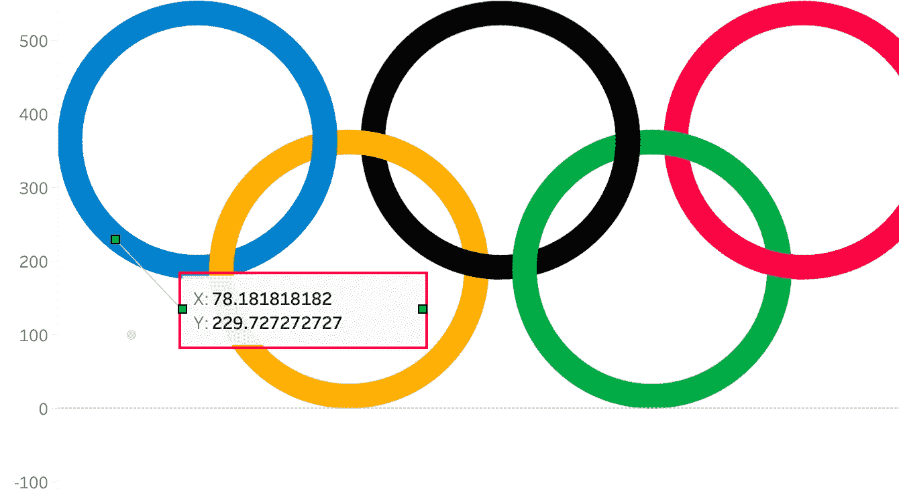
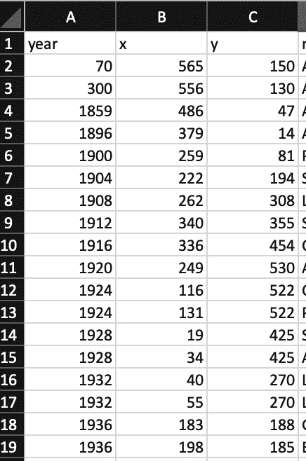
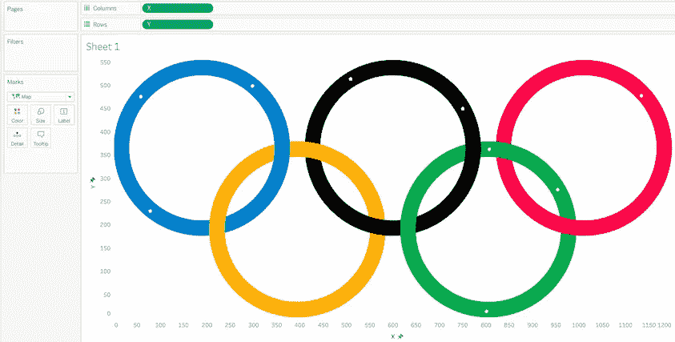

# 使用自定义图像作为 Tableau 中的地图

> 原文：<https://towardsdatascience.com/using-custom-images-as-maps-in-tableau-3e7a1980f390?source=collection_archive---------25----------------------->

## 你知道你可以在 Tableau 里画出任何东西吗？

是的，你没看错。您可以使用任何图像作为背景，并在其上添加数据点。在这篇文章中，我将带领你创建你自己的自定义地图的步骤。

由 [Unsplash](https://unsplash.com?utm_source=medium&utm_medium=referral) 上的 [GeoJango Maps](https://unsplash.com/@geojango_maps?utm_source=medium&utm_medium=referral) 拍摄

最近，我试图为[奥运会](https://public.tableau.com/views/TheOlympicGames-BriefTimeline/ABriefOlympicGamesTimeline?:language=en-GB&:display_count=n&:origin=viz_share_link)绘制时间表。出于本教程的目的，我将使用相同的 viz。

# 它是如何工作的？

我们知道我们需要两个坐标来绘制地图——一个位置的经度和纬度。如果您还记得散点图，我们基本上使用 X 和 Y 坐标来绘制数据点。因此，地图可以被认为是一个散点图，但在 Tableau 中有一个背景图像。你只需要坐标，就可以开始了。

# 如何向地图添加数据点？

为此，您需要首先准备数据源，添加图像并在数据源中添加所需的坐标。下面是详细的步骤。

## 1.准备数据源

打开一个电子表格文件，添加三列——X、Y 和一个标识符。我用的是年份。在 X 和 Y 列中输入随机数。

初始数据源(图片由作者提供)

## 2.设置工作表

转到 Tableau 中的新工作表，将 X 添加到 Columns shelf，将 Y 添加到 Rows shelf。右键单击 X 和 Y，然后选择“尺寸”。另外，将图表类型更改为地图。

(图片由作者提供)

## 3.找到图像

找到您想要使用的合适大小的图像。我用的图片尺寸是 1200 X 554。

> 请务必给予应有的学分，以使用图像。

一旦你有了图像，进入地图>背景图像。单击数据源的名称。将会打开一个弹出窗口。点击“添加图像…”

添加背景图片(图片由作者提供)

浏览到您的图像，并根据图像的大小设置 X 和 Y 字段限制。我的图像尺寸是 1200 X 554。如果需要，您也可以选择冲洗图像。单击确定。

你现在应该看到图像作为背景。在此阶段，最好将 x 轴和 y 轴固定在正确的范围内，以便图像与工作区域对齐。

将自定义图像添加为地图(作者提供的图像)

## 4.添加数据点

找到您添加到电子表格的一个数据点。右键单击该点，选择注释>点，然后单击确定。您也可以单击图像上的任意位置来注释该点。默认情况下，注释会显示 X 和 Y 坐标。

现在，将注释从(100，100)移动到图像上的一个点。你刚刚得到了第一个数据点。将这些坐标添加到电子表格中。根据所需的数据点数量重复此步骤。

使用注释获取坐标(图片由作者提供)

完成本练习后，您的电子表格应该如下所示。您可以添加更多包含与您的 viz 相关的详细信息的专栏。

(图片由作者提供)

保存电子表格并刷新数据源。

您的图像应该在刚刚映射的位置上有点。小白点是我们刚刚绘制的坐标。

映射的自定义图像(作者提供的图像)

瞧啊。您已经成功地使用了自定义图像并在其上绘制了数据。

你可以用这种技术做很多有趣的事情。这是我做的和我最终的 viz 看起来的样子。

来源:[即](https://public.tableau.com/views/TheOlympicGames-BriefTimeline/ABriefOlympicGamesTimeline?:language=en-GB&:retry=yes&:display_count=n&:origin=viz_share_link)

感谢阅读！

直到下一次…