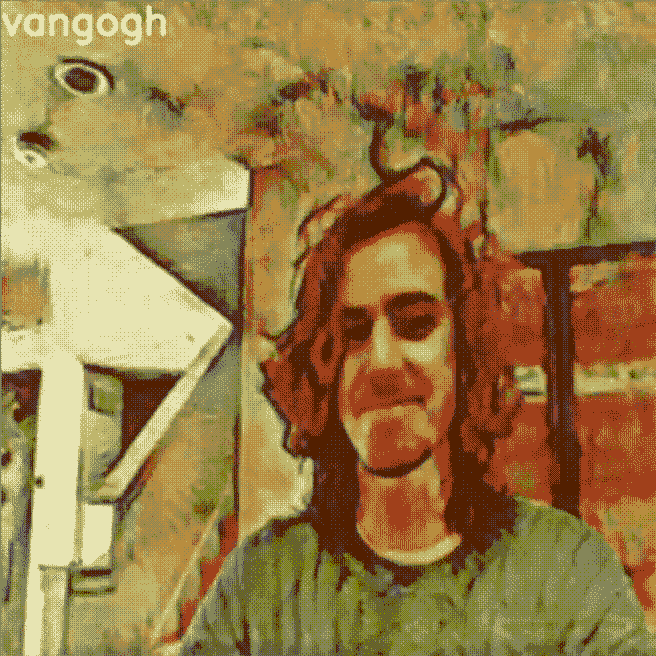
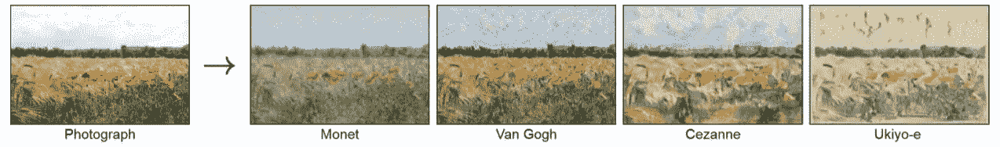
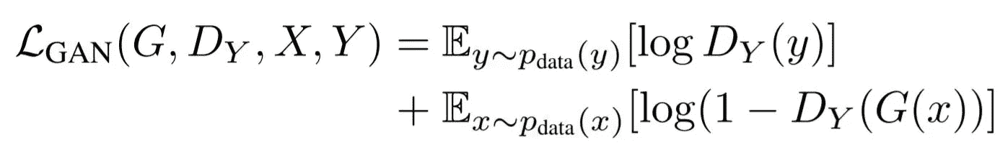
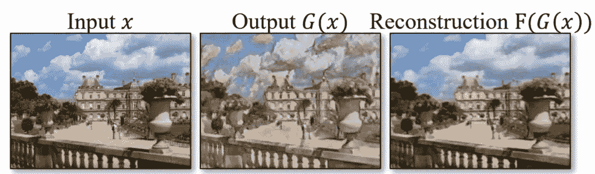
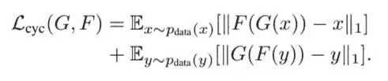
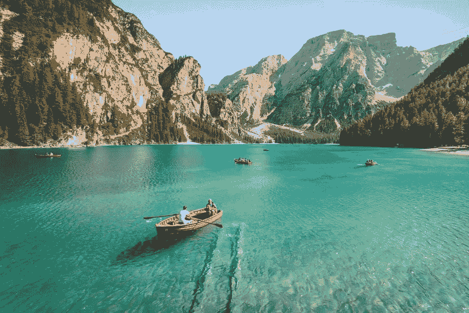
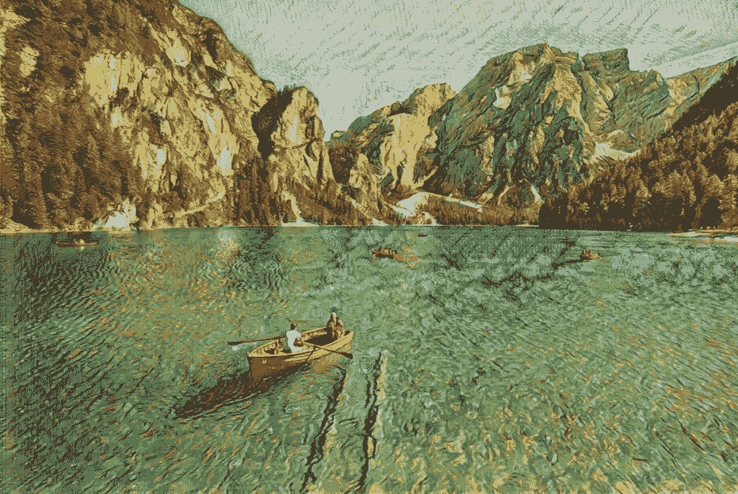

# 使用 CycleGAN 在网络摄像头上执行风格转换

> 原文：<https://towardsdatascience.com/using-cyclegan-to-perform-style-transfer-on-a-webcam-244142effe7f?source=collection_archive---------17----------------------->

## [实践教程](https://towardsdatascience.com/tagged/hands-on-tutorials)

## 关于如何设置 CycleGAN 和添加网络摄像头兼容性的教程



在我的网络摄像头上实时播放著名艺术家的作品。

*注意:本文假设您了解 GANs。* [*这里的*](https://machinelearningmastery.com/what-are-generative-adversarial-networks-gans/) *是巨大的资源。*

你有没有想过如果你是莫奈画的你会是什么样子？还是传说中的梵高？

随着我对 GANs 的了解越来越多，一个特别的应用引起了我的注意:风格转换。风格转移的目标是学习如何将一个域 X 的图像映射到另一个不同的域 y 的图像。一个经典的例子是让一个域成为一组照片，而另一个域包含一位著名艺术家(如克洛德·莫内)的绘画，并应用风格转移将普通照片转换为看起来像是他画的。



使用循环一致对抗网络的不成对图像到图像翻译。

这被称为图像到图像的转换，它传统上需要一个大型的成对图像数据集，这意味着为了学习上面例子中的映射，你需要相同位置、相同角度、相同时间的绘画和照片，等等。由于显而易见的原因，获得这种配对数据是不现实的，而且通常是不可能的。如果不用成对的例子就能把图像翻译成画，岂不是很棒？这个问题已经被探索，并且通过[循环一致的对抗网络](https://arxiv.org/pdf/1703.10593.pdf) (CycleGAN)已经实现了*不成对的*图像到图像翻译的有效方法，该方法使用 GAN 架构来学习必要的映射并执行高质量的图像翻译。我很好奇 CycleGAN 在视频上使用时有多有效，所以在这篇短文中，我将简要介绍 CycleGAN 的工作原理，然后介绍如何使用[官方 CycleGAN 实现](https://github.com/junyanz/pytorch-CycleGAN-and-pix2pix)将莫奈、梵高和其他人的艺术风格应用到您自己的网络摄像头上。

# 周期根的直觉

CycleGAN 的整体架构相当复杂。记住 CycleGAN 的目标，以及这些目标如何影响它的架构，有助于使它更容易理解。CycleGAN 的目标如下:

*   学习将域 X 映射和转换到域 Y(反之亦然)
*   维护图像的一致性:来自域 X 的图像在翻译到域 Y 时(反之亦然)应该看起来像原始图像，但是应用了必要的风格变化。

为了实现第一个目标，我们使用具有两个相应鉴别器的两个生成器，并应用下面的*对抗性损失*:



来自:[使用循环一致对抗网络的不成对图像到图像翻译。](https://arxiv.org/abs/1703.10593)

其中生成器 *G* 获取图像 *X* 并生成看起来属于域 y 的图像 *G(X)* 。鉴别器 *Dy* 试图正确地区分所生成的样本和从域 y 中随机选择的真实图像。这个相同的目标可以用于映射和翻译域 Y →域 x。

仅仅这样还不足以实现想要的风格转换。仅用对抗性损失进行训练将导致从域 X 到域 Y 的成功生成，但是不能保证生成的图像看起来像原始图像。我们希望映射是“循环一致的”，这意味着(通过其生成器)转换到目标域，然后转换回其原始域的图像应该尽可能地类似原始图像:*X*→*G(X)*→*F(G(X))*→≈*X*其中 *F* 是从域 Y 转换到 X 的生成器



来自:[使用循环一致对抗网络的不成对图像到图像翻译](https://arxiv.org/abs/1703.10593)。

为了实施这一原则，并实现我们的第二个目标，我们在下面定义了*周期一致性损失*函数。损失函数鼓励*X*→*G(X)*→*F(G(X))*→≈*X*和 *Y→ F(Y) → G(F(Y)) → ≈ Y.*



使用循环一致对抗网络的不成对图像到图像翻译。

我们目前有三种不同的损耗，用于在训练期间更新 CylceGAN:

*   G 对 Dy (X→Y)的对抗性损失
*   F 对 Dx (Y→X)的对抗性损失
*   循环一致性损失

而这些足以训练出 CycleGAN。我将简单地提一下，添加一个*身份损失*是有益的，这有助于保留翻译图像的颜色和色调。

CycleGAN 的作者建议通过使用变量 lambda λ来赋予这些损失函数不同程度的影响——如果您对 CycleGAN 架构的这一方面或其他方面(如层架构)感兴趣，我建议看一看[原始论文](https://arxiv.org/pdf/1703.10593.pdf)。有了一点 CycleGAN 直觉/更新，让我们用网络摄像头工作吧！

# 将风格转换应用到您的网络摄像头

为了将莫奈、梵高和其他风格应用到您的网络摄像头，我们将使用论文作者创建的[预训练 CycleGAN](https://github.com/junyanz/pytorch-CycleGAN-and-pix2pix) 模型。首先克隆[库](https://github.com/junyanz/pytorch-CycleGAN-and-pix2pix)并在终端/命令行中导航到根目录。从这里开始，您将运行`./scripts`文件夹中提供的一组 bash 命令来加载必要的模型。

```
bash ./scripts/download_cyclegan_model.sh style_monet_pretrained
bash ./scripts/download_cyclegan_model.sh style_ukiyoe_pretrained
bash ./scripts/download_cyclegan_model.sh style_cezanne_pretrained
bash ./scripts/download_cyclegan_model.sh style_vangogh_pretrained
```

这些会将预训练的 CycleGANs 保存在`./checkpoints`文件夹中。

我们现在将在根目录下创建一个名为`webcam.py`的 Python 文件，它将是`test.py`的修改版本，而不是通过 CycleGAN 运行数据集，而是通过它传递我们的网络摄像头馈送。

一旦你创建了`webcam.py`，开始导入必要的包:

然后，使用来自`test.py`的相同代码行来解析来自命令行的参数:

我们将通过编辑`./options/base_options.py`来编辑`webcam.py`的所需参数，并将参数`--dataroot`的所需布尔值设置为 false，因为使用网络摄像头，我们不需要提供数据的目录。现在，我们使用 cv2 来设置我们的网络摄像头，如果设置失败，就会引发错误:

然后，我们添加代码来获取网络摄像头的每一帧并执行必要的转换，以便它可以被我们加载的模型读取和转换。

最后，我们在一个新窗口中显示风格化的框架。如果用户在任何时候按下“Esc”键，窗口将关闭。

此时，您应该能够使用根文件夹中的以下命令运行您选择的 CycleGAN 模型的`webcam.py`。

```
python webcam.py  --name MODEL_NAME --model test --preprocess none --no_dropout
```

如果你对此满意:太好了！您可以通过修改`--name`参数来尝试其他预训练模型。在下一节中，我将展示如何添加一些额外的功能:通过按键实时切换样式。

# 在风格中循环

没有太多的修改必须作出，以便能够通过循环的风格，并应用到我们的网络摄像头实时。首先创建一个列表，列出您希望循环遍历的所有模型名称，并初始化一个变量来索引该列表。

在 while 循环之前插入以下代码。在我的代码中，这是在我们用 cv2 设置了网络摄像头之后。

我们还想在窗口的左上角添加文本，说明我们正在应用谁的艺术家的风格。首先为字体大小和位置设置一些参数。

除了前面的代码之外，在 while 循环之前插入以下代码。

为了将文本放置在左上角，我们将使用`cv2.putText()`并改变样式，我们将添加一个条件，如果按下“c”键，它将加载`style_models`列表中的下一个模型。下面是`webcam.py`的完整的最终实现:

它可以用前面列出的相同 bash 命令运行:

```
python webcam.py  --name MODEL_NAME --model test --preprocess none --no_dropout
```

# 结论

您可能会注意到每种风格都有一些闪烁/噪音。在视频上执行风格转换是一个相对较新的发展，许多[酷的、计算昂贵的工作](https://arxiv.org/abs/1604.08610)正在进行，试图使帧之间的转换更加一致。

CycleGAN 存储库文档教你如何在自己的数据集上训练，从而创建自己的风格！我认为收集漫画书作为一个数据集将导致一个非常酷的风格转移。

虽然已经有像 Photo Booth 这样的带有网络摄像头过滤器的程序，但风格转移很酷，因为他们学习了更高的理解，并且风格的细微差别可以有效地应用它。它可能不会在低分辨率的网络摄像头中显示出来，但在高分辨率的照片上，您可以真正看到它的威力:



Pietro De Grandi 原创[图片](https://unsplash.com/photos/T7K4aEPoGGk)



梵高的！

这也只是 CycleGAN 的一个具体应用，我建议浏览网页或查阅文献，看看它拥有的其他迷人的功能。

对于 webcam.py 和存储库文件，[这里是我在 GitHub 上的 fork](https://github.com/bensantos/webcam-CycleGAN)。

感谢阅读！