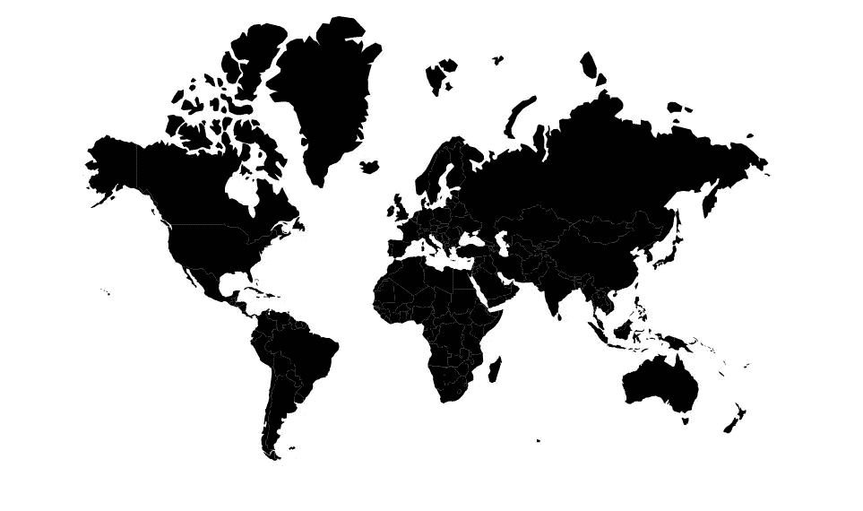

# 使用 D3.js 创建动态地图和视觉效果，展示 21 世纪相互竞争的气候变化情景

> 原文：<https://towardsdatascience.com/using-d3-js-to-create-dynamic-maps-and-visuals-that-show-competing-climate-change-scenarios-for-bb0515d633d3?source=collection_archive---------10----------------------->

## 如何使用 D3.js、Angular、JavaScript 和 Python 为您的数据科学项目创建地图和动画的代码演练


利用 D3.js 制作未来 80 年气候变化预测的动画和地图:在[zach-alexander.com/climate-change](http://zach-alexander.com/climate-change)的完整可视化和故事|图片由作者提供

随着拜登政府下周正式上任，应对气候变化的努力出现了乐观情绪。正因为如此，我认为探索未来 80 年政策作为(或不作为)对这一问题的潜在影响将是有趣的。

最近，我致力于一个完整的数据可视化故事，比较两种竞争气候变化情景下的温度变化预测。 [**这两种情景(“A2”和“B1”)**](https://en.wikipedia.org/wiki/Special_Report_on_Emissions_Scenarios)是 IPCC 在 21 世纪初制定的。这些情景概述了在这个问题上不同层次的全球合作及其对碳排放的潜在影响。如果你有兴趣阅读完整的数据故事并与其可视化互动，请随时前往:[](https://zach-alexander.com/climate-change)**【zach-alexander.com/climate-change】。**

**写完这个数据故事后，我意识到写一篇概述为观众创建 web 可视化的能力的文章可能会有所帮助。作为一名数据科学研究生(职业是数据工程师)，我经常对我们如何传达我们不懈努力完善的分析和数据的结论缺乏后续跟进(包括我在内)感到失望。最后，有时我们创建的算法或模型可能会失败，如果它们没有给出上下文或以令人信服的方式传达给受众。虽然现在有很多数据可视化平台(PowerBI，Tableau 等。)可以快速制作图表，在网上构建数据故事可以让分析更上一层楼。**

**在这篇文章中，我将从我为数据故事创建的一个可视化中选取一部分，并希望为如何使用[](https://angular.io/)**和 [**D3.js**](https://d3js.org/) 创建一个模拟 21 世纪气候变化模型的动画地图提供基础。****

****如果你想跟随完整的代码，你可以从这个库 中提取 [**。它将包含下面列出的所有代码，包括:**](https://github.com/zachalexander/d3-animated-map)****

*   ****将 csv 数据合并和转换为 JSON(python)****
*   ****运行本地角度应用程序(Angular-cli)****
*   ****安装 D3.js 并将 json 文件加载到 Angular 组件中(Angular)****
*   ****使用 D3.js 创建一个世界地图，并在 4 个时间间隔内制作动画(角度和 Javascript)****

****如果你发现自己想要在这篇文章中开始的动画的基础上构建，你 [**可以从我关于这个主题的综合数据故事中提取额外的代码**](https://github.com/zachalexander/portfolio/tree/master/src/app/components/climate-change) 。****

# ****确定你的想象或故事的目标****

****在开始任何网站工作之前，开发任何数据可视化的关键的第一步是考虑你最终想要向你的观众描绘什么。****

******我的目标:我想根据 IPCC 的气候变化情景，直观地展示未来 80 年各国的土地温度变化(以华氏度为单位)。******

****带着这个目标，我开始寻找一个令人信服的数据集。****

# ****查找数据集并识别其结构****

****幸运的是，有无数的气候变化数据集可供使用，而这个 [**世界银行数据集**](https://www.kaggle.com/theworldbank/world-bank-climate-change-data) 包含了预测未来一个世纪陆地温度变化的集合数据(基于全球环流模型和 IPCC 气候变化情景)，正是我所寻找的。****

## ****太好了！我有一个数据集，现在我如何把它转换成一个网页？****

****嗯，在我们着手把这些数据放到网页上之前，我们确实需要认真考虑我们的数据的哪一方面是我们想要呈现给我们的观众的。此外，由于 D3.js 可以很好地处理以[**JavaScript Object Notation(JSON)格式**](https://developers.squarespace.com/what-is-json#:~:text=JSON%2C%20or%20JavaScript%20Object%20Notation,content%20created%20with%20the%20CMS.) 格式化的数据，我们必须在构建可视化之前进行一些数据转换。****

****因为我想创建一个世界地图，所以我们也在处理地理坐标，它采用了一个更具体的 json 结构，称为“geojson”。****

## ****什么是 geojson？****

****简而言之，geojson 结构是专门用于编码各种地理数据结构的 json 格式的扩展。在 D3.js 中使用地图时，有许多内置函数和过程依赖于以 geojson 或 topojson 格式定向的数据。这两者的区别可以在这篇 [**stackoverflow 帖子**](https://stackoverflow.com/questions/14740705/difference-between-geojson-and-topojson) 中详细概述。我们将使用的格式 geojson 采用以下结构:****

```
**{
  "type": "Feature",
  "geometry": {
    "type": "Point",
    "coordinates": [38.00,−97.00]
  },
  "properties": {
    "name": "United States"
  }
}**
```

****对于上面这个简单的例子，我们可以看到，当这个数据被读入 D3.js 时，它会在相邻的美国的正中心画一个点(或点)。提到的“几何”是“点”的类型，附加到该点的“坐标”是该点将在网页上绘制的位置。您还可以将特定的属性附加到一个点上，比如一个“名称”，D3.js 也可以引用它(稍后我们将看到它在我们的调色板中发挥作用)。****

****虽然这是一个简单的例子，但你可以想象当你画特定的多边形(或形状)时，“坐标”会变得更长。本质上，当处理多边形时，您需要一个彼此相连的点的列表。每个多边形都有一组基于特定投影的坐标，然后这些坐标被渲染到页面上。作为一个实例，如果我们要查看内华达州的多边形坐标，您可以在下面找到它:****

```
**{
   "type": "Feature",
   "properties": {"name": "Nevada"},
   "geometry": {
       "type": "Polygon",
       "coordinates": [[[-117.027882,42.000709], [-114.04295,41.995232],[-114.048427,37.000263],[-114.048427,36.195153],[-114.152489,36.025367],[-114.251074,36.01989],[-114.371566,36.140383],[-114.738521,36.102045],[-114.678275,35.516012],[-114.596121,35.324319],[-114.574213,35.138103],[-114.634459,35.00118],[-115.85034,35.970598],[-116.540435,36.501861],[-117.498899,37.21934],[-118.71478,38.101128],[-120.001861,38.999346],[-119.996384,40.264519],[-120.001861,41.995232],[-118.698349,41.989755],[-117.027882,42.000709]]]
      }
}**
```

****我们可以看到，“几何图形”比我们的第一个例子长得多，“类型”现在是多边形而不是“点”。“坐标”是根据所使用的投影列出的，然后会呈现在页面上。****

# ****使用 python 将。csv 到。json****

****有了 geojsons 的新知识，我设计了一个计划，从 Kaggle 获取包含气候变化预测的 csv 文件，并最终将它们转换为 D3 的 json 文件。尽管许多数据操作可以通过许多 D3s 内置函数在 JavaScript 中正确完成( [**您可以将 csv 数据直接读入 JavaScript**](https://www.tutorialsteacher.com/d3js/loading-data-from-file-in-d3js) )，但我认为在将数据加载到网页之前操作数据会更有效，因为数据集是静态的(不依赖于对第三方 API 的访问/连接)。这样做的好处是，它应该使代码更高效，我们的可视化更敏捷，并减少页面加载时渲染地图和图表所需的时间。****

****为此，我使用了 python。你可以在 [**Github**](https://github.com/zachalexander/d3-animated-map/blob/main/Creating%20jsons%20for%20D3/data608_finalproj.ipynb) 上找到记录我的数据转换的整个 jupyter 笔记本。****

****总之，在阅读了 Kaggle 的 csv 文件后，我首先必须对各种日期范围和模型输出进行大量的数据汇总。然后，我基本上采用了一个公共 geojson 文件，该文件包含世界上所有国家的多边形，并将 Kaggle csv 文件中的温度数据和其他属性(利用属性信息中的公共标识符)合并到每个国家的属性中。在最后一段代码中，我创建了一个自定义函数来将数据帧输出为 json 文件:****

```
**# array of pandas dataframes with our various model data across the four time intervalsdataframes = [first20_med_a2, first20_med_b1, second20_med_a2, second20_med_b1, third20_med_a2, third20_med_b1, fourth20_med_a2, fourth20_med_b1]# empty array of json files that eventually will load in datajson_files = ['first20_med_a2.json', 'first20_med_b1.json', 'second20_med_a2.json', 'second20_med_b1.json', 'third20_med_a2.json', 'third20_med_b1.json', 'fourth20_med_a2.json', 'fourth20_med_b1.json']# custom function to take the pandas dataframes and store them in separate json filesdef createjsons():
    for idx, d in enumerate(dataframes):
        for i in features:
            for index, row in d.iterrows():
                if(row['Country'] == i['id']):
                    i['Change_c'] = row['Change_c']
                    i['Change_f'] = row['Change_f']
                    i['Date_range'] = row['Date_range']
                    i['Percentile'] = row['Pctile']
                    i['Scenario'] = row['Type']
                else:
                    pass
            with open(json_files[idx], 'w') as outfile:
                json.dump(gj, outfile)createjsons()**
```

****这一步的最终目标是创建单独的 json 文件，存储国家名称、温度变化(摄氏度)、温度变化(华氏度)、日期范围、模型计算百分比和场景类型。****

****正如我们在下面看到的，经过数据整理后，我的最终 json 文件中的一个 country 属性如下所示:****

```
**# I abbreviated the length of the coordinates to cut down on size of code block{
   "type": "Feature", 
   "id": "USA", 
   "geometry": {
      "type": "MultiPolygon", 
      "coordinates": [[[[-155.54211, 19.08348], [-155.68817,   18.91619], [-155.93665, 19.05939], [-155.90806, 19.33888], [-156.07347, 19.70294], [-156.02368, 19.81422], [-155.85008, 19.97729], [-155.91907, 20.17395], [-155.86108, 20.26721], [-155.78505, 20.2487], [-155.40214, 20.07975], [-155.22452, 19.99302], ...]]]
   }, 
   "properties": {
      "name": "United States of America", 
      "Change_c": 1.5040905413108334, 
      "Change_f": 2.7073629743595, 
      "Date_range": "2020-2040", 
      "Percentile": "median", 
      "Scenario": "a2"
   }
}**
```

****与上面的快速 geojson 示例类似，我们可以看到我们正在利用许多点来创建我们的美国多边形，但是我使用 python 来合并附加的“属性”,以便稍后用于我的可视化。我们很快就会看到，`change_f`值将用于我们的 choropleth 着色。****

****json 文件准备就绪后，我们可以开始想象我们的可视化会是什么样子。从用户的角度来看，我们希望显示土地温度随时间的变化，这可以通过读取特定时间间隔内的 json 文件来实现——所有这些都通过 D3.js 制作成动画。****

# ****数据整理已经够了！是时候用 Angular 建立一个网页了。****

****好吧！现在我们已经准备好了数据文件，我们可以启动一个本地单页面应用程序。****

****根据您想要使用的 JavaScript 框架，您需要下载命令行界面(cli)来启动本地开发服务器和包管理器。****

****对于这个例子，我们将使用的包管理器是 npm。安装 npm 最简单的方法之一是下载 node.js，它也将在您的安装中包含 npm。 [**这方面的说明可以在这里**](https://nodejs.org/en/download/) 找到。****

****作为我们的 Javascript 框架，我们将使用 Angular。为了简化我们的操作，您可以下载 Angular cli 来启动开发服务器。 [**这里的指令可以找到**](https://cli.angular.io/) ，由四行组成。****

****下载 node.js 和 Angular cli 后，可以打开 VSCode 终端窗口(或任何终端窗口)并运行以下命令:****

```
**// make sure npm is installed on your computer before running this:**npm install -g @angular/cli****
```

****安装完成后，在你的电脑上找到一个你想要存储应用程序文件的地方，然后运行(将“我的梦想应用程序”改为你想要的目录名称):****

```
****ng new my-dream-app****
```

****这将需要一两分钟才能完全运行，但最终它将创建一堆文件，这些文件包含您的新 Angular 应用程序，并提供编译所需的目录结构。当命令完成时，您可以导航到新的应用程序文件夹并运行“ng serve”来启动开发服务器。****

```
**// change directories into your new angular application**cd my-dream-app**// start the development server**ng serve****
```

****如果一切运行正常，您应该能够编译新创建的 Angular 应用程序，并在您的终端中看到:****

********

****如果您的 Angular 应用程序编译成功，您应该会在您的终端窗口中看到此消息****

****为了保持这一部分的简短，我不会深入讨论 Angular 如何工作的更多细节，但如果你对 Angular， [**完全陌生，请阅读这篇精彩的帖子**](https://medium.com/javascript-in-plain-english/understanding-angular-and-creating-your-first-application-4b81b666f7b4) 以了解基本的应用程序开发。此外， [**Angular 文档**](https://angular.io/docs) 对那些喜欢在杂草中获得更多的人非常有帮助。****

# ****让我们的网络可视化！****

****随着我们的 Angular 开发服务器的运行，我们现在可以开始构建我们的可视化。首先，我们需要从 npm 安装 D3.js 包，以便能够在我们的应用程序中使用这个库。为了这个视觉，我决定安装 D3 的版本 4(出于各种原因)。为此，在终端中停止开发服务器(ctrl + c ),并运行:****

```
**npm install d3v4**
```

****完成后，您可以通过运行以下命令来重新启动开发服务器:****

```
**ng serve**
```

****然后，您应该会看到与前面相同的“编译成功”消息。接下来，我们可以将 json 文件添加到应用程序内部的“assets”目录中(下面是文件夹结构):****

```
**|- application-name
   |- src
     |- assets
        |- first20_med_a2.json
        |- second20_med_a2.json
        |- third20_med_a2.json
        |- fourth20_med_a2.json**
```

****你可以在这里 找到这些已经预制好的 [**json 文件。然而，如果你愿意，你也可以利用上面的 python 脚本。**](https://github.com/zachalexander/d3-animated-map/tree/main/src/assets)****

****如果您使用的是 Angular，因为我们使用的是 Typescript，您可能还需要做一个快速配置，将 json 文件直接加载到 app.component.ts 文件中。 [**这篇文章**](https://medium.com/@devblog_/angular-7-import-json-14f8bba534af) 很好地总结了如何做到这一点。很可能，您只需将下面一行**加粗的**代码添加到您的 tsconfig.json 文件中:****

```
**{
  "compileOnSave": false,
  "compilerOptions": {
    .
    .
    .   
 **"resolveJsonModule": true,**
    .
    .
    .  
  }
}**
```

## ****渲染我们的第一张地图****

****随着我们的 json 数据存储在应用程序目录中，D3 库导入到我们的 node_modules 中，Angular 准备好接受 json 文件，我们可以开始在 web 上看到数据可视化的威力了！****

****为了呈现我们的一个 json 文件，我们首先需要确保我们在 app.component.ts 文件中引用它(下面是文件夹结构):****

```
**|- application-name
   |- src
     |- app
        |- **app.component.ts****
```

****导航到 app.component.ts 文件，通过将**加粗的**代码添加到现有代码中，将 json 数据导入到组件中:****

```
**import { Component} from '@angular/core';
**import * as d3 from 'd3v4';****// load the json file from the assets folder, give it a name**
**import * as firstModel from '../assets/first20_med_a2.json';**@Component({
  selector: 'app-root',
  templateUrl: './app.component.html',
  styleUrls: ['./app.component.scss']
})export class AppComponent { **// make sure to reference the correct structure
 firstModelData = firstModel['default'];** ngOnInit() { ** // print the json data in the browser console
   console.log(this.firstModelData)** }
}**
```

****保存这个文件，返回到您的浏览器，如果一切顺利，您应该能够在页面刷新后在开发工具中看到 json 数据打印到控制台:****

********

****Geojson 数据打印到 Google Chrome 控制台|作者图片****

****然后，我们需要删除 app.component.html 文件中的默认 html 语法，并创建一个快速的“div”。导航到 app.component.html 文件(文件夹结构如下):****

```
**|- application-name
   |- src
     |- app
        |- **app.component.html****
```

****然后，删除当前存在的所有 html 代码，并添加以下 div:****

```
**<div class = "world-map"></div>**
```

****现在，json 数据读入组件，我们可以开始编写 D3.js 函数了。导航回 app.component.ts 文件，并在 AppComponent 类中编写下面的**粗体**代码:****

```
**export class AppComponent { firstModelData = firstModel['default']; ngOnInit() {
    console.log(this.firstModelData) } **setMap(width, height, dataset) {** **const margin = {top: 10, right: 30, bottom: 10, left: 30};
   width = width - margin.left - margin.right;
   height = height - margin.top - margin.bottom;** **const projection = d3.geoMercator()
                     .rotate([-11, 0])
                     .scale(1)
                     .translate([0, 0]);** **const path = d3.geoPath().projection(projection);** **const svg = d3.select('.world-map')
                .append('svg')
                .attr('viewBox', '0 0 1000 600')
                .attr('preserveAspectRatio', 'xMidYMid')
                .style('max-width', 1200)
                .style('margin', 'auto')
                .style('display', 'flex');** **const b = path.bounds(datapull),** **s = .95 / Math.max((b[1][0] - b[0][0]) / width, (b[1][1] - b[0]  [1]) / height),** **t = [(width - s * (b[1][0] + b[0][0])) / 2, (height - s * (b[1][1] + b[0][1])) / 2];** **projection.scale(s).translate(t);** **svg.selectAll('path')
     .data(datapull.features)
     .enter()
     .append('path')
     .attr('d', path)** **}**
}**
```

****简而言之，这段代码声明了一个函数`setMap()`,它接受三个参数:宽度、高度和我们的数据集。然后，它定义一个边距，并从画布的所有四边减去边距像素。接下来，由于我们使用的是地图坐标，我们必须定义一个 [**地图投影**](https://bl.ocks.org/syntagmatic/ba569633d51ebec6ec6e) ，稍微旋转地图，这样俄罗斯的最东部就不会出现在画布的左侧，并设置我们的比例和平移。然后，我们将这个投影映射到我们的路径上，这将最终基于我们的投影输入和我们定义的画布尺寸来绘制我们的多边形。****

****然后，通过使用语法“d3.select(”选择空白 div 来创建我们的第一个 svg。世界地图”)。通过将 svg 附加到我们现有的 div，然后我们设置尺寸，并通过使用 viewBox 和 preserve spectra ratio 使其响应，并最终设置 1200px 的最大宽度，并将地图置于页面的中心(如果视口大于 1200px)。****

****然后，我们希望确保比例和平移图正确，并且我们画布的定义边界正确，因此变量`s`和`t`帮助定义我们墨卡托投影的边界。****

****最后，我们选择新添加的 svg，读入 geojson 特性，并在页面上绘制路径！为了在页面上呈现，我们需要使用实例化的函数并在`ngOnInit()`中调用它。将这行代码添加到 ngOnInit()函数内的 app.component.ts 文件中。****

```
**ngOnInit() {
    console.log(this.firstModelData) // add this line of code below to render your map: **setMap(1000, 600, this.firstModelData)**}**
```

****如果一切顺利，您应该会在页面上看到类似这样的内容:****

********

****setMap()函数首次渲染世界地图|图片作者****

****好吧！现在我们有所进展了！然而，不幸的是，我们的多边形填充是黑色的，我们希望根据以华氏度为单位的温度变化来创建每个国家的 choropleth 颜色。还记得我们使用 python 将该数据合并到每个国家的属性中吗？好了，现在我们可以使用每个国家的`change_f`值来区分我们的填充颜色！****

****为此，我们可以在我们的`setMap()`函数中添加以下代码(仍然在我们的 app.component.ts 文件中)，然后向我们的 svg 添加一个属性:****

```
**setMap(width, height, dataset) {**...****const color_domain = [2.5, 4, 7, 9, 10];****const color_legend = d3.scaleThreshold<string>().range(['#fee5d9', '#fcbba1', '#fc9272',  '#fb6a4a', '#de2d26', '#a50f15']).domain(color_domain);****...**svg.selectAll('path')
     .data(datapull.features)
     .enter()
     .append('path')
     .attr('d', path)
 **.style('fill', function(d) {
        const value = d['Change_f'];
        if (value) {
          return color_legend(d['Change_f']);
        } else {
          return '#ccc';
      }})
      .style('stroke', '#fff')
      .style('stroke-width', '0.5')**}**
```

****简而言之，我们可以使用 D3.js 中的 d3.scaleThreshold()函数来帮助我们创建 choropleth 调色板。由于时间的原因，我不会深入讨论这个问题，但是如果你有兴趣的话，你可以在这里 [**阅读更多关于这些秤的信息。此外，在将属性添加到我们的路径之后，我还将多边形(国家)的轮廓变得更粗和更灰。**](https://observablehq.com/@d3/quantile-quantize-and-threshold-scales)****

****如果这些附加功能正常工作，您应该会在页面上看到以下内容:****

********

****添加色标后的地图渲染|图片由作者提供****

## ****让我们来制作动画！****

****如果你已经做到了这一步，你绝对可以拍拍自己的背！可视化的最后一步是在不同的时间间隔内制作动画。如果你还记得从一开始，我们的目标是显示每个国家在四个不同时间间隔的温度变化:****

*   ****2020 年到 2040 年****
*   ****2040 年至 2060 年****
*   ****2060 年至 2080 年****
*   ****从 2080 年到 2100 年****

****正如你现在看到的，我们能够用一个 json 文件创建一个静态 choropleth 地图，显示 2020 年到 2040 年之间的温度变化。然而，为了使它在其他三个时间间隔内具有动画效果，我们希望在一段时间内将其他 json 文件加载到这个函数中。D3.js 使这变得相对容易。****

****首先，我们必须将其余的 json 文件加载到我们的 app.component.ts 文件中，类似于上面的第一个文件。为此，您可以添加下面几行**加粗的**代码:****

```
**import { Component, OnInit } from '@angular/core';
import * as d3 from 'd3';**# load the rest of the json files from the assets folder, give it a name**
import * as firstModel from '../assets/first20_med_a2.json';
**import * as secondModel from '../assets/second20_med_a2.json';
import * as thirdModel from '../assets/third20_med_a2.json';
import * as fourthModel from '../assets/fourth20_med_a2.json';**@Component({
  selector: 'app-root',
  templateUrl: './app.component.html',
  styleUrls: ['./app.component.scss']
})export class AppComponent {**# make sure to reference the correct structure** firstModelData = firstModel['default']; **secondModelData = secondModel['default'];
thirdModelData = thirdModel['default'];
fourthModelData = fourthModel['default'];****jsons;**...ngOnInit() {...}**
```

****然后，我们需要在页面加载时将 json 文件存储在一个数组中。因此，我们可以将其添加到我们的`ngOnInit()`函数中:****

```
**ngOnInit() {...**this.jsons = [this.firstModelData, this.secondModelData, this.thirdModelData, this.fourthModelData]**...}**
```

****现在，为了让我们的动画工作，我们必须在我们的`setMap()`函数下面创建一个新函数，叫做`transitionMap()`:****

```
**transitionMap(json, i) { const svg = d3.select('.world-map');  

  const color_domain = [2.5, 4, 7, 9, 10]; const color_legend = d3.scaleThreshold<string>().range(['#fee5d9', '#fcbba1', '#fc9272', '#fb6a4a', '#de2d26', '#a50f15']).domain(color_domain); svg.selectAll('path')
   .data(json[i].features)
   .transition()
   .delay(100)
   .duration(1000)
   .style('fill', function(d) {
      const value = d['Change_f'];
      if (value) {
        return color_legend(d['Change_f']);
      } else {
        return '#ccc';
      }
   })}**
```

****这个函数将接受两个参数，json 和迭代器值，迭代器值将作为 json 数组的索引号。当调用该函数时，它将选择我们的地图 svg，刷新调色板，然后用相应 json 中引用的数据重新绘制我们的地图。因为我们的。data()函数正在引用 json[i]，我们可以循环遍历刚刚创建的 json 数组，并在延迟一段时间后连续加载每个 json 文件。****

****现在，我们可以使用 Javascript 中的 setInterval()函数设置一个时间间隔来定义我们的“I”值。通过将以下代码添加到我们的 ngOnInit()函数的底部，该过程将在页面加载时开始:****

```
**ngOnInit() {... let time = 1; let interval = setInterval(() => {
     if (time <= 3) {
        this.transitionMap(this.jsons, time)
        time++;
     } else {
        clearInterval(interval);
     }
  }, 2000);}**
```

****如果工作正常，您的页面上应该有一个成功的动画 choropleth 地图呈现:****

********

****最终 D3.js 地图动画|图片作者****

## ****恭喜你！接下来呢？****

****如果你已经看完了，我相信你可以开始想象一些额外的东西可以添加到这个可视化中——包括第二个气候变化场景的四个 json 文件。****

****[**对于添加按钮、滑块、图例和附加数据的代码，可以去我的 Github**](https://github.com/zachalexander/portfolio/tree/master/src/app/components/climate-change) 拉更多我的代码！****

# ****把这一切放在上下文中****

****最后，本文的目标是为 web 构建一个相当复杂的地图动画。我们处理了一些不同的项目，从 python 中的数据整理，到基本的 web 开发原则，以及各种可视化技术。我希望你喜欢使用这个数据集，我鼓励那些有问题的人随时联系我。****

****此外，如果你喜欢这篇文章，请随时查看我的更多故事，在那里我讨论了我感兴趣的其他主题——即数据工程、机器学习等等！****

****也可以登陆我的网站[**【zach-alexander.com】**](http://zach-alexander.com)联系提问！感谢阅读！****