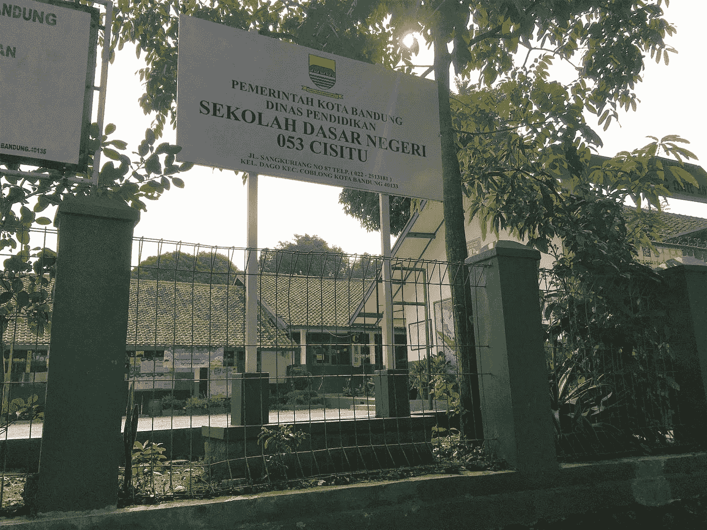
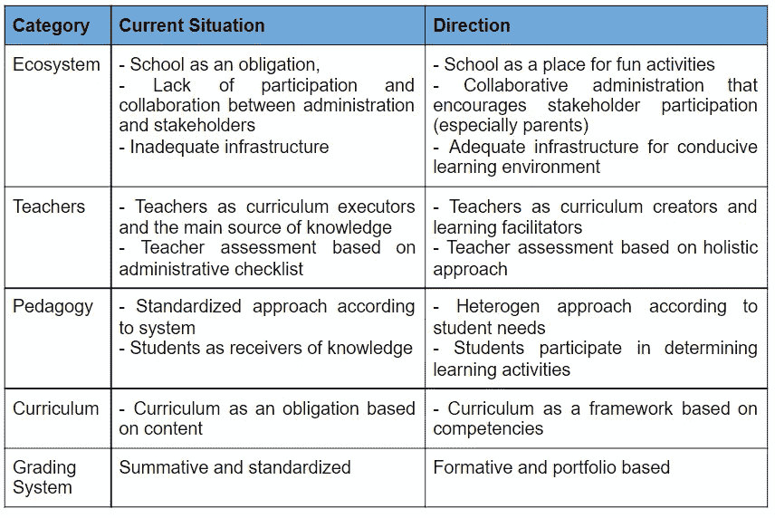
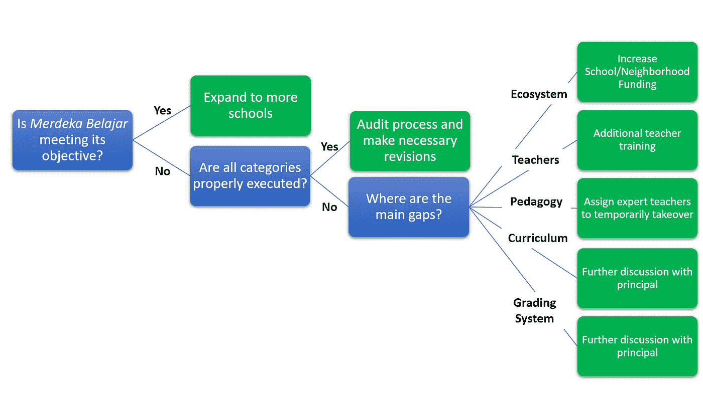
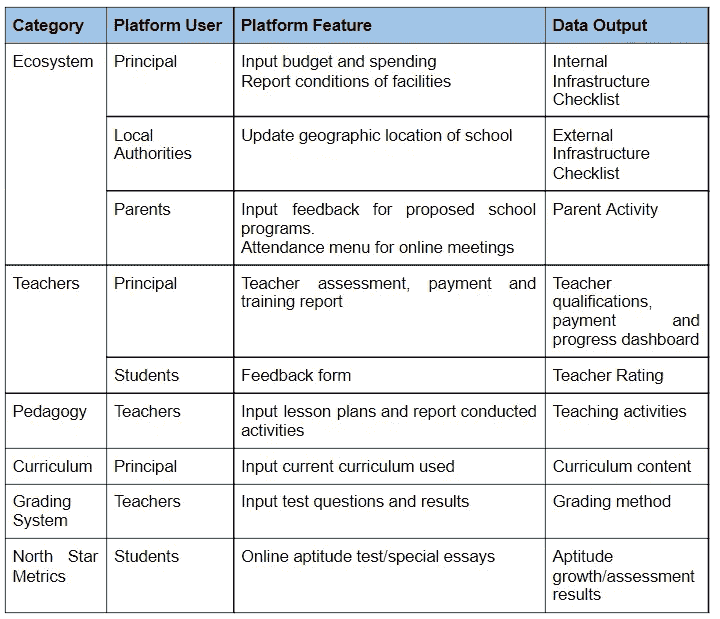
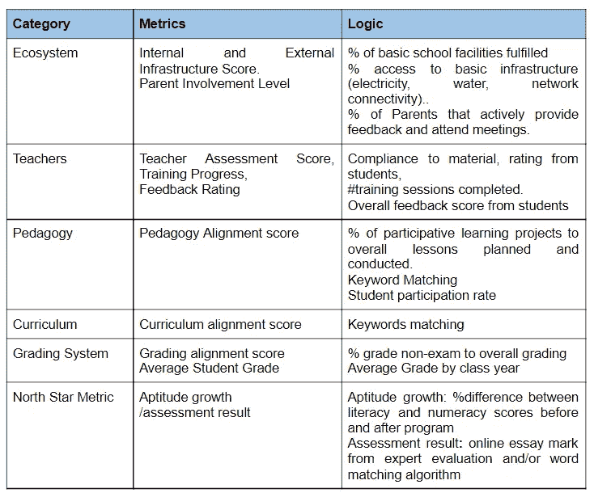
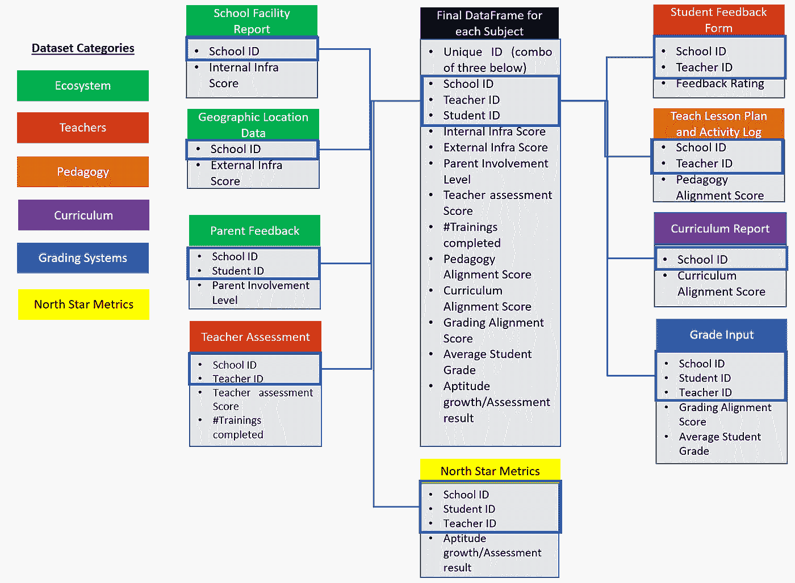
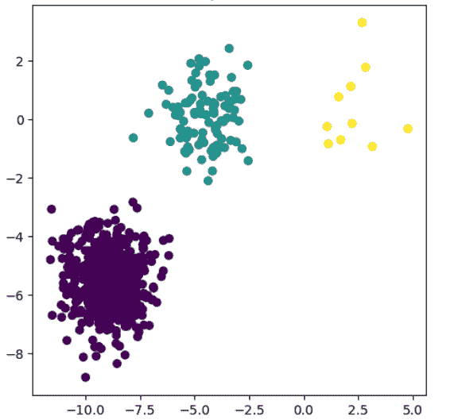
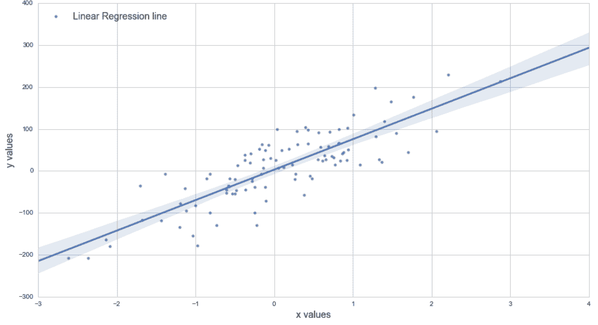

# 利用数据科学改善教育系统:印度尼西亚案例

> 原文：<https://towardsdatascience.com/using-data-science-for-improving-an-education-system-the-case-for-indonesia-5909782379b3?source=collection_archive---------27----------------------->

## [变更数据](https://towardsdatascience.com/tagged/data-for-change)

## 数据科学如何在实现印度尼西亚 2045 年教育路线图中发挥重要作用

我在印度尼西亚的小学建筑(来源:作者)

# 背景

学习是为了乐趣，所以学校应该是一个快乐的地方。这就是我在美国读小学时的感受。每节课都有一种令人兴奋的感觉，从做课堂项目的兴奋到看到我的老师装扮成她的科学家化身的幽默。我积极地和我的同学一起参加这些学习会议，我的老师是主持人，确保所有的声音都被听到。然而，当我搬到印度尼西亚时，我看到了如此显著的不同:学习主要是为了取得好成绩。课堂基本上是记忆课本和数学测验。主要目标是获得高分和班级前三名。老师被视为家长，而不是促进者。这改变了我对学校的看法，从一个快乐的地方变成了一种义务。然而，我现在很兴奋地看到变化即将到来。

2019 年，佐科·维多多总统任命科技独角兽 Go-Jek 的联合创始人 Nadiem Makarim 担任教育和文化部长，以改革这一体系。几个月后，他的团队发布了 2020 年至 2045 年的路线图，我觉得这非常令人兴奋。该路线图旨在通过一项名为 *Merdeka Belajar* (学习自由，这是下表所示的一系列系统性变化)的倡议，让年轻人更好地应对全球挑战。

来自 *Merdeka Belajar 倡议的指示(来源:作者的分析)*

这一举措将在大约 600 所学校进行试点，分为两组，100 所发达学校和 500 所发展中学校，根据准备情况区分不同的方法。试点小组的目标是到 2025 年底扩大到 10，000 所学校，并在未来十年内扩大到 30，000 所学校。学生应培养他们解决问题、认知和社交的技能，以体现以下特征:

*   高尚的
*   自主的
*   创造性的
*   合作的
*   批判思想家
*   全球意识

由于这似乎是一个伟大的方向，我的主要问题是如何确保正确的执行。这就是数据科学派上用场的地方。教育部确实在开发数字平台，以促进利益相关者的合作，提高学习效率。此外，这将是一个很好的工具，可以生成大量数据来收集关于该倡议实施情况的见解。要开始数据科学项目，我们需要首先定义项目章程，这将在下一节中讨论。

# 定义项目章程

在我们进入技术细节之前，我们必须首先确定目标、分析方法和利益相关者，这就是所谓的项目章程。就印度尼西亚的教育路线图而言，我们的目标是:

1.  默迪卡·贝拉加测试在培养学生解决问题、认知和社交技能方面是有效的。
2.  确定方向是否正确执行。
3.  找出执行中的主要差距。

第一个目标需要一个最能代表有效性的北极星指标。根据路线图的最低评估部分，最好的衡量标准是学生在读写和计算方面的能力增长。这可以通过对*默迪卡·贝拉加*倡议前后的直接比较来实现。根据目标实现情况(使用公平基准)或与非试点学校的显著差异，试点学校的结果可被视为良好。

另一个值得考虑的北极星指标是评估学生的认知、社会意识和现实生活中解决问题的能力。这种方法可以使用能够捕捉这些方面的在线文章来专注于特定的主题。历史可能是一个很好的题材。我上学的时候，历史主要是记忆关键的日期和事件。除非老师鼓励，我的老师就是这么做的，否则学生不需要在这门课中运用批判性思维和解决问题的技巧。在这种情况下，可以向控制组(非飞行员)和治疗组(飞行员)提供在线论文。问题应该是:“从印度尼西亚的殖民历史中吸取教训，政府需要什么样的政策和制度来保护自己免受外国的剥削？”一个可接受的答案将提供殖民时期的真实案例，找出根本原因，并提出一套政策来防止类似事件在未来重演。对关键词进行分类的高级机器学习算法可用于预评估，以及专家的最终评估。论文评估结果将有助于确定*的有效性。*

对于下一个目标，我们需要对两组学生进行深入分析。Merdeka Belajar 可以作为一个框架，根据北极星标准来决定将学生分为哪几类。通过提取正确的数据，我们可以看到哪些领域存在重大差距，需要立即采取行动。

该分析可以转化为决策树，如下所示，以确定利益相关者的行动项目:教师、校长、地方当局和教育部。

印度尼西亚教育利益相关者决策树(来源:作者的分析)

为了应用这个决策树，需要一个完整的数据框架，这将在下一节讨论。

# 获取数据

在进行分析之前，我们需要确定如何提取、转换数据并将其加载到适当的数据库中。教育部目前有一些在线平台，如用于虚拟学习的 Rumah Bela jar(Study House)，作为学校校长电子预算和商务平台的 Marketplace BOS，以及作为教师工作场所平台的 T2 Guru ber bagi(教师共享)。这些平台将有助于获取学校内部生态系统、教师表现、课程、教学法和评分系统的数据。地方当局也有平台更新学校的地理信息，以了解其当前的环境。父母也应该有一个平台，这样他们的参与程度就可以被追踪。将需要所有这些特征来提取关键成分以形成数据帧。请注意，非试点学校也需要这样做，以便进一步比较。

主要平台功能的主要数据输出(来源:作者的分析)

# 创建数据帧

数据框架中最重要的元素是拥有惟一的 ID:学校 ID、教师 ID 和学生 ID。这将使我们能够创建与各种数据集的关系，并形成一个整体数据源。下一步是将从平台中提取的数据转换成定义好的可量化指标。我想出了一些如下陈述:

我们模型的数据框架的关键列及其逻辑(来源:作者的分析)

在这些数据集被提取、转换并加载到数据仓库后，我们现在可以创建 DataFame 进行深入分析，如下图所示。请注意，数据应该处于相同的时间框架级别，在这种情况下，应该是每半年一次。

组装主要数据框架(来源:作者的分析)

# 应用数据科学模型

有了最终的数据框架，我们可以通过简单的分析得出关键的见解。我们可以创建简单的图表或重点表格，将北极星的结果与目标学校和/或非试点学校进行比较，并确定每个类别的主要差距。这种数据可视化将有助于为利益相关者提供总体分析。为了进行深入分析，我们可以使用数据科学来识别学生能力倾向增长或在线作文分数背后的关键因素。

我想到的第一个数据科学模型是 k-means 聚类。该算法将识别 k 个质心，然后基于相似性将学生聚类成 *k* 个组。一旦结果准备就绪，我们就可以看到哪些是最主要的集群，并根据最突出的指标进行描述。

k 均值聚类的例子(来源:[scikit-learn.org](https://scikit-learn.org/stable/auto_examples/cluster/plot_kmeans_assumptions.html#sphx-glr-auto-examples-cluster-plot-kmeans-assumptions-py))

在这种特殊情况下，我们可以从使用 k-means 算法对学生进行聚类开始，根据 6 个维度定义试点学校学生的共同特征。结果不仅会显示符合北极星标准的学生比例，还会显示他们的相似性。例如，数据可能会显示聚类 1 不仅在北极星中得分高，而且在生态系统和教育学方面也得分高，而聚类 2 则相反。下一步将是确定每个学校的主导集群，并根据决策树确定所需的支持类型。

使用线性回归模型，数据科学还可用于预测学生在应用改进措施后的北极星指标成绩。这个模型可以被设计来计算因果影响，北极星上升，从一套行动，以确定其有效性。它的工作方式是在没有干预的情况下，将实际结果与预测进行比较。这种预测将基于控制组，控制组可以是来自具有相似特征的非试点学校的学生。

线性回归的例子(来源:[stackoverflow.com](https://stackoverflow.com/questions/19068862/how-to-overplot-a-line-on-a-scatter-plot-in-python)

# 结束语

当前的技术使我们能够收集和处理无限量的数据，并投入使用，包括改善教育系统。拥有多个数字平台，我很高兴看到数据科学如何帮助印度尼西亚教育部确保 2045 年路线图的无缝执行。本文中讨论的模型和技术只是一些例子，还有很多方法可以探索和分析教育发展的进程。

然而，主要的挑战实际上是解释和交流数据见解，以便做出正确的决策。总会有这样的情况，利益相关者由于对当前行为的强烈信念而选择否认这样的发现。有些人可能还会通过走捷径来实现指标，比如在能力测试之前上强化课，或者报告不符合实际的课程。另一个挑战是公众对试点和非试点学校的潜在抗议，因为许多利益攸关方可能对成为实验对象有负面看法，反之亦然。

然而，有了像 Nadiem Makarim 这样一位强有力的杰出领导人，我坚信这一路线图能够实现，数据科学将在其中发挥关键作用。从个人经验来说，我衷心希望印尼的下一代；在每个省、市、镇、村；将学校视为一个有趣的学习场所，而不仅仅是一种义务。