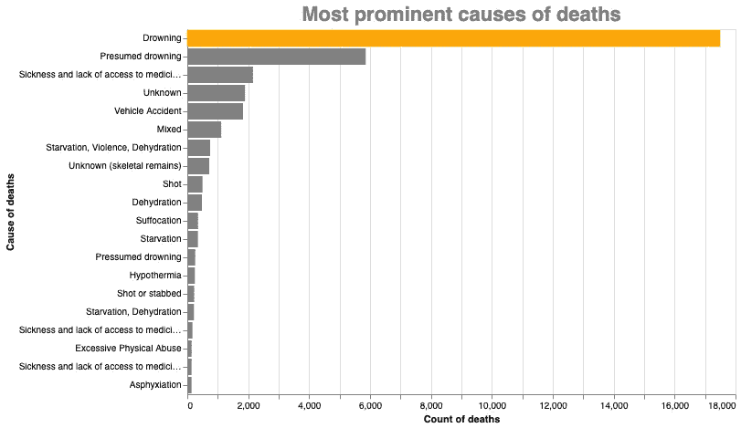

# 利用数据科学造福社会:移民及其致命路线

> 原文：<https://towardsdatascience.com/using-data-science-for-social-impact-migrants-and-their-fatal-routes-32c606f91fc4?source=collection_archive---------54----------------------->

## 移民及其最终旅程的数据探索

# 过去——火车旅行

2016 年一个晴朗的夏日，我在从萨格勒布到维也纳的火车上，穿梭于欧洲各国首都之间，欣赏着窗外的风景，喝着小杯咖啡，做着客户演示。在距萨格勒布约 50 英里的小城瓦拉日丁，有一个短暂的预定停留，数百人开始涌入火车；他们无处不在——坐在厕所附近的地板上，随身带着袋子，里面装着他们曾经在自己国家生活过的小样本。一个家庭(我猜想)也进入了我的车厢，我拿起了放在一个空座位上的夹克；已经在车厢里的女乘客和我互相看着对方，我们通过眼睛对情况进行了短暂的非语言交流，并不情愿地接受了事情的现状。

凯蒂·穆姆在 [Unsplash](https://unsplash.com/?utm_source=medium&utm_medium=referral) 上的照片

火车从车站开出后，这家人似乎有点舒服，清点了他们所有的财产。我开始和他们交谈，问他们要去哪里，他们用蹩脚的英语说，只要安全，他们就可以开始新的生活。我了解到他们来自叙利亚，夫妻俩都是一个村庄的教师，乘船到达希腊海岸，就在这时，一个小孩抱怨说饿了，打断了我们的谈话；这位母亲迅速在盒子里变出少量燕麦片，并从一个锡罐里拿出 baklava 形状的长面包，分成 8 块，分发给车厢里的每个人。我礼貌地拒绝了几次，但她很坚持，我勉强接受了。他们在火车上呆了一个小时左右，剩下的旅程多少有些沉默，只有断断续续的对话。我们互道再见，我告诉他们注意安全，并祝他们接下来的旅程好运。那次小小的互动就这样结束了。

我陷入沉思，决定写一篇关于这件事的博客，但我从来没有这样做。

# 现在——一项分析

几周前，我偶然发现了[失踪人口项目](https://missingmigrants.iom.int/)和相关数据，它刷新了我对火车事故的记忆。所以，我花了一些时间在数据中寻找一些令人大开眼界的事实。

> *这篇文章并不是展示数据科学的能力，所以我不会在文章中添加代码块，但是如果你想继续，那么 GitHub 上有* [*python 代码和数据。*](https://github.com/Prashantmdgl9/Missing-Migrants) *此外，我决定给主题赋予更多的单色观想。这是我的一点小小的尝试，来揭示一些人为了拯救自己的生命而不得不经历的致命而危险的旅程。*

失踪移民项目正试图捕捉尽可能多的关于移民的信息，这些信息来自无数的来源——其中一些是合法的，其余的可能出于各种目的而被少报。esp 有很多缺失的数据。对于…

1.  幸存者人数，85%失踪——人们可能在上岸后失踪，或出于政治原因，如安抚公民，没有太多的移民进入该国。
2.  幸存儿童人数，86%失踪——轻微贩卖。
3.  移民路线，55%失踪——由于政策，幸存者可能不告诉他们采取的确切路线，或者他们甚至不知道他们在哪里。

我处理了丢失的值，并更深入地查看了数据。数据时间线为 2014 年 1 月至 2021 年 2 月。

## 最主要的死因

溺水导致大多数死亡(图片由作者提供)

不出所料，溺水死亡人数最多。正如我所收集到的，数百人在几周的时间里乘着小船，任凭风的摆布，到达岸边。这些数字是根据找到的尸体数量估算的。你把浩瀚的大海和无情的暴风雨天气添加到图片中，然后进行计算。在我看来，x 轴上的数字更低。

## 致命的岁月

作者图片

不出所料，2016 年是移民危机新闻最多的一年。2020 年将会下降，但这可能是由于新冠肺炎或资源缺乏。

## 致命区域

地中海和北非仍然是温床(图片由作者提供)

地中海和北非的死亡人数最多，这可能是因为试图逃离该地区的人数太多。我从图表中选择的两个地区是美墨边境和东南亚。我确实知道中美洲的移民，但我从未把它等同于非洲/中东向欧洲移民的水平，尽管我知道洪都拉斯、危地马拉和尼加拉瓜的独裁政府以及委内瑞拉的失败经济。此外，孟加拉国移民到印度和缅甸的罗辛亚危机都是有据可查的新闻，但我没有与之相关的数字。

让我把死亡和幸存的人数加起来，看看移民的规模。

作者图片

看看数据告诉我们的在地中海前线所做的尝试的绝对规模。在大约 60，000 次尝试中，有 40，000 次成功，成功率超过 65%。

## 死亡原因

鉴于大多数路线是水上的，我预计大多数死亡是由于船只倾覆和船只失事。

地中海的数据高达 10k，我将其限制为 3k，这样人们也可以看到其他地区的条形高度(图片由作者提供)

美墨边境因枪击事件而闻名，但不知何故在这里却没有被捕捉到；上面写着死因是 ***【不明遗骨】*** 。大多数人步行几个月，他们的朋友和亲戚可能会在他们找到的任何地方埋葬他们，这就是骨骼遗骸出现在顶部的原因。

溺水仍然是大多数移民旅程的首要死因。

## 死亡时间表

对不起，坏的 x 轴，我知道它可以做得更干净，但我不记得如何。(图片由作者提供)

2016 年夏天的新闻充斥着欧洲移民危机，同样的情况也反映在上面的图表中，2016 年 5 月达到了顶峰。

出现峰值可能是因为两个原因:

*   2016 年 2 月，一条 125 英里长的*反移民*壕沟竣工，这条壕沟沿着突尼斯-利比亚边境延伸
*   北非的严重干旱([来源](https://www.reuters.com/article/ozatp-uk-africa-drought-morocco-idAFKCN0VD0Z1))

夏季月份预计会有更多的活动。

五月、六月、九月死亡人数最多(图片由作者提供)

## 迁徙旅程的温床

从上面的数据可以看出，我希望北非——靠近利比亚、中美洲和东南亚的地区——会被突出显示。

在地图上画出同样的东西，揭示了符合预期的真相。

作者图片

> 在过去 6 年的约 4 万例死亡中，我们没有信息对其中的约 2.8 万例进行分类。这表明，所有这些数字都是估计的，实际数字可能比我们面前的数字高得多。

作者图片

# 未来——未知的深渊还是希望？

尽管受到全世界的关注，这场危机仍然规模巨大。大规模的努力正在解决这个问题，但是到目前为止所取得的成绩是微不足道的。我知道这是一个多层面的危机，解决起来一点也不容易，但我们必须找到解决办法，否则人数将继续增加。

从火车上不知道家里发生了什么；我希望他们到达了他们想去的地方，开始了远离动荡的新生活。

# Kein mensch 是非法的(没有人是非法的)

没有人是非法的([来源](https://unsplash.com/@mbaumi?utm_source=medium&utm_medium=referral))