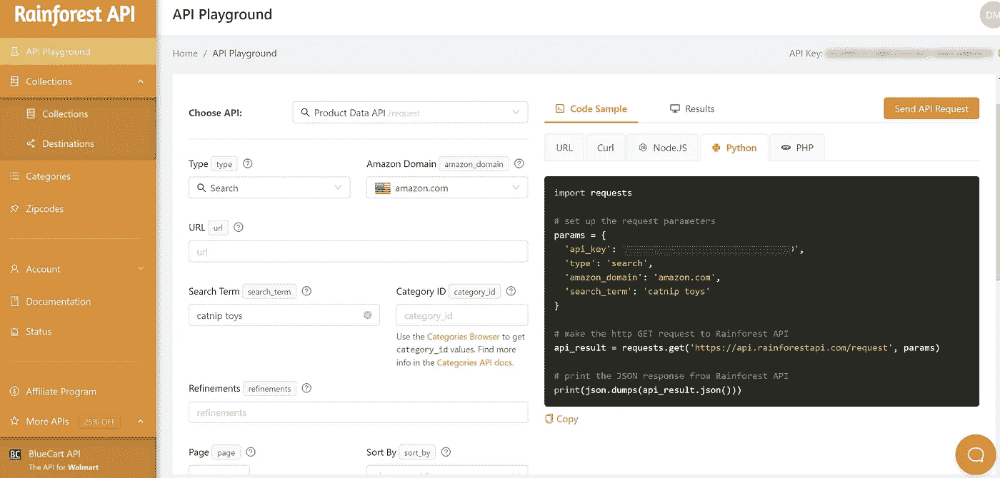
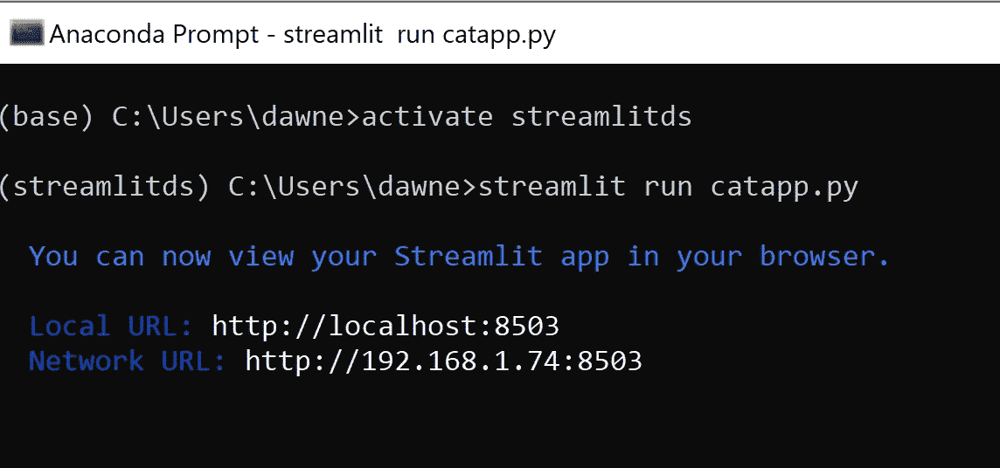
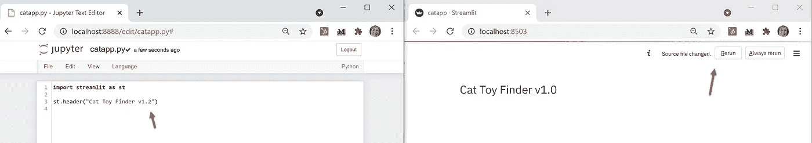
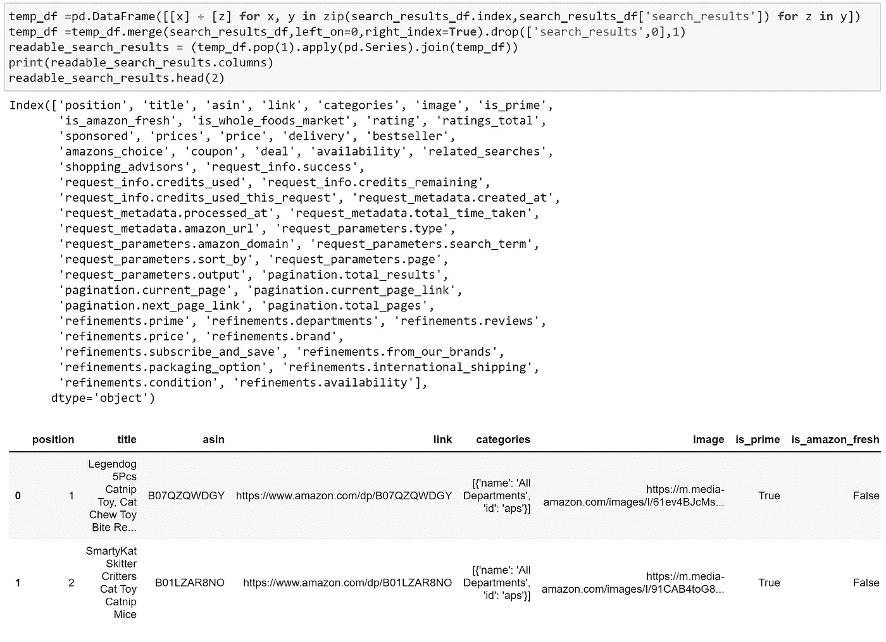
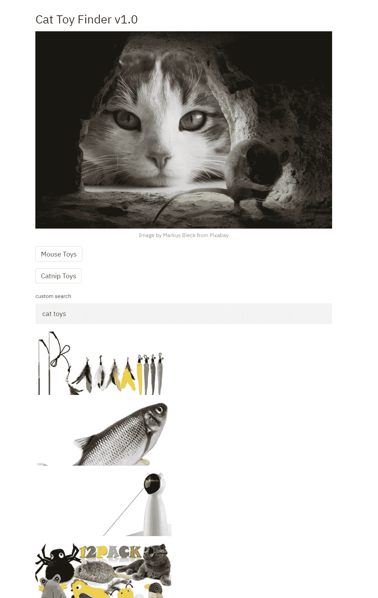
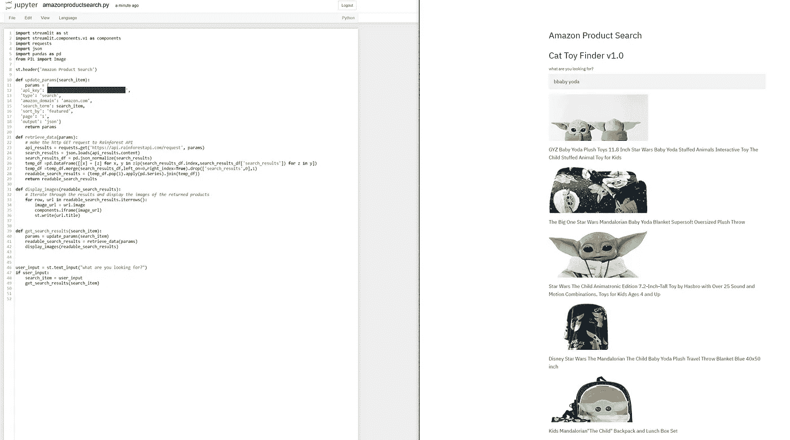
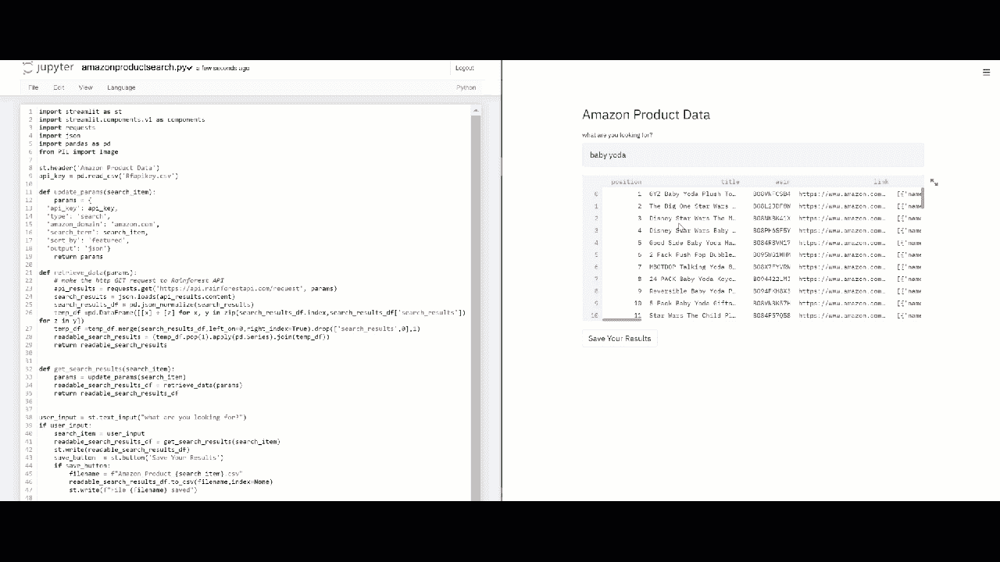

# 现在使用数据科学技能:让你的猫快乐。

> 原文：<https://towardsdatascience.com/using-data-science-skills-now-making-your-cat-happy-3b55429b00e4?source=collection_archive---------47----------------------->

## 使用 streamlit 和 API 在 30 分钟内创建一个亚马逊搜索 web 应用程序

图片由来自 [Pixabay](https://pixabay.com/?utm_source=link-attribution&utm_medium=referral&utm_campaign=image&utm_content=4068840) 的 [Markus Bieck](https://pixabay.com/users/moloch2511-4509192/?utm_source=link-attribution&utm_medium=referral&utm_campaign=image&utm_content=4068840) 提供

学习数据科学的组成部分既简单又有趣。无论是学习还是教授概念，关键之一就是要让它变得有趣。不是所有的概念都需要同时学习。简单点。让它变得有趣。

在数据科学中，你是否能挖掘出新的见解或训练出最好的模型可能并不重要。数据科学的一个重要方面是让您的用户或业务合作伙伴可以访问结果。一种方法是创建简单的交互式 web 应用程序来展示调查结果并与之交互。

在你开始学习高级技术之前，先试着做一些简单的事情。例如，你能以一种让你的猫感兴趣的方式呈现数据吗？

## **第一步:你的猫对什么感兴趣？**

关键是找到感兴趣的话题。在这种情况下，什么话题能让你的猫保持兴趣？比特币？大概不会。猫薄荷玩具？现在你有所发现了。

## **第二步:数据在哪里？(5 分钟)**

第一个想到的地方可能是亚马逊。这似乎是一个合理的初步猜测。

好的，你如何从亚马逊获得产品数据？你既不是合伙人也不是销售人员，所以你需要寻找外部 API。

一个快速的谷歌搜索就把我们带到了雨林 API。有 30 天的免费试用期(100 个电话)。免费很好。

 [## 雨林 API -产品数据 API

### 编辑描述

app.rainforestapi.com](https://app.rainforestapi.com/playground) 

同样好的是，有一个 API Playground 来帮助您生成可以在 web 应用程序中使用的 python 代码。注册并获得你的第一个代码片段不到五分钟。

使用 API Playground 创建代码片段—作者截图

## 3.构建一个简单的 Web 应用程序(5 分钟)

我强烈推荐 streamlit，它是一个快速简单的 web 应用程序。我已经在几个数据科学应用中使用过它，并且很满意。以后如果需要规模化，可以考虑 dash。但是现在，让我们看看 streamlit。

 [## Streamlit *构建和共享数据应用的最快方式

### 用我们神奇简单的 API，用几行代码构建一个应用程序。然后看到它随着你的迭代自动更新…

streamlit.io](https://streamlit.io/) 

streamlit 的美妙之处在于您需要安装软件包，创建一个简单的。py 脚本，并运行应用程序。嘣，你跑了。你可以在一个窗口中更新代码，当你点击重新运行时，应用程序会自动选择更改。太棒了！

就我而言，我创造了一个新的环境。激活新环境后，我进行了 pip 安装 streamlit。我运行了一个简单的命令，然后我启动并运行了下面这个世界上最简单的脚本。说真的，就是这么简单。

运行 streamlit 应用程序—作者截图

进行代码更改并保存；Streamlit 提示您重新运行以获取更改—作者截图

## 4.剪切并粘贴我的雨林 API 代码(1 分钟)

我的下一步是将雨林 API 代码剪切并粘贴到我的脚本中，看看我在处理什么。在 streamlit 中使用 st.write(xx)而不是 print(xx)。

剪切、粘贴、重新运行—作者截图

## 5.重复直到你满意为止(15 分钟到 15 年)

因为我更喜欢使用数据帧而不是 JSON，所以我修改了 JSON 响应来创建更好的数据帧。这是它在幕后的样子。

将 JSON 转换成可读的数据帧——作者截图

我添加了两个按钮来选择两个特定的搜索。另一种选择是使用文本输入进行搜索。您可以很容易地看到如何将这个框架应用于 Amazon 搜索工具。

作者截图

下面是您可以运行的最终代码——当然是使用您自己的 API 密钥。

## 后续步骤和结论

进行调整和创建新的网络应用程序很简单。只要对我们的 cat 应用程序做一些调整，我们就有了一个通用的亚马逊产品搜索 UI。

作者截图

仅仅 5 分钟的编码就让我在一个交互式数据框架中显示原始数据，并将结果保存到一个. csv 文件中。您可以很容易地看到如何从一个有趣的小应用程序发展成为一个有用的数据科学工具！

作者提供的交互式数据帧的 gif

感谢您的阅读，我希望您能在创建自己的 web 应用程序时获得一些乐趣！通过添加新功能(图表、图形)慢慢增加你的技能，在你知道之前，你会用你的 viz 技能给每个人留下深刻印象。