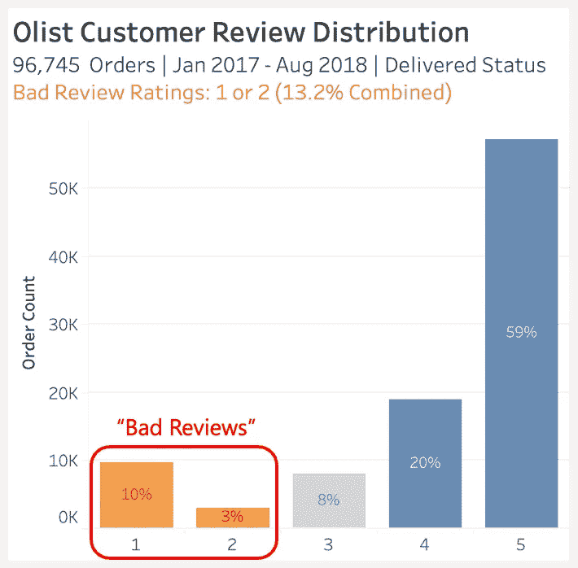
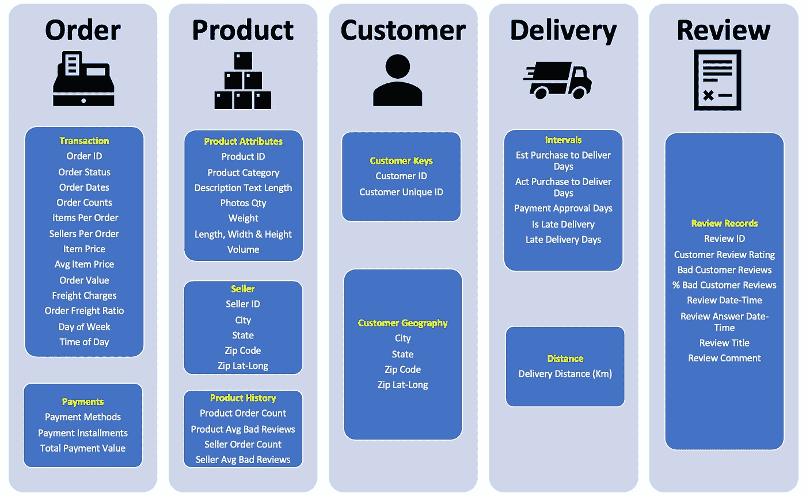
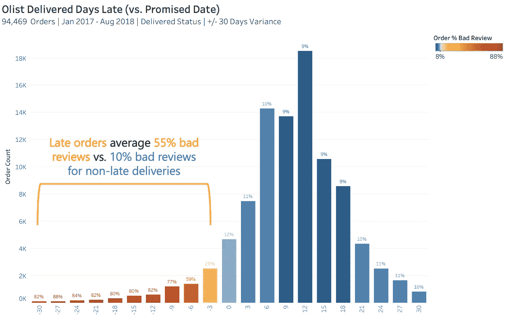
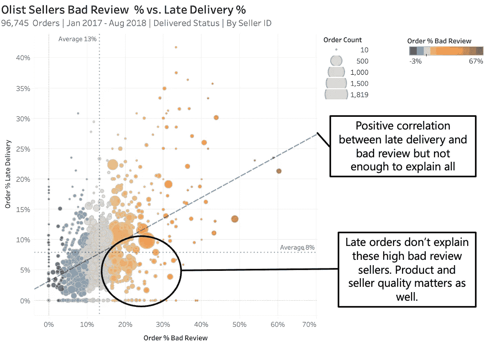
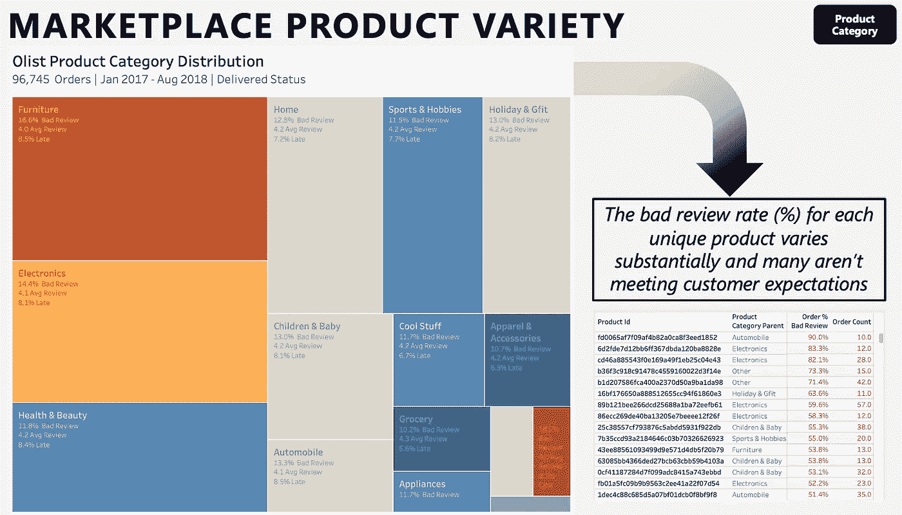
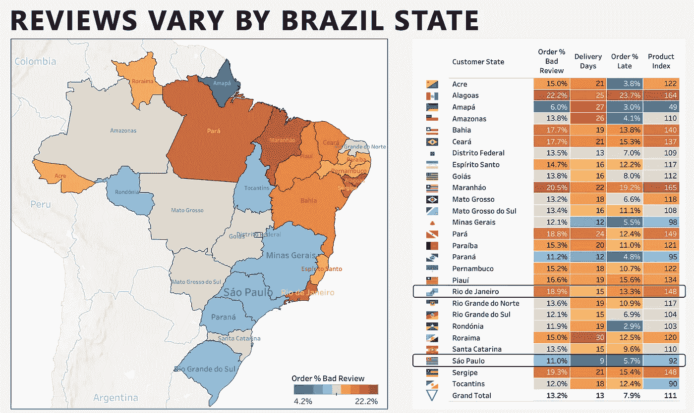
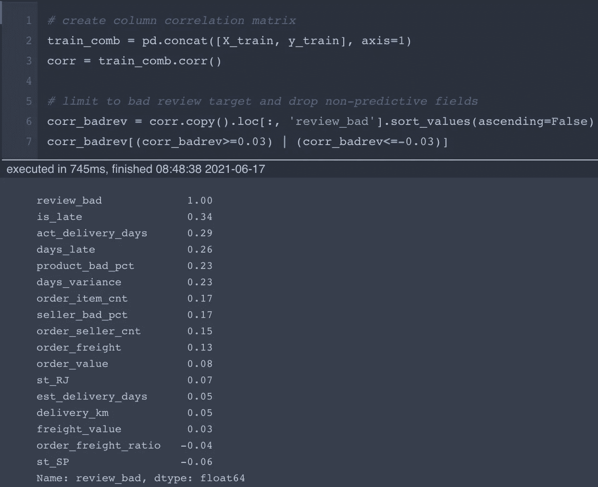
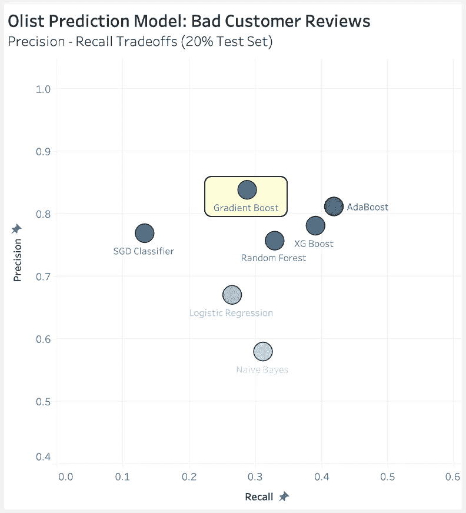
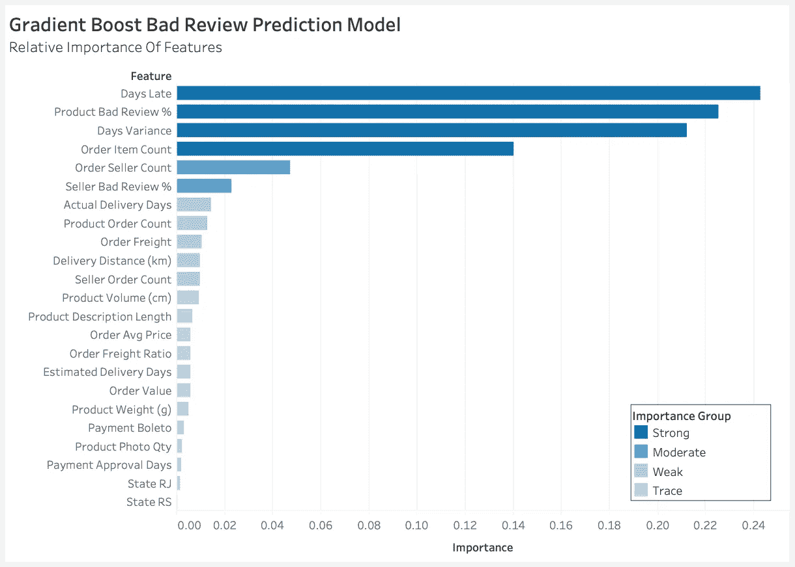

# 使用数据科学预测负面客户评论

> 原文：<https://towardsdatascience.com/using-data-science-to-predict-negative-customer-reviews-2abbdfbf3d82?source=collection_archive---------21----------------------->

## 提高客户满意度，同时优化您的业务


[蒂尔尼](https://stock.adobe.com/contributor/202206661/tierney?load_type=author&prev_url=detail)使用[土坯股票](https://stock.adobe.com/images/one-star-rating-with-young-woman-using-a-laptop-computer/226220901?prev_url=detail)许可证

**如果你能自信地预测到一个顾客会留下一个负面评价，你的企业会有什么不同的做法？**

*   主动干预以改善客户体验，并希望转移他们留下不好的公众评论分数？
*   从预测模型中的重要功能中学习，以解决客户体验不佳的根本原因？

在仔细考虑了成本效益权衡和公司实施纠正措施的能力后，答案是“是”。

> “负面评论说服了 94%的消费者避开一个商家”——评论追踪者

# 商业问题——糟糕的顾客评价

巴西面向小企业的领先电子商务市场是 Olist。Olist Store 使巴西各地的商家能够使用 Olist 物流合作伙伴向客户销售和运送产品。交付后，客户会收到一份电子邮件满意度调查，使用 1(不满意)到 5(满意)的评分标准。

Olist 友好地发布了 2017 年至 2018 年超过 [10 万笔交易的匿名客户评论和订单详情。这个流行的数据集已经被数据科学家下载了超过 76K 次。](https://www.kaggle.com/olistbr/brazilian-ecommerce/home)



按作者分类的 Tableau 图表

让我们为“坏顾客评论”建立一个预测模型，定义为在 5 分制中得到 1 分或 2 分。在我们已交付订单的大样本中，13.2%的评论得分为差(负面)。

我们将求解一个二元目标变量:review_bad = 1。

我们的目标是找到一个受监督的机器学习分类模型，它可以以最佳精度**预测糟糕的客户评论**。

高精度表明，当我们的模型预测一个差评时，它通常是正确的。这最大限度地降低了公司对预测的负面客户评论采取不正确行动的风险。

# 将数据转换为要素

Olist 提供了来自 8 个关系表的数据，它们具有很好的引用完整性。下图显示了一个熟悉的数据模型，它具有惟一的订单 id，便于连接多个商品和每个订单的付款。主数据表包括产品、客户和卖家。客户评论链接到一个整体订单，该订单可以包括多个产品或卖家。


由 Olist 通过 [Kaggle](https://www.kaggle.com/olistbr/brazilian-ecommerce/home) 拍摄的图像

8 个表中的原始数据包括 52 个不同的列。我开发的预测功能可以按照这些领域进行分组。



作者图片

为了简洁起见，我没有包括这个项目中使用的全部代码。详情请参考我在 [**GitHub**](https://github.com/cutterback/p05-olist-customer-rating-prediction/blob/2319f1352e234e22d311f77664fcb49500fa7bf2/Olist_Customer_Rating_Model.ipynb) **上的 Jupyter 笔记本。**

用于准备预测特征的数据转换:

*   过滤掉 2016 年的记录和未交付的订单(不到 1%)
*   只填写了少量存在空值的记录
*   如图所示，订单、付款、产品和卖家的综合指标
*   使用订单的生命周期日期计算的天数间隔指标
*   使用哈弗森函数中的中值纬度和经度，估计卖方和客户邮政编码之间的交付距离(公里)
*   为支付方式、客户状态、星期几和一天中的时段(上午、下午等)创建了一次性编码变量(标志)。)
*   清除任何订单的多个评论，仅保留最终评级；这影响了不到 1%的订单

# 视觉洞察力

在数据分析过程中，我通常将最终合并的数据帧从 Jupyter notebook 导出到 Tableau，以便更快地进行可视化检查。让我们来看看最有趣的观点。



按作者分类的 Tableau 图表

**延迟交付天数:** Olist 在订购时向客户提供预计交付日期，平均为 24 个预期处理/运输天数。如上所示，实际交付性能非常重要。对于延迟交付的订单(与预计日期的负差异)，客户差评平均为 55%，而非延迟交付的订单为 10%。迟到天数越大，差评比例越高。



按作者分类的 Tableau 图表

**卖家-产品质量:**散点图描绘了延迟交付和差评之间的线性趋势，每个观察值都是卖家在所有客户中的平均表现。延迟订单并不能解释整个故事，因为许多卖家的交付绩效高于平均水平(圈出)，但差评率更高。



按作者分类的 Tableau 图表

**产品种类:**使用树形图，我们可以看到不同产品类别差评率的变化。深入到一些单个产品，我们可以看到一些差评超过 50%的“狗”，它们显然没有达到客户的期望。产品的平均差评率是最终模型的一个重要特征。



按作者分类的 Tableau 图表

**地理分布:**巴西有 26 个州和 1 个联邦区。我们可以肯定地看到各州之间差评的差异。

*   圣保罗——在我们的数据中，该州占订单的 42%,在每一项指标上都表现出色。
*   里约热内卢——这个邻近的州占订单的 13%,在每项指标上都明显表现不佳。

这两个州都是巴西最大的两个城市之一的所在地，人口密度高，彼此相对接近。里约热内卢应该成为更深入挖掘交付绩效和产品组合的目标。为什么平均而言，客户会订购差评指数相对较高的产品？*(148 的产品指数意味着平均购买的产品差评率比巴西整体平均产品差 48%)。*

# **相关性分析**

在 Python 中对我们的 review_bad 目标变量运行 Pearson 相关性，在很大程度上证实了我们在之前的图中看到的关联。



作者图片

当查看单个特征相关性时，我们看到所有形式的交付间隔(is_late、act_delivery_days、days_late 和 days_variance)都呈中度正相关。

我们还发现，产品和卖家总体差评率的正相关性分别为 0.23 和 0.17。

最后，我们看到了对订单/卖家商品数量、运费/订单价值和交付距离的一些其他次要影响。在 27 个州中，相关性大于 0.03 的仅有两个州是里约热内卢(+0.07)和圣保罗(-0.06)，这支持了上面的州地图。

# **预测客户差评**

七个监督学习分类模型在“精度”指标上进行优化，但寻找合理的“召回”(我们的模型正确预测的差评比例)。对于每个模型，我对 80%的训练数据进行网格搜索，并进行分层的 5 重交叉验证，以探索各种参数组合。



按作者分类的 Tableau 图表

比较的模型包括随机森林、AdaBoost、梯度增强、XG 增强、逻辑回归、SGD 分类器和高斯朴素贝叶斯。

相关特征使用 StandardScaler 进行缩放，因此我将一致的训练特征作为每个模型的输入(即使大多数模型不需要缩放)。

然后，每个分类器的最终“最佳模型”在之前未见过的 20%比例测试数据上运行，比较模型结果如上所示。

我推荐了具有以下性能的梯度增强模型:准确率 84%，召回率 29%，准确度 88%，AUC 64%。最佳估计值的参数为:

```
'learning_rate': 0.01, 'max_depth': 8, 'min_samples_leaf': 25, 'n_estimators': 100
```

使用这种具有标准 0.50 概率决策阈值的模型导致预测大约 1/3 的差评(召回)，而仅在 6 次中有 1 次是错误的(精确度、假阳性)。这将是采取行动的一个开始，我们希望继续利用经验和更广泛的数据来完善这个模型。



按作者分类的 Tableau 图表

梯度推进模型中最重要的特性包括:

*   Strong:延迟交付天数、天数差异、产品差评百分比、订单项目数
*   中等:订单上的卖家数量，卖家差评百分比
*   弱:实际交付天数、产品订单总数、卖方订单总数、订单运费、交付距离(公里)

总之，**差评对延迟发货、产品/卖家历史、多个卖家/产品的配合最敏感。** Olist 应努力解决交付绩效不佳的根本原因。Olist 也可以尝试一个随机的成本效益试验，看看主动沟通、承认或客户让步是否可以防止差评被发布。

> 最终，负面评价是一份礼物。这表明你的顾客非常关心你的品牌，愿意花时间给你留下反馈。如果处理得当，即使是最糟糕的评论也可以变成积极的经历。— [艾米丽·希斯利普](https://www.uschamber.com/co/grow/customers/handling-negative-customer-reviews)

# 数据质量观察

对数据质量的一些观察和本项目固有的假设。

*   样本与总体:100，000 个订单的样本，每个订单都有一个相关的评论评级，对于构建模型来说很好，但不能代表总体。鉴于[只有 5-10%的客户写评论](https://websitebuilder.org/blog/online-review-statistics/)，而且不是每次都写，我们需要做一些工作来翻译我们的模型，以针对全部 Olist 订单进行归纳。
*   需要额外的功能:虽然 84%的准确率预测 29%的差评是一个开始，我们需要做得更好。我建议 Olist 为进一步的功能开发获取额外的数据:订单、客户退货、客户网络日志、客户服务互动、客户角色、人口统计、品牌/产品/卖家社会情绪的完整数据库，以及来自卖家的数据。
*   营销漏斗:Olist 还在 Kaggle 上发布了一个[营销漏斗数据集，其中包含来自卖方资格认证流程的 2 个上游表格。当加入订单模式时，该数据不可用，因为它仅包含 2017-2018 年间注册的卖家，代表了这一时期实际订单的一小部分(大多数是由已建立的卖家完成的)。](https://www.kaggle.com/olistbr/marketing-funnel-olist)

<https://chuckutterback.medium.com/membership> 