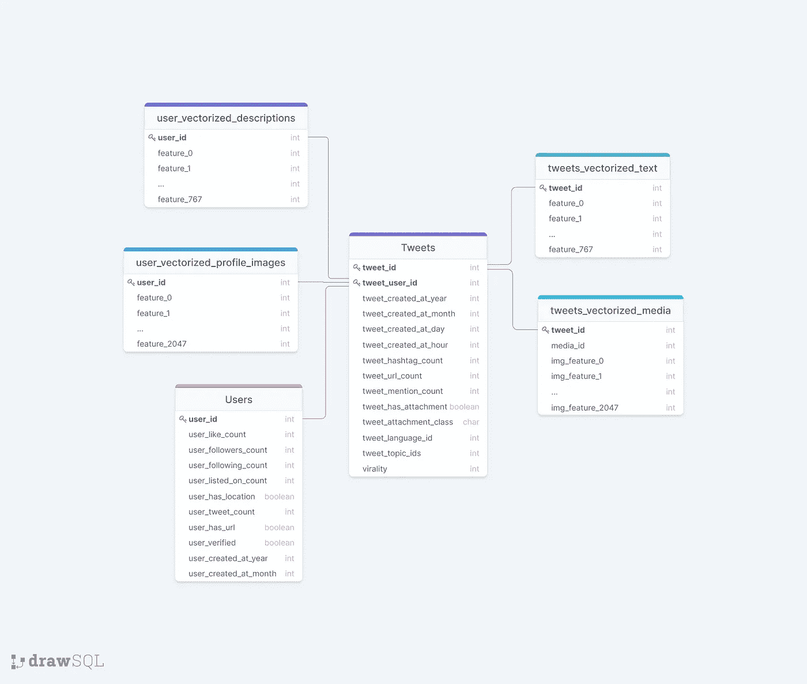

# 使用数据科学来预测病毒推文

> 原文：<https://towardsdatascience.com/using-data-science-to-predict-viral-tweets-615b0acc2e1e?source=collection_archive---------6----------------------->

## 数据科学

## 你能使用机器学习来预测哪些推文会传播开来吗？


亚历山大·沙托夫在 [Unsplash](https://unsplash.com?utm_source=medium&utm_medium=referral) 上的照片

在之前的一篇文章中，我写道[为过去的数据科学竞赛构建了一个 XGBoost 模型来预测视频流行度](https://medium.com/bitgrit-data-science-publication/building-an-xgboost-model-to-predict-video-popularity-ce4a39a356d7)。它涵盖了从加载数据和库到构建模型本身的所有内容。

[Bitgrit](https://bitgrit.net/) 最近发布了一个新的竞赛，奖金为 **$3000** 💵待售商品:

⭐ [**病毒推文预测挑战**](https://bitgrit.net/competition/12) ⭐

如果你想知道为什么推文会像病毒一样传播，这是你利用数据科学找到答案的绝佳机会！

比赛将于**2021 年 7 月 6 日**结束，因此[注册](https://bitgrit.net/competition/12)以获取数据，并跟随本文开始吧！

如果你不能通过付费墙，请点击这个[链接](/using-data-science-to-predict-viral-tweets-615b0acc2e1e?sk=5a42c1fb367c0aead5bc613d3a09089e)阅读这个故事。

## 目标

开发一个机器学习模型，根据推文内容、推文附带的媒体和发布日期/时间等属性，预测每条推文的**病毒级别**。

## 数据是什么样的？

```
📂 **Tweets**
 ├──test_tweets_vectorized_media.csv
 ├──test_tweets_vectorized_text.csv
 ├──test_tweets.csv
 ├──train_tweets_vectorized_media.csv
 ├──train_tweets_vectorized_text.csv
 └──train_tweets.csv
📂 **Users**
 ├──user_vectorized_descriptions.csv
 ├──user_vectorized_profile_images.csv
 └──users.csv
```

tweets 文件夹包含我们的测试和训练数据，主要特征都在`tweets.csv`中，其中有日期、标签数量、是否有附件以及我们的目标变量——病毒率等信息。矢量化 csv 文件是推文文本和媒体(视频或图像)的矢量化格式

“用户”文件夹包含有关用户的关注者和关注计数、推文计数、他们是否被验证等信息。他们的个人简历和图像也矢量化成单独的 csv 文件。

**数据之间的关系**

用户数据通过`user_id`关联，而推文数据通过`tweet_id`连接。

下面是这种关系的可视化。



[来源](https://drawsql.app/benedict/diagrams/bitgrit-viral-tweets-dataset)(用 [drawsql](https://drawsql.app/) 创建)

关于[竞赛](https://bitgrit.net/competition/12)指南部分数据的更多信息。

现在你有了目标和一些给你的数据信息，是时候开始做数据科学任务了，以实现预测推文病毒式传播的目标。

**所有的代码都可以在**[**Google collab**](https://colab.research.google.com/drive/1iVUDjnMHTcC0Y1VavUdpPXfBAnhgyHiF?usp=sharing)**或者** [**上找到威风凛凛的**](https://jovian.ai/benthecoder/viraltweets) 。

注意，出于轻量级的目的，并非所有的代码都包含在本文中，所以请参考笔记本以获得完整的代码。

# 加载库

与所有数据科学任务一样，您首先要为自己配备完成各种任务所需的库。

# 加载数据

你可以在 2021 年 7 月 6 日之前在这里报名参赛[获取数据。](https://bitgrit.net/competition/12)

打印每个数据的形状:

我们可以看出，我们的数据集中总共有 52 个用户有多条推文。请注意，矢量化媒体的行数比推文少，这意味着并非所有推文都有媒体，还要记住，一些推文有**多个**媒体。这将在合并数据时导致一些问题，但我们稍后会担心这个问题。

还要注意，矢量化的媒体/图像都有相同数量的列/特征——2048，而矢量化的文本都有 769 个特征。

现在让我们继续进行一些探索性的数据分析，以便更好地理解我们的数据。

# 探索性数据分析

EDA 对于发现数据趋势以及确定需要哪些转换和预处理来为建模准备数据非常重要。

## 数据是什么样子的

看数据，看起来挺标准的。我们有两个主键、特征和目标变量——病毒率。

但是请注意`tweet_topic_ids`是如何包含数组的？稍后，我们将不得不做一些预处理来处理这个问题。

我们的矢量化数据看起来很标准，其中每一列代表数字特征空间中的一个坐标。

现在让我们分析一下我们的 tweets 数据中的特征。

## 推特数据特征分析

我们的推文中总共有 11 个特征。

首先，我们来看看病毒式传播。

我们看到，平均来说，病毒水平为 2，大部分是 1。

查看时间特征，我们看到来自我们数据的推文在 2020 年有最高的计数，大多数推文是在 12 月和第 27 天创建的。他们也大多在晚上发推文(17 小时)。

继续讨论标签、网址和提及次数。大多数推文没有标签，只有一个网址，也没有提及。

绘制附件类和语言 id，我们看到 A 类是最普遍的，而 b 类很少。至于语言 id，很大一部分是 0，我们可以假设是英语。

大多数推文也有媒体附件。

## 特征的相关性

现在让我们看看我们的特征是如何相关的，或者换句话说，我们的特征和病毒之间的线性关系有多强。

形象化的一个好方法是使用热图。

从我们的热图中，我们可以看出，我们的特征与病毒传播无关，但一些特征确实彼此相关。

以数值表示相关性，我们看到相关性相当低，其中一些是负的。

尽管如此，这并不意味着我们的特征是无用的，因为它们仍然具有预测能力，所有这一切意味着它们不能“线性地”预测病毒水平。

现在让我们看看我们的用户数据。

## 用户数据分析

我们在用户中总共有 10 个功能。

可视化计数数据，我们可以观察到，喜欢计数大多在 0 到 5000 个喜欢之间，离群值在 300k 左右。

对于`users_followers_count`来说，很大一部分用户在 0 到 100k 的范围内，部分用户的关注者高达 160 万。

对于`users_following_count`来说，大部分也在 0 到 100k 的范围内，但也有一小部分超过 1m。

对于`users_listed_on_count`来说，他们中的大多数在 0 到 5000 之间，一些用户被列在多达 40 万的名单上。

我们的用户大多拥有 50 万左右的 tweet 数，大多数账户都是在 2011 年和 8 月份创建的。

转到二进制数据，我们的大多数用户在他们的帐户上列出了位置，他们在他们的简历中有一个 URL，并且他们中的大多数没有被验证。

现在我们已经对数据做了一些 EDA，让我们开始为建模做准备。

# 数据预处理

这些是我们将在这个特定示例中执行的几个预处理任务。**注意**肯定有各种各样的方法来实现它，更不用说还有更复杂的预处理和特征工程可以做，所以只把下面的方法作为一个例子，**而不是**一个客观的方法。

*   处理缺失值
*   [一个热编码](https://datagy.io/pandas-get-dummies/#:~:text=One%2Dhot%20encoding%20turns%20your,value%20matches%20the%20column%20header.)
*   使用[套索回归](/feature-selection-using-regularisation-a3678b71e499)进行特征选择
*   匹配训练数据和测试数据之间的列数(以便训练的模型处理测试数据)
*   将所有要素合并到一个最终数据框中，用于训练和测试/公共数据。

## 处理缺失数据

使用我编写的助手函数(笔记本中的代码)，我们将检查行中缺失数据的数量以及用户和推文数据的百分比

在主题 id 列中有一些丢失的数据，所以我们将处理它。我们还将使用热图来可视化缺失的数据，因为这对于搜索特定模式非常有用。我们丢失的数据似乎很分散。

为了处理`na`值，我们将用一个 0 — `[‘0’]`的数组填充它们，以表示该特定 tweet 没有主题 id。我把它放在一个数组中的原因是，以后当我们进行单热编码时，它可以表示为一个零的 topic_id。(同样，这只是一种方法，还有其他方法可以解决这个问题)

> *数据清理是一项必备技能。如果您想提高您的数据清理技能，请查看我们的* [*使用 Python*](https://medium.com/bitgrit-data-science-publication/data-cleaning-with-python-f6bc3da64e45) *进行数据清理的文章。*

我还注意到 hashtag、URL 和 reference 的计数都是浮点数据类型。然而，它们根本没有小数位，它们有唯一的值，可以被认为是分类的，所以我把它们转换成整数，如下所示。

## tweets 功能上的一个热门编码

对于 topic_ids，数据是一个数组，所以非常棘手。你能做的是将数组分解成单个的值，然后将它们变成虚拟的。

对于年、月、附件等其他列，使用 pandas 库中的`get_dummies()`进行编码非常容易。

至于小时数据，由于我们必须考虑时间数据中的时间特征，我们必须进行[循环编码](https://ianlondon.github.io/blog/encoding-cyclical-features-24hour-time/)。

在我们对我们的特性进行编码后，我们可以删除旧的特性，然后加入新的编码特性。

现在，我们的火车推文数据有多达 151 列！

## 一个关于用户特征的热编码

我们还将对我们的用户特性进行一次热编码，主要是年、月和用户验证列。就像我们对火车推特数据所做的那样。

## 推文数据的特征选择

矢量化数据有大量的特征，如果我们能够“将小麦从谷壳中分离出来”，或者选择可以帮助我们预测病毒传播的最佳特征，那将是最好的。这可以帮助我们节省尺寸，加快我们的模型训练时间。

我们将从我们的`train_tweets_vectorized_media`数据开始。由于不是所有的推文都有媒体，我们必须将每条推文的病毒式传播添加到有媒体的推文中。这可以通过在 tweet_id 上进行右连接来实现。这样，每条推文的所有病毒式传播都可以与推文图像特征相匹配。

因为我们不希望 train_tweets 中除了病毒式传播之外的列与我们的矢量化数据合并，所以我们可以使用`.difference`函数只获得病毒式传播。

然后，我们可以利用这个数据集，开始进行特征选择。

我们的目标是病毒式的，特性是包含“img_”的列

使用集合库，我们可以计算模型选择的特性的数量。在这种情况下，只有两个特性被认为是不“有价值”的，所以它不是那么有用。

尽管如此，通过我们模型中的索引，我们可以将它们与我们的媒体和 tweet id 连接起来，形成比以前少了两列的最终`train_tweets_media`数据。

对于`train_tweets_vectorized_text`，和上面的情况一样。我们必须做一个正确的连接来匹配每条推文的病毒式传播，然后进行特征选择。

## 用户数据的特征选择

为了对用户数据进行特征选择，我们需要为每个用户添加病毒级别。但由于每个用户都有多个推文，一种方法是获得他们的病毒率的中位数，然后执行右连接，以匹配每个用户的病毒率中位数。然后，使用这个新的数据框，我们可以执行特征选择。

使用熊猫的`groupby`和`agg`，我们可以找到中间值，然后合并它们。

## 将一切融合在一起

现在是时候将所有内容合并到最终的列车数据帧中了。

我们面临两个主要问题:

1.  不是所有的推文都有媒体，有些推文有多个媒体。我们如何将它与我们的火车推文数据框架结合起来？
2.  用户矢量化数据和我们的 tweets 矢量化文本数据具有相似的列名，这将在合并时导致问题(pandas 将向列追加 _x 和 _y)

一种方法是根据 tweet id 获取特征的平均值，以处理第一个问题。我们可以使用`groupby`函数来实现。

那么要解决特征列名称重叠的问题，我们可以使用重命名功能。

现在我们可以合并所有的数据框。

你可以有不同的方法来处理这个问题，但我的方法基本上是首先合并推文数据。因为不是所有的 tweets 都有媒体，所以会有数据丢失，所以用零填充这些 NA 值。

下一步是合并用户数据。之后，我将我的 tweets 数据加入到`train_tweets`中，然后是用户数据。

我们数据框的最终形状是 2946 列。

我们在训练中所做的预处理必须在测试数据上重复。如果不这样做，我们使用训练数据训练的模型将无法用于我们的测试数据。(这里没有显示测试数据预处理的代码)

## 为训练和测试匹配列数

在对我们的测试数据应用相同的预处理之后，我们面临另一个问题。

训练和测试的列数不匹配，这是因为它们中的任何一个缺少某些功能。

为了解决这个问题，我们可以在列上使用 set 函数，然后将它们相减，找出它们之间的差异。然后，我们可以将那些缺失的列添加到数据中，并将它们设置为零。

我们还发现我们的火车在测试中缺少列，但幸运的是没有。

# 构建轻量级 GBM 模型

与 [XGBoost](https://xgboost.readthedocs.io/en/latest/) 相比，使用 [LightGBM](https://lightgbm.readthedocs.io/en/latest/) 有几个[好处](/lightgbm-vs-xgboost-which-algorithm-win-the-race-1ff7dd4917d)，主要是更快的训练速度和更高的效率，以及更准确和使用更少的内存。

我们将建立一个非常简单的基础模型，没有任何参数调整。如果您想更多地尝试调整模型，我在下面链接了一些资源。

## 列车测试分离

列`virality`、`tweet_user_id`、`tweet_id`和`user_id`不是特性，所以我们可以删除它们。然后，我们将病毒率设为我们的目标变量。

然后，我们将数据分成 70%的训练数据和 30%的测试数据。

## 使数据符合模型

创建基本 LGBM 分类器模型。

安装`x_train`和`y_train`，我们可以训练我们的基本轻型 GBM 模型。

然后利用它，我们可以在测试数据集上预测它。

我们可以使用`sklearn.metrics`中的`accuracy_score`函数轻松地打印出我们模型的准确度分数

我们的基本模型达到了 66.45%的准确率！

我们还可以绘制出模型中重要的特征。

这里我们看到`user_follower_count`在预测病毒传播中是最重要的，这很有意义，因为你的粉丝越多，你的推文就越有影响力。

我们还在前 10 个特性中看到相当多的`user_vectorized_profile_images`特性，还有`user_has_location`和`user_like_count`

这种准确性仍然可以提高，但我们将在这里结束，并使我们的模型适合公开数据。

## 使模型适合测试/公共数据

瞧啊。我们有一个简单的模型来预测推文的病毒传播水平。

这样，您就可以发布提交文件并上传到 Bitgrit 竞赛了！

# 提高准确性的技巧

赢得数据科学竞赛并不容易，仅仅有一个工作模型是不够的。您需要一个具有高精确度的模型来战胜其他解决方案，更不用说还能很好地处理看不见的数据了。

提高准确性的一些技巧:

1.  更多的数据预处理— [归一化，缩放](https://kharshit.github.io/blog/2018/03/23/scaling-vs-normalization)等。
2.  特征工程
3.  [超参数调谐](https://medium.com/@pushkarmandot/https-medium-com-pushkarmandot-what-is-lightgbm-how-to-implement-it-how-to-fine-tune-the-parameters-60347819b7fc)
4.  [层叠合奏 ML 款](https://machinelearningmastery.com/stacking-ensemble-machine-learning-with-python/)

一个很好的学习方法是通过 Kaggle 上的好笔记本。这里有一些可能会有帮助。

*   [数据科学框架:实现 99%的准确率](https://www.kaggle.com/ldfreeman3/a-data-science-framework-to-achieve-99-accuracy)
*   [完整预处理教程](https://www.kaggle.com/gzuidhof/full-preprocessing-tutorial)
*   [Python 中的组装/堆栈介绍](https://www.kaggle.com/arthurtok/introduction-to-ensembling-stacking-in-python)
*   [针对 LightGBM 的简单贝叶斯优化](https://www.kaggle.com/sz8416/simple-bayesian-optimization-for-lightgbm)
*   [LGB +贝叶斯参数发现+等级平均](https://www.kaggle.com/fayzur/lgb-bayesian-parameters-finding-rank-average)

这篇文章到此为止，谢谢你的阅读，希望你学到了新的东西！

另外，如果你认为我有更好的方法来解决这些问题，请在下面留下评论。我将非常感激。

本次比赛由 [Bitgrit](https://bitgrit.net/) 主办，如果你喜欢这篇文章，也许你会喜欢这些文章:

*   [2021 年的 5 大计算机视觉趋势](https://medium.com/bitgrit-data-science-publication/5-computer-vision-trends-for-2021-96fd18d5596c)
*   [用 Python 预测以太坊价格](https://medium.com/bitgrit-data-science-publication/ethereum-price-prediction-with-python-3b3805e6e512)
*   [使用 PyTorch 从零开始构建图像分类模型](https://medium.com/bitgrit-data-science-publication/building-an-image-classification-model-with-pytorch-from-scratch-f10452073212)

关注 [Bitgrit 数据科学出版物](https://medium.com/bitgrit-data-science-publication)了解更多信息！

关注 Bitgrit 的社交网站📱了解讲座和即将举行的比赛的最新消息！

*   [网站](https://bitgrit.net/)
*   [推特](https://twitter.com/bitgrit_global)
*   [领英](https://www.linkedin.com/company/bitgrit/mycompany/)
*   [Instagram](https://www.instagram.com/bitgrit/)
*   [脸书](https://www.facebook.com/bitgrit/)
*   [YouTube 频道](https://www.youtube.com/channel/UCsEdlkbxrAH93NVGFgGtgdA)
*   [电报社区](https://t.me/bitgrit)！