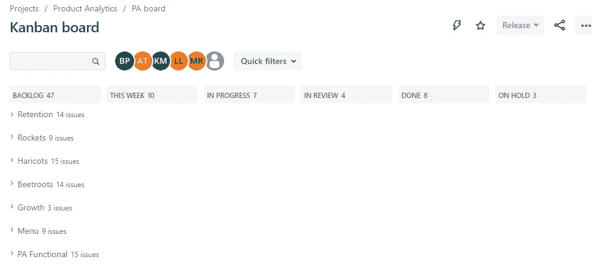
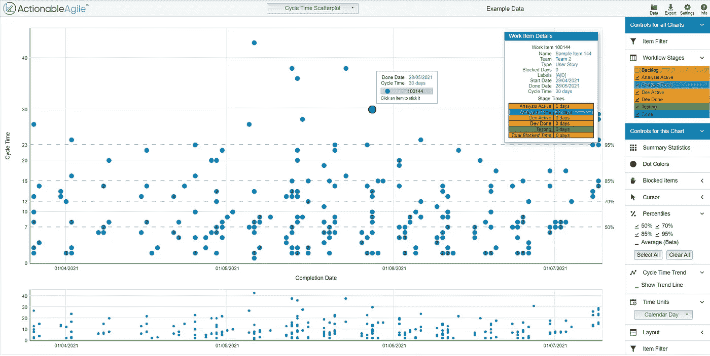
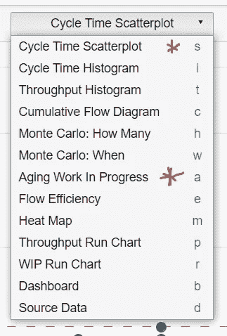
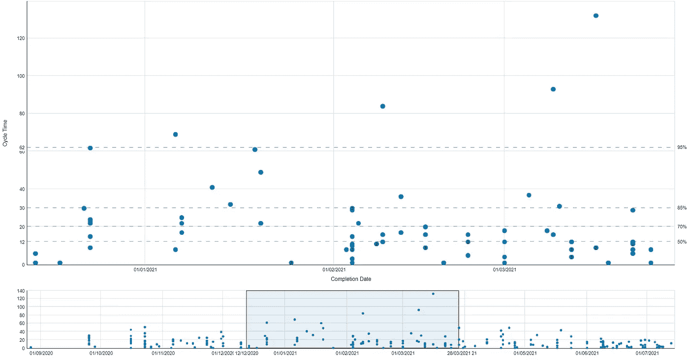
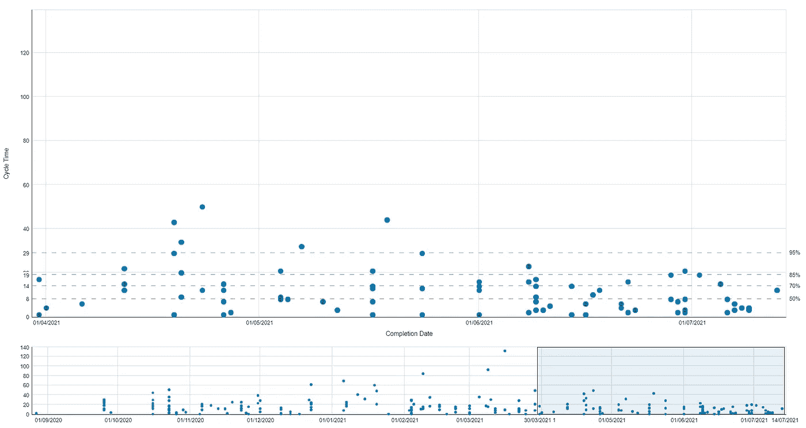
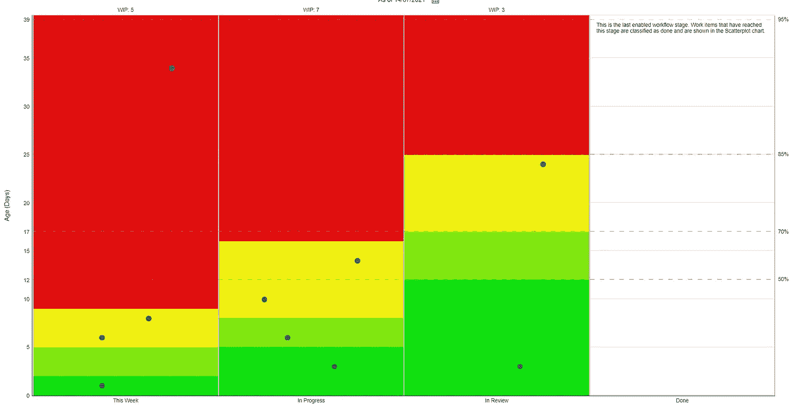

# 使用数据成为敏捷分析团队

> 原文：<https://towardsdatascience.com/using-data-to-become-an-agile-analytics-team-5e4760e88a08?source=collection_archive---------34----------------------->

## 我们如何使用可操作的敏捷来改进我们的工作流程 30%

回到今年(2021 年)3 月，我开始了解我团队的 JIRA 董事会是否达到了应有的效率。我向工作中的一位敏捷教练寻求帮助(你好，Zara)。接下来是一段旅程，我的思维方式和工作方式发生了完全的转变，这是我没有想到的。

在我们的第一次会议中，Zara 提到我们 JIRA 董事会的状态非常好，并且符合敏捷最佳实践。作为一个分析团队，我们试图“采用”看板方法和思维方式来帮助管理和可视化我们的工作。利益相关者会提出待处理的问题单，并与他们合作，我们会相应地安排优先级。不幸的是，这就是我们采用看板的终点。我们没有做任何事情，甚至没有代表敏捷的核心哲学。我们不是一个敏捷的团队！

## 看板板设置

下面的截图显示了我们当前的看板。如果你使用看板方法，你的看板可能看起来像这样:

产品分析团队 JIRA 董事会

我们用来管理工作流的列有*待办事项、本周、进行中、评审中、完成*和*等待*(希望名称不言自明)。我们用泳道来代表我们支持的不同团队。还有一个专用于职能工作的泳道，包括个人发展、数据质量改进、招聘等

# 可操作敏捷(AA)

在我们查看了董事会设置后，Zara 问我是否遇到了 [**可操作的敏捷**](https://actionableagile.com/) **。我没有。但当 Zara 从演示帐户加载这个散点图给我看 AA 时，我就被迷住了。我不知道我在看什么，我只知道不管它是什么，我想要它——毕竟我是一名分析师。“周期时间散点图”的屏幕截图，演示数据如下:**

可操作的敏捷演示数据

## 什么是可操作的敏捷？

可操作的敏捷是一种帮助你理解和可视化你的团队工作如何在过程中移动的方法(专栏)。有许多图表可以帮助您分析关键的工作流程指标，例如:

*   周期时间—票证从“积压”中取出后到达“完成”栏所需的时间
*   吞吐量—任何时间段内完成的票据数量

你也可以运行蒙特卡罗模拟来预测一件工作需要多长时间。下面是你可以用 AA 做的所有事情的列表。我已经标记了我们每周用来帮助我们处理过程的那些。

## 了解可操作的敏捷

尽管我对图表有明显的热情，但在我完全理解我在看什么以及我们如何从中受益之前，我不会天真到改变团队的工作方式。所以我和 Zara 开了一系列的会议来学习更多关于敏捷工作方式和可操作的敏捷。

以下是我和 Zara 一起参加的为期 3 周的速成班的总结和结果:

> 可操作的敏捷让我能够在宏观层面上分析我的团队的平均周期时间(见下图),并在微观层面上理解何时票据有风险。使用 AA 中的数据，我建立了我的团队的历史基线数字，并确定了我们应该采取的行动来改善它们。我还对 JIRA 董事会做了一些改动，以便我们能够更有效地使用 AA。了解了足够多的信息，知道这是我们可以从中受益的东西，并对我所谈论的内容充满信心，我与团队分享了 AA-他们对图表同样感到兴奋。一旦他们都买了，我们为自己创造了一个 OKR。

## 设定目标

我们的目标是减少数据的可变性，并作为一个团队变得更加可预测。关键结果是将 Q2 第 80 百分位循环时间减少了 30%。

# 结果

注意:每个点代表一张或多张 JIRA 门票，y 轴是周期时间，即门票移动到“完成”需要多长时间。x 轴是票被移动到“完成”的日期。一起创造了我们工作的时间序列。

## 以前

敏捷前图表

## 在...之后

后敏捷图

乍一看，可能不容易看出影响，但如果仔细观察，您会发现以下情况:

*   散点图上的数据点被压缩得更多，异常值明显更少**(可变性降低)。**
*   第 80 百分位线已经从 30 天变成了 19 天**(改善了 37%)。** OKR 实现了！
*   第 70 和第 50 百分位线分别下降了 30%和 33%。

# 我们是如何做到这一点的？

访问我们的历史数据是有用的，因为它让我们看到我们作为一个团队是如何做的，但是如果我们想看到我们的周期时间有所改善，我们需要改变我们的工作方式。

## 1)站立

我们做的最基本的改变是引入了单口站立！我们每周一都有团队会议，涵盖了一大堆主题，包括团队在做什么，但我们很少看 JIRA 的董事会。因此，我们决定花前 30 分钟浏览每个泳道和栏目中的每张有效门票。我们还在周三早上增加了一个更短的 15 分钟站立。

看黑板这个简单的动作经常在这方面发挥巨大的作用。也许这只是你把票移到“完成”时产生的多巴胺冲动。不管是什么原因，做倒立肯定有积极的心理影响。我甚至可以肯定，我们减少的周期时间中有一部分是因为我们及时地移动和关闭了票证。

## 2)减少在制品

每周一，我会向我们所有的利益相关者发送我们正在做的事情的更新，但到了周中，很明显团队不会完成他们承诺的一半。这不是他们的错！持续不断的会议、数据问题、反馈循环、电子邮件、松散信息和“小”请求意味着不可能找到固定的时间来专注于实际工作。

所以除了站立，下一个改变是减少我们每周的工作量。我们承担的更少，所以我们可以交付更多。再一次，进展中的事情越少的心理影响，意味着团队可以更集中精力，更频繁地交付。

## 3)审查进行中的老化工作

我们在每次会议中使用的第二个图表是“老化工作进行中”图表。这个图表让我们可以看到每个活动票证的年龄，并发现任何有风险的内容。有时事情太多，很容易忘记时间。拥有识别风险的简单方法，意味着我们可以快速行动。这可能是更新利益相关者，重新安排工作的优先次序或寻找依赖。(是的，我知道有一张票漂浮在红色区域。我们只是人类)。

## 4)更好地界定更大任务的范围

我们还没有完善这一点，但我们更加关注它。有一项分析花了两个月才完成，事后看来，我们应该把它分解成更小的任务。事实上，这个分析是促使我联系 Zara 的催化剂。结果是更好地界定了工作范围，与利益相关方商定了明确的成果，并在需要时使用了 epics。

## 5)控制可控性

以上所述让我们意识到，虽然我们容易受到许多我们无法控制的因素的影响，但作为分析师，有太多东西是我们可以控制的。当有人要求我们做不在优先考虑的事情时，说“不”或“还没有”就是其中之一。直到今天，我知道团队仍然会对“小恩惠”说“是”,但是他们说的越来越少了。我还观察到团队态度的变化。他们不再纠结于任务，从而更多地限制了自己的时间。当 SQL 查询超时时，它们会继续前进。当他们在等待利益相关者的反馈时，他们会继续前进。

# 经验教训

我们已经看到我们的工作流指标有了巨大的改进，我真的相信我们学到的东西可以应用于任何分析团队，但如果你自己也开始了这一旅程，我想分享一些最后的经验教训。

1.  **为你的团队创造一个安全的空间** —这不是一个点名羞辱的练习。他们应该能够开诚布公地讨论为什么事情比他们希望的时间长，而不会感觉像在显微镜下一样。
2.  **保持纪律**d——在任何情况下都不要跳过单口相声。
3.  **继续适应和迭代**——我们仍然没有做到完美。不断回顾你的过程。
4.  **说实话** —这些数字的提高是因为你改进了你的流程，还是你在操纵这些数字？
5.  **采用良好的 JIRA 实践** — AA 并不完美，所以要养成使用 JIRA 的特性来帮助你去除数据中的噪音的习惯。

# 最后的话

我不知道我们是否已经达到了敏捷团队的状态，但是我们肯定不是三月份的那个团队了。

我非常感谢 Zara 让我看到了一个全新的数据世界，但更重要的是，它有耐心帮助我了解如何正确使用它。如果你足够幸运，在你的公司里有敏捷教练，我建议你去找他们。在过去的 5 个月里，我学到了很多。

你可以在 [**Twitter**](https://twitter.com/DodoNerd) 上关注我，也可以不费吹灰之力在 Medium 上关注我和 [**废话连篇**](https://medium.com/crap-talks) 。如果你喜欢这篇文章，请向下滚动，给它一些掌声:)