# 阿黛尔是一个了不起的歌手-数据可以说明为什么！

> 原文：<https://towardsdatascience.com/using-data-to-show-why-adele-is-an-amazing-singer-musician-6de886d80e61?source=collection_archive---------26----------------------->

## 如果你想证明你最喜欢的歌手有多棒，为什么不用数据呢？

马特·博茨福德在 [Unsplash](https://unsplash.com/s/photos/music?utm_source=unsplash&utm_medium=referral&utm_content=creditCopyText) 上的照片

ONG 已经存在了很久，并以这样或那样的方式慢慢进入了人们的生活。我从 9 岁左右开始定期听歌，近十年后，我已经沉浸在许多不同流派的歌曲中。

这些年来，在我听过的所有艺术家中，我最喜欢的是阿黛尔。如果你听过她最著名的歌曲如“ ***你好”、“有人喜欢你”*** 或 ***“在深处打滚”*** ，你就会知道她的唱腔是丰富的，令人着迷的，她的歌真的把强烈的情感倾注到你的心里。它们让你感受到从未有过的感觉。

> 听“**有人喜欢你**”，让我 10 岁的时候第一次感到心碎。

作为数据科学项目的一部分，我决定利用我对歌曲和阿黛尔的欣赏，分析 [*这个*](https://www.kaggle.com/yamaerenay/spotify-dataset-19212020-160k-tracks) 数据集。它收集了 1921 年至 2020 年间在 Spotify 上发布的 16 万多首歌曲的音频特征。

> Spotify 是一项数字音乐、播客和视频流媒体服务，让您可以访问来自世界各地艺术家的数百万首歌曲和其他内容。

结果呢？

我想出了问题的数据驱动原因:*为什么阿黛尔是一个了不起的歌手？*

# 主要支持问题

为了恰当地展示阿黛尔的神奇，我需要问一些支持性的问题，并在数据集中找到它们的答案。

我有三个问题:

1.  最近歌曲有什么值得注意的趋势吗？
2.  *与 2020 年的竞争对手相比，阿黛尔的受欢迎程度如何？*
3.  阿黛尔和她的顶级竞争对手之间的主要区别是什么？

在下面的章节中，我将只讨论与我的论点相关的部分发现。如果你想要一套完整的发现，可以去看看我的 [*Kaggle 笔记本*](https://www.kaggle.com/andrewwilliam1507/spotify-analysis-udacity-project) 或者我的 [*github*](https://github.com/Andrew7918/spotify_analysis) 。

# 更多关于数据的信息

在我们深入研究答案之前，我将首先解释数据集的一些相关但不那么直观的特性。如果您不确定某项功能的含义，请随意返回此处。

1.  `valence` : *一首歌在音乐上有多积极/快乐。*
2.  `popularity` : *一首曲目在获取数据时的受欢迎程度。*要知道数据集是 2020 年 6 月发布的，所以我们这里使用的所有流行度特征，都是指 2020 年 6 月的赛道流行度。
3.  `explicit` : *曲目是否包含露骨内容。* 1 为显式，0 为不显式。
4.  `speechiness` : *一个音轨中的口语单词等级。*更接近于 1 意味着只专门包含语音。接近 0 表示仅包含音乐。

# 1.近年来宋的发展趋势

对于这一部分，我把“最近几年”框定为从 2010 年开始。换句话说，我所做的观察，是从 2010 年到 2020 年每一年的平均歌曲特征中得出的。

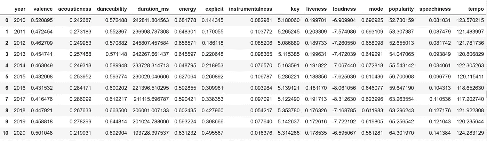

数据外观图片|作者图片

此外，我还获得了 2010 年至 2020 年每年 100 首流行歌曲的平均特征表。

我在这部分有一些非常有趣的发现。

## a)从 2010 年开始，歌曲变得越来越悲伤，但从 2017-2018 年开始，歌曲变得越来越快乐

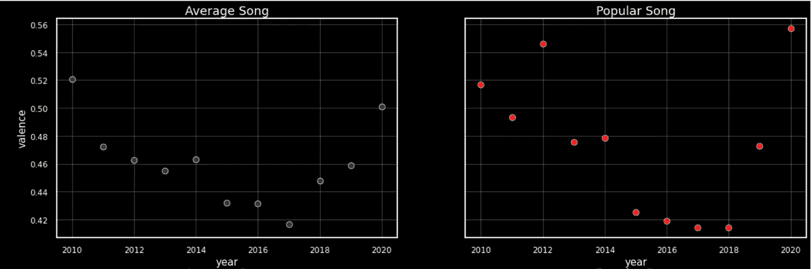

多年来普通歌曲和流行歌曲的价格比较|作者图片

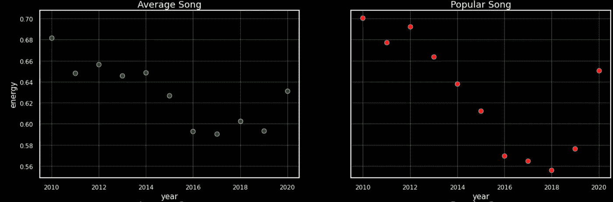

多年来普通歌曲和流行歌曲的能量比较|作者图片

*   从 2010 年到 2017 年至 2018 年，普通歌曲的价格和能量大多下降，然后再次飙升，这意味着歌曲在反弹之前在音乐上变得越来越悲伤和沉闷。
*   2010–2020 年的流行歌曲也遵循这一趋势，在 2016–2018 年达到最悲伤和最没有活力的水平。
*   这些趋势可能表明，2016 年至 2018 年是一个充满心碎的时期，因此更多的歌曲更悲伤，这些严肃的歌曲最终变得流行。然而，我们需要做更多的数据挖掘来证明这一点。
*   足够有趣的是，2020 年似乎鼓励歌曲在快乐和积极方面大幅飙升。

> 在 2020 年所有的消极中，我想这个世界转向了歌曲来获得积极的突破。

## b)歌曲变得越来越适合跳舞。

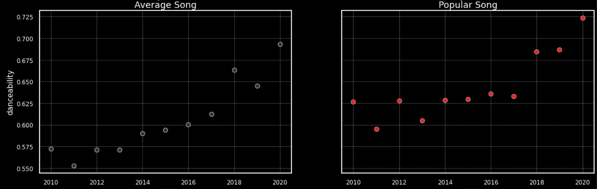

多年来普通歌曲和流行歌曲的可跳性呈上升趋势 **|** 作者图片

普通歌曲和流行歌曲的可跳性呈上升趋势。

## c)歌曲越来越露骨。

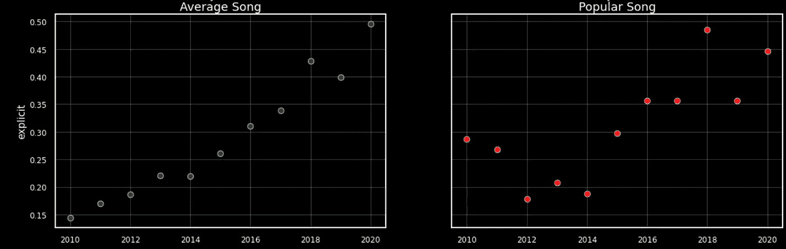

多年来普通歌曲和流行歌曲清晰度的上升趋势|作者图片

随着时间的推移，普通歌曲更容易露骨，这种露骨的歌曲越来越受欢迎。

## d)这些趋势与阿黛尔有什么关系？

在这一点上，你可能想知道，这些趋势与阿黛尔有什么关系？简单来说:

> 阿黛尔并不“新潮”。

看看下面的数字:

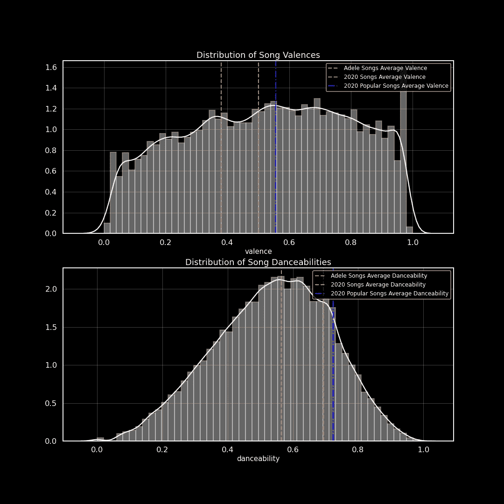

歌曲的价格和可跳舞性分布|按作者分类的图像

阿黛尔没有追随最近歌曲的潮流。与 2020 年的歌曲相比，她的歌曲平均价低，平均可跳性也低。

除此之外她的**明确度仅为 2020 年歌曲的******1/10**:**

**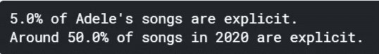**

**清晰|作者图片**

**至少在过去三年左右，所有这些特征都呈上升趋势，如果阿黛尔坚持自己的风格，她可能会进一步落后于潮流。**

## **第 1 节的结论:**

**自 2017-2018 年以来，歌曲一直趋向于变得更快乐，更适合跳舞，更明确。但阿黛尔的音乐类型属于 [*流行、R & B 和灵魂乐*](https://en.wikipedia.org/wiki/Adele) 的范畴。因此，她的歌曲更像是饱含深意的情感歌谣——它们不追随快乐、乐观的潮流。**

**因此，很容易得出这样的假设:阿黛尔的歌曲在最近一段时间可能不那么受欢迎了。嗯，这就把我们带到了下一个问题。**

# **2.与 2020 年的竞争对手相比，阿黛尔的受欢迎程度**

**根据我们掌握的数据，发现阿黛尔在 2020 年有多受欢迎是很简单的。歌曲特征已经包括了`popularity`，所以为了得到阿黛尔受欢迎程度的一个很好的代理，我们可以总结她所有歌曲的受欢迎程度，并将其与所有其他艺术家的受欢迎程度相比较。**

**这样做，我们得到:**

****

**作者图片**

**这个数字看起来很合理，但我们必须记住，数据集也包含许多 20 世纪的旧曲目。也就是说，当我们使用这种方法时，我们是在将阿黛尔的歌曲与弗兰克·辛纳屈、猫王等的传奇经典进行比较。**

**事实上，根据这种方法，以下是最受欢迎的五位艺术家:**

**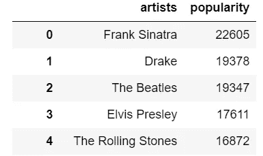**

**根据合计人气排名的前 5 位人气艺人|作者图片**

**称披头士或弗兰克·辛纳特拉为阿黛尔的“竞争对手”似乎不太公平。毕竟，他们是永恒的传奇，几十年来，他们的歌曲已经享誉全球。与此同时，阿黛尔的第一首歌《故乡的荣耀》在 2007 年才发行。**

**因此，我从 2007 年开始发行歌曲的艺术家中挑选了一部分，认为这些艺术家是阿黛尔的竞争对手。**

**结果如下:**

**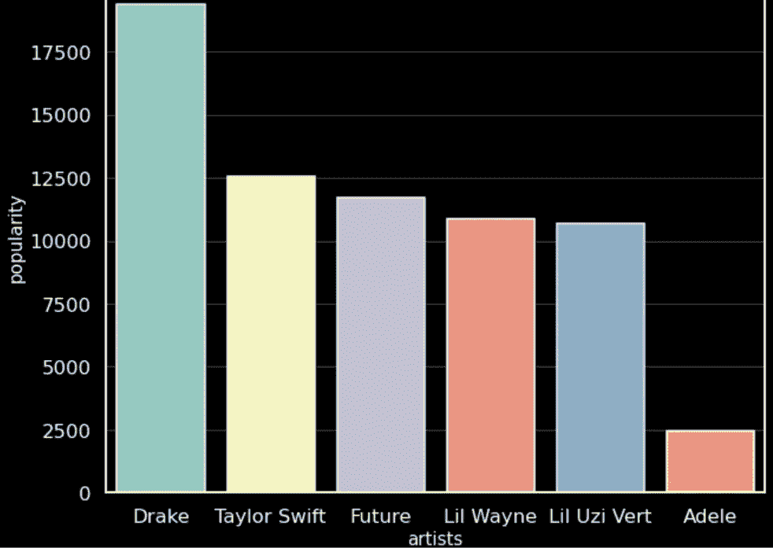**

**前 5 名最受欢迎的艺术家(2007 年以后发行的歌曲)+ Adele |作者图片**

**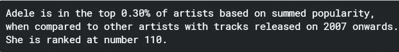**

**阿黛尔受欢迎的确切数字|作者图片**

> **从这一点开始，当我们讨论前 5 名艺术家时，我们指的是在 2007 年以后发行歌曲的艺术家。**

## **第 2 节的结论**

**阿黛尔在 2020 年极受欢迎。她是 Spotify 全球排名前 1.63%的艺人之一，也是 2007 年以来发行过歌曲的前 0.3%的艺人之一。**

**带着这个想法，我试图找到最后一个问题的答案。**

# **3.阿黛尔和她的竞争对手之间的主要区别**

**知道了阿黛尔的受欢迎程度，我想进一步发现是什么把前五名最受欢迎的艺术家与阿黛尔区分开来。**

> **她是否在某些方面有所欠缺？前 5 名艺人之间有什么共同点吗？**

**通过更多的操作，我找到了前 5 名艺术家的平均轨迹特征。与阿黛尔的平均轨迹特征相比，以下是获得的结果:**

## **a)他们的歌更快乐，更有活力，人们更可能随着他们的歌起舞**

**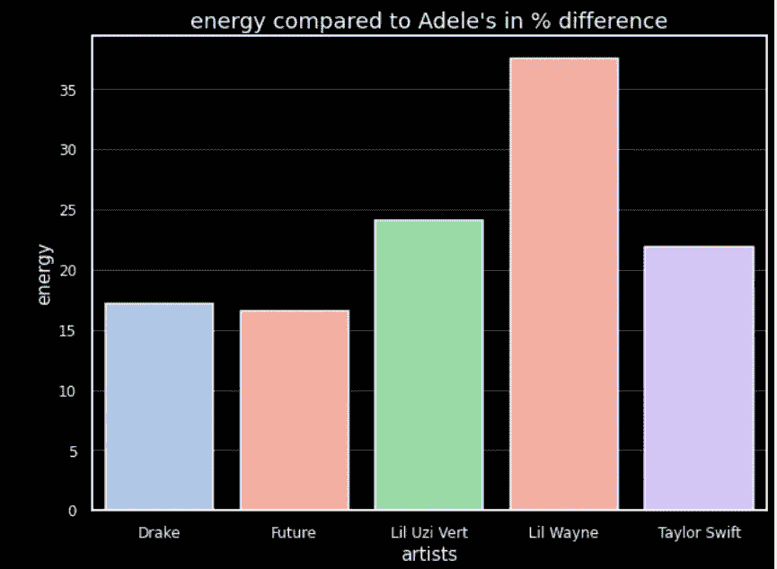****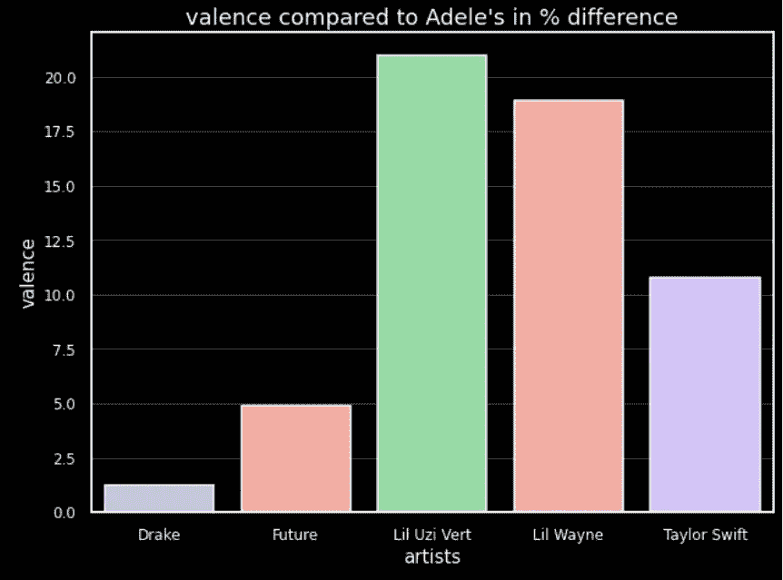**

**与阿黛尔相比，前 5 名艺术家的能量和效价|作者图片**

**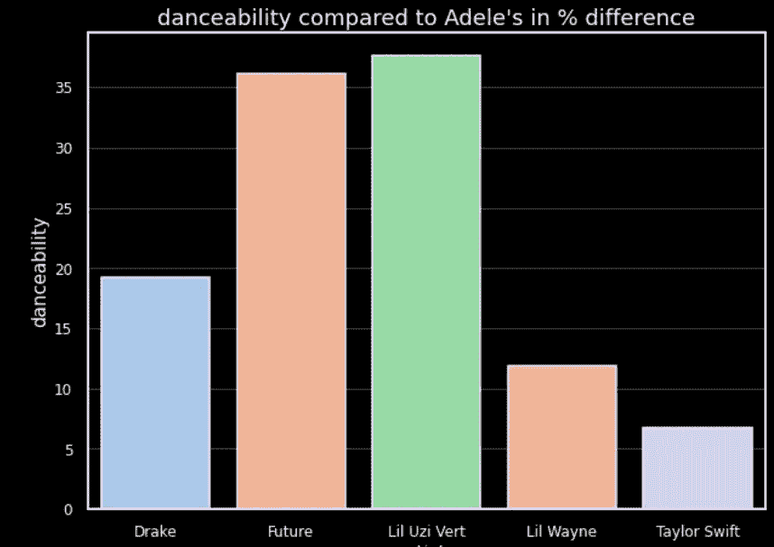**

**与阿黛尔相比，前 5 名艺术家的舞蹈能力|作者图片**

*   **在三个特征**能量、价和可舞性**中，所有前五名艺人的平均曲目**都比阿黛尔的平均曲目**高。**
*   **换句话说，就拥有快乐和振奋人心的歌曲旋律而言，前五名艺术家比阿黛尔更追随流行歌曲的最新趋势。**

## **b)大多数前 5 名的歌曲具有较高的口语词比率**

**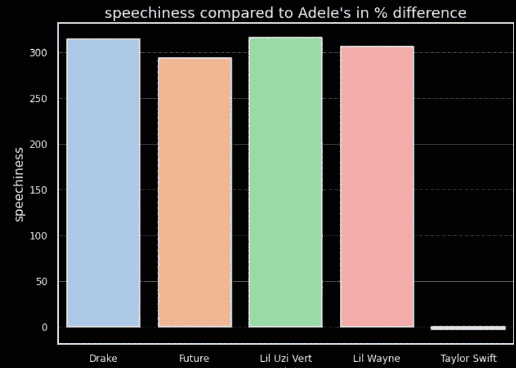**

**与阿黛尔相比，前五名艺术家的演讲|作者图片**

*   **德雷克、未来、利尔·简自豪·维特、李尔·韦恩的平均语速都是阿黛尔平均语速的至少 2.5 倍。**
*   **这是意料之中的，因为除了泰勒斯威夫特，前 5 名的其余艺人都是说唱歌手。**

## **c)前五名艺术家中的大多数都发行了许多更露骨的歌曲**

**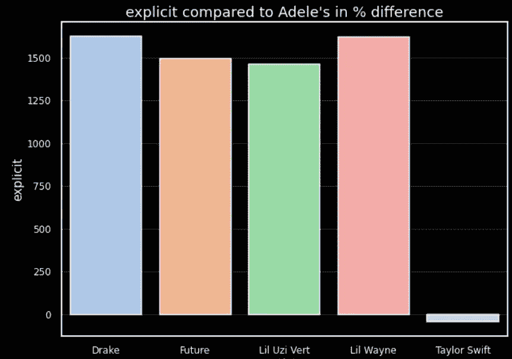**

**与阿黛尔相比，前 5 名艺术家的清晰度|作者图片**

*   **再一次，除了泰勒·斯威夫特之外，所有前五名艺术家的清晰度都比阿黛尔高得多(相差超过 10 倍)。**
*   **有人可能会认为，因为他们是现代说唱歌手，他们有很多明确的曲目。嗯，需要注意的一点是， ***相关性并不等同于因果关系*** *。***
*   **换句话说，不能因为他们都是现代说唱歌手，内容露骨度高，就代表因为前者，后者就跟着来了。**

## **d)有趣的是，阿黛尔的歌曲比大多数歌曲的平均受欢迎程度都高。**

**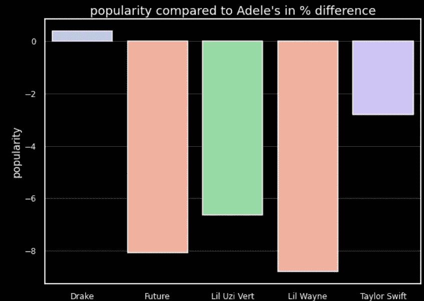**

**与阿黛尔相比，前 5 名艺术家的清晰度|作者图片**

*   **平均来说，阿黛尔的歌曲实际上比未来、里尔·简自豪·维特、李尔·韦恩和泰勒·斯威夫特更受欢迎。**
*   **她的歌曲在流行程度上也接近德雷克的歌曲。**

> **那么为什么阿黛尔不在前 5 名艺术家之列呢？**

## **e)阿黛尔所缺乏的**

**好吧，因为我们总结了每个艺人歌曲的流行度，作为一个艺人受欢迎程度的代表，这导致了一种可能性——与前 5 名艺人相比，阿黛尔发布的歌曲很少。**

**果然，经过更多的数据探索，我们可以看到:**

****

**轨道数量比较**

> **注意:这里我用了“已经涉及”这几个字，因为只要一首 Spotify 的歌把一个艺人列为它的创作者之一，我就把这首歌包括进去了。**

## **第 3 节的结论**

**与前五名艺术家相比，阿黛尔的音乐在风格和情绪上相对不同。**然而，这并不是阿黛尔不在前 5 的原因。****

**相反，这仅仅是因为与前五名艺人相比，她很少创作歌曲。**

# **总体结论:那么为什么阿黛尔是一个伟大的歌手/音乐家？**

**原因是我们之前的三个结论的汇总。**

> **1.阿黛尔的音乐更悲伤，更缓慢，更深情的音乐类型没有遵循最近流行歌曲的趋势，快乐和乐观的歌曲。**
> 
> **2.然而，数据显示，她仍然是最受欢迎的艺术家的前 0.3%(从 2007 年开始发行的歌曲)。**
> 
> **3.事实上，她不在前五名的原因，不是因为她不新潮的风格，而是因为她发行了一些小曲。她的歌曲质量不言自明，因为它们的平均受欢迎程度可与前 5 名艺术家发行的歌曲相媲美。**

**既然我们已经结束了，我想问你几个问题:**

> **当提出这些论点时，你会同意阿黛尔是一个伟大的音乐家/歌手吗，即使你不喜欢她？**
> 
> **这种数据驱动的论点是否遗漏了什么？**

**感谢您阅读本文！我希望你觉得这很有趣。**热烈欢迎任何评论或批评。****

**此外，请随时与我联系，就这些话题进行交流，并通过 [LinkedIn](https://www.linkedin.com/in/andrew-william-1507/) 与我联系。**