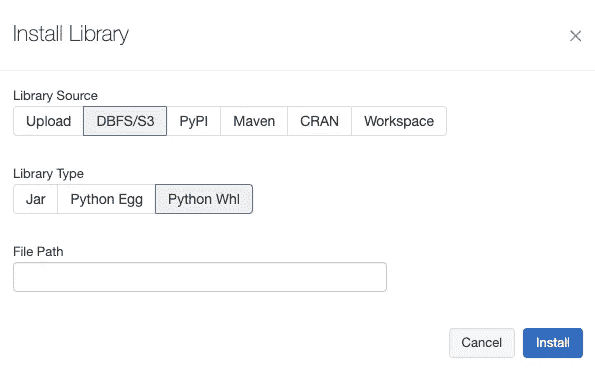

# 在 ML 管道中使用数据块集群

> 原文：<https://towardsdatascience.com/using-databricks-clusters-in-ml-pipelines-adc2bde3c8ed?source=collection_archive---------40----------------------->

## 运行生产 Spark 作业，并在 Databricks 作业集群上培训 ML 模型。


来源:由 [Unsplash](https://unsplash.com/s/photos/predictive-analytics?utm_source=unsplash&utm_medium=referral&utm_content=creditCopyText) 网站上的[米利安·耶稣会士](https://unsplash.com/@mjessier?utm_source=unsplash&utm_medium=referral&utm_content=creditCopyText)

在这篇文章中，我想描述一下我在 Databricks 作业集群上执行 production Spark 和 ML 作业的经历。
到目前为止，我是 Databricks 解决方案的忠实粉丝，因为我发现它们比我用过的替代方案好得多，不，我不是 Databricks 的员工。

在我的日常工作中，我开发了一个自动化的基于人工智能的预测分析平台，该平台简化并加快了构建和部署预测模型的过程。
过去两年，我一直在构建数据和 ML 管道，包括数据清理、结构化、特征工程、培训、评估、预测和监控工作。

有两个原因让我开始使用 Databricks:

1.  我想让别人帮我管理 Spark。我不想在 Spark echo-system 上花费太多时间(安装、配置、优化和调优等)。
2.  我们在 Kubernetes 上使用 JupyterHub 作为游戏环境。管理它相当具有挑战性，尤其是当我们希望它可扩展并运行繁重的 Spark 任务时。

自从我开始使用 Databrikcs 以来，我发现了许多我喜欢的更强大的功能，我将在这篇文章中讨论这些功能。

# 在数据块集群上运行生产作业

我们根据自己的需求开发了定制的 Databricks 气流操作器，用于执行生产任务。这个 Airflow 操作符根据作业的类型和工作负载为每个作业创建两种类型的集群之一:

1.  标准群集—包含 3–512 个节点(自动横向扩展和纵向扩展)的 Spark 群集，我们将这种类型的群集用于 Spark 作业。
2.  单节点集群—我们还运行非分布式训练算法，在这种情况下，常规的多节点集群不适用。

每个作业都有一个专用群集，该群集在作业完成后立即关闭。为了执行许多独立的任务，可以并行运行许多集群。

操作员知道使用正确的参数在正确类型的集群上执行每个作业，管理故障、重试等。
使用 Databricks REST API 创建集群很简单，这是一个创建单节点集群的请求示例:

```
{
    "run_name": "my_run",
    "new_cluster": {
        "spark_version": "7.4.x-gpu-ml-scala2.12",
        "aws_attributes": {
            "instance_profile_arn": "my_instance_profile",
            "availability": "SPOT_WITH_FALLBACK",
            "zone_id": "my_zone",
            "ebs_volume_count": 1,
            "ebs_volume_size": 100},
    "num_workers": 0,
    "spark_conf": {
        "spark.master": "local[*]",
        "spark.databricks.cluster.profile": "singleNode"},
    "node_type_id": "p3.2xlarge",
    "spark_python_task": {
        "python_file": "s3://my-bucket/my-file.py",
        "parameters": []},
    "libraries": [{"pypi": {"package": "dill==0.3.1.1"}}],
    "max_retries": 1,
    "timeout_seconds": 36000
}
```

你可以在文章[1]的结尾找到关于不同参数的更多信息。

# 积分福利

**Managed Spark**
Spark 已经安装并配置完毕，支持快速按需创建集群，轻松管理集群，并在任务完成后关闭集群。

**data bricks Runtime** data bricks 提供了几个可用的运行时配置，例如“Databricks Runtime ML”，它可以自动创建针对机器学习优化的集群。
该配置包括最流行的机器学习库，如 TensorFlow、PyTorch、Keras、XGBOOST、Scikit-Learn、Pandas 等等。
它加快了集群创建时间，我可以用特定的运行时配置“标记”我的作业，这样我就可以在推理管道中再次使用它。它承诺在训练管道和预测管道之间有相同版本的库，使它们相互兼容。

**调试简单** 使用“数据块-连接”[2]可以调试作业。它只需要安装在本地虚拟环境中，并使用 Databricks 帐户详细信息进行配置。
它支持在集群上远程调试作业，并且变得非常有用，特别是当我们想要调试大量不适合本地机器内存的数据时。

**易于使用自己的 Python 包**
可以在集群上安装 Python 包，并从我们的作业中访问它们。它使得使用内部包、公共对象和代码变得非常容易。
可以从几个来源安装软件包，并使用 UI 或 API。



库安装— Databricks 统一分析(来源:作者)

**内置 AWS 和 Azure 集成** Databricks 和 AWS 以及 data bricks 和 Azure 之间存在集成。我们可以使用单个 API 在两个云中执行作业，而不是在我们这边构建这些集成。

**笔记本和数据目录** Jupyter 笔记本已经上市，具备预配置的 spark 会话和开箱即用的可视化功能。
还可以轻松执行繁重的工作负载，并且可以将处理后的数据帧保存到数据目录中，让其他团队和同事使用他们的笔记本来访问它们。

# 结论

在这篇文章中，我简要描述了为什么我喜欢使用 Databricks 集群作为基础设施来运行 Spark 作业和训练模型。有太多的细节我没有描述，因为我想给出一个主题的概述，而不是太深入。
如果有什么具体的东西让你感兴趣，我会很感激你的评论，我会在我的下一篇帖子里写出来。

**链接:
1。**数据块工作 API: [https://docs.databricks.com/dev-tools/api/latest/jobs.html](https://docs.databricks.com/dev-tools/api/latest/jobs.html)

2.data bricks Connect:
[https://docs . data bricks . com/dev-tools/data bricks-Connect . html](https://docs.databricks.com/dev-tools/databricks-connect.html)