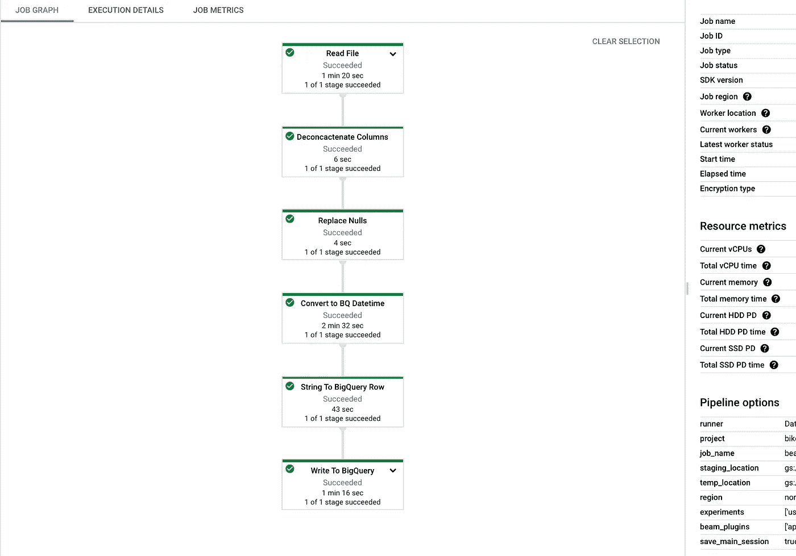
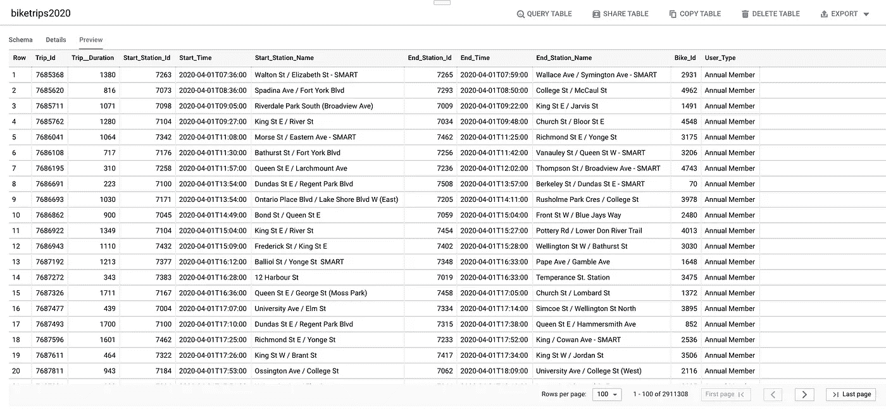

# 使用数据流提取、转换和加载自行车共享多伦多乘客数据到 BigQuery

> 原文：<https://towardsdatascience.com/using-dataflow-to-extract-transform-and-load-bike-share-toronto-ridership-data-into-bigquery-e9b1dc199781?source=collection_archive---------10----------------------->

## 关于构建 ETL 管道的说明，该管道用于将 Bike Share Toronto ridership 数据加载到 BigQuery 表中，以便它可以用作 Data Studio 创建数据可视化的源


安德烈·费塔多在 [Unsplash](https://unsplash.com?utm_source=medium&utm_medium=referral) 上拍摄的照片

在我之前的[博文](https://bilalmkhan.medium.com/how-the-pandemic-has-affected-bike-share-toronto-ridership-65798265adc2)中，我使用 Google Data Studio 和 BigQuery 作为数据源来分析疫情是如何影响自行车共享出行的。在这篇博客文章中，我将一步一步地演示在尝试将 [Bike Share Toronto ridership 数据](https://ckan0.cf.opendata.inter.prod-toronto.ca/tr/dataset/bike-share-toronto-ridership-data)从云存储中直接加载到 BigQuery 时遇到的一些问题，以及如何通过使用 Dataflow 使用 Apache Beam 执行 ETL 过程来解决这些问题。

# 下载数据

1.  让我们首先在云壳中打开一个会话，并将 2020 年[自行车共享多伦多乘客数据](https://ckan0.cf.opendata.inter.prod-toronto.ca/tr/dataset/bike-share-toronto-ridership-data)下载到一个单独的文件夹`'2020'`。

```
wget [https://ckan0.cf.opendata.inter.prod-toronto.ca/dataset/7e876c24-177c-4605-9cef-e50dd74c617f/resource/5f5d78c4-d810-4048-9dac-c18273abffac/download/files-1.zip](https://ckan0.cf.opendata.inter.prod-toronto.ca/dataset/7e876c24-177c-4605-9cef-e50dd74c617f/resource/5f5d78c4-d810-4048-9dac-c18273abffac/download/files-1.zip) -O temp.zipunzip temp.zip -d 2020rm temp.zip
```

上面的第一个命令下载名为`temp.zip`的 zip 文件，第二个命令将其解压到名为`2020`的文件夹中，第三个命令删除下载的 zip 文件。

2.让我们通过运行下面的命令来看看文件解压缩后的内容。

```
ls 2020
```

我们看到，2020 年的乘客数据分为 12 个 CSV 文件，都以`2020`开头:

```
2020–01.csv 2020–02.csv 2020–03.csv 2020–04.csv 2020–05.csv 2020–06.csv 2020–07.csv 2020–08.csv 2020–09.csv 2020–10.csv 2020–11.csv 2020–12.csv
```

3.我们可以通过读取 CSV 的标题来读取列名:

```
head -n 1 2020/2020–01.csv
```

这将输出以下列名:

```
Trip Id,Trip Duration,Start Station Id,Start Time,Start Station Name,End Station Id,End Time,End Station Name,Bike Id,User Type
```

# 将文件复制到云存储桶

接下来，让我们将文件复制到云存储桶中。这将允许我们利用[对云存储 URI](https://cloud.google.com/bigquery-transfer/docs/cloud-storage-transfer-overview) 的通配符支持，用一个命令将多个文件批量加载到一个 BigQuery 表中。

4.首先，用您的项目 ID 设置一个项目变量，并设置项目属性。

```
export PROJECT=my-project-idgcloud config set project $my-project-id
```

5.使用 make bucket `gsutil mb`命令在项目中创建一个新的 bucket。

```
gsutil mb -l northamerica-northeast1 gs://my-bucket-name
```

6.使用`gsutil cp`命令将文件复制到我们刚刚创建的云存储桶中。

```
gsutil cp 2020/* gs://my-bucket-name
```

7.检查文件是否已成功复制。

```
gsutil ls gs://my-bucket-name/
```

8.一旦数据被成功复制到云存储桶，就从云外壳中删除该文件夹。

```
rm -r 2020
```

# 创建大查询数据集

9.在将数据装载到 BigQuery 表之前，我们需要为该表创建一个 BigQuery 数据集。

```
bq --location=northamerica-northeast1 mk mydataset
```

# 尝试直接从云存储中将数据加载到 BigQuery 时出错

10.接下来，让我们尝试使用`bq load`命令将数据加载到一个 BigQuery 表中，并使用一个通配符，在基础上附加一个星号(`*`)

```
bq load --autodetect --source_format=CSV mydataset.biketrips2020 gs://my-bucket-name/*
```

然而，我们得到一个错误:

```
- gs://my-bucket-name/2020-10.csv: Error while reading
data, error message: CSV table references column position 9, but
line starting at position:3401930 contains only 9 columns.
```

该错误消息表明加载作业失败，因为至少有一行的列数少于自动检测到的架构规定的列数。

11.为了找到这些错误的来源，我们可以检查错误字节位置附近的 CSV 文件。为此，我们使用 gsutil `cat`命令。

```
gsutil cat -r 3401700–3402200 gs://my-bucket-name/2020–10.csv
```

由此，我们发现有许多行中的`Trip_Id`和`Trip_Duration`的值被错误地连接在一起。例如，下面的第二行应该以`10000084,625,7120,…`开始

```
10000083,720,7239,10/03/2020 13:28,Bloor St W / Manning Ave — SMART,7160,10/03/2020 13:40,King St W / Tecumseth St,5563,Annual Member10000084625,7120,10/03/2020 13:28,Gerrard St E / River St,7120,10/03/2020 13:38,Gerrard St E / River St,5250,Annual Member10000085,1526,7239,10/03/2020 13:28,Bloor St W / Manning Ave — SMART,7544,10/03/2020 13:53,Foster Pl / Elizabeth St — SMART,3956,Annual Member
```

我们需要找到所有这样的串联值，并将它们拆分。这是在 BigQuery 中无法完成的数据转换。因此，我们需要构建一个 Apache Beam 管道来转换数据并加载到 BigQuery 中。

此外，我们看到上述行中的`Start_Time`和`End_Time`列不符合 [BigQuery 兼容的](https://cloud.google.com/bigquery/docs/reference/standard-sql/data-types#examples) `[datetime](https://cloud.google.com/bigquery/docs/reference/standard-sql/data-types#examples)` [格式](https://cloud.google.com/bigquery/docs/reference/standard-sql/data-types#examples)。我们还需要用数据流进行转换。

12.处理错误的一个选择是在`bq load`中设置`max_bad_records`标志。这将忽略坏行，并且不会将它们加载到表中。例如，我们可以将`max_bad_record`标志设置为 100:

```
bq load \
--autodetect \
--max_bad_records=100 \
--source_format=CSV \
mydataset.biketrips2020 \
gs://my-bucket-name/*
```

然而，这仍然会给我们带来错误，尽管是不同类型的错误。

```
Could not parse ‘NULL’ as INT64 for field Bike_Id (position
8) starting at location 5061057 with message ‘Unable to parse’
```

出现此错误是因为对于 BigQuery，在 CSV 中表示空值的标准方式是使用空字段。我们可以通过在`bq load`命令中设置标志`null_marker=NULL`来处理这个错误，从而指定这个特定的文件使用字符串 NULL 来标记 NULL。例如:

```
bq load \
--autodetect \
--max_bad_records=100 \
--source_format=CSV \
--null_marker=NULL \
mydataset.biketrips2020 \
gs://my-bucket-name/*
```

这处理了由于解析空值引起的错误。然而，我们还将在 Apache Beam 管道中包含这种转换，以便单个管道执行所有必要的转换。

# 建立数据流管道

13.接下来，我们编写一个 Apache Beam 管道，它提取文件，执行转换，并将数据加载到 BigQuery 中。Python 文件`[etl_pipeline.py](https://github.com/bilalmkhan/etl-pipeline-beam)` <https://github.com/bilalmkhan/etl-pipeline-beam/blob/main/etl_pipeline.py>包含管道的 Python 代码。三个函数执行主要的转换:`deconcat()`、`replace_nulls()`、`format_datetime_bq()`。我们可以使用云壳编辑器上传 Python 文件。

# 设置 Python 环境

14.在云 Shell 中运行以下命令，设置虚拟环境来运行我们的代码:

```
sudo pip install virtualenv virtualenv -p python3 venv source venv/bin/activate pip install apache-beam[gcp]==2.24.0
```

# 运行管道

15.运行 Python 文件`[etl_pipeline](https://github.com/bilalmkhan/etl-pipeline-beam/blob/main/etl_pipeline.py).py`会创建一个运行`DataflowRunner`的数据流作业。我们需要指定一个云存储桶位置，用于在管道仍在运行时暂存和存储临时数据，以及包含 CSV 文件的云存储桶。

```
python etl_pipeline.py \
--project=$PROJECT \
--region=northamerica-northeast1 \
--runner=DataflowRunner \
--staging_location=gs://my-bucket-name/test \
--temp_location gs://my-bucket-name/test \
--input gs://my-bucket-name/*.csv 
--save_main_session
```

16.当数据流作业完成时，我们可以在 Gooogle 云控制台中导航到云数据流，并查看作业图表和其他作业完成详细信息:



17.导航到 BigQuery 验证数据是否成功加载到表中。这些数据现在可以用作 Cloud Data Studio 创建可视化的数据源。



*感谢您的阅读！如果您对此工作流程有任何建议，请在评论中分享。*