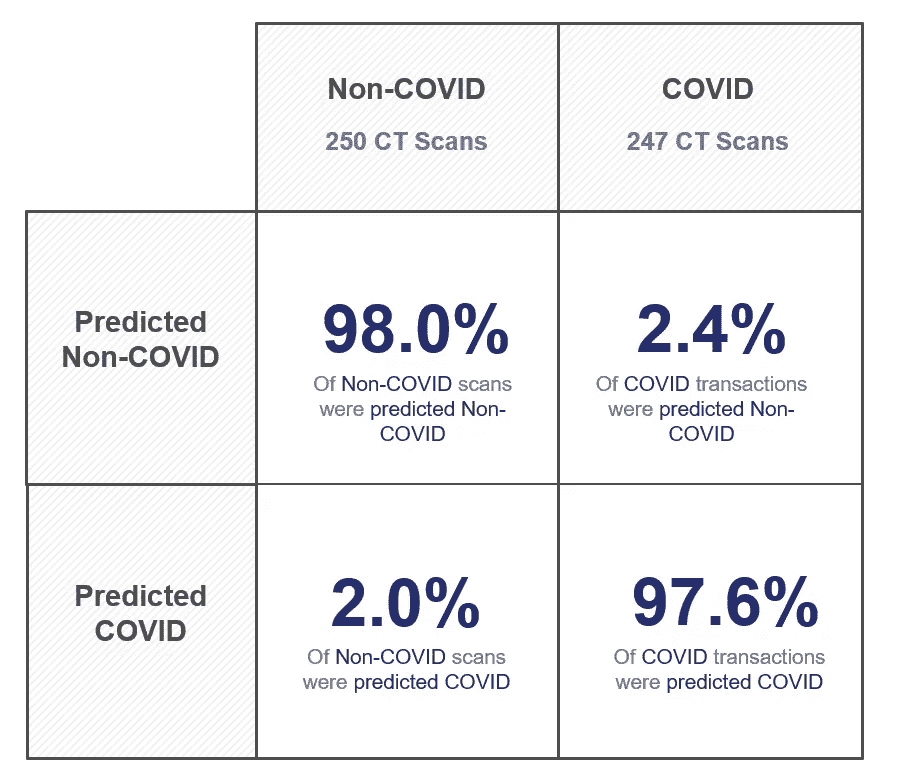
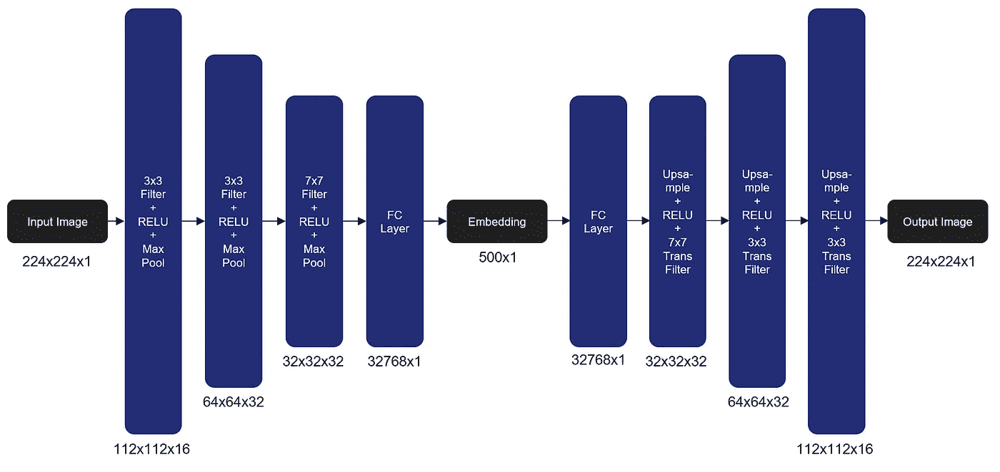
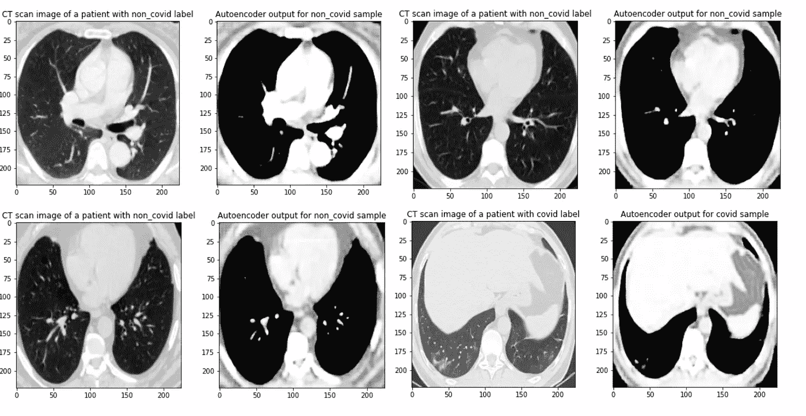

# 利用深度学习对抗新冠肺炎

> 原文：<https://towardsdatascience.com/using-deep-learning-in-the-fight-against-covid-19-688ba3b10629?source=collection_archive---------23----------------------->

## 人工智能如何以 98%的准确率可视化和诊断新冠肺炎

[疾控中心](https://unsplash.com/@cdc?utm_source=medium&utm_medium=referral)在 [Unsplash](https://unsplash.com?utm_source=medium&utm_medium=referral) 拍摄的照片

如果你收听了去年的新闻，新冠肺炎患者死亡的主要原因与无法通过充满肺部的液体呼吸有关。这缩小了我们肺部的总容量，使呼吸更加困难。这种液体可以使用 CT 或计算机断层扫描来观察。当急诊室的病人出现呼吸问题时，CT 扫描通常是医生建议进一步治疗的第一个预后工具。如果可以通过 CT 扫描正确诊断 Covid，这可以加快对处于危急或危及生命状况的患者的诊断，或者在测试用品有限时提供一种诊断方法。

为了预测新冠肺炎，之前的工作和在 [*建立的数据集被用于新型冠状病毒识别* (Soares et al. 2020)](https://www.medrxiv.org/content/10.1101/2020.04.24.20078584v3) 的真实患者 ct 扫描的大型数据集。这包含来自 250 名 COVID 阴性患者和 247 名 COVID 患者的健康肺的约 1300 次 CT 扫描，以及 Covid 感染肺的约 1300 次 CT 扫描。这个数据集然后被应用于一个名为 [ResNet-18](https://www.mathworks.com/help/deeplearning/ref/resnet18.html) 的卷积神经网络架构，训练一个新的模型来将健康患者与 Covid 感染患者进行分类。ResNet 的工作原理是利用[剩余学习](https://en.wikipedia.org/wiki/Residual_neural_network)，或者替代直接前馈神经网络的概念，允许跳过连接，这允许激活跳过网络中的一层，从而简化网络并帮助解决[消失梯度问题](https://en.wikipedia.org/wiki/Vanishing_gradient_problem)。如果您对 ResNet 架构是如何构建的感兴趣，[这篇面向数据科学的文章将详细解释这一点。](/an-overview-of-resnet-and-its-variants-5281e2f56035)

该网络的总体 F-1 分数为 97.87%，不仅超过了原始数据集的研究，而且与最准确的 Covid 测试一样好，如果不是更好的话。全部结果如下表所示。

ResNet-18 结果

为了建立在这些结果的基础上，并提供新冠肺炎看起来像什么的一般化模型，在相同样本上开发了第二无监督自动编码器模型。

[自动编码器](https://en.wikipedia.org/wiki/Autoencoder)是一种神经网络，用于学习一组数据的表示(编码)。一旦学习了这种表示，就可以将其重建为可视图像(解码)。这使得我们可以忽略图像中的噪声，而专注于所有图像之间的相似性。我们的特定网络获取大小为 244x244x1 的图像，学习大小为 500x1 的编码，并将其解码回 244x244x1 的图像(最后的 x1 表示灰度与彩色图像)。完整的架构可以在下图中看到。

新冠肺炎自动编码器

这种自动编码器的结果非常有说服力——下面是 4 次 CT 扫描及其相应输出的示例。

自动编码器生成的图像

很明显，自动编码器确定图像的重要部分是肺本身，选择使该区域变暗并忽略肺内部的大部分成分。还可以看出，covid 感染的肺只有健康肺总肺活量的 50%左右。

这项研究背后的希望是，这两种算法可以帮助需要立即诊断的医生，并在持续抗击新冠肺炎的前线提供援助。

如果你想看完整的研究，GitHub 库可以在[这里找到](https://github.gatech.edu/amarmon3/covid-autoencoder-cv)！这也包括对研究结果的更多验证！

你喜欢这篇文章吗？我希望这有助于展示机器学习如何用于医学预测。如果你喜欢它，请跟随并查看我的其他文章，如[这篇](/deep-learning-on-a-budget-450-egpu-vs-google-colab-494f9a2ff0db)我运行了一些 GPU 性能测试！

 [## 深度学习预算:450 美元 eGPU vs 谷歌 Colab

### Colab 对于开始深度学习来说是非凡的，但它如何与 eGPU +超极本相抗衡？

towardsdatascience.com](/deep-learning-on-a-budget-450-egpu-vs-google-colab-494f9a2ff0db)  [## 建立一个基于预算新闻的算法交易者？那么你需要很难找到的数据

### 创建一个零美元的算法交易者，分析免费的 API，数据集和网页抓取器。

towardsdatascience.com](/building-a-budget-news-based-algorithmic-trader-well-then-you-need-hard-to-find-data-f7b4d6f3bb2) 

没有我的队友:安德鲁·马蒙、德万什·辛格、帕拉维·米斯拉和里什·古尔纳尼，这篇文章是不可能完成的