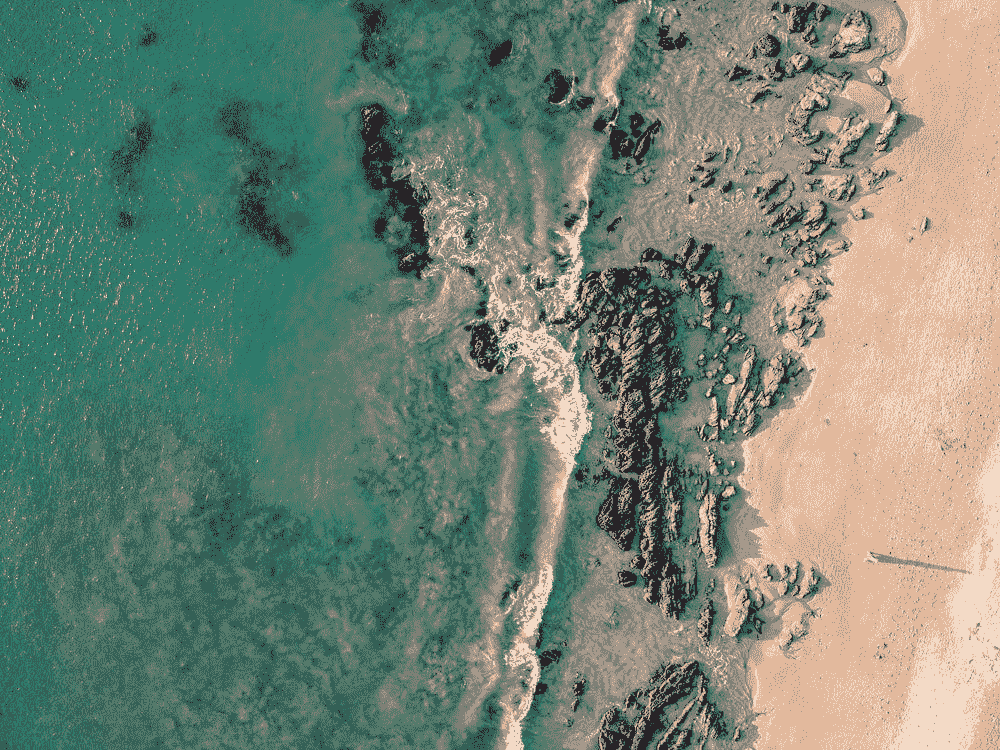
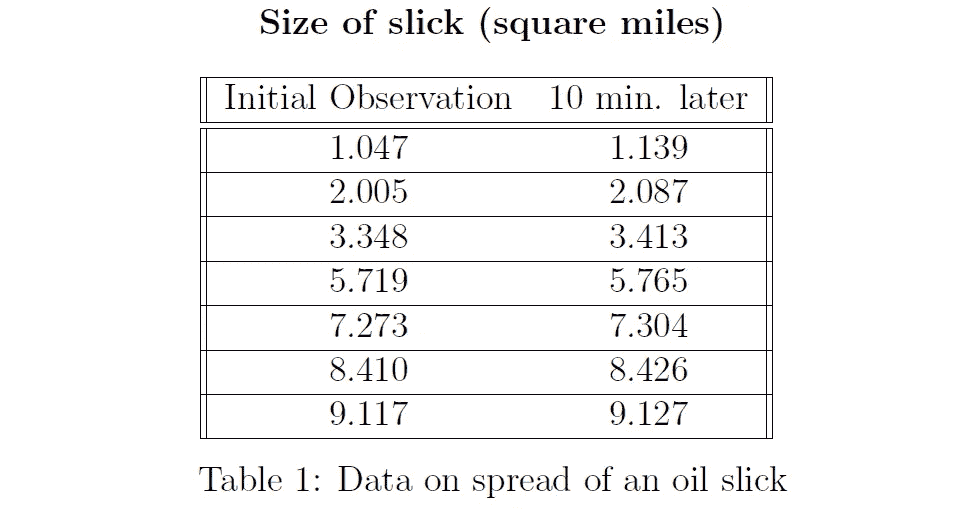
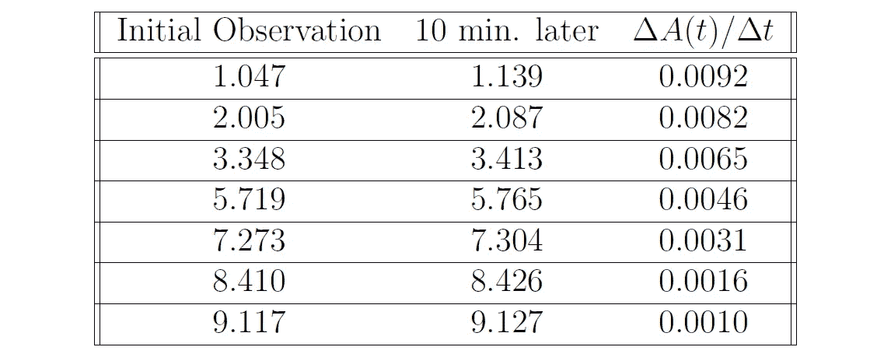
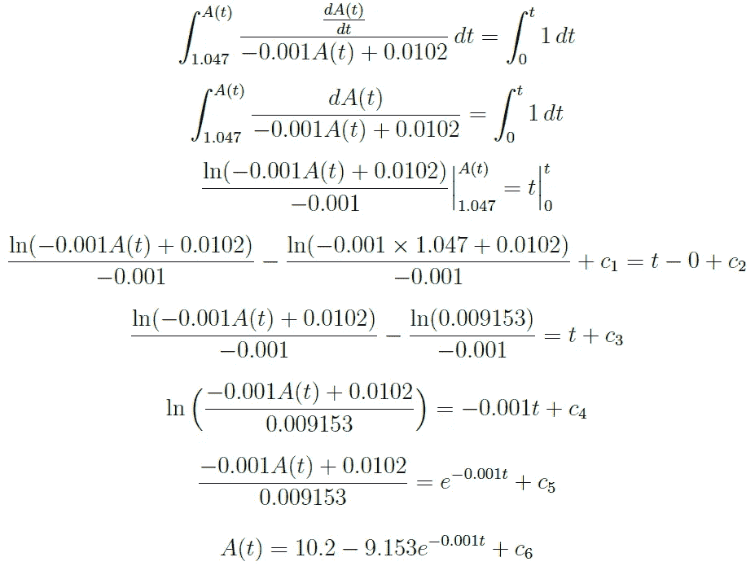
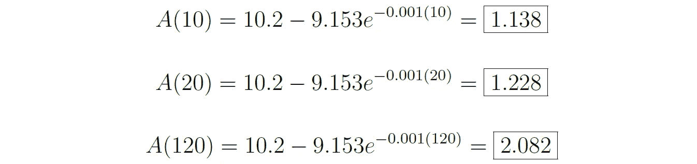
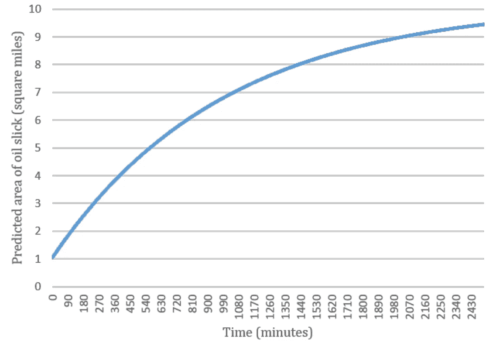

# 用微分方程模拟浮油的扩散

> 原文：<https://towardsdatascience.com/using-differential-equations-to-model-the-spread-of-an-oil-slick-45b6f27d08e5?source=collection_archive---------9----------------------->

## [变更数据](https://towardsdatascience.com/tagged/data-for-change)

## 将数学技术应用于环境问题

图片由[罗伯托](https://unsplash.com/@topikito)在 [Unsplash](https://unsplash.com/photos/Z1LrpFdog9k) 上拍摄

我们将调查一个假设的海面浮油扩散的场景。不时地，但不定期地，一架直升机被派遣去拍摄浮油。每次飞行，直升机都会到达浮油上空。飞行员拍了一张照片，等了 10 分钟，又拍了一张照片，然后回家。在七次航行的每一次中，浮油的大小(平方英里的面积)都是从两张照片中测量的。

我们将使用微分方程来模拟浮油的扩散，预测不同时间浮油的平方英里数，绘制预测函数相对于时间的曲线，并确定记录下表中观察值的时间。需要注意的是，我们将完成一系列具体的任务，这些任务来源于本文末尾的参考资料。

# 第一部分:为浮油的大小建立一个模型

首先，我们可以在上表中添加一列，描述 10 分钟时间段内浮油面积的变化率，也等于δ*A*(*t*)/δ*t*(其中 *A* ( *t* )表示时间 *t* 时的浮油面积)。计算方法如下:

因此，我们得到了下表，并附加了列δ*A*(*t*)/δ*t*。

现在，我们可以用浮油面积的变化率来画出最初的观察值。

根据 Microsoft Excel 计算(如上图所示)，最佳拟合的直线为*y*=–0.001*x*+0.0102，即δ*A*(*t*)/δ*t*=–0.001*x*+0.0102。这也可以表示为一阶线性微分方程模型:

将该微分方程的两边除以–0.001*x*+0.0102，然后相对于 *t* 进行积分以分离出 *A* ( *t* )得出:

假设第一次观测发生在时间 *t* = 0，我们可以代入初始条件( *t* ，*a*(*t*)=(0，1.047)，求解 c₆.简化后，我们得到 c₆ = 0。因此:

# (b)部分:预测 t = 10 分钟、t = 20 分钟和 t = 120 分钟时浮油的未来大小。

我们必须将我们给定的*t*-值 10、20 和 120 代入之前找到的函数 *A* ( *t* )。

# 第(c)部分:绘制你的模型，将浮油的大小作为时间的函数。

下面是基于功能 *A* ( *t* )的模型。

# (d)部分:找出浮油面积为 8 平方英里的时间。

我们必须设置 *A* ( *t* )等于 8，并求解 *t* 。

# (e)部分:确定第一次、第三次、第五次和第七次初次观察的时间。

我们可以使用与第(d)部分所示相同的过程来找到第一次、第三次、第五次和第七次初始观察的时间。

## 第一次初步观察

## 第三次初步意见

## 第五次初步意见

## 第七次初次意见

# 结论

通过这个项目，我们探索了如何通过首先绘制油膜面积变化率的初始观测值，计算精确的趋势线(R 值非常高，为 0.9967！)，并利用数学生成浮油面积的预测方程。当用我们的函数 *A* ( *t* )和我们的初始数据执行“现实检查”时，我们看到这个函数是合乎逻辑的，因为它对于浮油开始快速增长然后随着时间的增加快速减慢到小得多的增长率是有意义的。我们还能够计算出进行某些观察的时间，以及估计浮油未来的大小。

我们可以用来模拟浮油扩散的另一种方法是根据 10 分钟后的观察值绘制初始观察值，而不是根据面积变化率。当执行时，这是通向微分方程的另一条途径。虽然我们可以预期这些结果与我们目前的方法提供的结果略有不同，但它们应该非常接近。

这种方法的一个局限性是，它假设浮油面积的变化只遵循一个微分方程。其次，它没有考虑任何可能影响浮油扩散程度的环境因素。这就很难扩展到其他场景。

总的来说，我们通过将一阶微分方程的技巧应用到现实生活场景中，练习了对浮油区域的分析和建模。在根据给定数据推导精确模型的过程中，我们使用了积分、数学建模和求解给定初始值的微分方程。

# 参考

[1]贾德森，T. W. (2020 年 8 月 1 日)。常微分方程项目。斯蒂芬 f 奥斯汀州立大学。[http://faculty . SF ASU . edu/judson tw/ode/html-2020 08 01/ode project . html](http://faculty.sfasu.edu/judsontw/ode/html-20200801/odeproject.html)

[2]温克尔，b .(未注明)。浮油扩散。用微分方程模拟调查和机会的系统倡议。[https://www . simode . org/resources/2038/download/1-5-S-oil click-student version . pdf](https://www.simiode.org/resources/2038/download/1-5-S-OilSlick-StudentVersion.pdf)