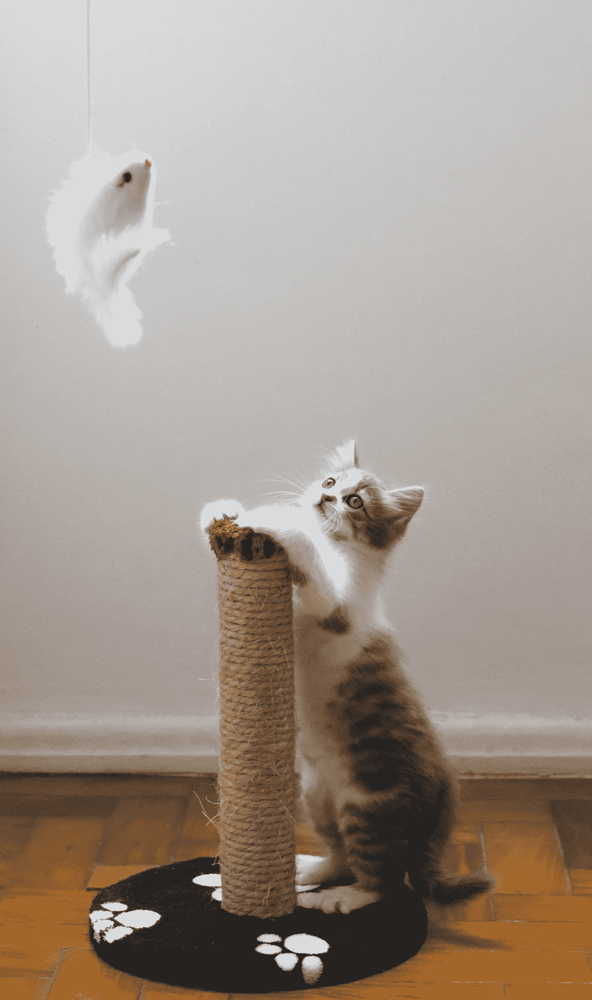

# 用蒸馏来保护你的神经网络

> 原文：<https://towardsdatascience.com/using-distillation-to-protect-your-neural-networks-ea7f0bf3aec4?source=collection_archive---------43----------------------->

## 蒸馏是如何被用来保证神经网络安全的

蒸馏是一个热门的研究领域。对于蒸馏，你首先训练一个深度学习模型*、*、**、**、来解决你的任务。然后，你培养一个**学生网**，可以是任何模式。

教师接受真实数据的培训，学生接受教师输出的培训。它预测老师的输出:无论是标签，标签的概率分布，还是其他。

查尔斯·德鲁维奥在 [Unsplash](https://unsplash.com?utm_source=medium&utm_medium=referral) 上拍摄的照片

*注:有蒸馏的变体。一种是自学，老师和学生的网络是一样的！*

[Bermix 工作室](https://unsplash.com/@bermixstudio?utm_source=medium&utm_medium=referral)在 [Unsplash](https://unsplash.com?utm_source=medium&utm_medium=referral) 上拍摄的照片

# 蒸馏的好处

蒸馏有不同的好处。例如，您可以选择一个比教师网络小的学生网络。你将能够达到比从头开始训练学生模型更高的精确度。同时，你会有一个比老师更小、更简单、更快的模型。

蒸馏还提供了正则化，使你的网络更加一般化。在这篇文章中，我们将讨论蒸馏的一个主要用途:保护你的神经网络免受攻击！

# 为什么有效

就像这篇关于[反思正则化](/exploit-your-hyperparameters-batch-size-and-learning-rate-as-regularization-9094c1c99b55)的文章一样，蒸馏提供了更平坦的局部极小值。因此，输入数据的微小变化不太可能改变预测值。为什么这很重要？攻击者可以创建**对抗性示例**。这些例子包括导致错误预测的真实输入的小变化(例如，改变几个像素)。

这是我的上一篇关于 COVID mask 预测的文章中提到蒸馏的部分原因。如果没有提取，通过修改几个像素来欺骗掩模预测模型是相当容易的。

一个特别危险的例子是:自动驾驶汽车。想象一下，如果一名黑客在停车标志上贴了一张贴纸。贴纸可能看起来像最初的停车标志，但 2%的像素变化会让自动驾驶汽车错过停车标志。这些变化被称为**对抗性扰动**。有了蒸馏，黑客将需要使用更定制的攻击或改变更多的像素，这可能是显而易见的。

# 前进

照片由[威利安·贾斯登·德·瓦斯康塞洛斯](https://unsplash.com/@willianjusten?utm_source=medium&utm_medium=referral)在 [Unsplash](https://unsplash.com?utm_source=medium&utm_medium=referral) 拍摄

你*往往不需要万无一失的安全性，只需要比同类目标更好的安全性*。如果我们能找到一种方法使每个神经网络高度安全，那将是理想的，但目前看来这是遥不可及的。

安全是一场猫捉老鼠的游戏，攻击往往比防御发展得更快。蒸馏是一种基本的防御手段，可以用来 ***让你的网络对攻击*** 更加稳健。你可以使用像 [KD_Lib](https://github.com/SforAiDl/KD_Lib) 这样的库来尝试提取你的网络。

当攻击变种进化到回避防御时，蒸馏变种也进化到对这些攻击免疫。蒸馏会让攻击变得更难，但并非不可能。这是您安全工具箱中的一步。