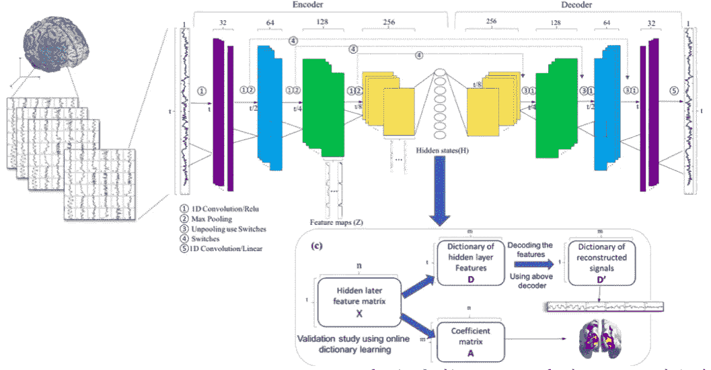

# 使用分布式计算进行神经成像

> 原文：<https://towardsdatascience.com/using-distributed-computing-for-neuroimaging-2689cfc144c9?source=collection_archive---------35----------------------->

## 是的，终于到了使用 PySpark 进行医学成像的时候了


学分:Pexels

如今，由于分辨率、磁场强度、联合体和基础设施的提高，神经影像数据也成为大数据。事实上，每天用几种医学成像模式采集大量的 3D 和 4D 图像。几个数据集与数千个文件一起公开可用，仅举几个例子:

*   [人类连接体项目(HCP)](http://www.humanconnectomeproject.org/)
*   [1000 功能连接体项目](https://www.nitrc.org/projects/fcon_1000/) (1000FCP)
*   [老年痴呆症神经影像倡议](http://adni.loni.usc.edu/)

这些数据集包括功能、结构、扩散、人口统计和其他信息，这些信息每天都在增加，这就产生了用分布式和并行系统加速处理的需求。在影像模态中，功能磁共振成像(fMRI)是一种通过检测血流的相关变化来测量大脑活动的技术。在被称为[血液动力学反应](https://en.wikipedia.org/wiki/Haemodynamic_response)的过程中，活跃的神经元比不活跃的神经元接收更多的氧气，这可以通过核磁共振成像仪检测到。从数据的角度来看，这被转换成 4D 体积(对于脑扫描是 3D 的，然后在时间上跟随血液演变)。因此，如果我们分析几个时间点，每个文件的大小以陡峭的斜率线性增长。此外，信号极易受噪声影响，因此必须应用多种噪声消除算法。类似的情况也发生在扩散数据上，这里我们用不同的梯度来代替时间点。因此，文件也将是 4D 的，但不是时间点，每个体积将代表不同的梯度角度。


fMRI 文件的简单表示(鸣谢 [Sarraf & Ostadhashem](https://arxiv.org/abs/1603.07064)

存储、预处理和分析这种类型的数据在计算上是昂贵且耗时的，因此应该利用具有既定方法的并行计算的优势。功能性和扩散 MRI 的解决方案之一是**使用 Spark / PySpark。**这些工具允许读取和加载成像数据，将它们转换为可并行操作的弹性分布式数据集，并将它们转换回成像格式，如 [NIFTI](https://nifti.nimh.nih.gov/) 。据报道，与传统方法相比，使用(Py)Spark 的计算时间可以减少到四分之一(参见例如 [Makkie 等人 2019](https://www.sciencedirect.com/science/article/pii/S0925231218311470?casa_token=kjsGF5imACcAAAAA:f-ZEd9jn9pucsHdPP-PEGEhFFHbKy0PsAEXRDrsR-uSMhmgKBsSBkQBABWM6nVMi0km_xmSreH8) )。在本文中，我总结了一些越来越复杂的实验/测试。从简单的独立成分分析开始，到功能连接，再到训练大脑时间序列的深度卷积网络。

Spark 大数据技术和工具，如 [Hadoo](http://hadoop.apache.org) p，是面向可靠、可扩展、分布式计算的开源软件编程平台和项目。特别是 Spark 正变得广泛使用，这是由于使用数千个节点的计算时间的改进，以及 Spark (MLlib)和 GraphX(GraphX)的机器学习库的扩展。特别是对于神经成像，典型的管道将使用 Nibable 包(http://nipy.org/nibabel)来访问数据(DICOM 或 Nifti)，然后将数据转换为**弹性分布式数据集(RDD)格式，这是 Spark 架构的基本结构。**实际上，rdd 是*分区的记录集合*。奇特之处在于它们是容错的，可以并行操作。Spark 独立调度程序由三个主要进程组成:主进程、工作进程和驱动程序。应用程序被提交给驱动程序，然后主程序协调进程，将它们分发到集群上的工作节点。典型的工作流程(未显示细分主/工作)如下所示:


fMRI 火花管道示例(鸣谢 [Sarraf & Ostadhashem](https://arxiv.org/abs/1603.07064)

Saman Sarraf 和 Mehdi Ostadhashem [向](https://arxiv.org/abs/1603.07064)展示了一项任务，包括加载、通过 [MELODIC](https://fsl.fmrib.ox.ac.uk/fsl/fslwiki/MELODIC) 工具进行独立组件检测，比较了使用和不使用 PySpark 在 Python 中执行的相同过程，显示了以下计算成本:


同一任务的处理时间(学分[萨拉夫&奥斯塔哈舍姆](https://arxiv.org/abs/1603.07064)

尽管很成功，但这只是在本地机器上的一个简单实验。Boubela 等人在 2015 年描述了一个更现实的场景，他们甚至在亚马逊云上使用了下面的架构。在这种情况下，任务是通过使用时间序列的皮尔逊相关性来构建功能性[连接体](https://www.nature.com/articles/s41598-018-37300-4)。

**架构**可以总结如下


**使用建议分析方法的数据流**。[2015 年布贝拉等人的功劳](https://www.ncbi.nlm.nih.gov/pmc/articles/PMC4701924/)

特别是，在前面提到的研究中，作者在具有 192 GB RAM、两个英特尔至强 X5690 处理器和四个 Nvidia Tesla GPUs 的服务器 Ubuntu Linux(可选 GPU 计算)上从 fMRI 数据计算功能连接性；Spark 集群由 10 台 48 GB 内存的 Linux 机器和 2 个英特尔至强 X5550 处理器组成。

为了在云上实现这一点，亚马逊提供了一个名为 [**EMR**](https://aws.amazon.com/emr/?whats-new-cards.sort-by=item.additionalFields.postDateTime&whats-new-cards.sort-order=desc) 的解决方案，已经由 Yarn、Hadoop 和 Spark 进行了设置。常规设置是一个带有 **S3 数据桶的集群。**下面的视频展示了向这样的基础设施发送数据是多么容易。

关于**实现**，作者设计了**Scala(Spark 的本地语言)中的专用文件阅读器，在多个节点上并行读取 4D NIfTI 文件**，并将结果收集到 Spark 环境中的 RDD 中。读者已经友好的[通过 github](https://github.com/rboubela/biananes.) 分发。

voxelwise 时间序列数据存储在一个 ***RowMatrix*** 对象的列中，该对象是用于与 Apache Spark 机器学习库 *MLlib* 接口以处理大数据的最常见对象。运行独立成分分析或主成分分析的代码将非常类似于众所周知的 Python 脚本，如 [Sci-kit](https://scikit-learn.org/stable/) :

```
**from** **pyspark.mllib.linalg** **import** Vectors
**from** **pyspark.mllib.linalg.distributed** **import** RowMatrix# Toy exmple data
rows = sc.parallelize([
    Vectors.sparse(5, {1: 1.0, 3: 7.0}),
    Vectors.dense(2.0, 0.0, 3.0, 4.0, 5.0),
    Vectors.dense(4.0, 0.0, 0.0, 6.0, 7.0)
])

mat = RowMatrix(rows)
*# Compute the top 4 principal components.* pc = mat.computePrincipalComponents(4)

*# Project the rows to the linear space spanned by the top 4 principal components.* projected = mat.multiply(pc)
```

此外，[连接组学](https://en.wikipedia.org/wiki/Connectomics)研究特别适合 Spark，因为 *GraphX* 库定义了两个 rdd，一个包含顶点，另一个包含边，以便在图上进行分布式计算。

其他值得一提的研究是显微镜 Spark 框架 [**Thunder**](https://github.com/thunder-project/thunder) ，以及 Milad Makkie 关于用于 fMRI 大数据分析的**快速和可扩展的分布式深度卷积自动编码器**的工作。



演职员表 [Makkie 等人 2019](https://www.sciencedirect.com/science/article/pii/S0925231218311470?casa_token=6YDhadqVmH4AAAAA:cvnIOzHgvNdRIhezU0R8wOY3_sxTXBxk75wZ41L-haN2gHLFKgOxqYCJDEhFFaHj2j4_5PWBoCo)

特别是 Makkie 和他的同事表明，即使在 Spark 上运行来自 [TensorFlow 的 autoencoder，也有可能在 Spark 上实现 fMRI 分析框架(如下图所示)。需要重点承担的是，这个版本的 TensorFlow 不是传统的，需要专门下载。](https://github.com/yahoo/TensorFlowOnSpark)

```
# for tensorflow>=2.0.0
pip install tensorflowonspark# for tensorflow<2.0.0
pip install tensorflowonspark==1.4.4
```

总之，基于 Spark 的分布式计算已经被广泛应用于多个任务。如今，需要分析来自 fMRI、扩散或显微镜的大数据集，利用分布式结构作为 Spark 联合到 GPU 上的并行计算可以是一种解决方案。我在这里只提到了几个例子，显示了计算时间和其他性能的提高。

如果科学家无法访问 Spark 集群(例如从大学)，一个可能的解决方案是在亚马逊云上运行 [EMR 结构](https://aws.amazon.com/emr/#:~:text=Amazon%20EMR%20is%20the%20industry,%2C%20Apache%20Hudi%2C%20and%20Presto.)，使用 S3 存储桶来存储数据(如上面的视频所示)。

在神经成像的特殊情况下，加强再现性也很重要，并且还应该记住另外两件事(尽管它们不是特定于分布式系统的，也应该用于独立的应用中):

*   具有以一致的方式结构化的数据，具有所谓的 [*脑成像数据结构*](https://bids.neuroimaging.io/)*【BIDS】*
*   使用标准化管道作为 [fMRIprep](https://fmriprep.org/en/stable/) (总结如下)


fMRIprep 工作流程(图片来自 [J.Gorgolewski](https://www.nature.com/articles/s41592-018-0235-4?WT.feed_name=subjects_computational-neuroscience) )

如果您对 neuroimage 的分布式和并行解决方案有进一步的建议，欢迎在此发表评论。

**参考文献**

[Freeman、Jeremy、Nikita Vladimirov、Takashi 川岛、鱼目、Nicholas J. Sofroniew、Davis V. Bennett、Joshua Rosen、Chao-Tsung Yang、Loren L. Looger 和 Misha B. Ahrens。"用集群计算绘制大规模的大脑活动图."*自然方法* 11，2014 年第 9 期:941–950。](https://www.nature.com/articles/nmeth.3041)

[Boubela，Roland N .等人，“使用 apache spark 和 GPU 处理的大规模 fMRI 数据分析的大数据方法:人类连接体项目的静息态 fMRI 数据演示”*神经科学前沿* 9 (2016): 492。](https://www.frontiersin.org/articles/10.3389/fnins.2015.00492/full)

[Makkie，m .，Huang，h .，Zhao，y .，Vasilakos，A.V .和刘，t .，2019 年。用于 fMRI 大数据分析的快速可扩展分布式深度卷积自动编码器。*神经计算*， *325* ，第 20–30 页。](https://www.sciencedirect.com/science/article/pii/S0925231218311470?casa_token=kjsGF5imACcAAAAA:f-ZEd9jn9pucsHdPP-PEGEhFFHbKy0PsAEXRDrsR-uSMhmgKBsSBkQBABWM6nVMi0km_xmSreH8)

[Makkie，m .，Li，x .，Quinn，s .，Lin，b .，Ye，j .，Mon，g .，&刘，T. (2018)。用于 fMRI 大数据分析的分布式计算平台。 *IEEE 大数据汇刊*， *5* (2)，109–119。](https://ieeexplore.ieee.org/abstract/document/8307234?casa_token=v_io0trUejsAAAAA:AAxtGTk28rXPrMubc_5yaEjAA4AgjQR0WYsVG7dx_j5Sw1hv1ryKL_3Gz7ZEKLhqxpN_VnHIHsM)

## **随意连接:**


[@ Dr _ Alex _ 克里米](https://twitter.com/Dr_Alex_Crimi)


[@dr.alecrimi](https://www.instagram.com/dr.alecrimi/)