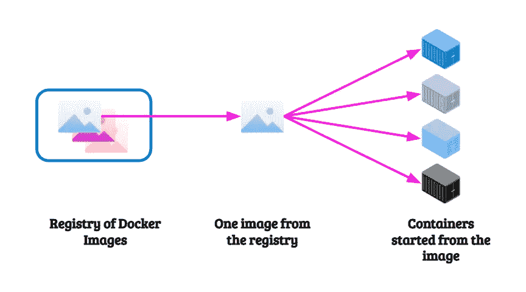
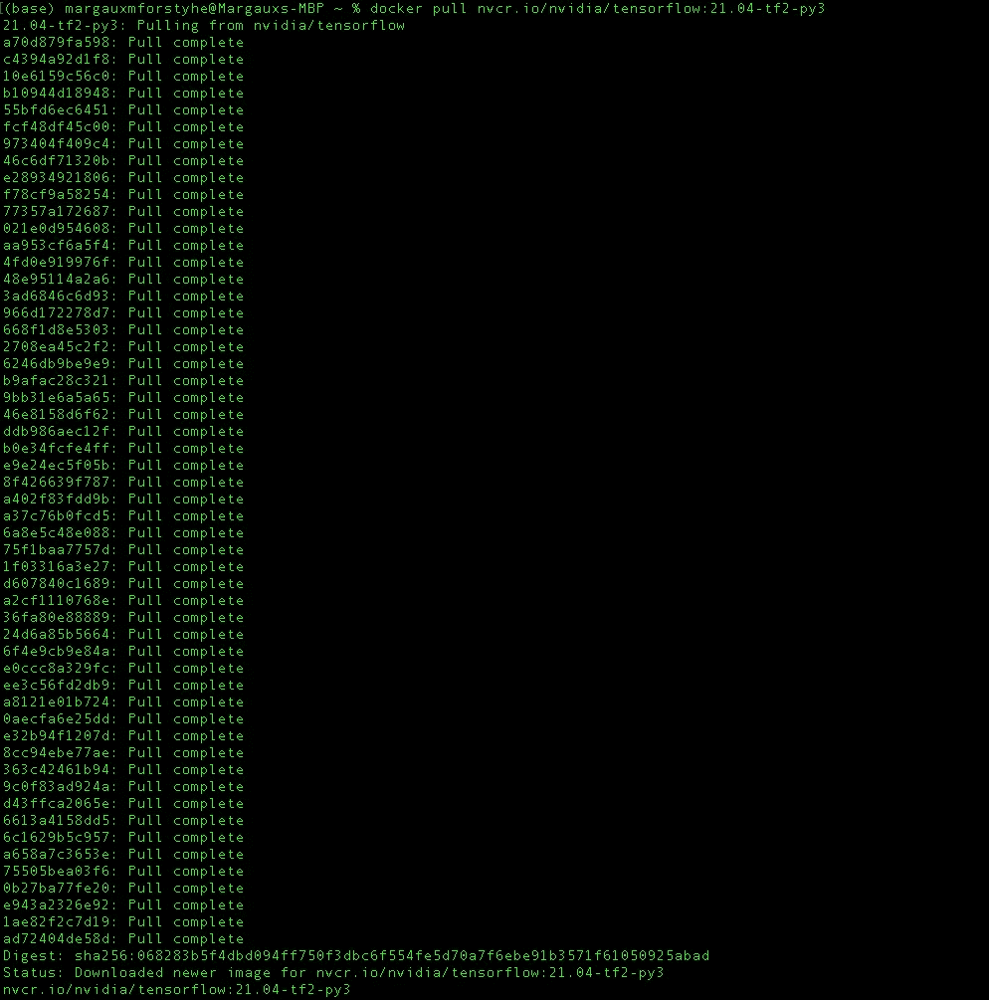
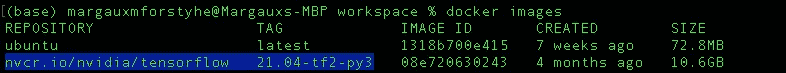
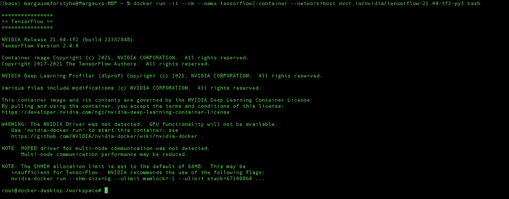
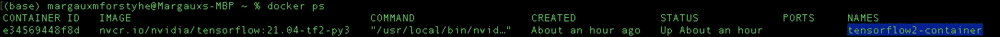
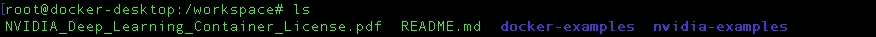
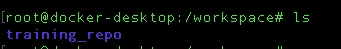
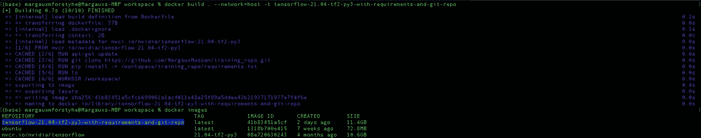
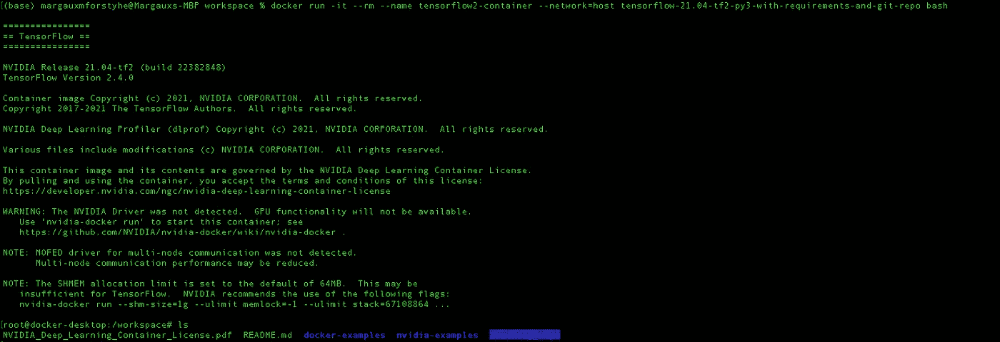

# 将 Docker 用于深度学习项目

> 原文：<https://towardsdatascience.com/using-docker-for-deep-learning-projects-fa51d2c4f64c?source=collection_archive---------2----------------------->

## 作为一名机器学习工程师，我每天都使用 docker 容器，这帮助我节省了大量时间，并保持有序。


保罗·泰森在 [Unsplash](https://unsplash.com?utm_source=medium&utm_medium=referral) 上的照片

在这篇文章中，我将解释如何在我的日常项目中使用 Docker。关于这个主题有很多很好的文档和视频，但我想分享一种我在从事的几个行业项目中一直使用的方法。

> Docker 是什么？

Docker 使用操作系统级虚拟化来交付称为容器的软件包中的软件。每个**停靠容器**都是从**停靠图像**中创建的。一个映像拥有构建**环境**的所有信息(库、文件夹、文件、操作系统等)。容器是相互隔离的。



Docker 流-按作者分类的图像

官方 Docker 文档可以在此[链接](https://docs.docker.com/)找到。

要下载 Docker，您可以访问这个[链接](https://www.docker.com/products/docker-desktop)，在本文的其余部分，我将假设 Docker 已经正确安装在机器上。

# 深度学习项目为什么要用 Docker？

当你在机器上运行深度学习培训时(在云上或本地)，你需要能够轻松地运行培训，而不必每次都为设置环境而挣扎。此外，如果出于某种原因，您想在另一台机器上运行此培训，您不希望再次经历所有设置。

理想情况下，我们希望有一个命令可以放心地跨机器运行。这就是为什么我几乎一直使用 Docker 容器进行培训。

以下是 Docker 对我的主要优势:

*   所有必需的包都已经安装了训练的正确版本:例如，如果我想使用 *Tensorflow2* 进行一次训练，我为此配置了一个 docker 映像，另一个用于 *Tensorflow1* ，另一个用于 *Pytorch* 。
*   如果在单个 GPU 上运行，我可以对所需的 GPU 进行分区。
*   由于所有容器都是独立的，因此如果执行崩溃，其他进程不会受到影响——因此其他 GPU 不会受到影响，例如当我选择特定的 GPU 用于训练时。
*   如果使用 git 存储库作为源代码，我通常会将它添加到主 docker 映像中，然后在每次创建 docker 容器时进行 git pull，并切换到我想要使用的分支/提交。
*   本地文件夹/文件和 NAS 可以在启动容器时轻松挂载——因此不需要复制，节省了时间，尤其是在我调试某些东西的时候。

# Docker 简介

以下是您需要了解的一些基本命令:

*   显示当前运行的容器:

```
docker ps
```

*   显示所有容器(甚至那些不再运行的容器):

```
docker ps -a 
```

*   显示本地保存的图像:

```
docker images
```

*   移除 docker 容器:

```
docker stop container_name # if container is running
docker rm container_name
```

*   移除所有 docker 容器(不再运行):

```
docker container prune
```

*   移除图像:

```
docker rmi image_name
```

*   删除所有 docker 图像(非常小心这一个！):

```
docker image prune -a
```

# 在 Docker 容器中运行 Tensorflow2 培训

## Docker 图像

首先，我们提取包含 Tensorflow 版本 2.1.04 和 Python3 的 NVIDIA 映像(这将需要一些时间):

```
docker pull nvcr.io/nvidia/tensorflow:21.04-tf2-py3
```



Docker pull done 按作者分类的图像

完成后，我们使用命令`docker images`检查图像是否在本地图像列表中:



列出 Docker 本地图像—按作者分类的图像

我们确实看到了带有标签`21.04-tf2-py3`的图像`nvcr.io/nvidia/tensorflow`。

## 用这个图像启动一个容器，并浏览一些标志

我们可以使用此图像创建一个容器:

```
docker run -it --rm --name tensorflow2-container --network=host nvcr.io/nvidia/tensorflow:21.04-tf2-py3 bash
```



Tensorflow2 图像中的 Docker 容器已打开-作者提供的图像

我们在这个命令中使用了一些特定的标志:

*   `-it`用于打开一个交互终端
*   `--rm`是用来当我们退出集装箱时，它会把它移走
*   `--name`用于用自定义名称给容器命名
*   `--network=host`用于访问容器中的互联网(与主机相同的网络)
*   然后，我们有了要使用的图像的名称，后跟`bash`以在容器中创建一个交互式 shell

如果我们在另一个终端中运行`docker ps`，我们将看到我们的新容器:



docker ps 命令来查看新启动的容器——按作者排序的图像

我们确实看到了我们的集装箱`tensorflow2-container` ✅

现在，如果我们想将我们的**本地工作区**用于训练脚本，我们可以通过使用`-v /Users/margauxmforstyhe/workspace/:/workspace`将我的工作区文件夹挂载到容器中。此参数将我们计算机上的工作区文件夹挂载到容器中的基本工作区文件夹。

在我们当前的容器中，如果我们运行`ls`,我们会看到:



Docker 容器中的默认工作空间文件夹-按作者排序的图像

让我们退出当前使用命令`exit`打开的 docker 容器，并使用工作区文件夹创建一个新的容器:

```
docker run -it --rm --name tensorflow2-container --network=host -v /Users/margauxmforstyhe/workspace/:/workspace nvcr.io/nvidia/tensorflow:21.04-tf2-py3 bash
```

并运行`ls`:



Docker 容器中的本地工作区文件夹-按作者排序的图像

➡️本地工作区安装在 Docker 容器中，我们现在可以使用它进行培训/测试。

当我做一些训练测试时，我使用一台带有 GPU 的机器，并为 GPU0 选择一个带有`--gpu=device=0`的 GPU。然后，当我完成测试时，我通常运行如下命令来开始训练:

```
docker run -i -d --rm --gpus=device=0 --name tensorflow2-container --network=host -v /Users/margauxmforstyhe/workspace/:/workspace nvcr.io/nvidia/tensorflow:21.04-tf2-py3 bash -c "export PYTHONPATH=/workspace && python3 /workspace/training_repo/train.py .... {parameters for the training}"
```

这里我们有一个处于**分离模式的 docker 容器** ( `-d`意味着我们看不到终端中代码的执行)在 0 号 GPU 上运行本地训练脚本。

> **注意:**这和推理脚本完全一样，你只需要改变被调用的 python 脚本。

另一种方法是拥有一个包含所有训练脚本的 git 存储库，并将其作为映像的一部分添加进来。让我们用一个 [Dockerfile](https://docs.docker.com/engine/reference/builder/) 来做这件事吧！

## 使用 Docker 文件构建 Docker 映像，并使用 git 存储库作为训练存储库

Dockerfile 文件用于创建图像。例如，我们想要在我们之前使用的映像`nvcr.io/nvidia/tensorflow:21.04-tf2-py3`之上创建一个映像，然后我们想要从 Github 克隆[*training _ repo*](https://github.com/MargauxMasson/training_repo.git)并安装运行培训的所有需求(例如`install rasterio`，或者安装一个特定包的版本)，这为我们提供了这个 docker 文件:

```
FROM nvcr.io/nvidia/tensorflow:21.04-tf2-py3RUN apt-get update 
RUN git clone [https://github.com/MargauxMasson/training_repo.git](https://github.com/MargauxMasson/training_repo.git)
RUN pip install -r /workspace/training_repo/requirements.txt
RUN lsWORKDIR /workspace/CMD "ls"
```

为了构建这个图像——我们将把它命名为`tensorflow-21.04-tf2-py3-with-requirements-and-git-repo`——我们使用命令`docker build`(需要在 Dockerfile 所在的文件夹中运行):

```
docker build . --network=host -t tensorflow-21.04-tf2-py3-with-requirements-and-git-repo
```



使用 Dockefile 构建图像—按作者分类的图像

我们看到图像的构建工作正常，当我们用`docker images`检查时，我们确实看到了新的图像`tensorflow-21.04-tf2-py3-with-requirements-and-git-repo`。

**注意:**docker 构建命令中的`“.”`表示名为`Dockerfile`的 docker 文件位于我们运行命令的文件夹中。

现在，当我们使用这个映像启动容器时，我们不需要挂载本地工作区，因为 git repo 已经在映像中了:

```
docker run -it --rm --name tensorflow2-container --network=host tensorflow-21.04-tf2-py3-with-requirements-and-git-repo bash
```



实际上， *training_repo* 就在容器的工作区中。

即使 git 存储库中的代码发生了变化，也可以不加修改地使用这个映像。当启动容器时，我们可以`git pull`或`git checkout`到任何想要的分支/提交:

```
docker run -i -d --rm --gpus=device=0 --name tensorflow2-container --network=host tensorflow-21.04-tf2-py3-with-requirements-and-git-repo bash -c "cd /workspace/training_repo && git pull && git checkout my_training_dev_branch && export PYTHONPATH=/workspace && python3 /workspace/training_repo/train.py .... {parameters for the training}"
```

同样，正如启动容器时所建议的，我们可以添加这些标志:`--shm-size=1g --ulimit memlock=-1 --ulimit stack=67108864`

所以:

```
docker run -i -d --rm --gpus=device=0 --name tensorflow2-container --network=host --shm-size=1g --ulimit memlock=-1 --ulimit stack=67108864 tensorflow-21.04-tf2-py3-with-requirements-and-git-repo bash -c "cd /workspace/training_repo && git pull && git checkout my_training_dev_branch && export PYTHONPATH=/workspace && python3 /workspace/training_repo/train.py .... {parameters for the training}"
```

有很多方法可以使用 Docker，但这是我喜欢使用它进行训练和推理的方式，它帮助我保持有组织性，因为我有一些特定的图像(或至少 Docker 文件),我可以自信地使用它们，并知道我的训练代码将毫无困难地运行。


GIF 来自[https://media.giphy.com/media/g0gtihsbzj5pSWgcml/giphy.gif](https://media.giphy.com/media/g0gtihsbzj5pSWgcml/giphy.gif)