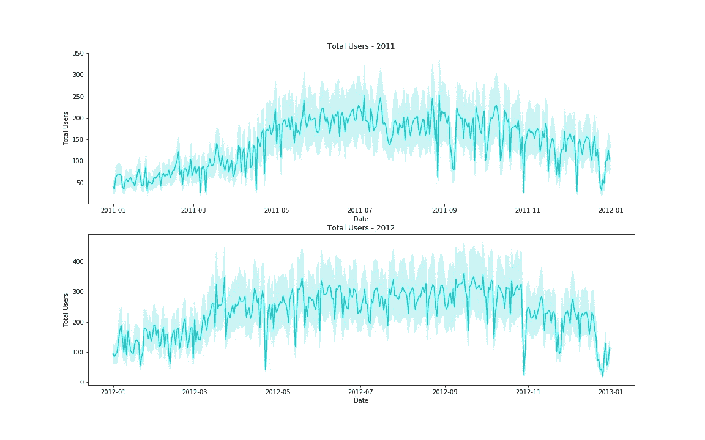
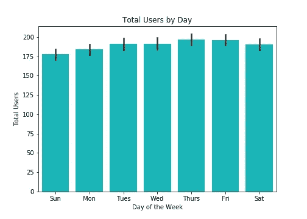
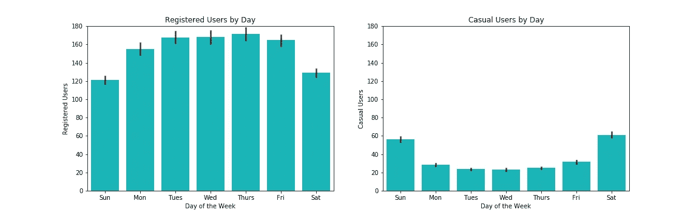
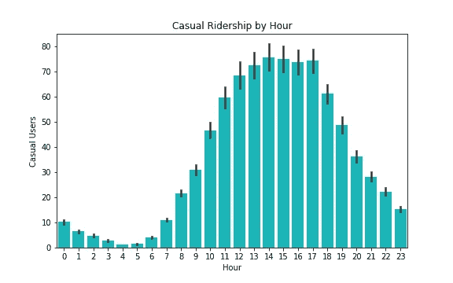
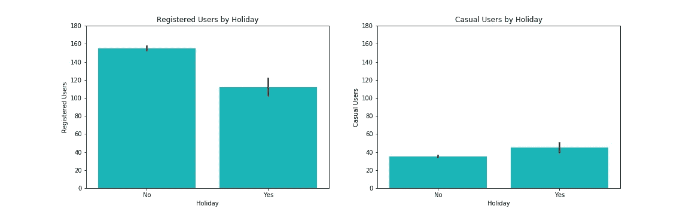
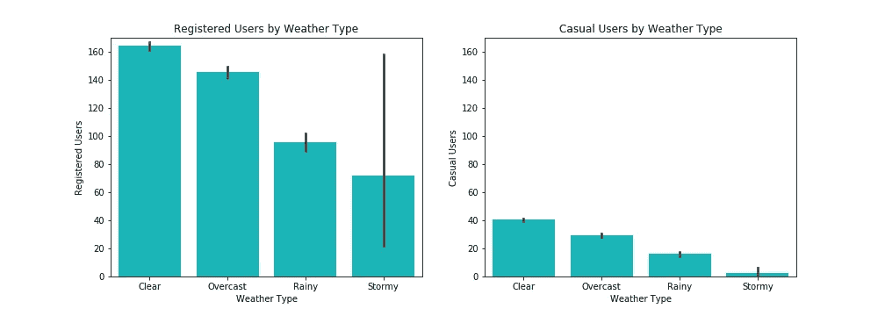

# 使用 EDA 生成业务理解

> 原文：<https://towardsdatascience.com/using-eda-to-generate-business-understanding-7f07f81e5af6?source=collection_archive---------55----------------------->

## [数据科学](https://towardsdatascience.com/data-science/home)

## 对客户细分和外部因素的洞察

在几个以神经网络为特色的背靠背项目(你可以在这里探索[这里](/detecting-leukemia-with-a-cnn-af699b19ab99)和[这里](/how-to-deploy-your-custom-ml-model-with-streamlit-and-heroku-53456cb054fb))并决定[从头开始构建一个神经网络](/why-you-should-build-a-neural-network-from-scratch-bdee4f265f08)之后，我想开始一个以 EDA 为重点的项目，以保持我的熊猫技能敏锐并回到数据科学的根源。从数据中获得深刻的、可操作的理解和建议。

[图片](https://unsplash.com/photos/rtjsWoes2xg)由[元彬杜](https://unsplash.com/@dean_du)在 [Unsplash](https://unsplash.com/) 上提供

# 数据

首都自行车共享数据集分布很广。可以在 [UCI](https://archive.ics.uci.edu/ml/datasets/bike+sharing+dataset) 或[数据世界](https://data.world/data-society/capital-bikeshare-2011-2012)上找到。它包含 2011 年和 2012 年的约 17，000 条意见。虽然数据相当干净，但有点棘手，因为数据的粒度，或者一次观察代表的是一天中的一个小时。这些功能包括**天气数据** —温度、风阻和天气类型，**时间数据** —日期、星期几、小时和假日，以及**乘客数量** —分为临时乘客和注册乘客。

如果我们绘制两年内每小时的总用户数，我们可以快速了解全年的乘客量变化。

> 如果适用的话，我喜欢通过查看我的主要特性和目标特性的分布来开始我的 EDA 项目。在这一点上，我没有建模任何东西，但是查看这个分布可以快速了解高级行为。

一段时间内的用户总数。图片作者。

# 客户细分…

…是一个强大的工具。它可以阐明客户群之间的主要差异，以及这些不同的偏好如何影响业务决策并推动客户体验的改善。

潜伏在这个数据集中的是一个客户细分力量的完美例子，以及当你没有意识到它的发生或者你愿意忽略它时会发生什么！

按一周中的每一天来看每小时的总用户数，这几天之间似乎没有显著差异！

一周中每一天每小时的用户总数。图片作者。

所以我们可能会得出结论，一周中的某一天并不会真正影响乘客数量，对吗？好吧，让我们试着把总用户分解成临时用户和注册用户。

一周中每一天每小时的登记乘客和临时乘客。图片作者。

这里我们看到一个非常不同的故事！这两个群体有相反的行为。注册用户通常是在工作日骑行的商务通勤者，而临时用户是为了休闲或锻炼，因此在周末骑行更多。凑巧的是，将它们聚合在一起几乎完美地隐藏了这种区别。

这就是 EDA 可以为企业提供有价值的细节的地方。现在，我们可以开始区别对待这些细分市场，以满足它们不同的定位和需求。

也许我们想为通勤者提供折扣，或者为临时用户启动一个“打卡”计划，让他们每乘坐 X 次车就能获得一次免费租赁。或者尝试用打折的升级包把临时用户转化为注册用户。或者走另一条路！只在周末给注册用户一个免费的“伙伴通行证”，这样他们可以带一个朋友，增加临时乘车人数(并可能获得一个新客户)。

我们可以通过查看每小时登记的乘客数量来确认登记的乘客主要是通勤者。上午 8 点和下午 5 点至 6 点的高峰时段有明显的高峰。

一天中每个小时登记的乘客人数。图片作者。

我们看到休闲骑手的模式非常不同(记住，他们在周末骑得更多)。每小时的客流量集中在下午，毕竟那是最舒适的乘车时间！请注意，y 轴的比例相对于注册乘客量要小得多。

一天中不同时段的临时乘客。注意与上面相比的 y 轴刻度。图片作者。

为了巩固我们的理解，我们可以看看这两组人在假期是如何骑车的。如果我们知道注册用户大多是商务通勤者，我们可能会希望他们在假期少骑点车，因为他们不用上班。另一方面，也许临时用户利用这一天去公园骑自行车！

假日的登记乘客和临时乘客。图片作者。

这似乎有一些证据，尽管数据中似乎也有相当多的噪音。如果是假日，注册用户确实骑得少，临时用户骑得差不多——大多数假日是在工作周，所以因为临时用户在工作周骑得不多，我们真的不希望看到他们的骑行量有很大差异。

# 天气

现在让我们看看一些影响乘客的外部因素，主要是环境因素，如天气和温度。气温对整体乘客量有很大影响。甚至全年客流量的差异也常常归因于温度。冬天的客流量并不是因为冬天而减少，而是因为外面是 0 度！

数据集有 4 类天气:

1.  晴朗，少云，部分多云
2.  薄雾和多云，薄雾和破碎的云，薄雾
3.  小雪、小雨和雷雨、小雨和零散的云
4.  大雨、冰粒、雷暴和雾、雪和雾

这是一个相当武断的评级系统，但它会完成工作。

按天气类型划分的注册乘客和临时乘客。图片作者。

在这两个客户群中，天气恶劣程度和乘客量之间存在负相关关系。随着天气恶劣程度的增加，乘客数量会减少。(或者你可以说这是一种积极的关系，随着天气的改善，乘客数量会增加)

但是在注册乘客中有一个有趣的现象。暴风雨条件(最坏的天气)的 95%置信区间包括其他天气类型！这里发生了什么事？

嗯，没有进一步的调查，很难说出细节，但我们可以假设。例如，我假设对于许多骑车人来说，自行车租赁是他们唯一的通勤选择，因此无论天气如何都必须骑车上下班。他们的行为非常缺乏弹性，或者很少有其他选择(也许他们没有汽车，火车/地铁也不在他们的社区服务)。

另一个假设是，这些通勤者在早上条件正常时骑车去上班，然后一场突如其来的暴风雨(或错过的天气预报)让他们骑车去上班。他们别无选择，只能骑自行车下班回家，否则他们可能会努力避免这种情况。

# 结论

探索性数据分析是数据科学过程中的一个重要步骤。你需要成为数据专家，才能理解你正在看的东西！即使是看起来简单明了的数据，比如我们的原始数据，乘客数量看起来稳定，**也可能隐藏着细微的差别，这将改变你对你的商业案例的看法**。

深入了解您的客户群将使您能够针对特定人群制定战略，并避免“一刀切”的客户获取和保留心态。毕竟，我们已经看到注册用户和临时用户有非常不同的需求，但在对公司的影响方面却是互补的。你不想把重点放在注册用户上，以至于疏远临时用户。

最后，一些因素——比如众所周知的天气——将永远在你的控制之外。再多的营销或复杂的建模都无法阻止一月对大多数乘客来说太冷，也无法阻止他们乘坐预报中有雷雨的火车。但了解这些外在因素如何影响你的客户并将其纳入你自己的业务预测中仍然很重要。

你可能只需要一些创造性的思维——也许是一个动态定价模型，当天气/温度变得不舒服时降低价格，以鼓励继续骑行。无论你的商业案例是什么，都要带着不断学习的心态去对待它，记住要像使用左脑一样多的使用右脑。

# 连接

我一直在寻找连接和探索其他项目！这个项目的回购，所有的数字和代码都可以在我的 GitHub 上找到。

[LinkedIn](https://www.linkedin.com/in/aren-carpenter/)|[Medium](https://arencarpenter.medium.com/)|[GitHub](https://github.com/ArenCarpenter)