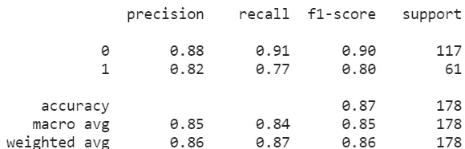

# 使用实体嵌入提高机器学习模型的性能

> 原文：<https://towardsdatascience.com/using-entity-embeddings-to-improve-the-performance-of-machine-learning-models-7bf35e9a7822?source=collection_archive---------27----------------------->

## 在 ML 模型中实现由神经网络学习的嵌入的教程


米卡·鲍梅斯特在 [Unsplash](https://unsplash.com?utm_source=medium&utm_medium=referral) 上的照片

本文的目的是提供关于如何在 ML 模型中实现由神经网络学习的嵌入的信息。因此，我们不会详细讨论嵌入理论。

注意:假设你了解深度学习和机器学习的基础知识

# **什么是实体嵌入，为什么使用实体嵌入？**

不严格地说，实体嵌入是分类变量以连续方式的向量表示。在神经网络的上下文中，嵌入将每个实例的特征从其原始空间转换到低维向量空间表示，同时保留来自其特征的信息，并且还在嵌入空间中有意义地表示每个类别。因此，使用嵌入可以让模型了解每个变量之间的相互关系，从而提高性能。

# **实现**

使用由神经网络学习的嵌入来训练 ML 模型的一般步骤是:

1.  用嵌入层训练神经网络。
2.  从训练好的神经网络中提取嵌入。
3.  用来自训练好的神经网络的分类变量的嵌入替换分类变量。
4.  使用嵌入来训练你的 ML 模型。

在本教程中，我们将使用 sklearn、fastai、PyTorch 和著名的泰坦尼克号数据集进行演示。您可以使用自己选择的框架来复制这一点。在本教程之前，已经完成了数据清理和特征工程。

```
#required libraries
from sklearn.metrics import classification_report
import pandas as pd
from sklearn.preprocessing import OneHotEncoder
from sklearn import preprocessing
from sklearn.ensemble import RandomForestClassifier
from fastai.tabular.all import *
```

在使用 FastAI 将数据输入神经网络之前，对数据进行预处理

```
dls = TabularPandas(df_train, y_names="Survived", y_block=CategoryBlock, 
    cat_names = ['Cabin', 'Title', 'Sex'],
    cont_names = ['Age', 'Pclass', 'Fam_size'],
    procs = [Categorify, FillMissing, Normalize], splits = RandomSplitter(valid_pct=0.2)(range_of(df_train)))
to_nn = dls.dataloaders()
```

创建一个 TabularLearner，用 lr_find()找到一个合适的学习速率。

```
learn = tabular_learner(to_nn, metrics=accuracy)learn.lr_find()
```

训练神经网络。

```
learn.fit_one_cycle(8, 2e-2)
```

从训练的神经网络中提取嵌入，并用来自训练的神经网络的分类变量的嵌入来替换分类变量。

```
#function to embed features ,obtained from fastai forums
def embed_features(learner, xs):
    xs = xs.copy()
    for i, feature in enumerate(learner.dls.cat_names):
        emb = learner.model.embeds[i]
        new_feat = pd.DataFrame(emb(tensor(xs[feature], dtype=torch.int64)), index=xs.index, columns=[f'{feature}_{j}' for j in range(emb.embedding_dim)])
        xs.drop(columns=feature, inplace=True)
        xs = xs.join(new_feat)
    return xsemb_xs = embed_features(learn, to_nn.train.xs)
emb_valid_xs = embed_features(learn, to_nn.valid.xs)
```

使用嵌入来训练你的 ML 模型。

```
rf = RandomForestClassifier(n_estimators=400, min_samples_leaf=10,      
                          max_features=1/2, max_samples = 50)
rf = rf.fit(emb_xs,to_nn.train.y)
valid_preds = rf.predict(emb_valid_xs)
print(classification_report( to_nn.valid.y,valid_preds))
```



图片来自作者。

与在原始数据集上训练的随机森林相比，在嵌入数据上训练的随机森林上，我们获得了 3%的准确性提高，这是一个相当大的提高！

# **结论**

使用实体嵌入不仅可以帮助我们更好地理解和可视化我们的数据，而且还可以提高 ML 模型的性能。嵌入是处理分类变量的有用工具，也是对传统编码方法(如一键编码)的升级。