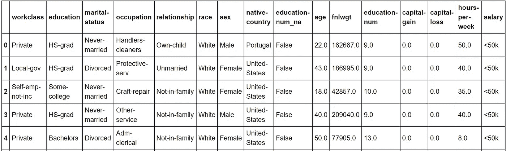

# 使用 fastai 回调进行高效的模型训练

> 原文：<https://towardsdatascience.com/using-fastai-callbacks-for-efficient-model-training-cb03160a5f17?source=collection_archive---------21----------------------->


图像快门库

## 利用提前停止和模型保存回调的力量

当你训练一个深度学习模型时，你想从你用来训练模型的资源中获得最大的收益。如果你使用像 Paperspace Gradient 这样的按小时付费的环境，时间就是金钱。如果你能在更短的时间内训练出你的模型，你就能省钱。即使你正在使用 Colab，并且计价器没有运行，你自己的时间仍然是宝贵的，所以知道如何最大限度地利用你可用的时间和能力来训练你的深度学习模型是值得的。在本文中，我将描述两个回调，你可以在 fastai 中使用它们来确保你的模型训练尽可能高效。我在本文中描述的例子在我的 Packt book[Deep Learning with fastai Cookbook](https://www.amazon.com/Deep-Learning-fastai-Cookbook-easy/dp/1800208103/ref=sr_1_1?dchild=1&keywords=%22deep+learning+with+fastai+cookbook%22&qid=1627678139&sr=8-1)中有更详细的解释。

## 训练深度学习模型的两个问题

fastai 与 Keras 有一个共同的特点，Keras 是另一个常用的深度学习高级框架。在这两个框架中，模型训练过程不是开箱即用的。默认情况下，模型训练过程存在以下问题:

1.  训练过程将按照您在 fit 语句中指定的次数继续进行，即使您想要优化的指标不再改进。
2.  您在训练过程结束时获得的模型具有来自最后一个时期的权重，即使存在其权重会导致模型具有更好性能的更早时期。

幸运的是，fastai 和 Keras 都以**回调**的形式包含了这两个问题的解决方案。在本文的剩余部分，我将解释 fastai 中的这些回调。关于如何使用回调来控制 Keras 中的模型训练过程的类似描述，请参见我的曼宁著作[的第 6 章“结构化数据深度学习](https://www.amazon.com/Deep-Learning-Structured-Data-Mark/dp/1617296724/ref=sr_1_1?dchild=1&keywords=%22deep+learning+with+structured+data%22&qid=1627678682&sr=8-1)”。

## 基线:在没有回调的情况下训练模型

为了查看 fastai 回调的影响，我们将从训练一个没有回调的模型开始。该模型在 fastai 策划的数据集 ADULT_SAMPLE 上进行训练，该数据集包含个人的详细信息，如受教育年限、婚姻状况和职业类别。



成人 _ 样本数据集

在成人样本数据集上训练的模型的目标是预测给定个人的工资是高于还是低于 50 k。

我们首先训练没有回调的模型:

请注意对 set_seed()的调用。我们这样做是为了在不同的训练运行之间的每个时期获得一致的结果。这使我们能够在训练运行之间进行比较，并强调回调的影响。如果我们不调用 set_seed()，我们将在运行之间得到不一致的结果。例如，历元 2 上的精度对于每次训练运行将是不同的。

以下是应用于不带回调的学习者对象的 fit 语句的输出:


没有回调的基线的 fit 语句的输出

精确度增加到时段 2，然后在时段 3 下降，并在剩余时段振荡直到时段 9。当我们对学习者对象运行 validate()时:

```
learn.validate()
```

输出显示，在训练运行结束时，训练模型的精度是历元 9:


不带回调的模型的 validate()输出

由于没有回调，我们遇到了本文开头提到的两个问题:在模型停止改进之后，训练运行继续进行，并且从训练运行中出来的经过训练的模型的性能比在训练运行期间看到的最佳性能差。

## 添加提前停止回调，以便在模型性能停止提高时停止训练运行

现在我们已经建立了一个没有回调的基线，让我们添加一个早期停止回调，以便在模型性能停止提高时停止训练运行。

我们将使用用于训练基线模型的相同的 dataloaders 对象，但是这一次我们将在 fit 语句中指定一个早期停止回调:

fit 语句的输出现在显示，尽管指定了 10 个时期，但是训练运行只进行到时期 5。耐心参数被设置为 3，因此在每个高精度标记之后，训练过程得到 3 个时期的改进。如果在高水位标记后的 3 个时期内没有改善，训练过程将自动停止。


带有提前停止回调的 fit 语句的输出

在时段 2 中精度的高水位标记之后，精度没有变得更好，因此训练运行在 3 个时段之后，在时段 5 之后停止。

当我们在学习者对象上运行 validate()时，输出显示训练过程产生的模型的精度再次是训练运行的最终时期的精度，即使更早的时期具有更高的精度:


通过提前停止回调训练的模型的 validate()输出

## 保存训练过程中的最佳砝码组

添加早期停止回调是对基线的改进，因为在准确性不再提高后，我们没有运行那么多无效的时期。然而，在最终的训练模型中，我们仍然没有达到最佳精度，因此仍然有改进的空间。为了获得最佳的准确性，我们将添加一个模型保存回调，以确保经过训练的模型在训练过程中具有最佳的准确性。

我们将再次使用用于训练基线模型的相同的 dataloaders 对象，但是这次我们将在 fit 语句中指定两个回调。我们还会将学习者对象的路径设置为可写目录，以便在培训过程中保存模型:

就像上一节中的模型一样，fit 语句的输出显示，即使指定了 10 个时期，训练运行也只进行到时期 5。


带有提前停止回调和模型保存回调的 fit 语句的输出

再次，由于提前停止回调，在精度在时段 2 中的高水位标记上停止提高之后，训练过程自动停止 3 个时段。

训练结束时，训练好的模型的精度如何？对该模型的学习者对象运行 validate()表明，精度不是来自训练运行的最终时期的精度。这一次，精确度与我们在纪元 2 的高水位标记中看到的一致。


通过提前停止回调和模型保存回调训练的模型的 validate()输出

通过回调、提前停止和模型保存，我们解决了本文开头提到的两个问题:

*   多亏了早期停止回调，我们避免了做一堆无效的时期，因为精度不再提高。
*   由于模型保存回调，从训练过程中得到的训练模型具有我们在训练过程中看到的最佳准确性。

## 结论

通过使用 fastai 中的提前停止和模型保存回调，您可以从培训周期中获得最大收益。您将避免在模型没有改进的时期耗尽容量，并且您可以确保在训练周期结束时，您拥有具有最佳性能的模型。

以下是与本文相关的一些资源:

*   本文检查的代码:[https://github . com/packt publishing/Deep-Learning-with-fastai-Cookbook/blob/main/ch8/training _ with _ tabular _ datasets _ callbacks . ipynb](https://github.com/PacktPublishing/Deep-Learning-with-fastai-Cookbook/blob/main/ch8/training_with_tabular_datasets_callbacks.ipynb)
*   预定地点:[https://www . packtpub . com/product/deep-learning-with-fastai-cookbook/9781800208100](https://www.packtpub.com/product/deep-learning-with-fastai-cookbook/9781800208100)
*   关于这个主题的视频:【https://youtu.be/qkRok0e3yvs 