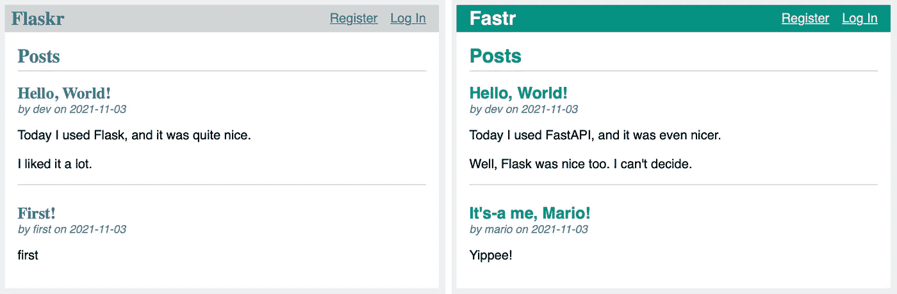

# 使用 FastAPI 重新创建烧瓶教程

> 原文：<https://towardsdatascience.com/using-fastapi-to-recreate-the-flask-tutorial-ee19ab135eed?source=collection_archive---------29----------------------->

## [实践教程](https://towardsdatascience.com/tagged/hands-on-tutorials)

## 不仅仅是另一篇“Flask 与 FastAPI”文章——学习 Python web 框架的有用练习

由[托尔加·乌尔坎](https://unsplash.com/@tolga__?utm_source=medium&utm_medium=referral)在 [Unsplash](https://unsplash.com?utm_source=medium&utm_medium=referral) 上拍摄

Flask 和 FastAPI 是两种流行的 Python web 框架。很容易在网上找到这两个框架的大量比较——如果你正在阅读这篇文章，你可能已经读过你的“Flask vs. FastAPI”文章。

这里有一个*非常*的快速总结。Flask 出现的时间更长，并且面向小型网络应用。作为较老的框架，它往往有更大的用户群和更多的教程和回答的问题。FastAPI 较新，适合创建 REST APIs。它越来越受欢迎，尤其是对于机器学习用例。但是一般来说，这两个框架非常相似——您可以用 Flask 做的任何事情都可以用 FastAPI 来完成，反之亦然。

Flask 拥有的一个东西是[一个伟大的初学者教程](https://flask.palletsprojects.com/en/2.0.x/tutorial/index.html)，用于构建一个简单的应用程序，用户可以在其中注册、登录和创建帖子。FastAPI 有很好的构建 API 的文档，但是缺少像 Flask 示例这样的基础应用的简单教程。我正在学习这两个框架，所以我决定使用 FastAPI 重新创建 Flask tutorial 应用程序是一个很好的练习。我想其他初学者可能会从我学到的东西中受益。

# 如何充分利用这篇文章

1.  **查看 GitHub** **上的** [**源代码。**我不是在这里写一个完整的教程。我将指出 Flask 和 FastAPI 应用程序之间的一些关键差异，但您必须去 GitHub 查看完整的源代码以及所有内容是如何组合在一起的。](https://github.com/djcunningham0/fastapi_flask_tutorial)
2.  **阅读** [**烧瓶教程**](https://flask.palletsprojects.com/en/2.0.x/tutorial/) **。它解释了我们正在构建的应用程序，此外，教程中还有许多与框架无关的有用信息。如果你已经熟悉 web 框架，你可以浏览一下教程，但是如果你是新手，完成它可能是有益的(最多只需要几个小时)。**
3.  **自己动手！**从头开始编写应用程序，从 Flask 示例开始并将其转换为 FastAPI，或者克隆我的 [GitHub 库](https://github.com/djcunningham0/fastapi_flask_tutorial)对其进行修补。最好的学习方法是实践！

# 教程应用程序

在 Flask 教程中，我们构建了一个名为 Flaskr 的应用程序。我使用 FastAPI 构建了一个等效的应用程序，并将其命名为 Fastr。这两款应用都允许用户使用用户名和密码注册，登录，并以博客格式发表文章。这些应用程序运行在存储用户和帖子数据的 SQLite 数据库之上。

使用 Flask(左)和 FastAPI(右)创建的同一个 web 应用程序。

# Flask 和 FastAPI 应用程序之间的区别

除了字体和颜色的表面变化，这些应用程序在幕后的实现方式也有一些关键的不同。我将在这里重点介绍其中一些，大致按照您在 Flask 教程中遇到它们的顺序。在这篇文章中我不会讲太多技术，所以请务必参考 GitHub 上的[源代码以了解更多细节。](https://github.com/djcunningham0/fastapi_flask_tutorial)

这不是一个完整的列表，但这里有一些 Flask tutorial 应用程序和我在 FastAPI 中的实现之间的关键差异:

*   **无应用工厂。**Flask 教程推荐在`__init__.py`文件中实现一个[应用工厂](https://flask.palletsprojects.com/en/2.0.x/tutorial/factory/#the-application-factory)。我通常不喜欢在`__init__.py`文件中放太多代码，所以我在`main.py`文件中创建了 FastAPI app 对象，这是 FastAPI 文档中的典型模式。
*   **用紫玉米跑步。**在 Flask 中，我们设置一些环境变量，然后调用`flask run`。FastAPI 推荐使用[uvicon](https://fastapi.tiangolo.com/deployment/manually/#run-a-server-manually-uvicorn)，所以我们用`uvicorn fastr.main:app`运行我们的应用。
*   **同一事物的不同名称。代码的某些部分几乎完全相同，只是命名规则略有不同。例如，Flask 中的 Blueprint 相当于 FastAPI 中的 APIRouter，用法几乎相同。**
*   **填写缺失的部分。** Flask 内置了许多功能，其中一些功能是一个基本的 FastAPI 应用程序所没有的。我们需要手动挂载[静态文件](https://fastapi.tiangolo.com/tutorial/static-files/)并指定我们的[模板引擎](https://fastapi.tiangolo.com/advanced/templates/)(这两个都是在 Flask 中自动完成的)。我们也没有像在 Flask 中那样内置“会话”对象——我们需要使用 [SessionMiddleware](https://www.starlette.io/middleware/#sessionmiddleware) 对象来实现该功能。一旦我们添加了这些部分，它们在框架之间的行为几乎是相同的。
*   **Pydantic 模型和类型检查。** FastAPI 与 Python [类型提示](https://fastapi.tiangolo.com/python-types/)和 [Pydantic 数据模型](https://fastapi.tiangolo.com/features/#pydantic-features)紧密集成，允许大量自动数据验证。例如，在我们的应用程序中，我们不必像在 Flask 中那样显式验证“用户名”字段是否已填充。
*   **更强大的数据库实施。**这并不是严格意义上的必要更改，但是我使用 SQLAlchemy 实现了后端数据库，而不是直接使用 sqlite3。这是在 [FastAPI 文档](https://fastapi.tiangolo.com/tutorial/sql-databases/)中推荐的模式，它有一些好处，比如允许我们以后容易地改变到不同的数据库后端(例如 PostgreSQL)。这种变化需要一些代码重组 Fastr 应用程序在`db/`目录下有所有与数据库相关的代码。
*   重写测试。这是比较棘手的部分之一，因为 Flaskr 单元测试的设置是非常特定于 Flask 框架的。首先，我们需要在`conftest.py`文件中更改设置测试数据库和应用程序的夹具。之后，我们对 Flask 和 FastAPI 应用程序进行了大量相同的测试，但是在一些测试中，语法和预期的响应是不同的。许多变化都是在 FastAPI 应用程序中使用 SQLAlchemy 的结果。如果您运行 Fastr 应用程序的单元测试，您会发现它们通过了全面覆盖。

# 结论

如果你比较一下 [Flask 教程应用](https://github.com/pallets/flask/tree/main/examples/tutorial)和 [my FastAPI 实现](https://github.com/djcunningham0/fastapi_flask_tutorial)的源代码，你会发现它们的相似之处多于不同之处。FastAPI 应用程序中有更多的样板代码来复制 Flask 内置的一些功能。但是你也获得了 FastAPI 的一些好处，比如来自类型提示的数据验证和[自动生成的交互式文档](https://fastapi.tiangolo.com/features/#automatic-docs)。

对于这类 app，我会推荐 Flask 或者 FastAPI 吗？我不知道。对于如此简单的事情，这并不重要。一旦我们开始添加更多的功能，我们可能会从一个框架中受益更多。例如，如果我们想增加对异步请求的支持，FastAPI [本身就包含了这种能力](https://fastapi.tiangolo.com/async/)。或者，如果我们有一个具体而复杂的特性想要快速实现，我们可能会更幸运地在大量的 [Flask 社区示例](https://www.fullstackpython.com/flask-code-examples.html)中找到一个起点。最终，任何一个人都可以完成工作，并且很容易将你的知识从一个人转移到另一个人。

[成为媒体会员](https://medium.com/@djcunningham0/membership)访问成千上万作家的故事！