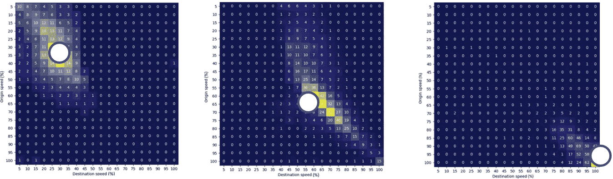
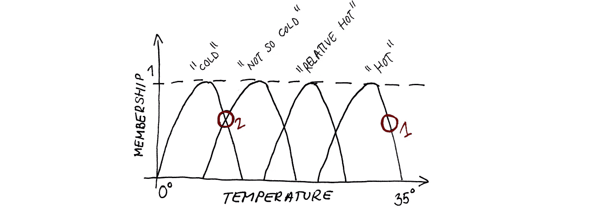
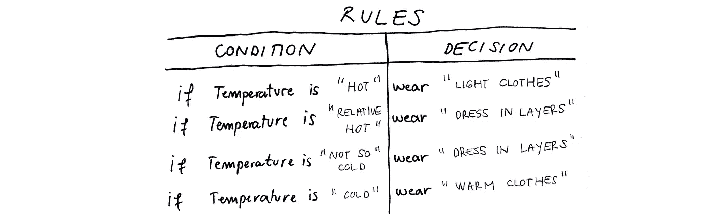
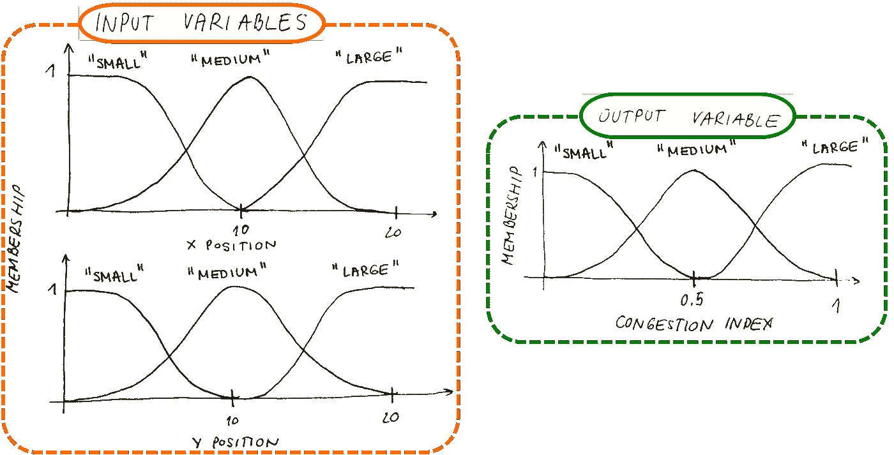
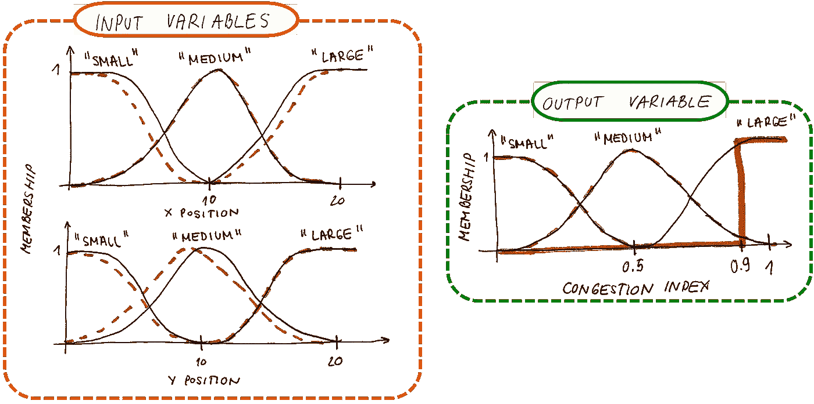
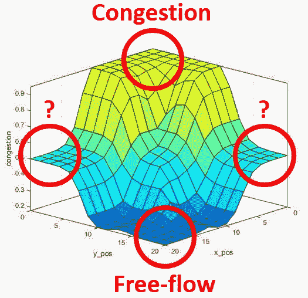

# 基于模糊逻辑的道路交通拥挤指数估计

> 原文：<https://towardsdatascience.com/using-fuzzy-logic-for-road-traffic-congestion-index-estimation-b649f8ddede1?source=collection_archive---------34----------------------->

## [思想和理论](https://towardsdatascience.com/tagged/thoughts-and-theory)

## 如何利用大量 GPS 数据为基于模糊的道路交通拥堵量化系统提供信息

[的照片](https://unsplash.com/@fancycrave?utm_source=medium&utm_medium=referral)上[的 Unsplash](https://unsplash.com?utm_source=medium&utm_medium=referral)

在本文中，将对“基于速度概率分布的拥挤指数估计的模糊推理系统”一文进行概述。目标是以一种更“可读”的方式呈现论文的发现，并鼓励读者学习新的东西或在他们的研究中使用这些知识。

在讨论大城市面临的挑战时，拥堵是主要话题。因此，本文的主要目标是提出另一种道路交通拥堵量化方法，但这一次使用了一种称为速度转换矩阵(STM) [ [2](https://www.researchgate.net/publication/344138884_Traffic_State_Estimation_and_Classification_on_Citywide_Scale_Using_Speed_Transition_Matrices) ]的新型道路交通建模技术。拥塞量化方法基于四个步骤:

1.  STM 计算。
2.  质心(CoM)坐标的计算代表了从 STM 提取的交通状态。
3.  使用 CoM 坐标作为模糊推理系统的输入导致范围[0，1]内的拥塞指数。
4.  通过从《公路通行能力手册》(HCM) [ [3](http://www.trb.org/Main/Blurbs/175169.aspx) ]中提取领域知识，使用遗传算法优化 FIS。

让我们从一些使用方法的背景开始。

# 速度转换矩阵

STMs 的概念最近才出现[ [2](https://www.researchgate.net/publication/344138884_Traffic_State_Estimation_and_Classification_on_Citywide_Scale_Using_Speed_Transition_Matrices) ]，它基于马尔可夫链理论，表示被观察系统的两个或多个状态之间的转移概率。STM 表示矩阵，该矩阵示出了在某个时间间隔内在两个连续路段之间过渡时改变车辆速度的概率。关于 STMs 的详细信息可以在以下文章中找到:

<https://medium.com/analytics-vidhya/speed-transition-matrix-novel-road-traffic-data-modeling-technique-d37bd82398d1>  

# 质心

使用由 STM 表示的交通模式的 CoM 坐标来估计拥塞指数。使用这种方法是因为物体在 STM 中的位置提供了道路交通分析环境中的基本信息。它揭示了受监控的十字路口或路段的交通状态。下图显示了使用 STMs 时 CoM 计算的重要性。如果将 CoM 放在左上角，我们可以观察到源链路和目的链路的速度都很低，表现为拥塞。如果将 CoM 放在矩阵的中间，可以观察到一些不稳定的操作。而如果将 CoM 放在右下角，我们可以观察到由于起点和目的地链路的速度非常大而导致的自由流动情况。使用这些陈述，我们可以同意当使用 STM 作为交通数据模型时，CoM 是交通状态估计的关键参数。

三个 STM 例子的质心:拥塞(左)，不稳定流(中)，自由流(右)(图片作者:作者)

# 模糊推理系统

基于知识的决策有时很难用离散值来完成，而一些非离散值可以更好地代表问题。例如，如果你需要根据屋外的温度来决定如何着装，你可能会使用一些非离散值，如“热”、“相对热”、“不太冷”或“冷”这些变量被称为语言变量，因为它们不代表离散值，而这些值是用单词量化的。

> 关于用 Python 实现模糊推理系统的有趣教程可以在[ [4](/fuzzy-inference-system-implementation-in-python-8af88d1f0a6e) 中找到。

</fuzzy-inference-system-implementation-in-python-8af88d1f0a6e>  

在这里，模糊推理系统(FIS)派上了用场！FIS 可以用语言术语表示变量，用隶属函数表示具有特定术语的隶属度。让我们使用下面的图像来显示上述温度示例:

用语言值表示的简单模糊变量(图片来源:作者)

请注意本例中的第 1 点和第 2 点。在第一点，很明显温度是“热”的最强成员，而在第二点，它介于“不太冷”和“冷”之间。为了创建决策系统，我们需要基于一些先验知识定义规则来帮助我们，在这种情况下，决定穿什么。在基于 FIS 的系统中，我们使用简单的“如果-那么”规则，如下图所示。

基于模糊的决策规则集(图片来源:作者)

此示例显示了最简单的 FIS，只有一个输入变量(温度)和一个输出变量(衣服类型)。

对于拥塞量化 FIS，我们使用了两个输入变量(CoM 的 x 坐标和 CoM 的 y 坐标)和一个输出变量(拥塞指数)，如下图所示。

基于经验的初始 FIS 变量(图片来源:作者)

输入和输出变量用语言表达式“小”、“中”和“大”来描述输入变量被限制使用值[0，20]，因为 STM 维度是 20x20。输出变量表示拥挤指数，由于结果的解释更容易，拥挤指数被限制在区间[0，1]内。

该 FIS 的 If-then 规则按以下方式设置:

1.  x 和 y 坐标的“小”值代表“大”拥堵指数。
2.  x 和 y 坐标的“中等”值表示“中等”拥堵指数。
3.  x 和 y 坐标的“大”值代表“小”拥堵指数。

总共有九条规则涵盖了上述基本价值观以及它们的其他组合。详细内容可以在论文[ [1](https://www.researchgate.net/publication/353357688_Fuzzy_Inference_System_for_Congestion_Index_Estimation_Based_on_Speed_Probability_Distributions) ]中找到。

在这里，最初的 FIS 是代表。它是仅利用先前研究者的经验构建的。为了验证初始 FIS，必须使用一些领域知识进行调优。

# 用遗传算法优化 FIS

在这种情况下，优化涉及调整初始 FIS 隶属函数、规则或两者，以便更好地表示领域知识。

> 如果你使用的是 Matlab，关于 FIS 优化的细节可以在这里找到[ [5](https://ww2.mathworks.cn/help/fuzzy/tune-fuzzy-inference-systems.html) ]。

专家系统的关键部分之一是领域知识表示。本文参考了 HCM 的领域知识表示方法。数据基于 HCM 服务水平值进行标注，该值使用相对于自由流速度(FFS)的速度值进行定义。FFS 可以定义为单车在空路段的速度，也可以定义为观察路段的速度限制。HCM 定义了从 A 到 F 的六个服务水平，其中 A 代表 FFS 的交通流量，车辆之间几乎没有相互作用，F 代表严重拥堵情况。创建 LoS 矩阵是为了直观地表示转换矩阵上的 LoS 值，如下图所示。

从 HCM 中提取的用于标注测试数据集的矩阵(图片来源:作者)

它用颜色表示 LoS，两个 LoS 值之间的过渡用相应的颜色混合表示。为了量化拥堵级别，以如下方式将 LoS 值合并为三类:(I)由标记为 A 和 B 的 LoS 表示的自由流动交通状况被标记为“低”，(ii)由标记为 C 和 D 的 LOS 表示的交通状况被标记为“中”，以及(iii)由 LOS 值 E 和 F 表示的拥堵交通状况被标记为“高”。然后，通过用提到的类别标签标记数据来创建两个数据集。

第一个是用于基于遗传算法的 FIS 优化的训练数据集，第二个是用于结果验证的测试数据集。适应度函数和关于优化过程的细节可以在原始论文[ [1](https://www.researchgate.net/publication/353357688_Fuzzy_Inference_System_for_Congestion_Index_Estimation_Based_on_Speed_Probability_Distributions) ]中找到。

优化结果可以在下图中观察到。优化后，它显示了初始 FIS 变量(纯黑色)和 FIS 变量(红色)。可以观察到，除了输出变量之外，初始 FIS 非常适合优化的那个。我们可以看到“大”这个词偏离了最初的 FIS，它应该改为一个阶跃函数。

基于领域知识的优化 FIS 变量(图片来源:作者)

# 结果

优化 FIS 的结果如下图所示。它代表输入变量和输出变量之间的关系。可以看出，当 CoM 的 x 和 y 坐标较小时，拥塞指数较高。在这种情况下，车辆在输入和输出观察到的道路交通路段上具有非常低的速度。当 CoM 的 x 和 y 坐标很大时，可以观察到相反的情况。在这里，我们有一个小的拥堵指数和接近自由流速度的速度。

优化 FIS 的结果；CoM 坐标与拥堵指数关系图(图片来源:作者)

问号代表 STM 的区域，可以用从非常低到非常高的速度和相反的速度的偏离跃迁来描述。这些区域可以代表异常区域，并且可能是瓶颈检测的方法。这些主题将在我们未来的研究中涉及。

# 结论

本文提出了一种利用大量 GPS 数据和模糊推理系统进行拥堵量化的方法。这里，速度转换矩阵的新概念被用作交通数据建模方法。

目的是以一种更具“可读性”的方式展示论文“[基于速度概率分布的拥堵指数估算模糊推理系统](https://www.researchgate.net/publication/353357688_Fuzzy_Inference_System_for_Congestion_Index_Estimation_Based_on_Speed_Probability_Distributions)”[[1](https://www.researchgate.net/publication/353357688_Fuzzy_Inference_System_for_Congestion_Index_Estimation_Based_on_Speed_Probability_Distributions)”的研究结果，并鼓励读者学习新知识或在自己的研究中使用这些知识。

如果你对类似的、与交通相关的话题感兴趣，请关注我的[媒体简介](https://tisljaricleo.medium.com/)，或者在研究门户:)查看[发表的研究](https://www.researchgate.net/profile/Leo-Tisljaric)

如有任何问题或建议，欢迎评论或联系我！[https://www.linkedin.com/in/leo-tisljaric-28a56b123/](https://www.linkedin.com/in/leo-tisljaric-28a56b123/)

# 参考

[1]l . tiljari，E. Ivanjko，Z. Kavran，T. Cari，[基于速度概率分布的拥堵指数估计模糊推理系统](https://www.researchgate.net/publication/353357688_Fuzzy_Inference_System_for_Congestion_Index_Estimation_Based_on_Speed_Probability_Distributions)，
*交通研究程序*，55，2021:1389–1397

[2]l . tiljari，T. Cari，B. Abramovi 和 T. Fratrovi，[使用速度转换矩阵对全市范围内的交通状态进行评估和分类(2020)](https://www.researchgate.net/publication/344138884_Traffic_State_Estimation_and_Classification_on_Citywide_Scale_Using_Speed_Transition_Matrices) ，*可持续性*，12，18:7278–7294

[3] HCM 2016:公路通行能力手册。华盛顿特区:交通研究委员会，2016 年。

[4]模糊推理系统在 Python 中的实现，[https://towards data science . com/Fuzzy-Inference-System-implementation-in-Python-8 af 88d 1 f 0 a 6 e](/fuzzy-inference-system-implementation-in-python-8af88d1f0a6e)

[5]调整模糊推理系统，[https://WW2 . mathworks . cn/help/Fuzzy/tune-Fuzzy-Inference-Systems . html](https://ww2.mathworks.cn/help/fuzzy/tune-fuzzy-inference-systems.html)