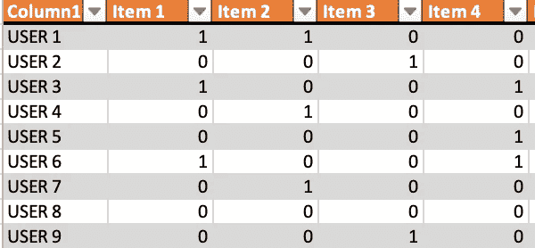
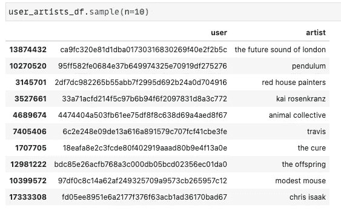
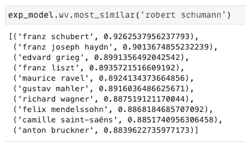
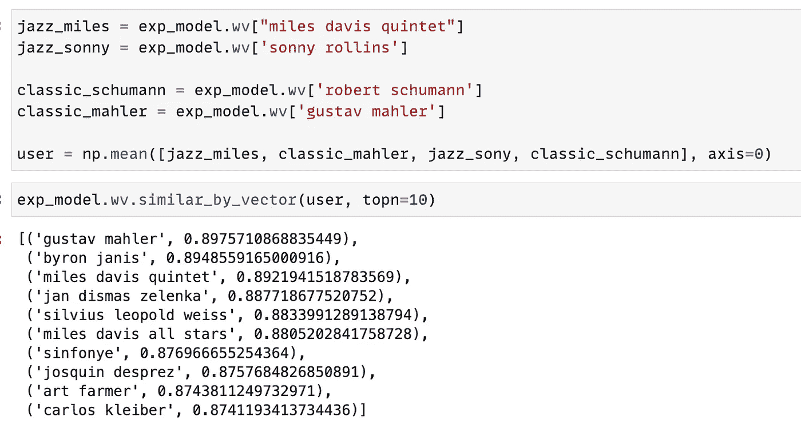
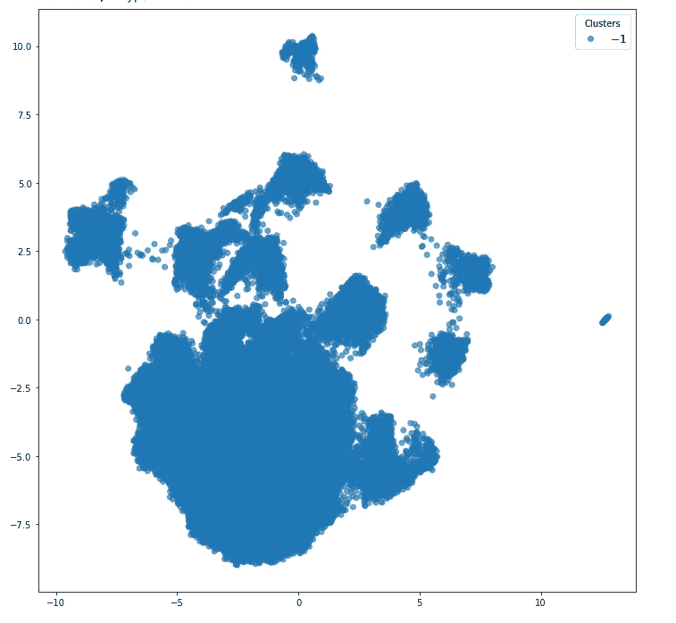
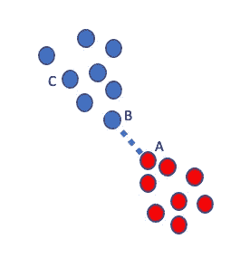
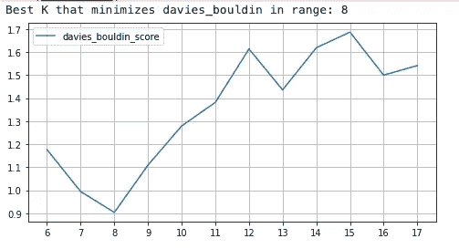
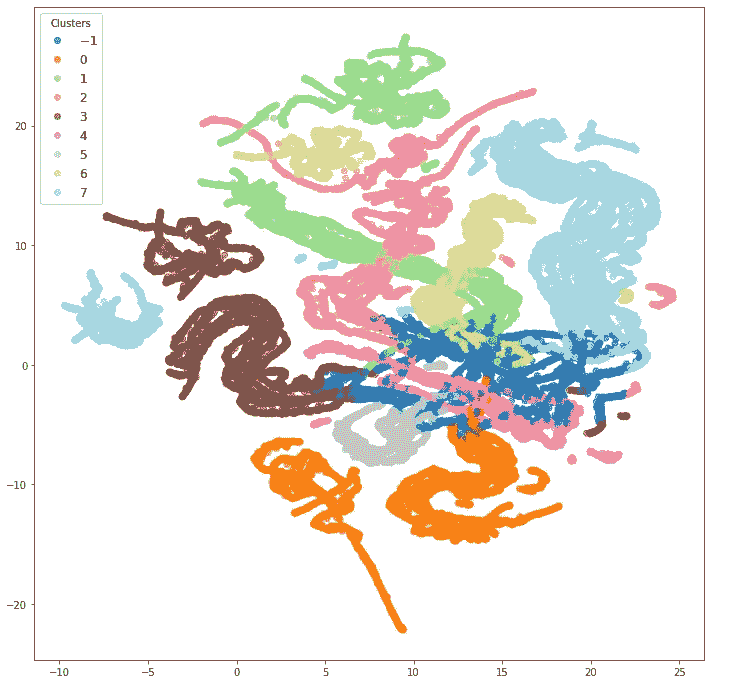
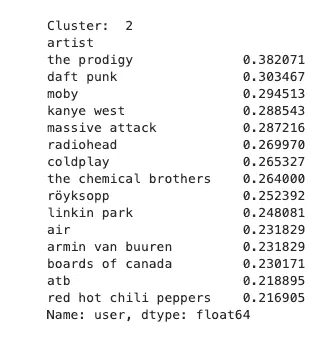
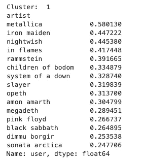

# 使用高斯混合模型来转换用户项目嵌入并生成更好的用户聚类

> 原文：<https://towardsdatascience.com/using-gaussian-mixture-models-to-transform-user-item-embedding-and-generate-better-user-clusters-a46e1062d621?source=collection_archive---------19----------------------->

## 通过使用高斯混合模型生成新的和更紧密的用户特征来改进用户项目嵌入的聚类


马库斯·斯皮斯克在 [Unsplash](https://unsplash.com?utm_source=medium&utm_medium=referral) 上的照片

# 一.导言

一家销售音乐唱片的大公司聘请你帮助他们更好地了解客户和他们的偏好，以便他们可以个性化他们的服务。该公司主要感兴趣的是*了解听众中存在的群体类型、他们的聆听模式和偏好*。为了这个任务，他们给了你他们最珍贵的工件——他们完整的用户-艺术家交互数据集。

用户-项目交互数据是表示用户和项目之间不同参与形式的常见方式，如用户观看的电影、用户点击的广告或用户购买的购物项目。它被认为是一种有点原始但有用的输入形式，用于根据用户参与的项目找到他们之间的相似之处，或者预测他们将来会参与的项目。



由 9 个用户和 4 个项目组成的原始交互数据。表示相同数据的另一种常见方式是使用用户-项目对列表。

因为原始交互数据通常非常稀疏和嘈杂，所以通常的做法是首先将其嵌入到较低维度的空间中，以便仅保留关于每个项目或用户的重要或相关信息。然后，数据的低维表示可以用于各种下游任务，例如根据用户选择的项目之间的相似性对用户进行分类或聚类。

在低维空间中嵌入用户-项目交互数据的方式不止一种。最简单的方法是通过一种降维算法(如 PCA)来运行它，同时保持尽可能多的方差。有人可能会说，输出并不是真正的嵌入，尽管它可以类似地用于对数据进行聚类，并找到用户之间的相似之处。

另一个非常常见(并且通常更加准确)的策略是使用某种形式的[矩阵分解](https://en.wikipedia.org/wiki/Matrix_factorization_(recommender_systems))，以便将用户项目矩阵(N_users * N_items)分解为两个低维矩阵——N _ users * N _ latent _ factors 和 N _ items * N _ latent _ factors——其乘积就是原始的用户项目矩阵。得到的潜在维度将捕获关于每个项目的最相关的信息或特征，并因此提高下游聚类任务的性能。


3 个用户和 3 个潜在因素的低维嵌入数据


3 个项目和 3 个潜在因素的低维嵌入数据

假设您确实能够创建一个较低维度的嵌入层，它仅使用 50 个维度来准确表示您所获得的数据集中存在的大约 4，000 位艺术家(或项目)。然而，您尝试的大多数聚类算法仍然无法在数据中找到任何有意义的聚类，这些数据似乎太密集，无法以有意义的方式进行聚类。

这是一个很常见的场景。随着使用的频繁和项目数量的增加，嵌入层的维度和复杂性通常也会增加。当您有几千个经常使用的项目时，很可能您的嵌入层将包含至少几十个压缩维度，这并不总是很好地聚集(尽管它们可能对其他类型的任务非常有用)。显然，您可以将数据嵌入到任意数量的维度中，但是在某个点上，如果您的维度太低，您可能会开始丢失关于用户之间区别的重要信息。

在这篇文章中，我想建议一种方法来进一步细化难以聚类的用户嵌入，以提高其聚类的性能和结果。简而言之，它基于从项目嵌入数据中学习高斯混合模型，然后基于每个用户成为每个项目聚类分布的一部分的概率，使用它来生成新的用户向量。除了简单且在足够多的实验中被证明是有用的这一事实之外，所提出的方法没有什么特别巧妙的地方，使得共享它成为一个好主意。虽然它是针对聚类用户-项目嵌入的用例，因为它依赖于共享相同向量空间的项目嵌入和用户嵌入的可用性，它当然可以扩展到其他上下文。

这篇文章分为四个主要部分。第二部分展示了一种从用户-项目交互数据生成嵌入的方法(尽管还有更多)。第三部分尝试对数据进行聚类，并展示了聚类中的主要问题。第四节介绍并实现了我们提出的方法。第五节得出结论。

# 二。嵌入交互数据

这里我要用的数据集是 [LastFM 360K](https://www.upf.edu/web/mtg/lastfm360k) 。正如您在下面看到的，它可以很容易地格式化为普通的用户-项目交互数据。



不幸的是，我不能使用任何形式的原始数据集或子集来测试这里提出的方法，但 LFM 的数据是公开可用的，似乎是一个很好的替代方案。然而，值得注意的是，LFM 数据集在几个方面有所不同，这实际上使得结果不如我们进行的原始实验令人印象深刻。仅举一个明显的例子——LFM 的数据集实际上登记了用户、项目*和使用次数*。这意味着每个“行”或用户-条目对都应该根据所报告的交互数量进行加权，以获得准确的结果。为了简单起见，我选择忽略这些复杂性，但这显然应该在实际场景中加以考虑。

所以第一步是生成嵌入。我实际使用的嵌入模型是 Word2Vec。虽然 W2V 是一个最初设计用于根据单词在句子中的出现来创建单词嵌入的模型，但它也可以很好地创建多种序列的嵌入，包括根据用户“购物篮”中的出现来嵌入项目。关于如何生成嵌入，我不会涉及太多的细节，因为这里描述的方法可以应用于任何嵌入，而不管它是如何生成的，而且，我相信附件笔记本中的相关代码是非常简单明了和可重复的。

不过简而言之，我使用了(Gensim 的)W2V，以便根据艺术家在用户历史中的出现来学习嵌入他们。换句话说，我们将向模型提供用户列表和每个用户听过的艺术家列表，模型将为每个艺术家生成代表其最重要特征的潜在因素向量。

例如，由于列表中的艺术家之一是“罗伯特·舒曼”，我们训练的模型将生成相应的嵌入记录，该记录用由我们数据集中所有艺术家组成的空间中的向量来表示“罗伯特·舒曼”，如果它是准确的，则将其“定位”为更接近于类似于*的*艺术家的向量，即通常与舒曼一起出现在具有类似历史的用户中的艺术家。


舒曼的嵌入向量

虽然有更准确的方法来验证嵌入的准确性，但使用一些可以直观测试的示例来验证它也是一个好主意。如下所示，我们确实期望从音乐艺术家和收听用户的数据集学习的嵌入来检测相同流派的艺术家之间的相似性。



因此，现在我们有了准确的嵌入矩阵，我们可以继续对我们的用户进行聚类，并更好地了解数据中存在的组的类型和结构。然而，使用 W2V 嵌入交互数据的一个缺点是，当我们对聚集*用户*感兴趣时，它只留给我们嵌入*项目*或艺术家。处理这种情况的一种方法是获取每个用户参与的项目或艺术家的所有向量，并获取它们的平均值或中间值。换句话说，如果我听了舒曼和米勒·戴维斯的音乐，那么我的用户将由一个向量表示，该向量等于:

```
(model.wv['robert schumann'] + model.wv['miles davis']) / 2
```

详细介绍这种方法的优点和缺点或者回顾其他方法需要很长时间，但这是一种在相关潜在空间中捕捉用户“位置”的相当有效的方法。上面得到的向量将在舒曼和迈尔斯之间，以某种方式描述我的偏好和像我一样的用户的偏好。例如，在下面的代码中，我为一个听了两位古典艺术家(舒曼和马勒)和两位爵士艺术家(米勒·戴维斯和桑尼·罗林斯)的用户生成了一个均值向量。您可以看到，与该用户均值最相似的 10 位艺术家确实是爵士乐和古典音乐艺术家的混合体。



因此，我们将通过取每个用户听过的所有艺术家的平均值来创建用户矩阵。

# 三。聚类用户

所以现在我们开始尝试将我们的用户聚集起来。我们将使用 HDBSCAN，这是一种高效的基于密度的聚类算法，因为我们希望该算法根据数据的结构来确定数据中的聚类数，而不是对数据的形状及其分布进行假设，还因为它是一种相对快速高效的算法。不幸的是，我们不太成功。


不出所料，HDBSCAN 已经确定，除了少数几个小集群，我们的大部分数据都是噪声，上面的 2D 投影(用户嵌入)在一定程度上解释了这一点。我们的数据非常密集，这意味着用户不容易区分零件。这种结果很常见，通常需要进行更多的数据转换和超参数调整实验。

在这一点上，有些人会争辩说，试图“撕毁”聚类有些人为或徒劳，因为数据以这种方式聚集在一起的原因是…因为这就是数据点之间的关系和距离。然而，记住手头的问题是至关重要的。我们的任务是对拥有相似偏好和行为模式的用户进行细分。换句话说，该任务的目的是将数据分割成簇。然而，因为我们的数据非常密集，所以我们需要找到一种方法，让相似的用户*比他们真正的*更近，让不同的用户彼此更远。

如上所述，这篇文章的目的是为你处理这种情况的方法库增加一个工具。但是，在此之前，我只想简要展示两个其他方法或转换，作为基线。

首先，尽管有些争议，但提炼“大块”数据的一种非常有用的方法是使用流形学习算法，如 TSNE 或 UMAP，以便更好地表示局部结构，并通过使相似的样本更接近来进一步提炼聚类。我选择使用 UMAP 是因为它在大 Ns 上的良好性能以及它在局部和全局结构之间的平衡。

正如你在下面所看到的，我们的数据现在有了一些改进，因为 UMAP 确实进一步细化了聚类，将它们分成一部分，使 HDBSCAN 能够找到更密集的结构。但是，我们的大部分数据仍然是集中在一起的。


另一种常见的(也是更简单的)分解集群的方法是简单地获取日志并规范化数据。我在这里忽略了很多理论，但主要部分是，使用下面的代码应用这种转换将为我们留下以下结构。


使用对数变换和归一化来分离聚类



这种方法似乎也是一种改进，尽管它在 2D 空间中比在多维空间中分离得更好。换句话说，如果要在 2D 执行聚类，这种转换会很有帮助，但这意味着将丢失大量数据，这意味着结果的值将取决于手头的问题和数据。

# 三。从集群到分布

让我简要解释一下提议的转换的逻辑，然后深入研究实现。

我们有一个向量空间，包含了*项向量*和*用户向量*(其中每个*用户向量*等于用户参与的项向量的平均值)。我们想把相似的用户*拉近*到一起。因为使用户相似的是他们听相同的项目或艺术家的事实，那么，换句话说，*我们希望用户更接近他们参与的项目，而远离他们不参与的项目*。这让我们尝试下面这个简单的方法。

1.  通过学习一个混合模型来聚类*项目向量*，该混合模型基于每个项目都是从高斯分布中采样的假设。当这个阶段完成时，我们有 K 个项目集群，而每个集群代表一个项目分布。一个好的结果将产生相似项目的聚类，例如摇滚乐队、流行艺术家等的聚类。但是，即使这种聚类不准确，它也仅用于转换数据(或从数据中生成新的要素)。让我们称这个阶段的结果为*项目集群*。
2.  基于每个用户成为每个项目聚类的一部分(或其分布的一部分)的概率，为每个用户创建一个向量。例如，假设在步骤 1 中，我们找到了两个项目分类—一个是古典音乐艺术家，另一个是爵士乐艺术家。在步骤 2 中，我们迭代我们的用户向量，并估计每个用户向量成为每个项目聚类的一部分的概率。换句话说，对于每个用户，我们估计其向量从古典艺术家项目聚类中采样的概率，以及其向量从爵士艺术家项目聚类中采样的概率。简单来说:

```
Assuming we have 2 clusters (or distributions): Z1 and Z2, and user vector X1The new vector of user 1 will be [P(Z1|X1), P(Z2|X1)]
```

为什么这很有帮助？我还不能提供一个数学上严格的证明，部分原因是它并不总是正确的，但是下面的例子可能是解释直觉的一个起点。

考虑下图中的向量 A、B 和 C(每个向量由 2D 空间中的数据点表示)，并假设 B 和 C 之间以及 A 和 B 之间的距离相等(或几乎相等)。很明显，根据它们在空间中的位置，很难确定它们相对于周围其他向量的相似性(或不相似性)。换句话说，问题“B 更像 C 还是更像 A？”很难回答，因为它们的距离几乎相等。这就是为什么基于密度的聚类算法的性能有些差。但是，如果我们将数据视为矢量分布的混合，并且如果我们发现有两种分布——蓝色和红色，那么通过比较矢量 A、B 和 C 由蓝色分布生成的概率，它们与周围其他矢量相比的相对相似性(或不相似性)会变得更加明显。之所以如此，是因为相对清楚的是，样本 B 和 C 最有可能是从与 a 不同的分布中“取样”的。



幸运的是，使用 sklearn 的高斯混合模型(GMM)，这种方法也很容易实现。当 Sklearn 的 GMM 类适合数据集时，它假设数据点是从 K 个高斯分布的混合中生成的，并从数据中学习高斯混合模型，从而提供为每个样本或向量分配其最可能属于的高斯的能力。

因此，对于步骤 1，我们使用 GMM 来聚类我们的项目并生成项目聚类，而每个聚类对应于项目向量的高斯分布。

我使用这个简单的 util 函数来对项目进行聚类，并返回训练好的模型，我需要这个模型来估计以后的概率。

可以使用多种方法来选择 K 分量的数量。对于我的任务，我使用了最小化 davies_bouldin 分数的 K。



对于阶段 2，这是重要的一点，对于每个用户向量(代表用户已经听过的项目向量的平均值)，我们使用训练模型的 *predict_prob* 方法来获得它成为每个项目聚类的一部分的概率。

因此，我们最终得到一个用户数据集，而每个用户向量现在由它成为每个项目聚类的一部分的概率向量来表示。让我们再次尝试使用 HDBSCAN 对其进行集群。



好多了。正如预期的那样，我们的新数据或转换后的数据本质上更紧密地聚集了用户，这些用户的向量最有可能是由某个项目集群或分布生成的。如上所述，这种转换使得用户之间的相似性或差异变得更加“激烈”，因为现在每个向量代表一组概率，而不是多维空间中的位置。

这些结果可以而且应该被进一步检验，看看这些分类是否有意义。这个数据集和我的实现中的一个问题是，我没有去掉最受欢迎的艺术家，这在某种程度上扭曲了结果，以及为了简单起见我跳过的其他步骤，这也使结果不那么令人印象深刻。

然而，我们仍然可以注意到某些用户群最常听的艺术家在主题上的明显相似性。例如，我们注意到一群用户对电子音乐(下图中的群 2)或重金属摇滚(下图中的群 1)有着强烈的偏好。



喜欢电子音乐的用户群



喜欢重金属摇滚的用户群

# 四。结论

当用户和项目之间的交互更加强烈并且用户偏好变化很大时，用户项目嵌入通常很难聚类。这种数据集最常见的方法通常包括应用某种形式的特征变换，以便使相似样本之间的相似性更明显，差异更清晰。

在这篇文章中，我分享了另一种可能有助于解决这种情况的方法。虽然它以类似的方式操作，但它可以被视为一种特征生成方法，而不是一种变换。该方法首先基于物品数据学习高斯混合模型，该模型本质上假设数据是从混合高斯分布生成的。然后，它为每个用户向量或记录生成一个新的特征集，该特征集表示从每个分布中被采样的概率。在这样做的时候，它本质上是用一个不同的度量来代替距离相似性度量，这个度量就是成为任一分布的一部分的概率。

这种方法已经在足够多的实验中产生了非常好的结果，值得分享，但是它还远远没有经过认真的思考或测试。话虽如此，但它通常做得很好，而且肯定会有益于出现类似困难的其他领域。

希望会有帮助

笔记本可以在[这里找到](https://github.com/a-agmon/clustering/blob/main/DoubleClustLastFM.ipynb)