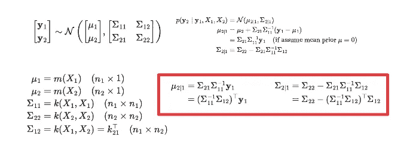
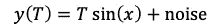

# 使用高斯过程回归作为生成模型，使用 Python

> 原文：<https://towardsdatascience.com/using-gaussian-process-regression-as-a-generative-model-using-python-66278a154eb5?source=collection_archive---------6----------------------->

由 [Unsplash](https://unsplash.com/s/photos/statistics?utm_source=unsplash&utm_medium=referral&utm_content=creditCopyText) 上的 [Edge2Edge 媒体](https://unsplash.com/@edge2edgemedia?utm_source=unsplash&utm_medium=referral&utm_content=creditCopyText)拍摄

## 以下是如何使用高斯过程生成新数据

如今，我们可以有把握地说**生成模型是人工智能的热点。**处理数据的人可能知道技术细节，而对于非技术人员来说，能够从现有数据集生成新东西的想法听起来基本上像科幻小说。出于这个原因，当非技术人群遇到像 [**这样的东西时，深度假冒**](https://www.youtube.com/watch?v=-ZRUZzZPGto) 它会爆炸得相当快。

实际上有很多生成模型，而且大多数都使用深度学习方法(你听说过 [GANs 吗？](https://en.wikipedia.org/wiki/Generative_adversarial_network))。

> 你必须忍受的主要的、永恒的、巨大的权衡是，同时拥有可解释性和深度学习几乎是不可能的。

我的意思是，当你使用深度学习时，你有如此多的参数、层和操作，以至于你真的无法理解你的模型在做什么:**你只知道**(或希望)**它工作得非常好。**

在我们的研究中，我们需要创建一个具有特定属性的生成模型:**它需要是可解释的。我们需要非常确定它实际上在创造什么，为什么，以及如何创造。所以我们使用高斯过程。**

在这篇文章中，我想告诉你如何使用一个非常简单的算法，在给定一个参数作为输入的情况下，从现有的点中创建一组新的点。我们开始吧！

# 1.先决条件

让我们把事情简单化:我们正在谈论**高斯过程回归。这意味着，首先，它是一个回归模型:**

假设在某个值 X_1 =10 处有一个点 Y_1 = 5，在另一个值 X_2 = 14 处有另一个点 Y_2 = 20。回归模型帮助您找出 X_1 = 10 和 X_2 = 14 之间的 Y 值。

当然，你可以尝试用直线，多项式，正弦和余弦来做。高斯回归当然使用高斯分布。你基本上是在假设你可以用一个**平均值**和一个**标准差**来模拟你的点数。这意味着您的过程的不同表示将根据平均值和标准偏差进行分布。

如果你想更深入一点，这里是它的工作原理。

我使用 LaTeX 生成的图像

这意味着给定点 X1 的子集和值 y1 的子集，我们可以预测在点的 X2 子集中会发生什么。

那些已经知道所有这些东西的人可能已经注意到，在一天结束时，一切都依赖于一个被称为**内核**k .的函数

现在，我可以花几个小时写关于内核的东西，我甚至不是这方面的专家，所以我甚至不会去尝试(查看[这里](https://www.cs.toronto.edu/~duvenaud/cookbook/)以了解更多)。我们需要知道的是**内核根据其他点与固定点 x 的距离来确定我们给予其他点的权重。**

例如，有理由假设，如果你想了解湖人队是否会在 2021 年赢得戒指，你会看他们 2019 赛季的赛程，也许还有 2018 赛季的赛程，但你不会看 1969/1970 赛季的赛程，因为这可能会误导人。

**通常，设置权重的方式是使用** [**RBF 核**](https://scikit-learn.org/stable/modules/generated/sklearn.gaussian_process.kernels.RBF.html) **。你也可以使用** [**白化内核**](https://scikit-learn.org/stable/modules/generated/sklearn.gaussian_process.kernels.WhiteKernel.html) **添加一些噪点修正。**

所以说重点吧。假设你的鼻窦受到某种噪音的干扰。

请不要运行这个！你会得到一个错误，因为我没有定义很多东西。

如果你使用我们所说的，我们可以得到这样的东西。

这就是你通常使用高斯过程回归的方式…

但是我们如何从我们的数据集中生成一组新的点呢？
换句话说:

> **如何才能最终使用高斯生成回归作为生成模型？**

基本上我们要这样做:**给定某个输入值(我们就称之为 T)我们要生成一个全新的点列表(称为时间序列)。**

让乐趣开始吧。:)

# 2.这个想法

现在我们知道了这一切是如何工作的，我们需要理解如何真正地**产生**新的东西。

假设你有一个正弦函数，这个正弦的振幅取决于外界温度。大概是这样的:

我用乳胶制作的图像

其中噪声具有零均值和固定方差。

想象你有 200 个温度，每个温度 100 个点。这意味着，例如 T = [1，2，…，200]和 x = [1，2，…，100]。您将拥有一个 200 行 100 列的矩阵(表格)。**你可以为每张桌子复制我们之前讨论过的想法。**

另一方面，你可以反过来想！**你可能会想到 100 个点，说每个点有 200 个温度值。**如果现在你考虑你能得到的这种“颠倒”的情况，给定温度 t1 下的某一点 **x_0** ，和在同一点 x_0 下的**，对于另一个温度 T2 = t1+1，在两者之间会发生什么，例如在 T3 =(T2+t1)/2。**

如果对数据集的所有点都这样做，你将得到 T3 =(T2+t1)/2 的整个点集。

**伟大的事情:极其简单。坏消息:数据集的每个点都有一个模型，所以你不想有太多的点。**

# 3.代码

我说了很多。让我们用一些代码深入研究一下。:D

## 3.1 图书馆

这是你需要的:

其实没什么特别的，只是相当主流的模块，比如 **sklearn，matplotlib，numpy，pandas，seaborn…**

## 3.2 实验

> 在我的实验中，我保持事情简单。当然，你可以想象有一个不同参数的时间序列列表，并应用你将在这几行中找到的相同推理。

我坚持分析这个信号的想法:

我用乳胶制作的图像

但是让我们说得更清楚些:

***训练集特性:***

*   t 是一个“温度”，我们假设从 100 到 200 有 100 个等间距的温度
*   x 是一个固定向量**，由 0 和 10 *π**之间的 50 个点组成
*   噪声方差= 5，均值= 0

***测试设置特性:***

*   x 是**同上**
*   T 是通过采样由中间温度组成的等间距数组的 20 个值 T29 得到的:T_test = (100.5，101.5，102.5，…)

下面是如何生成这个数据集。

***训练集代码:***

***测试设置代码:x***

实际上，您可以在这里用这段代码来拟合您的模型:

***拟合你的模型:***

**这个模型会给你一堆拟合的模型**(我们说过，每个点一个)，如果你要的话，**训练集上的结果。**

然后，您可以使用以下代码生成新点:

***运行训练好的模型并生成新的点。***

整个过程就是由这个简单的函数完成的:

但是事情变得有趣多了。:)

还记得我们之前讲过的内核吗？**嗯，可以调整内核以获得尽可能好结果。**

实际上，来自 sklearn 的伟大的家伙们会优化这个过程，以便你可以尽可能地获得最佳值，但是尝试给算法一个提示作为起点是明智的。然后他们会开始围绕它进行优化。

当然，我们不知道该给出什么样的暗示。为此，**我们将进行网格搜索，并从中获得超参数的最佳组合。**

在优化我们的模型之前，我们当然需要定义我们在寻找什么。一般来说，我们可能需要两样东西:

*   **良好边界**(几乎所有数据都在 1.96 方差内)
*   **好的意思**(很合适……相当合理)。

换句话说，我们想要评估边界和 MSE 中包含的点数。您可以使用以下代码来实现:

***评估自己的表现***

这就是你如何网格搜索你的最优值。注意，我们玩的是一个双参数游戏: **l** 和 **n** 。有关它们的更多信息，请访问<https://scikit-learn.org/stable/modules/generated/sklearn.gaussian_process.kernels.WhiteKernel.html>****和<https://scikit-learn.org/stable/modules/generated/sklearn.gaussian_process.kernels.RBF.html>**。******

*********网格搜索功能(一):*********

*******网格搜索功能(二)*******

## ****4.结果呢****

****网格搜索功能执行以下步骤:****

1.  ****生成您的培训数据****
2.  ****生成您的测试数据****
3.  ****网格搜索你输入的所有模型****
4.  ****给你表演****

****让我们试试这个:****

****现在让我们看看表演吧！****

****有些模型的均方误差很差，但是 l=0.5 的模型看起来不错。****

******边界包含的点数是多少？******

****好的，如果我们设置 l=0，我们得到基本上完美的边界(记住 x 只有 50 个点)，但是均方误差很可怕。所以就 MSE 和 in 点数而言，最好的是 n=0.01 和 l = 0.5。****

****让我们修复它们:****

****并使用它们:****

******这是你的最佳预测，从一个输入(T=101.5)生成一个全新的时间序列:******

****放大:****

******给定一个温度输出，我们生成了整个点序列:******

> ****我们使用高斯回归作为生成模型！****

******性能怎么样？它们符合我们的预期:******

# ****5.结论****

****如果你喜欢这篇文章，你想知道更多关于机器学习的知识，或者你只是想问我一些你可以问的问题:****

****A.在 [**Linkedin**](https://www.linkedin.com/in/pieropaialunga/) 上关注我，我在那里发布我所有的故事
B .订阅我的 [**简讯**](https://piero-paialunga.medium.com/subscribe) 。这会让你了解新的故事，并给你机会发短信给我，让我收到你所有的更正或疑问。
C .成为 [**推荐会员**](https://piero-paialunga.medium.com/membership) ，这样你就不会有任何“本月最大数量的故事”，你可以阅读我(以及成千上万其他机器学习和数据科学顶级作家)写的任何关于现有最新技术的文章。****

****再见:)****