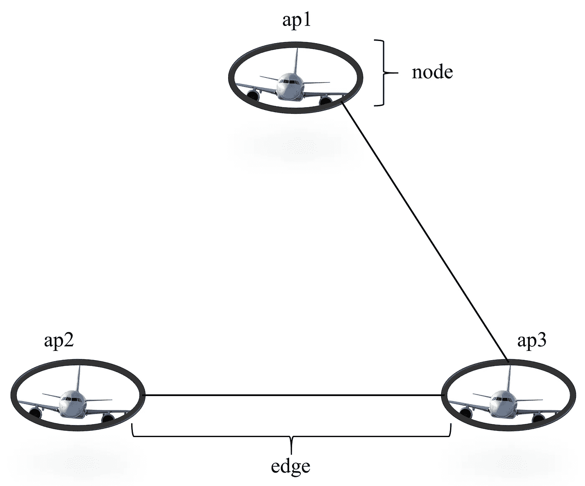
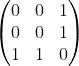
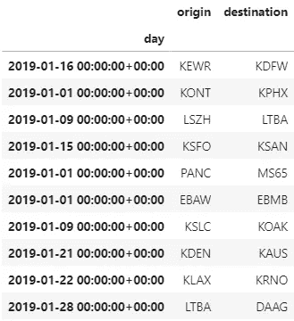
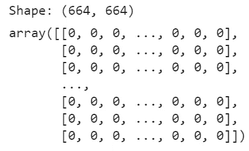

# 利用图论有效解决数据科学问题

> 原文：<https://towardsdatascience.com/using-graph-theory-to-efficiently-solve-data-science-problems-9ce0ab8fbf71?source=collection_archive---------11----------------------->

即使是最基本的也会让你开始！


# 为什么我应该现在学这个，而不是以后？

在数据科学领域有很多东西要学。通常，作为一名数据科学家，您倾向于边走边学。如果你当前的任务需要新的方法，你做一些研究，直到你能解决手头的问题。然而，如果我们没有学习这门学科的基础知识，图论的应用通常隐藏在我们意想不到的地方。在这篇文章中，我将向你展示在某些应用中，图论的基础知识是如何发挥作用的

*   **大大加快**你的代码
*   减少大量循环、索引等功能。来甜的**俏皮话**
*   使以前几乎无法解决的任务成为可能

**所有学到的概念都会非常基础，并配有图片或代码。另外，**我不会介绍超过 5 个新名词**。**

# **基本概念和术语**

**一个图由一组 ***节点*** {a1，a2，…，和}以及一组 ***边*** *，*组成，这些边将部分或全部节点相互连接起来(*图 1* )。例如，假设有一组机场{ap1，ap2，ap3}。如果所有机场之间都有航班，但 ap2 只提供到 ap3 的航班，则边是{(ap1，ap3)，(ap3，ap1)，(ap2，ap3)，(ap3，ap2)}。典型地，术语*“图”*是指所有边也以它们的反转形式(ap1，ap3)——>(ap3，ap1)存在的那些图。否则，它被称为**，这不是本指南的一部分。****

********

****图 1:有三个节点和两条(唯一的)边的图的例子。除非另有说明，所有图片均由作者提供。****

****每一个图都可以用它的 ***邻接矩阵*** 用数字形式表示。在这种情况下，它是:****

********

****如您所见，这个对称矩阵在存在连接两个节点的边的地方保存 1，在不存在边的地方保存 0。更技术性的描述是所有节点对之间长度为 1 的路径的数量。****

****这就是你开始行动所需要的全部理论。让我们解决一些现实世界的问题。你可以在 github repo 中找到所有的代码。****

# ****数据准备****

## ****资料组****

****作为一个现实世界的应用程序，我决定使用一个飞行数据集。[公开发布](https://zenodo.org/record/4670228#.YIQtKEUzaUl)，该数据集包括在 2500 个参与机场起降的所有航班。下载指纹为“MD5:0 df 632 f 65 E1 d 7 b 7 DD 6 f 89294 e 81861 e 0”的数据集来复制我的分析。****

## ****清洁****

****对于这个分析，我只保留了开始(“起点”)和到达(“目的地”)的位置以及时间戳(“日期”)。此外，出于演示的目的，我随机抽取了 1000 个航班作为样本。关于精确的复制，请参见[链接库](https://github.com/MaxHilsdorf/airport_graph_analysis)。****

********

# ****分析****

****为了举例说明图论方法的效用，我们将向数据科学家提出一些关于飞行数据集的基本问题。然后，我们将比较典型的 pandas 方法和图表方法的简单性和效率。****

## ****预分析:创建邻接矩阵****

****图形方法基于**操纵邻接矩阵**。因此，我们必须首先创建它。将计算邻接矩阵所花费的时间视为一项投资。这是值得的。****

****首先，我们需要获得数据集中所有**唯一机场**的列表。使用 pandas 和 numpy 很容易做到这一点(不要忘记导入它们)。****

```
**airports = np.unique(np.append(df[“origin”], df[“destination”]))**
```

****由于 python 列表是有序的，每个机场现在都与一个固定的数值相关联。这个值将代表它在邻接矩阵中的位置。此外，我们可以使用这些来**将数据集中的每个字符串映射到一个数值**，这允许有效地计算邻接矩阵。****

```
**mapping_dict = {k:i for i,k in enumerate(airports)}
df_mapped = df.applymap(lambda x: mapping_dict[x])**
```

****现在，邻接矩阵只有一步之遥。我们将创建一个 nxn 零矩阵，n 是唯一机场的数量。然后，我们遍历每个数据帧行一次，看看是否需要将 0 值更改为 1。****

```
**# Create null-matrix
A = np.zeros((len(airports), len(airports)), dtype = int)# Enter 1 into the null-matrix where there is an edge
for date, flight in df_mapped.iterrows():
    i, j = flight["origin"], flight["destination"]
    if A[i,j] == 0:
        A[i,j], A[j,i] = 1,1**
```

****好吧，我们做到了！这是我们的**邻接矩阵**:****

********

## ****问题 1:你能直接从 A 飞到 B 吗？****

****这个问题看起来极其琐碎。确实是！然而，即使对于这种问题，**图表方法也优于标准方法**。解决这个问题的常见方法是遍历每一行，如果有这样的直接路径，则返回 True。这种类型的函数可能如下所示:****

```
**def exists_direct_path(df, node1, node2):

    # Loop through each row
    for i, row in df.iterrows():

        # Check whether (node1, node2) or (node2, node1) is in the dataset
        if {row["origin"], row["destination"]} == {node1,node2}:
            return True

    return False**
```

****使用邻接矩阵，简单地索引它就可以了:****

```
**A[node1, node2] == 1**
```

****但是等等？这不是**伪比较吗？**“exists _ direct _ path”函数不做我们在预分析中做的事情吗？事实上，图表方法在这里只有优势，因为我们已经预先计算了普通方法现在做的事情。然而，这才是重点！我们已经遍历了每一行一次，现在可以简单地通过索引来检查每一条路径。使用“exists_direct_path”，函数的每个调用都将执行相同的循环。这显然是低效的。****

****事实上，做 200 次这样的比较花了我的笔记本电脑 18 秒。图表法耗时 0.0006 秒。我们已经可以看到:****

> ****有些问题使用标准的 python 和 pandas 方法完全可以解决，但是与基于图形的方法相比效率非常低。****

## ****问题 2:A 直接链接到多少个机场？****

****让我们关注一个稍微复杂一点，但仍然简单的问题。想象一下，你的老板想在另一个城市开设一家子公司，但这个城市与世界其他地方的最佳连接是至关重要的。****

****用传统方法解决这个问题意味着遍历所有行，并跟踪在类似列表的东西中找到的所有可能的目的地。它可能是这样的:****

```
**def degree(df, node): # degree is the technical term

    # Setup empty list
    flights = []

    # Loop through every row
    for i, row in df.iterrows():

        # If the node is either an origin or a destination, there must be a direct path
        if row["origin"] == node:
            flights.append(row["destination"])
        elif row["destination"] == node:
            flights.append(row["origin"])

    # Remove duplicates
    flights = list(set(flights))

    return len(flights)**
```

****使用邻接矩阵，这同样简单得多:****

```
**A[node].sum()**
```

****就像以前一样，运行时效率**是惊人的**。获得 200 个节点的度数花了我的笔记本电脑 19.5 秒，而基于图的方法花了 0.02 秒。****

## ****问题 3:从 A 地到 B 地旅行时，我需要换几次车？****

****让我们来看最后一个相当复杂的问题。假设一位顾客正在计划他的假期。他想在当地机场起飞，心中有五个可能的目的地。然而，他只想在旅途中换乘两次或更少。在这种情况下，我将从基于图的方法开始。你很快就会明白为什么。****

****我们可以利用邻接矩阵的另一个**便利特性。请记住，前面我将邻接矩阵定义为表示每对节点之间长度为 1 的路径的数量。结果是，如果你把邻接矩阵提升到 2 的幂，你会得到长度为 2 的路径数，以此类推。换句话说:如果机场 ap1 和 ap2 之间的航班需要至少三次转机，你会发现:(A**3)[ap1，ap2] > 0。因此，要找到两个机场之间的最短路径，我们需要将 A 乘以自身，直到我们找到一个值> 0。******

****这个技巧允许我们**通过提高 A 的幂来有效地**找到最短路径，直到找到一条路径。一旦找到它，最后一个 A 数就是最小路径长度。我们还需要告诉计算机什么时候停止寻找，否则它会一直寻找，直到找到一条路径。在这种情况下，我将这个最大长度设置为 10。如果没有找到匹配的⁰，程序将返回 10。****

```
**def shortest_path(A, x, y, iterations = 10, mapping_dict = mapping_dict):

    # Create copy of Matrix to work on
    M = A.copy()

    # Get numerical representations of airports
    i, j = mapping_dict[x], mapping_dict[y]

    # Define the maximum power to which A is to be raised
    iterations = 10 # A = A*A until a path is found or the max iterations are reached
    for k in range(iterations):
        if M[i,j] == 0:
            M = np.matmul(M,A)
        else:
            return (x,y,k)**
```

****回到手头的问题，您的客户想要在“LFPO”起飞，并记住了目的地“YWHA”、“LTAC”、“LIRF”、“埃夫拉”和“KRFI”。****

```
**home_airport = "LFPO"
vacation_destinations = ["YWHA", "LTAC", "LIRF", "EVRA", "KRFI"]
max_changes = 2**
```

****使用“shortest_path”功能，我们可以很容易地告诉他最多 2 次换乘就可以到达哪些目的地。****

```
**n_changes = [shortest_path(A, home_airport, destination) for destination in vacation_destinations]acceptable = [destination for location, destination, changes in n_changes if changes <= 2]acceptable**
```

****输出:****

```
**['LIRF', 'EVRA']**
```

****现在，让我们用一种不基于图论的不同方法来实现它。弄清楚如何做到这一点并不容易。事实上，我认为解决这个问题的唯一方法是**尝试将多个航班相互链接的每种组合**。一旦找到所有组合，最短路径就是所有组合中具有正确起点和终点的最短长度的组合。****

****如果你曾经使用过具有**指数复杂度**的算法，你可能已经知道这种方法有多糟糕。总共有 5 或 10 个机场时，它可能工作得很好。但是以 1000 个机场为例，在你的分析完成之前，你的孙辈们就已经退休了。与这种指数复杂度相比，基于图的方法具有 **O(n )** 的复杂度，因为它所做的只是乘以矩阵。****

****可能是一些非常聪明的人想出了我不知道的算法，这些算法比这种暴力方法更有效。然而，很明显的是:****

> ****对于关于多个对象之间存在某种关系的某些数据科学问题，了解基本的图论将允许您编写高效的代码，并解决用其他方法实际上无法解决的“基本”问题。****

# ****结论****

****我们已经探索了使用图论方法来回答某些(看似)简单的数据科学问题。很明显，许多问题我们可以用循环来解决。使用基于图形的方法更容易解决。一旦邻接矩阵被创建，关于感兴趣的对象之间的关系的存在的大多数问题可以使用像索引或求和这样的单一表达式来回答。如果您的代码要应用于大量数据，或者如果同样的问题可能会再次发生，那么计算一次邻接矩阵是非常值得的。****

****此外，使用普通方法实际上无法解决一些问题，因为算法的复杂性甚至与中等规模的数据集不兼容。如果出现这种情况，您可能想后退一步，看看基于图的方法是否有一个简单的解决方案，就像本指南中所做的那样。****

****为了进一步阅读，我将把你链接到 Vaidehi Joshi 的这篇伟大的文章。它涵盖了更详细的理论基础，提供了更多的图论应用实例，并链接到一些更深入的文献。****

******非常感谢您的阅读！******