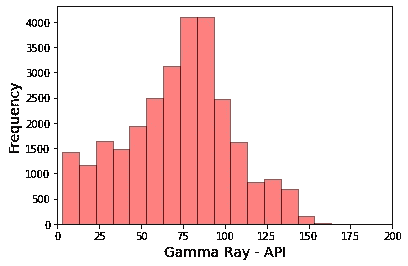
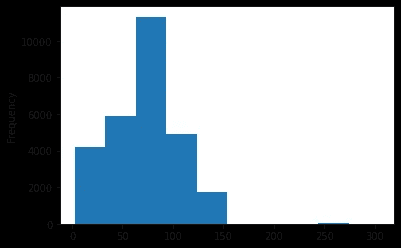
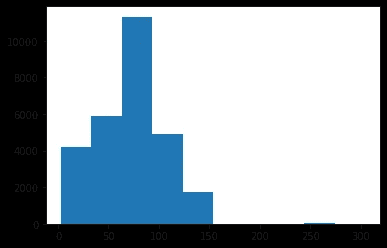
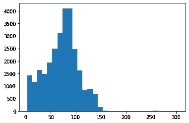
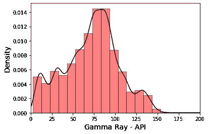
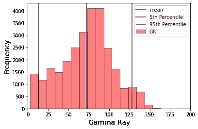

# 用 Python 中的 Matplotlib 创建测井数据直方图

> 原文：<https://towardsdatascience.com/using-histograms-to-visualise-well-log-data-16142e2c7f81?source=collection_archive---------14----------------------->

## 用直方图可视化数据分布


在 [Unsplash](https://unsplash.com?utm_source=medium&utm_medium=referral) 上 [Marcin Jozwiak](https://unsplash.com/@marcinjozwiak?utm_source=medium&utm_medium=referral) 拍摄的照片

## 介绍

直方图是探索性数据分析和数据科学中常用的工具。它们是优秀的数据可视化工具，看起来类似于条形图。然而，直方图使我们能够深入了解一组数据中的值的分布，并使我们能够在一个简洁的图中显示大量数据。在岩石物理学和地球科学领域，我们可以使用直方图来识别异常值，也可以挑选关键的解释参数。例如，来自伽马射线的粘土体积或页岩体积端点。

要创建直方图:

*   我们首先取一条测井曲线，并确定其中包含的数值范围。例如，me 可能有一个伽马射线测井，来自我们的一口井，范围从 5 到 145 API。
*   然后，我们将整个范围划分为不同的仓或区间。以伽马射线测井为例，我们可以得到从 0 到 10、11 到 20、21 到 30 一直到 141 到 150 的区间。
*   创建容器后，我们获取数据并将每个值分配到适当的容器中。
*   我们最终得到的是一个区间与频率的关系图，如下图所示



在这个简短的教程中，我们将看到如何使用 matplotlib 在 python 中快速创建直方图。我们还将看到如何定制绘图以包含额外的信息，如百分位值和平均值。

相关的 Python 笔记本可以在[这里](https://github.com/andymcdgeo/Andys_YouTube_Notebooks/blob/main/02%20-%20Log%20Data%20Visualisation%20-%20Histograms.ipynb)找到。

本教程的相关视频可以在我的新 YouTube 频道上找到:

## 导入库和加载 LAS 数据

任何 python 项目或笔记本的第一步通常是导入所需的库。在这种情况下，我们将使用`lasio`来加载我们的 las 文件，`pandas`来存储我们的测井记录数据，而`matplotlib`用于可视化我们的数据。

```
import pandas as pd
import matplotlib.pyplot as plt
import lasio
```

我们在这个简短教程中使用的数据来自公开发布的 Equinor Volve 数据集。详情请见[这里](https://www.equinor.com/en/what-we-do/digitalisation-in-our-dna/volve-field-data-village-download.html)。该数据集由 Equinor(前挪威国家石油公司)发布，旨在促进研究、开发和学习。在本练习中，我们将使用该数据集中的一口井。

为了读取数据，我们将使用 lasio 库，这是我们在之前的笔记本和[视频](https://youtu.be/8U4gxMJybJs)中探索过的。

```
las = lasio.read("Data/15-9-19_SR_COMP.LAS")
```

然后，我们将 las 文件转换为 pandas dataframe 对象。

```
df = las.df()
```

使用`.describe()`方法，我们可以探索数据的汇总统计。

```
df.describe()
```


我们可以看到，这个文件中有七条测井曲线。

*   AC 代表声波压缩慢度
*   井径仪校准
*   容积密度的 DEN
*   伽马射线的 GR
*   中子孔隙度的 NEU
*   RDEP 深电阻
*   中等电阻率 RMED

## 使用熊猫创建直方图

我们可以使用 pandas 创建一个快速直方图，而不依赖于导入其他库。

```
df['GR'].plot(kind='hist')
plt.show()
```



使用 df['GR']创建的 Volve 数据集的伽马射线测井的简单直方图。plot(kind='hist ')

## 使用 matplotlib 创建直方图

我们也可以像这样使用 matplotlib 创建相同的直方图。

```
plt.hist(df['GR'])
plt.show()
```



使用 plt.hist(df['GR'])创建的 Volve 数据集的伽马射线测井的简单直方图。图片由作者提供。

这产生了一个非常小的情节。我们可以看到值的范围从 0 到 150，API 为 250 时有很小一部分数据。每个 bin 大约有 25 个 API 宽，这是一个相当大的范围。

我们可以通过为 bins 参数指定一个 set number 来控制它，在本例中，我们将它设置为 30。

```
plt.hist(df['GR'], bins=30)
plt.show()
```



条柱数量增加的直方图。图片由作者提供。

让我们通过给箱子添加边缘颜色来稍微整理一下情节。

```
plt.hist(df['GR'], bins=30, edgecolor='black')
plt.show()
```


当我们这样做时，我们可以看到 API 低于 100 的仓位实际上是两个独立的仓位。

为了进一步整理绘图，我们可以指定 x 和 y 标签，并设置 x 轴限制。

```
plt.hist(df['GR'], bins=30, color='red', alpha=0.5, edgecolor='black')
plt.xlabel('Gamma Ray - API', fontsize=14)
plt.ylabel('Frequency', fontsize=14)
plt.xlim(0,200)

plt.show()
```


除了条形，我们还可以添加一个核密度估计，它为我们提供了一条显示数据分布的线。

```
df['GR'].plot(kind='hist', bins=30, color='red', alpha=0.5, density=True, edgecolor='black')
df['GR'].plot(kind='kde', color='black')
plt.xlabel('Gamma Ray - API', fontsize=14)
plt.ylabel('Density', fontsize=14)
plt.xlim(0,200)plt.show()
```



matplotlib 直方图，顶部绘制了核密度估计。图片由作者提供。

## 向图中添加额外信息

当计算粘土和页岩体积作为岩石物理工作流程的一部分时，我们通常使用百分位数作为我们的解释参数。这减少了异常值或少量数据点的影响，例如，这些数据点可能代表薄的热页岩。

我们可以使用内置的熊猫函数来计算关键的统计数据:`mean()`和`quantile()`。

```
mean = df['GR'].mean()
p5 = df['GR'].quantile(0.05)
p95 = df['GR'].quantile(0.95)

print(f'Mean: \t {mean}')
print(f'P05: \t {p5}')
print(f'P95: \t {p95}')
```

这将返回以下输出。

```
Mean: 	 71.98679770957146
P05: 	 12.74656
P95: 	 128.33267999999995
```

为了更好地了解这些点相对于我们的数据的位置，我们可以使用 axvline 将它们添加到绘图上，并传入计算的变量、颜色和标签。

```
df['GR'].plot(kind='hist', bins=30, color='red', alpha=0.5, edgecolor='black')
plt.xlabel('Gamma Ray', fontsize=14)
plt.ylabel('Frequency', fontsize=14)
plt.xlim(0,200)

plt.axvline(mean, color='blue', label='mean')
plt.axvline(p5, color='green', label='5th Percentile')
plt.axvline(p95, color='purple', label='95th Percentile')

plt.legend()
plt.show()
```



绘制了关键统计线的 matplotlib 直方图。图片由作者提供。

# 摘要

在这个简短的教程中，我们介绍了如何将测井曲线显示为直方图，并定制一个适合包含在报告和出版物中的图。

*感谢阅读！*

*如果你觉得这篇文章有用，请随时查看我的其他文章，这些文章从不同的角度研究了 Python 和测井数据。你也可以在* [*GitHub*](https://github.com/andymcdgeo) *找到我在这篇文章和其他文章中使用的代码。*

*如果你想联系我，你可以在*[*LinkedIn*](https://www.linkedin.com/in/andymcdonaldgeo/)*或者我的* [*网站*](http://andymcdonald.scot/) *找到我。*

*有兴趣了解更多关于 python 和测井数据或岩石物理学的知识吗？跟我上* [*中*](https://medium.com/@andymcdonaldgeo) *。*