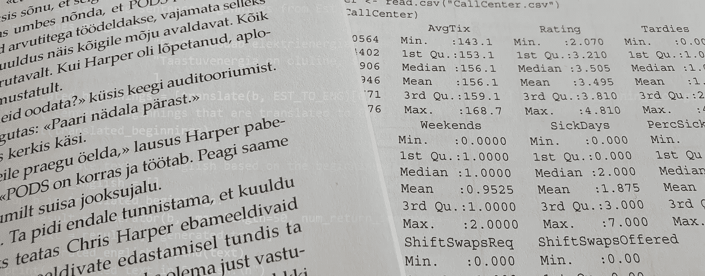

# 在非英语文本中使用拥抱脸模型

> 原文：<https://towardsdatascience.com/using-hugging-face-models-on-non-english-texts-aa0b4cb9ad08?source=collection_archive---------23----------------------->

作者图片

## 如何在非英语文本上使用来自拥抱脸的预先训练的英语语言模型

一个**预训练模型是一个保存的机器学习模型**，它以前在一个大数据集(例如维基百科中的所有文章)上训练过，以后可以用作一个执行特定任务的“程序”(例如找到文本的情感)。

[拥抱脸](https://huggingface.co/models)对于预先训练好的语言处理模型来说是一个很好的资源。也就是说，大多数可用的模型都是针对流行语言(英语、西班牙语、法语等)训练的。).幸运的是，许多较小的语言都有预先训练好的模型可用于翻译任务。在这里，我将通过以下方式演示如何使用可用的模型:

1.  将输入文本翻译成英语，
2.  使用预先训练的英语模型执行特定任务，
3.  将结果翻译回原始语言。

我使用爱沙尼亚语(约 110 万人的母语)作为输入语言，并评估该工作流程在以下任务中的实用性:

1.  情感分析。
2.  提取问题回答。
3.  文本生成。
4.  命名实体识别。
5.  总结。

# 翻译

翻译是将文本从一种语言翻译成另一种语言的任务。这将是我们每个示例中的第一个也是最后一个任务。访问拥抱脸部模型的方法之一是通过他们的[推理 API](https://api-inference.huggingface.co/docs/python/html/index.html) ，它能够运行推理(从机器学习模型中询问一些东西)，而无需本地安装或下载任何模型。首先，你需要在拥抱脸注册，并在你的个人资料中获得你的 API 令牌。

使用 API 包括:

*   从[模型中枢](https://huggingface.co/models)中选择模型并定义端点`ENDPOINT = https://api-inference.huggingface.co/models/<MODEL_ID>.`
*   用您的个人 API 令牌定义头部。
*   定义查询的输入(强制)和参数(可选)。
*   运行 API 请求。

下面的端到端代码示例说明了这一点。通过从[模型库](https://huggingface.co/models)中复制模型名称来定义 API 端点；2.设置一个 API 令牌，在拥抱脸注册账号后可以从你的用户设置中找到；3.定义向 API 发出 POST 请求的函数；4.定义我想翻译的输入文本，并使用这个输入和 5 运行 API 查询。提取结果。 **NB:对于下面的翻译，我们只需要重复步骤 4 和 5(定义新的输入并提取结果**)。

# 情感分析

情感分析是将输入文本分类为正面或负面的任务。可能的类别数量取决于特定的预训练模型。例如，一些模型仅使用两个类别(阳性、阴性)，而其他模型使用三个(阳性、中性、阴性)或更多。

对于情感分析，我使用[变形金刚库](https://huggingface.co/transformers/index.html)，这是继[推理 API](https://api-inference.huggingface.co/docs/python/html/index.html) 之后的另一个简单选项，用于访问预训练的模型。通过笔记本中的`!pip install transformers`或终端中的`pip install transformers`安装库。

在给定任务中使用预训练模型的最简单方法是使用`pipeline('name-of-the-task')`功能。该库为特定任务下载预先训练好的模型，推理在您的本地机器上运行(回想一下，如果您不想下载模型，可以使用推理 API)。让我们看看它是如何进行情感分析的:

1.  首先，我们用管道函数和任务名称创建一个分类器。您可以从文档中找到可用的任务[。](https://huggingface.co/transformers/main_classes/pipelines.html)
2.  接下来，我们将输入文本从原始语言翻译成英语。
3.  最后，我们用一行代码运行情感分析并提取结果。下面的例子很成功——翻译得不错“我们想要最好的，但结果总是这样。”我们正确地将句子的情绪归类为负面。

这是另一个例子，但是这次任务由于错误的翻译而失败了。翻译回复说“支持民主的最佳论据是与普通选民进行五分钟的谈话”，但正确的翻译应该是“反对民主的最佳论据是 T2”。在翻译和使用预先训练的英语模型时，要记住错误翻译的可能性。

# 抽取式问题回答

抽取式问题回答是基于输入文本回答问题的任务。在下面的例子中，我将给出一个关于我正在工作的单位的一般描述，并尝试回答“这个单位在做什么？”。让我们看一下下面的代码:

1.  创建问答管道(第 2 行)。
2.  提供原文的上下文，并将上下文翻译成英语。
3.  用原文提供问题，并将其翻译成英语。
4.  通过管道运行问题和上下文，并提取答案。
5.  将答案翻译回原文。

上面的输出显示，翻译并不完美，但它会做的工作。“电子实验室在做什么？”这个问题的答案也有点尖锐但核心意思是正确的。

# 文本生成

文本生成(也称为因果语言建模)是在给定句子开头的情况下预测下一个单词的任务。换句话说，这就是机器学习模型试图成为作家的任务😄！

在下面的例子中，我们:

1.  生成文本生成管道。
2.  用爱沙尼亚语定义两个句子开头，然后翻译成英语。
3.  使用管道根据开头生成文本，并将生成的单词数限制在 50 个以内。
4.  将生成的文本翻译回爱沙尼亚语。

正如你从上面的结果文本中看到的，我们的模型产生了相当多的废话，比如“爱沙尼亚用燃烧天然气的水力发电厂发电”😄。也就是说，Est-to-Eng-to-Est 的工作流程似乎工作得很好，并且这个例子中的翻译质量非常好。

# 命名实体识别

命名实体识别(NER)的任务是试图从文本中找到人名、地名、组织名。在下面的例子中，我将给出两个爱沙尼亚语句子作为输入，并尝试从中检测所有命名实体。让我们看一下下面的代码:

1.  初始化命名实体识别管道，并为我们的模型输出的的[类定义合理的名称。在这里，我创建了一个字典，使用类代码作为键，爱沙尼亚语的含义作为值。这些以后会用到。](https://huggingface.co/transformers/task_summary.html#named-entity-recognition)
2.  定义输入文本。
3.  将输入内容翻译成英语。
4.  为 NER 定义函数:我们的函数 a .)用输入运行 ner pipeline，b .)用爱沙尼亚语(在 for 循环中)的合理名称替换所有模糊的类名，c .)将属于同一实体的字符串/标记组合在一起(您可以在不分组的情况下尝试该函数以查看原始输出)。
5.  打印所有实体及其所属的类。

上述结果表明，该模型能够正确检测所有命名实体，并将它们划分到相应的类别(组织或个人)。

# 摘要

摘要是将一篇长的文本或文档概括成一篇较短的文本的任务。在下面的例子中，我使用了 Google 的 T5 模型，该模型是根据混合输入数据(包括来自 CNN 和 Daily Mail 的文档)进行训练的。同样，我们可以遵循已经熟悉的工作流程:

1.  用“摘要”任务初始化 Transformers 管道。
2.  提供一个输入句子或文档。
3.  将输入内容翻译成英语。
4.  用预先训练好的英语模式总结课文。您可以提供摘要的最大和最小长度作为参数—这里，我将摘要的长度限制为 30 个令牌。
5.  翻译回输入语言。

上面的总结者能够很好地捕捉输入的核心思想，但是输出有一些语法问题。因此，我们可以预期，该模型应该用于有意识的用户快速捕捉长文档的核心含义。

# 摘要

本文通过将翻译作为工作流的一部分，展示了在非英语语言上使用预先训练的英语语言模型的想法。这个概念在五个不同的任务上进行了测试:

1.  在情感分析中，输出的质量很大程度上取决于翻译的质量。在这里，我们试图检测两个爱沙尼亚句子的情感——其中一个例子是成功的，另一个由于翻译错误改变了句子的意思而失败。
2.  在回答问题时，我们看到我们的例子在翻译中几乎没有丢失任何东西。
3.  文本生成也可以工作，但是很难看到这个任务的任何“真实”用例，因为输出纯粹是虚构的。
4.  在命名实体识别中，我们在翻译中没有损失太多，我们的方法非常适用。
5.  在文本摘要中，模型应该用于捕获较长文本的核心思想，而不是生成语法正确的文本。

简而言之，translate 的概念->使用预先训练的英语模型-> translate back 是一种有用的方法，可以在较小的非流行语言上完成各种自然语言处理任务。