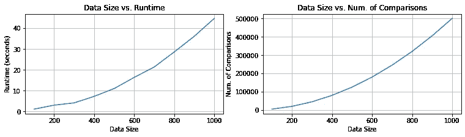
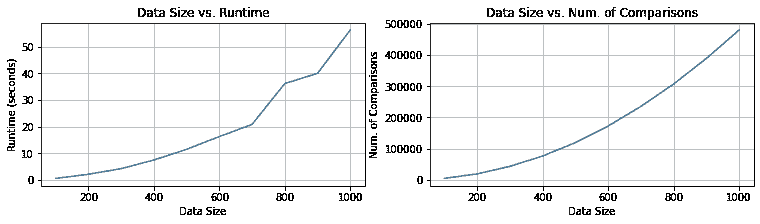
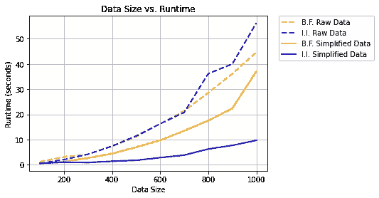
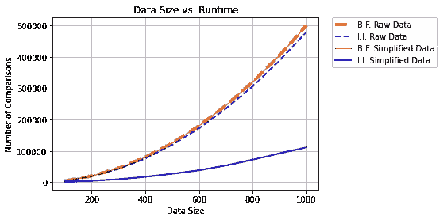

# 使用倒排索引进行高效的文档相似度计算

> 原文：<https://towardsdatascience.com/using-inverted-index-for-efficient-document-similarity-computation-a8d3fb8f0c12?source=collection_archive---------12----------------------->

## [实践教程](https://towardsdatascience.com/tagged/hands-on-tutorials)

## 一种在某些情况下更有效地处理成对相似性计算的简单方法，使用 python 示例。


图片作者:https://www.pexels.com/photo/clear-light-bulb-355948/

# 搜索查询背后的魔力

我目前的谷歌搜索显示 Quora 上有超过 300 万个问题，但即使你正在键入一个新问题，它们也能立即向你显示类似的问题。我只需在谷歌的搜索栏中输入这些信息，算法就会根据我的搜索查询立即向我显示最相关的内容。

尽管有许多先进的概念来实现这个*魔术，*我将向您展示一个古老而简单的方法，用于在某些场景中更有效地处理文档的成对相似性计算。我将把它与暴力方法进行比较，并给出一些 Python 代码示例。

完整代码可以在这里找到: [GitHub 链接](https://github.com/tolgayan/inverted-index-doc-similarity-experiment/blob/main/inverted_index_similarity_performance_experiments.ipynb)。

## 相似性比较的重要性

如果我们可以用向量解释任何信息，那么通过一些相似性比较，我们就可以找到这个域中隐藏的联系。

相似性比较方法被大量用于聚类向量。它用于主题检测、文档聚类、语言翻译或检查抄袭。它还用于在社交媒体网站上推荐 youtube 视频或朋友建议。

还有更多的应用领域。简而言之，如果我们可以用向量解释任何信息，我们就可以利用它进行信息检索。

## 了解倒排索引

假设您有大量包含许多单词的文档。在这种结构中，根据单词所属的文档来收集单词。换句话说，文档是*父*，文字是*子*。倒排索引方法颠倒了这种关系，将单词作为父级，将文档作为子级。我将用一个例子来说明这一点。

假设您有这样的文档:

```
doc1: "Today is a beautiful, and a sunny day to start my workout."
doc2: "I will not be able to come today to meet with him."
doc3: "Our class meeting starts soon!"
doc4: "My class starts at 6."
```

在标记化、删除停用词和一些清理之后，文档看起来像这样:

```
doc1: ["today", "beautiful", "sunny" "day", "start", "workout"]
doc2: ["come", "today", "meet"]
doc3: ["class", "meet", "start", "soon"]
doc4: ["class", "start"]
```

现在我们可以颠倒文件和文字。

```
today     : [doc1, doc2]
beautiful : [doc1]
sunny     : [doc1]
day       : [doc1]
start     : [doc1, doc3]
workout   : [doc1]
come      : [doc2]
meet      : [doc2, doc3]
class     : [doc3, doc4]
soon      : [doc3]
```

现在我们可以看到哪些单词出现在哪些文档中。或者，我们甚至可以演示单词在文档中的位置，但是为了简单起见，我们将使用这个演示。

我们如何从倒排索引结构中获益？

假设您正试图通过这些文档的特征嵌入(可以用 word2vec、doc2vec、BERT 或 TF-IDF 等创建的文档的数字表示)对它们进行聚类。)，你会通过这些向量的余弦相似度来做到这一点。在强力方法中，由于有四个文档，您必须进行 6 次不同的相似性检查。

倒排索引结构有助于我们发现具有共同单词的文档。只有当一个文档与其他文档至少有一个共同的单词时，我们才会将它们进行比较。

为了提高效率，我们将按照数字顺序遍历文档。对于文档 1，它出现在单词“今天”和“开始于另一个文档”的集合中。这些集合的组合给出了[文档 1，文档 2，文档 3]。因此，我们将计算(文档 1，文档 2)和(文档 1，文档 3)之间的相似性得分。我们可以接着看第二份文件。

由于我们已经讨论了第一个文档，我们将不再考虑它。因为文档 2 与文档 4 一起出现在“meet”集合中，所以我们将只找到相似性(文档 2，文档 4)。

对于文档 3，由于它存在于文档 4 的“类”集合中，所以我们将只找到相似性(文档 3，文档 4)。

因为我们只剩下一个文档，所以我们不需要做任何计算。在前面的步骤中，我们已经涵盖了所有可能的配对。

因此，我们计算了。

```
(doc1, doc2)    (doc1, doc3)    (doc2, doc4)    (doc3, doc4)
```

比较的次数比蛮力方法少两个！这似乎对性能有一点影响。因此，让我们用一个真实的数据集来尝试这种方法。

## Python 的真实例子

我们将从[这里](https://www.kaggle.com/savasy/ttc4900)加载一个文本数据集，它包含不同主题的土耳其文本数据。

数据是这样的:

```
 category  text
0 siyaset 3 milyon ile ön seçim vaadi mhp nin 10 olağan...
1 siyaset mesut_yılmaz yüce_divan da ceza alabilirdi pr...
2 siyaset disko lar kaldırılıyor başbakan_yardımcısı ar...
3 siyaset sarıgül anayasa_mahkemesi ne gidiyor mustafa_...
4 siyaset erdoğan idamın bir haklılık sebebi var demek ...
```

我们会在使用之前清除数据。

现在是时候生成一些特征向量了。目前，我所知道的最好的生成特征向量的方法是使用句子-Bert。你可以点击[这里](https://github.com/UKPLab/sentence-transformers)了解更多。但是，这超出了这篇博文的范围。因此，我们将使用简单的 TF-IDF 进行演示。

现在让我们试试暴力和倒排索引方法。

**蛮力方法:**

**倒排指数法:**

结果如下:

**强力方法:**



**倒排指数法:**



这两种方法之间没有明显的区别，不像承诺的那样。现在是时候讨论倒排索引方法的瓶颈了。

只有当文档足够清晰并且每个文档中的字数很少时，倒排索引方法才是有用的。否则，它可能比强力方法慢，因为生成倒排索引结构需要额外的计算。

这个问题最常见的解决方案是减少每个文档中的数据。有许多不同的特性选择方法，这些方法超出了本文的范围。为了解决这个问题，我们将从每个描述文档的文档中提取 50 个关键字，并用它们来表示文档。

**提取关键词**

结果如下:



其中“B.F .”代表“蛮力”，“I.I .”代表“倒排索引”。原始数据显示关键字提取前的结果，简化数据显示关键字提取后的结果。

提取关键字后，强力方法的比较次数没有变化，运行时间略有不同。不过倒排索引性能提升明显！这几乎比使用 1000 行数据的暴力方法快 50 秒。如果您正在处理数千行数据，那么运行时将会有显著的不同。

你可以在这里找到完整的代码: [GitHub 链接](https://github.com/tolgayan/inverted-index-doc-similarity-experiment/blob/main/inverted_index_similarity_performance_experiments.ipynb)。

# 最终意见

这篇博客文章展示了一种加速两两相似性比较操作的普通而简单的方法，并用 python 例子展示了它。结果表明，倒排索引方法仅在文档很短或非常清晰的情况下有用。尽管如此，对长数据使用数据简化技术还是有很大的不同。

今天，根据数据和挑战，可能有更好、更合适的方法。然而，倒排索引是一种易于实现和理解的方法。

就是这样。我希望你喜欢它，非常感谢你阅读我的博文。

如果您愿意，可以通过以下链接联系我:

推特:【https://twitter.com/etolga_ayan 

领英:[https://www.linkedin.com/in/emre-tolga-ayan-7b9a0a149/](https://www.linkedin.com/in/emre-tolga-ayan-7b9a0a149/)

GitHub:[https://github.com/tolgayan/](https://github.com/tolgayan/)

干杯，

埃姆雷·托尔加·阿扬

## 参考

[1] S .耶尔德勒姆，土耳其语文本分类的基准数据，[https://www.kaggle.com/savasy/ttc4900](https://www.kaggle.com/savasy/ttc4900)

[2] K. Ganesan，[教程:用 TF-IDF 和 Python 的 Scikit-Learn 提取关键词](https://kavita-ganesan.com/extracting-keywords-from-text-tfidf/#.YDNHzegzZnJ)，[https://ka vita-Ganesan . com/Extracting-Keywords-from-text-tfi df/#。YDNHzegzZnJ](https://kavita-ganesan.com/extracting-keywords-from-text-tfidf/#.YDNHzegzZnJ)

[3]利用倒排索引、草绘和采样的高效文档相似度，[https://cosine similarity . org/content/inverted-index-sketching-sampling . html](https://cosinesimilarity.org/content/inverted-index-sketching-sampling.html)