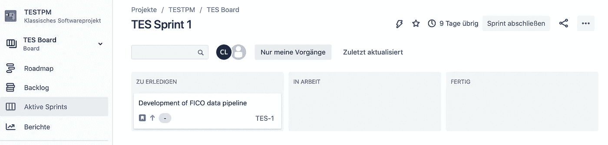
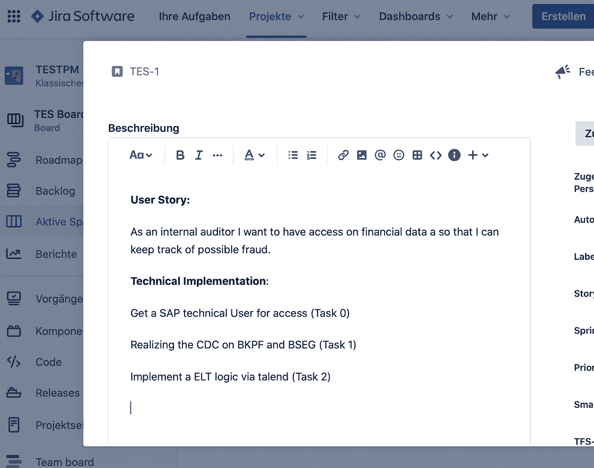
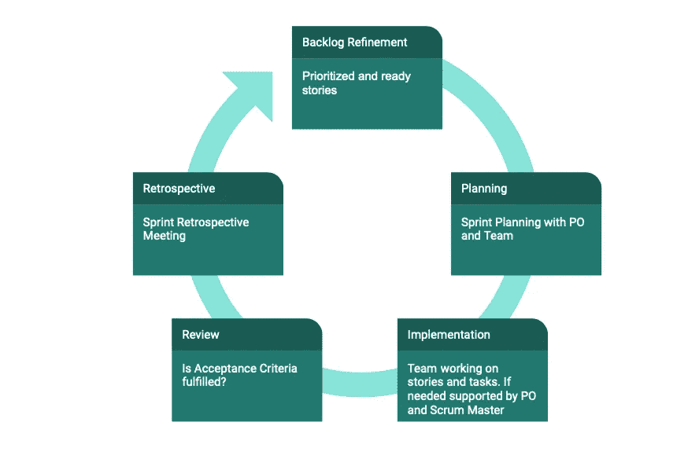
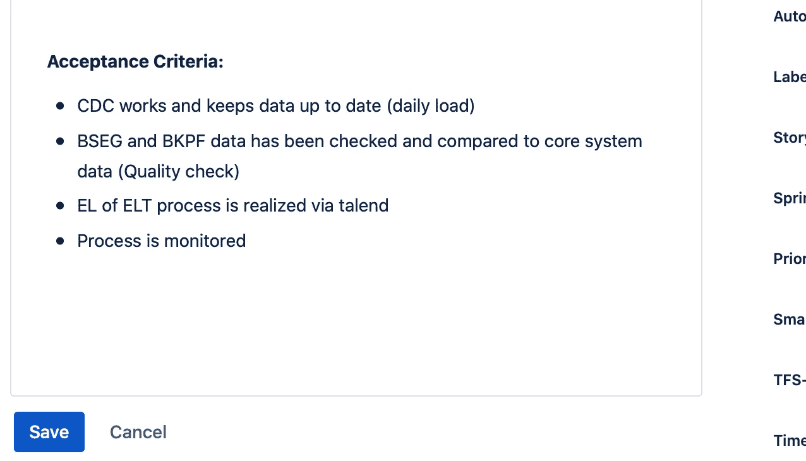

# 在数据科学中使用吉拉和用户故事

> 原文：<https://towardsdatascience.com/using-jira-and-user-stories-in-data-science-f1f3f0b1d1ec?source=collection_archive---------21----------------------->

## 如何在数据领域成功实施吉拉和敏捷项目管理

威尔弗里德·桑特在 [Unsplash](https://unsplash.com/s/photos/nature?utm_source=unsplash&utm_medium=referral&utm_content=creditCopyText) 上的照片

无论你是项目经理还是产品负责人，项目管理工具和一些基本的敏捷技术将极大地帮助你管理你的项目或产品。至少，这些工具会给你、管理层和你的团队一个更好的概述。此外，结果可能是更快的实现、更少的查询、更好的时间估计和更大的动力。在下面的文章中，我想为您提供一些可以帮助您改进项目管理和底层用户故事的要点。

## 管理工具

在这里，正如标题所示，我推荐吉拉——用于管理目的的标准软件。你可以很容易地从[免费 SaaS 解决方案](https://www.atlassian.com/software/jira/free)【1】开始。您可以在应用程序中以 Scrum 或看板模式运行您的项目。免费版本为您提供了许多优秀的功能，如积压、报告、工作流等。

吉拉·斯普林特——作者图片

如果您有特定的 GDPR 需求，您也可以在本地托管吉拉或现在所谓的数据中心。像 Trello(也是免费的)或开源版本 Wekan(免费，但是你必须建立一个服务器)也存在，但是我更喜欢吉拉。在回答了 toll 问题之后，我想给你六个你在从事数据科学项目时应该注意的主要话题。

## Scrum 对看板对瀑布

选择工具后的下一步可能是决定你想使用哪种项目管理方法。当使用 Scrum 时，我会推荐吉拉作为首选工具——因为它提供了你需要的一切。通过使用 Scrum，你将需要设置角色、仪式和工件。此外，Scrum 专注于复杂的软件开发。当在开发新的复杂软件产品或服务的环境中使用时，所描述的项目管理方法可以显示其全部优势。

看板板——图片由 [Gerd Altmann](https://pixabay.com/de/users/geralt-9301/?utm_source=link-attribution&utm_medium=referral&utm_campaign=image&utm_content=4051662) 在 [Pixabay](https://pixabay.com/de/?utm_source=link-attribution&utm_medium=referral&utm_campaign=image&utm_content=4051662) 上拍摄

另一方面，由于持续改进的核心原则，看板适合作为可控软件过程中的一种方法。看板经常在支持或维护团队中使用，在这些团队中，要解决的任务很复杂，但通常并不复杂(比如软件推出或维护工作)。看板关注过程效率和生产率的提高。除了 Scrum 和看板，BEAM 方法可能对你也有意义——你可以在这里阅读更多关于它的内容[。](/the-3-most-important-project-management-methods-in-data-science-df7e14955d37)

讨论这些原则，甚至传统的项目管理方法，并决定哪一个最适合你，可能是一个相当困难的过程。在这里，你必须自己做一点研究。这也是有意义的，这样你就理解了理论背景。这个决定也是基于你的组织和人们想要如何一起工作——所以简而言之:你必须自己去发现它。对于我自己，我真的可以推荐吉拉文档[4]。我的观点是，如果你在数据集成、分析、报告等领域工作。由于复杂的任务和不断变化的需求，敏捷工作确实很有意义。

## 用户故事

在建立了基本的基础设施并决定使用哪种项目管理方法之后，让我们从用户故事开始。用户故事是用日常语言表述的软件需求，并且有意保持简短。为了更深入，我推荐下面的文章: [**如何在敏捷软件开发中编写好的用户故事**](https://blog.easyagile.com/how-to-write-good-user-stories-in-agile-software-development-d4b25356b604) **。**

用户故事示例—作者提供的图片

在吉拉，我将用户故事放在描述字段中。通常把其他重要的参考放在那里也是有意义的。如果有必要，你可以使用与故事相关的任务。

## 积压优化

谈到故事和任务，很好地描述它们非常重要，尤其是在大数据领域。大多数技术细节必须被很好地记录下来，这样来自开发人员的错误和问题就可以保持在较低的水平。在这里，我向 sprint 规划推荐一个反周期的 backlog 精化，在这里产品负责人和团队可以讨论故事以及如何在技术上实现它们。

可思考的敏捷过程——作者图片

然后，可以标记好准备好的优先故事，并将其引入下一个 sprint。当不使用 Scrum 时，类似的团队会议和协作也是有用的。

## 验收准则

**验收标准** (AC)是软件产品被用户、客户或其他系统**接受**所必须满足的条件。它们对于每个用户故事都是独一无二的，并且从最终用户的角度定义了特性行为[5]。

AC 示例—作者提供的图像

在吉拉，你也可以把它放在描述字段或为它创建一个新的文本字段。在这里，产品负责人投入一些时间以满足业务需求真的很重要——这取决于他在业务部门和开发团队之间进行调解。

## 故事点与人工日

我真的会推荐以上两种工具中的一种或两种。故事点是一个用来描述用户故事大小的单位。他们代表了开发工作。

传统的软件团队以基于时间的格式创建评估，例如，天、周和月。然而，许多敏捷团队已经转移到故事点。故事点是估计完全实现产品待办事项或其他任务项所需的总工作量的度量单位。团队根据任务的复杂性、工作量以及风险或不确定性来分配故事点。赋值是为了更好地管理不确定性，以便有效地将任务分成更小的部分[1]。

根据我的经验，我喜欢使用人工来完成 ETL/ELT 管道、建立一些数据库和其他相关工作，这些工作可能也很复杂，但是团队已经很熟悉了。对于更复杂的任务，如开发深度学习算法或建立新的基于云的数据湖——通常是你以前从未做过的事情——使用故事点是有意义的。

## 谈谈你的工作

最后但同样重要的是，我的建议是，总是谈论你和你的团队取得的成就，以及你的故事如何有助于改善业务和流程，或者至少使它们更容易。我的经验告诉我，公司中像 BI、数据科学或工程这样的新团队通常不太受关注。事实上，同事们可能会问他们在公司里到底在做什么。为了给你的团队留下好印象并获得后续订单，项目营销是必不可少的。此外，通过认可，团队通常会更加团结，积极的情绪会传播开来——至少在我看来是这样。

GIF 由 [GIPHY](https://giphy.com/gifs/christian-bale-american-psycho-SnioCkL9cd3B6/links)

项目营销被理解为一个项目在其环境和超越。项目营销及其效果在实践中常常被低估，过多的精力被放在应对技术需求上。项目的主动“销售”然后被遗忘:结果是项目团队做了很好的工作，但是这没有被任何人注意和欣赏。因此，在争夺稀缺资源或有价值的注意力方面，该项目往往落后于其他项目，并且在未来将不得不应对比正常项目营销更糟糕的情况[7]。

## 结论

希望这篇文章能给你一些启发，有所入手。第一步永远是建立一个工具集，当然还有作为产品或项目经理与你的团队取得联系，例如与吉拉取得联系。在我看来，所提供的工具和方法是最重要的因素之一，尤其是在数据领域。我真的推荐使用敏捷过程来更快地部署已开发的系统，以便最小化过程中的风险和不期望的开发。你可以在下面的资源和阅读材料中找到更多的灵感和工具。在数据科学领域，敏捷方法很有前途，因为通常不可能预先评估项目是否可以使用可用数据完成。结果在多大程度上是成功的，只有一旦有了结果才能判断。

## 资料来源和进一步阅读

[1]吉拉，[我们的云产品能够更好地协同工作](https://www.atlassian.com/software/jira/free) (2020 年)

[2]https://trello.com[特雷罗](https://trello.com/) (2020)

[3]韦坎，[开源看板](https://wekan.github.io/) (2020)

[4]吉拉，[敏捷宣言还是一样东西吗？](https://www.atlassian.com/agile/manifesto) (2020 年)

[5] altexsoft，[验收标准:目的、格式和最佳实践](https://www.altexsoft.com/blog/business/acceptance-criteria-purposes-formats-and-best-practices/) (2020)

[6] Quickscrum，[产品积压细化](https://guide.quickscrum.com/scrum-guide/product-backlog-refinement/) (2020)

[7]项目管理手册，[项目营销](https://www.projektmanagementhandbuch.de/handbuch/projektrealisierung/projektmarketing/) (2021)