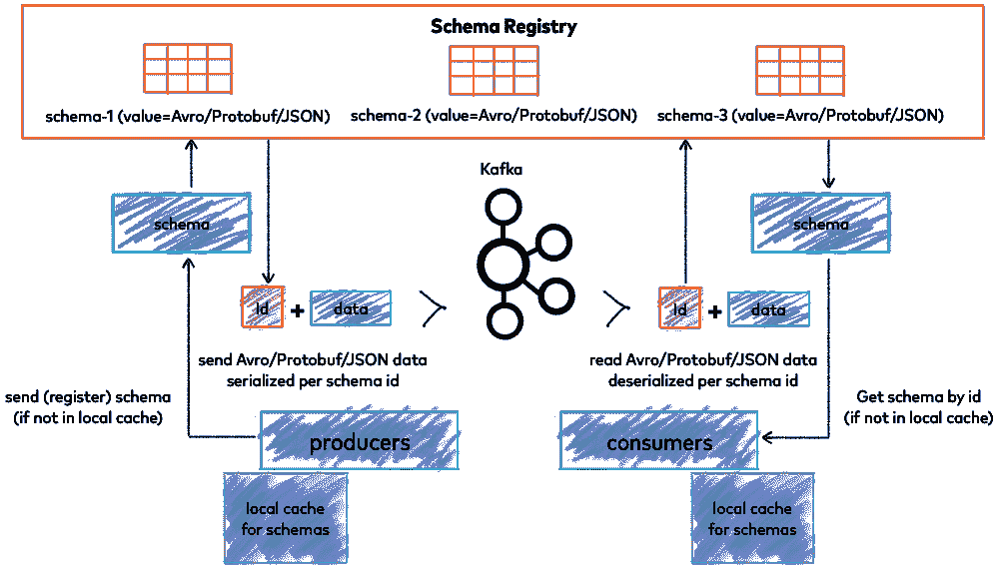

# ML 流水线中的 Schemafull 流数据处理

> 原文：<https://towardsdatascience.com/using-kafka-with-avro-in-python-da85b3e0f966?source=collection_archive---------18----------------------->

## 使用带有 AVRO 和模式注册的 Kafka，使容器化的 Python 流数据管道利用模式进行数据验证

# 介绍

在我以前的一篇关于机器学习管道的文章中，消息队列被认为是 HTTP 客户端-服务器架构的一种替代方式，这是现今服务于 ML 模型的最常见的方式。

提醒一下，在 ML 管道中使用像 [Apache Kafka](https://kafka.apache.org/) 这样的队列有以下优点:

*   输入数据生产者和数据处理器(Kafka 术语中的消费者)解耦的自然异步处理，即消费数据的 ML 推理/训练服务的失败不会导致 HTTP 超时、数据丢失和数据生产者的失败，而只会导致延迟处理
*   更好地利用 CPU/GPU 相关任务的计算资源，例如 ML 推断/训练:
    - [批量推断](https://docs.microsoft.com/en-us/azure/cloud-adoption-framework/innovate/best-practices/ml-deployment-inference#batch-inference)通常效率更高，因为 ML 模型不需要为每个预测预热和拆除
    -如果传入数据不规则到达，队列会平滑负载，而 HTTP 服务器会在负载高峰期间不堪重负，并在安静期间空闲
*   提高吞吐量。然而，值得一提的是，当推理延迟至关重要时，队列并不完美。在这些情况下，轮询间隔非常短的 Kafka 消费者(这消除了以前的一些优势)或 HTTP ML 模型服务器仍然是可行的选择。

建议读者在阅读本文之前先熟悉 Apache Kafka 和 Docker(包括 docker-compose)。Confluent 有一个[不错的介绍卡夫卡的页面](https://docs.confluent.io/platform/current/kafka/introduction.html)。 [Docker docs](https://docs.docker.com/compose/) 也很棒。

# 为什么要使用模式？

大多数关于如何使用 Kafka，尤其是 Python 的教程都展示了生成和使用无模式 JSON 字符串的例子。尽管运行这些示例很容易，但它们并不太适合生产使用。我们来看看为什么。

## 无模式方法的缺点

*   生产者不能强制其发布到主题的数据格式(字段集),这可能导致消费者端的不兼容和运行时错误。当然，它可以在代码中处理，但这会使代码更加复杂，因此容易出错，需要更多的维护。
*   数据格式演化没有约束，因此生产者可以潜在地切换到新的模式，而不需要消费者期望的字段，这可能再次导致运行时错误(有关详细信息，请参见下一节)
*   JSON 格式的数据包括每个消息的字段名，这使得它在存储空间方面效率很低

Schemafull 消息解决了这些问题，但是，它的代价是更复杂的基础设施，并且需要对模式演化非常小心。

## AVRO 图式及其演变

Kafka 支持 [AVRO](https://avro.apache.org/) 、 [Protobuf](https://developers.google.com/protocol-buffers/) 和 [JSON-schema](https://json-schema.org/) (这仍然存在 JSON 数据格式非二进制且在存储方面不是很高效的缺点)。我们将在文章的代码中使用 AVRO，因为这似乎是卡夫卡最常见的模式格式。

一旦定义，模式通常不能随意更改。提到的一个例子是字段删除或重命名。这个潜在的问题可以通过将字段定义为`nullable`并使用`default`值来解决，因此如果字段变得过时，生成器只需停止填充它，同时它仍保留在模式的新更新版本中:

```
{"name": "value", "type": ["null", "double"], "default": null}
```

其他模式进化考虑在 [AVRO 规范](https://avro.apache.org/docs/current/spec.html)中有描述。

# 演示设置

这个库有一个 Python AVRO 消费者和生产者的基本例子:

[](https://github.com/isenilov/python-kafka) [## GitHub - isenilov/python-kafka

### 运行所有服务:docker-compose-f docker-compose . YAML up-build-d 附加到应用程序的日志…

github.com](https://github.com/isenilov/python-kafka) 

让我们回顾一下它所包含的服务，查看`docker-compose.yaml`的`services`部分

## 动物园管理员

[Apache ZooKeeper](https://zookeeper.apache.org/) 由 Kafka 用于在一个集中的位置维护配置，并且是 Kafka 集群工作的先决条件。消费者和生产者通常不与它直接交互，所以我们在这里省略了它的详细描述。

## 图式注册表



*用于存储和检索模式的汇合模式注册表(* [*来源*](https://docs.confluent.io/platform/current/schema-registry/index.html) *)*

[汇合模式注册中心](https://docs.confluent.io/platform/current/schema-registry/index.html)是一个用于存储和检索模式的服务。显然，人们可以使用 Kafka，而不仅仅是拥有模式和应用程序代码，但是模式注册中心确保了所有消费者和生产者的版本化模式的单一真实来源，排除了这些消费者和生产者之间模式偏差的可能性。

注册表既有 RESTful API，也有由 [confluent-kafka-client](https://github.com/confluentinc/confluent-kafka-python) 提供的本地支持，这实际上是在 Python 中使用 kafka 的标准。

可以通过 HTTP 请求注册模式，如下所示:

```
SCHEMA=$(sed 's/"/\\"/g' < ./Message.avsc)

curl -X POST -H "Content-Type: application/vnd.schemaregistry.v1+json" \
  --data "{\"schema\":\"${SCHEMA//$'\n'}\"}" \
  http://<registry_host>:<registry_port>/subjects/<name>/versions
```

它应该返回模式注册的 id(版本):`{“id”:1}`

使用 Python 代码中的模式可以通过从前面提到的客户端实例化`AvroSerializer`和`AvroDeserializer`来完成。

## 卡夫卡

[Apache Kafka](https://kafka.apache.org/) 集群本身使用来自汇合的 [Docker 映像运行，该映像具有其运行所需的一切。
它有许多配置选项，但我们仅限于基本的工作选项，例如，`PLAINTEXT`协议不执行任何加密。](https://hub.docker.com/r/confluentinc/cp-kafka/)

## init-卡夫卡

这是 Kafka 的一个短暂实例，仅用于创建我们计划在使用`kafka-topics` CLI 的演示中使用的主题:

```
kafka-topics --create --if-not-exists --topic Test.Topic --bootstrap-server kafka:29092 --replication-factor 1 --partitions 1
```

为了简单起见，将`replication-factor`和`partitions`选项设置为 1。参考 [Kafka 文档](https://kafka.apache.org/documentation/)了解更多关于这些和更多其他选项的细节。

## 工人

这是消费和生产应用程序本身。为了简单起见，消费者和生产者都在`__main__.py`中。代码大部分是不言自明的，所以让我们只看它的一些重要部分。

**生产者配置:**

```
"value.serializer": AvroSerializer(schema_str=Message.schema,
schema_registry_client=schema_registry_client, to_dict=todict)
```

`schema_str=Message.schema` — producer 需要传递一个模式，这里我们传递包含该模式的生成的 Python 类的属性。模式将在`schema_registry_client`中上传和注册。

`to_dict=todict` —这必须是将消息对象转换为 Python 字典的可调用对象。我们使用来自生成代码的`helpers.py`的`todict`方法。

**消费者配置:**

```
"value.deserializer": AvroDeserializer(schema_str=None, schema_registry_client=schema_registry_client,
from_dict=lambda obj, _: Message(obj))
```

这里我们不传递模式，所以`schema_registry_client`将从模式注册中心获取它。
`from_dict=lambda obj, _: Message(obj)` —将字典转换为消息对象的相反操作。这里我们需要做一点修改，因为反序列化器将 context 作为第二个参数传递给 callable(我们忽略了它)，但是生成的类构造函数只接受字典。

```
"group.id": "test_group"
```

`“group.id”`。这允许共享相同消费者组 ID 的多个消费者(读取具有数据处理应用程序的多个容器以进行水平缩放)轮流消费消息，因为他们共享 [Kafka 偏移量](https://docs.confluent.io/platform/current/clients/consumer.html#offset-management)。同时，如果需要将这些消息用于其他目的，例如，在线测试一个实验性的 ML 模型，可以通过使用新的`group.id`部署这个实验组来完成，从而避免与主要的产品结构混淆。

# 运行演示

存储库的`README.md`有使用`docker-compose`运行所有服务的指令。执行这些命令应该会在 stdout 中产生类似这样的结果:

```
worker_1  | Waiting for schema registry to be available
worker_1  | Producing message to topic 'Test.Topic'
worker_1  | Produced message: {'timestamp': 1639304378, 'data': {'count': 10, 'value': 100.0}}
worker_1  | 
worker_1  | Flushing records...
worker_1  | Consumed message: {'timestamp': 1639304378, 'data': {'count': 10, 'value': 100.0}}
```

这意味着生产和消费是成功执行的。

我们打印消费的消息:

```
if message is not None:
    print(f"Consumed message: {message.dict()}")
```

但是，这是推理代码通常随后将结果预测发布到另一个主题、将它们保存到数据库或在下游 API 调用中使用它们的地方。

# 监视

一般来说，对 Kafka 消费 ML 服务的监控类似于在[NLP 任务的完整机器学习管道](/complete-machine-learning-pipeline-for-nlp-tasks-f39f8b395c0d)文章中所描述的。

然而，推断时间可以(并且可能应该)伴随着消费者滞后，这表明消费者落后于公布的数据多少。如果增长，通常意味着消费者群体必须扩大。当使用基于`[librdkafka](https://github.com/edenhill/librdkafka#language-bindings)` [的](https://github.com/edenhill/librdkafka#language-bindings)客户端时，如本例中使用的`confluent-kafka-python`，可以使用`librdkafka`返回的[统计数据](https://github.com/edenhill/librdkafka/blob/master/STATISTICS.md)来获得消费者滞后，如[本期](https://github.com/confluentinc/confluent-kafka-python/issues/670)所述。

# 结论

本文展示了为什么在 Kafka 中使用模式可能是一个好主意，以及如何使用 Python(ML 服务的首选语言)来实现它。一如既往，如果您对内容有任何问题或建议，请随时通过 LinkedIn 联系我。